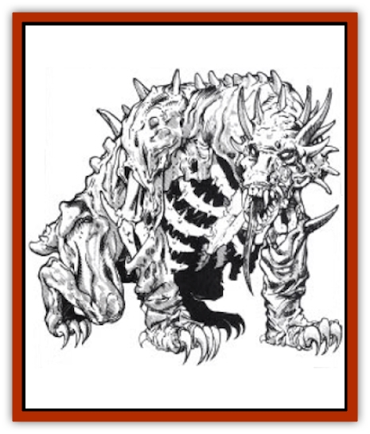

# Beast - Undead

| Statistic | **Gholor** | **Stahnk** |
| --- | --- | --- |
| **Activity Cycle:** | Any | Any |
| **Alignment:** | Neutral | Neutral |
| **Armor Class:** | 6 | 6 |
| **Climate/Terrain:** | Any | Any |
| **Damage/Attack:** | 3-9/3-9/3-24 or 3-18 | 3-9/3-9/3-24 |
| **Diet:** | None | None |
| **Frequency:** | Very rare | Very rare |
| **Hit Dice:** | 12+12 | 12+12 |
| **Intelligence:** | Non- (0) | Non- (0) |
| **Magic Resistance:** | 20% | 20% |
| **Morale:** | Elite (14) | Elite (14) |
| **Movement:** | 0 | 9, Sw 9 |
| **No. Appearing:** | 1 | 1 |
| **No. of Attacks:** | 3 or 1 | 3 |
| **Organization:** | Solitary | Solitary |
| **Size:** | H (20' long) | H (20' long) |
| **Special Attacks:** | Acidic bite | Ensnare and fling |
| **Special Defenses:** | See below | See below |
| **THAC0:** | 7 | 7 |
| **Treasure:** | G,H | G |
| **XP Value:** | 8,000 | 8,000 |

The undead beast is a mindless killer of unknown origin, compelled to destroy the living. The most common variety of undead beast is called the stahnk.

The size of a small [[Dragon_General_Information|dragon]], the stahnk's bones protrude from rotting flesh. It has a great horned head, and its ribs are bare and barbed, forming a nasty cage. It walks on all fours, but it can rear on its hind legs, balancing with its stubby tail, to bring its powerful forearms to bear.

**Combat:** The stahnk assaults anything that moves, attacking with its razor-sharp claws and horned head. Any victim struck by a claw must roll a successful saving throw vs. death magic or be flung for 1d20 additional points of damage. The beast can also charge its victims in an attempt to trample them (roll its normal attack roll). A trampled victim must roll a saving throw vs. death magic, suffering 1d8 points of damage if the roll succeeds and 3d8 points of damage if the roll fails. Additionally, a trampled victim who fails his saving throw vs. death magic must then roll a saving throw vs. wand. If he fails this saving throw, he is ensnared in the beast's rib cage and suffers 1d4 points of damage from the barbs each round the beast moves. An ensnared character can break free from the rib cage if the beast loses 50% of its hit points (a stahnk that has already lost half of its hit points cannot ensnare victims). Victims ensnared in the rib cage can continue to attack the beast, but they do so with a -3 penalty to both attack and damage rolls.

The stahnk can be turned by a priest as a special monster. It is unaffected by flame and suffers only minimum damage (1 point plus any applicable bonuses) from edged or pointed weapons. Blunt weapons, such as clubs and maces, affect the beast normally.

**Habitat/Society:** The stahnk dwells in the most desolate regions of the world. It is almost always found alone, having long ago destroyed all other creatures in its immediate environment. Each stahnk claims an area of no more than a few acres as its domain. A stahnk never leaves its domain, and it kills all living creatures that trespass. Since stahnks destroy the bodies of their victims but leave the possessions untouched, they tend to accumulate sizeable treasure caches.

**Ecology:** Stahnks do not eat their victims, but instead crush and rend them into pulp. Powerful evil wizards occasionally use stahnks as guards.

**Gholor**

The gholor, also known as the feaster, is an undead beast with no hind legs or rib cage. It cannot make ensnaring, trampling, or flinging attacks. Instead, it attacks with two 20-foot-long bony hooked arms and its sharp teeth; its jaws secrete acid, causing an additional 1d8 points of acid damage with each successful bite.

Gholors live at the bottom of deep funnel-like depressions located in deserts, on ocean floors, or in similarly desolate areas. They cannot move from their funnels. Gholors radiate a magical pull within a 1d10-mile radius of their funnels, causing all victims in the area to feel a desire to travel to the funnel. For every hour a being is within this radius, it must roll a successful saving throw vs. spell or continue to move toward the funnel at its normal movement rate. When a victim reaches the funnel, it begins to slip inside; it slips to the center and into the arms of the waiting gholor in three rounds.

**Anhkolox**

About 10% of all undead beasts, including gholors, have enchanted bones that glow green. Such undead beasts are called anhkolox. These beasts are very hot: a character touching a glowing bone with his bare hands suffers 1 point of damage. If the beast is touched with any inflammable object, such as a wooden staff, the object bursts into flames.

An anhkolox can also attack with a breath weapon, an ice-cold cone of green fire seven feet long with a base diameter of 2½ feet, A victim struck by the green fire must roll a saving throw vs. spell. If he succeeds, he suffers 1d4 points of damage. If he tails, he suffers 2d4 points of damage and his bones throb inside his body for the next 1d6 turns; his AC is increased by +1 and all attack rolls suffer a -1 penalty during that period. These effects can be negated by *dispel magic* or a similar spell, though the PC still suffers the damage.

---
## Discovery & Documentation

**Source Publication:** MC4 Dragonlance Appendix (w/binder #2) (1989)
**Campaign Setting:** Dragonlance
**Author(s):** Rick Swan

### Other Creatures Found in This Source Book
   * [[Anemone_Giant_Sea|Anemone, Giant Sea]]
   * [[Bear_Ice|Bear, Ice]]
   * [[Bird_Krynn|Bird (Krynn)]]
   * [[Disir|Disir]]
   * [[Draconian_Aurak|Draconian, Aurak]]
   * [[Draconian_Baaz|Draconian, Baaz]]
   * [[Draconian_Bozak|Draconian, Bozak]]
   * [[Draconian_Kapak|Draconian, Kapak]]
   * [[Draconian_General_Information|Draconian, General Information]]
   * [[Draconian_Sivak|Draconian, Sivak]]
   * [[Draconian_Proto-_Traag|Draconian, Proto-, Traag]]
   * [[Dragon_Amphi|Dragon, Amphi]]
   * [[Dragon_Astral|Dragon, Astral]]
   * [[Dragon_Kodragon|Dragon, Kodragon]]
   * [[Dragon_Krynn_Othlorx_General_Information|Dragon (Krynn), Othlorx, General Information]]
   * [[Dragon_Krynn_General_Information|Dragon (Krynn), General Information]]
   * [[Dragon_Sea|Dragon, Sea]]
   * [[Dreamshadow|Dreamshadow]]
   * [[Dreamwraith|Dreamwraith]]
   * [[Dwarf_Daergar|Dwarf, Daergar]]
   * [[Dwarf_Hill_Neidar|Dwarf, Hill, Neidar]]
   * [[Dwarf_Mountain_Hylar|Dwarf, Mountain, Hylar]]
   * [[Dwarf_Theiwar|Dwarf, Theiwar]]
   * [[Dwarf_Zakhar|Dwarf, Zakhar]]
   * [[Elf_Half-|Elf, Half-]]
   * [[Elf_High_Qualinesti|Elf, High, Qualinesti]]
   * [[Elf_High_Silvanesti|Elf, High, Silvanesti]]
   * [[Elf_Sea_Dargonesti|Elf, Sea, Dargonesti]]
   * [[Elf_Sea_Dimernesti|Elf, Sea, Dimernesti]]
   * [[Elf_Wild_Kagonesti|Elf, Wild, Kagonesti]]
   * [[Eyewing|Eyewing]]
   * [[Fetch|Fetch]]
   * [[Fire_Minion|Fire Minion]]
   * [[Fireshadow|Fireshadow]]
   * [[Gnome_Tinker|Gnome, Tinker]]
   * [[Gurik_Cha'ahl|Gurik Cha'ahl]]
   * [[Haunt_Knight|Haunt, Knight]]
   * [[Horax|Horax]]
   * [[Human_Krynn|Human (Krynn)]]
   * [[Imp_Blood_Sea|Imp, Blood Sea]]
   * [[Kalothagh|Kalothagh]]
   * [[Kani_Doll|Kani Doll]]
   * [[Kender|Kender]]
   * [[Kyrie|Kyrie]]
   * [[Lizard_Man_Krynn|Lizard Man (Krynn)]]
   * [[Minotaur_Krynn|Minotaur, Krynn]]
   * [[Ogre_High|Ogre, High]]
   * [[Ogre_Krynn|Ogre (Krynn)]]
   * [[Phaethon|Phaethon]]
   * [[Saqualaminoi|Saqualaminoi]]
   * [[Shadowperson|Shadowperson]]
   * [[Shimmerweed|Shimmerweed]]
   * [[Skrit|Skrit]]
   * [[Spectral_Minion|Spectral Minion]]
   * [[Spider_Krynn|Spider (Krynn)]]
   * [[Stag|Stag]]
   * [[Tayling|Tayling]]
   * [[Thanoi|Thanoi]]
   * [[Tylor|Tylor]]
   * [[Wichtlin|Wichtlin]]
   * [[Wyndlass|Wyndlass]]
   * [[Yaggol|Yaggol]]
