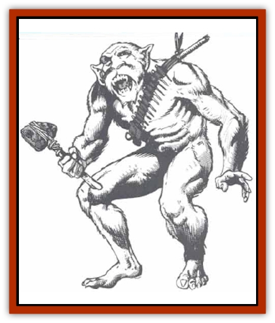

# Beastman

| Statistic | **Beastman** |
| --- | --- |
| **Activity Cycle:** | Day |
| **Alignment:** | Neutral (good) |
| **Armor Class:** | 8 |
| **Climate/Terrain:** | Tropical and subtropical/Forests |
| **Damage/Attack:** | By weapon (1-8 usually) |
| **Diet:** | Omnivore |
| **Frequency:** | Very rare |
| **Hit Dice:** | 2 |
| **Intelligence:** | Average (8-10) |
| **Magic Resistance:** | 80% |
| **Morale:** | Steady (11-12) |
| **Movement:** | 12 |
| **No. Appearing:** | 2-12 |
| **No. of Attacks:** | 1 |
| **Organization:** | Tribal |
| **Size:** | M (5' tall) |
| **Special Attacks:** | Nil |
| **Special Defenses:** | Camouflage |
| **THAC0:** | 19 |
| **Treasure:** | K,Q |
| **XP Value:** | 270 |

Beastmen resemble short, slender humans, except for the fine layer of dark green or olive colored fur that covers their bodies. Underneath this is an inner coat of coarse black fur. As a beastman moves about, his body instinctively causes portions of the black fur to become erect, like the hair on a cats back when it is frightened. By so doing, the beastman creates a pattern of stripes or spots that enables him to blend in with the hues and shadows of the forest around him. Because of this unique ability, beastmen seldom wear clothing or ornamentation of any sort.

The beastman language is very intricate, involving spoken elements, hand and body gestures, and changes in the patterns on the speaker's fur. While other races can learn the spoken and gestural portions of the language, they are unable to reproduce the color changes. Thus outsiders can speak in only the simplest terms.

**Combat:** The beastman's unusual ability to camouflage himself in the forest makes him a dangerous hunter or adversary. When he chooses to remain undetected, a beastman can hide in shadows with a 90% chance of success. This ability works only in places where the beastman's dark green and black coloration blends with the foliage. When he attacks an opponent who is not aware of his presence, the opponent suffers a -6 penalty to his surprise roll.

Although beastmen generally seek to avoid combat (or even contact) with outsiders, they certainly defend themselves and their tribes. When they engage in combat, their ability to camouflage themselves and their natural magic resistance make them dangerous opponents. In combat, beastmen employ a variety of spears, stone axes or knives, bolas, and blowguns. They create a special toxin for use in their blow gun darts - a weak form of class F poison (those who fail their saving throws vs. poison die in 2d4 rounds). Although just as lethal as other class F poisons, all saving throws made to resist its effects gain a +4 bonus.

Sometimes beastmen take opponents prisoner rather than kill them. In these cases, a large, weighted net woven from vines and creepers is dropped from above. Prisoners taken with such a net are often stripped of all possessions and then released far from the tribe. If, however, they are judged to be a threat even after this is done, they are put to a painless death.

**Habitat/Society:** Each beastman tribe consists of between 40 and 60 individuals, though most encounters occur with hunting parties of 1d6 +4 individuals. Each tribe is lead by a chief who is not elected or appointed, but simply adopts the leadership roll as needed. A tribe's chief varies from one day to the next, as the situation warrants. For example, if the tribe is at war, the chief is the best warrior. In cases where one or more individuals are suited to the task, a competition of some sort decides the leader. It is not considered an honor to be the chief of the tribe, it is just a duty that many are called upon to carry out from time to time. Likewise, there is no shame in never being a chief, or in losing a competition for the leadership spot.

Beastman culture does not discriminate against either sex. The only exception to this rule are pregnant women who, because of their importance to the future of the tribe, are treated with reverence and excused from all heavy activity. Young are raised by the community as a whole. Ten percent of any tribe are young (10%-80% mature).

Beastmen live in houses woven from the living branches of the forest's treetops. Each such shelter provides a home for 1d4+2 adults of mixed gender who have a form of group marriage. In addition, there may be one or two children in the house.

Beastmen do not believe in magic, ghosts, spirits, or the supernatural. If they cannot see, hear, or touch something, then it does not exist. There are many who say that this is because of the beastmen's innate magic resistance. On the other hand, there are those who feel that the reverse is true; that this disbelief grants the beastmen their immunity to spells.

**Ecology:** Beastmen are skillful hunters, well adapted to survival in their forests. They are hunted by only the most cunning and powerful creatures. Although they are omnivores and gather fruits and nuts to eat, they practice no form of agriculture.

Beastmen have little that other cultures consider worth trading for. As their culture is self-sustaining, they have no need of or desire for outside trade.

---
## Discovery & Documentation

**Source Publication:** MC5 Greyhawk Appendix (1989)
**Campaign Setting:** Advanced Dungeons & Dragons 2nd Edition
**Author(s):** Grant Boucher, William W. Connors, Steve Gilbert, Bruce Nesmith, Chris Mortika, Skip Williams

### Other Creatures Found in This Source Book
   * [[Aspis|Aspis]]
   * [[Bonesnapper|Bonesnapper]]
   * [[Booka|Booka]]
   * [[Brownie_Buckawn|Brownie, Buckawn]]
   * [[Brownie_Quickling|Brownie, Quickling]]
   * [[Crystalmist|Crystalmist]]
   * [[Dragon_Cloud|Dragon, Cloud]]
   * [[Dragon_Oerth_Greyhawk|Dragon (Oerth), Greyhawk]]
   * [[Dragonfly_Giant|Dragonfly, Giant]]
   * [[Dragonnel|Dragonnel]]
   * [[Elf_Grugach|Elf, Grugach]]
   * [[Elf_Valley|Elf, Valley]]
   * [[Golem_Necrophidius|Golem, Necrophidius]]
   * [[Grell_Wild|Grell, Wild]]
   * [[Grung|Grung]]
   * [[Hobgoblin_Norker|Hobgoblin, Norker]]
   * [[Hook_Horror|Hook Horror]]
   * [[Horgar|Horgar]]
   * [[Hound_Yeth|Hound, Yeth]]
   * [[Iguana_Giant|Iguana, Giant]]
   * [[Ingundi|Ingundi]]
   * [[Kech|Kech]]
   * [[Kyuss_Son_of|Kyuss, Son of]]
   * [[Mite|Mite]]
   * [[Needleman|Needleman]]
   * [[Plant_Carnivorous_Oerth|Plant, Carnivorous (Oerth)]]
   * [[Plant_Carnivorous_Vampire_Cactus|Plant, Carnivorous, Vampire Cactus]]
   * [[Plasmoid_General_Information|Plasmoid, General Information]]
   * [[Rat_Oerth|Rat (Oerth)]]
   * [[Raven_Crow|Raven/Crow]]
   * [[Scarecrow|Scarecrow]]
   * [[Shadow_Slow|Shadow, Slow]]
   * [[Skulk|Skulk]]
   * [[Snail|Snail]]
   * [[Sprite|Sprite]]
   * [[Taer|Taer]]
   * [[Tentamort|Tentamort]]
   * [[Turtle_Giant|Turtle, Giant]]
   * [[Tyrg|Tyrg]]
   * [[Wolf_Mist|Wolf, Mist]]
   * [[Wraith_Oerth|Wraith (Oerth)]]
   * [[Zygom|Zygom]]
