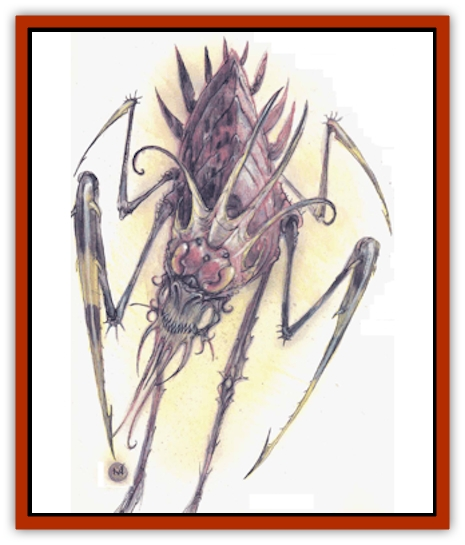

# Bebilith

| Statistic | **Bebilith** |
| --- | --- |
| **Activity Cycle:** | Any |
| **Alignment:** | Chaotic evil |
| **Armor Class:** | -5 |
| **Climate/Terrain:** | The Abyss |
| **Damage/Attack:** | 2d4/2d4/2d6 |
| **Diet:** | Carnivore |
| **Frequency:** | Very rare |
| **Hit Dice:** | 12 |
| **Intelligence:** | Very (11-12) |
| **Magic Resistance:** | 50% |
| **Morale:** | Champion (15-16) |
| **Movement:** | 9, Wb 18 |
| **No. Appearing:** | 1 |
| **No. of Attacks:** | 3 |
| **Organization:** | Solitary |
| **Size:** | H (15' long) |
| **Special Attacks:** | Armor destruction, poison |
| **Special Defenses:** | Webs, protection magic, +2 weapons to hit |
| **THAC0:** | 9 |
| **Treasure:** | Nil |
| **XP Value:** | 13,000 |

Also known as <q>creepers of the Abyss</q> and <q>barbed horrors</q>, bebiliths are huge arachnids that roam the Abyss, preying on the [[Tanar'ri_General_Information|tanar'ri]].

Crule, unwavring harbingers of death and torture, bebiliths are hideous, misshapen [[Spider|spiders]] with hard, chitinous shells. Their two forelegs each end in a brutal barb, and their mouths are filled with fangs that drip poisonous liquid.

Bebiliths can apparently speak to each other through mind contact. They cannot communicate otherwise.

**Combat:** These spiderlike creatures are never surprised and are immune to attacks from nonmagical weapons and magical weapons of less than +3 enchantment. They are always surrounded by a *protection from good* spell they can reverse at will.

Bebiliths viciously attack anything they see, without mercy. Their sharp forelegs cause 1d6 points of damage each, and a foreleg hit may also ruin the target's armor or shield. For each hit, roll 1d6: 1-2, the shield (if any] may be ruined; 3-6, the armor (if any) may be ruined. Nonmagical armor and shields are ruined 40% of the time. Magical armor and shields modify this by -10% per plus of the magical enchantment. Ruined armor or shields no longer improve the target's Armor Class and cannot be repaired for less than their gold piece values. Magical enchantments are lost, regardless of repair. If the target wears neither armor nor shields, foreleg attacks from a bebilith do normal damage.

A bebilith can also bite (1d12 points of damage and poison; successfully save vs. poison with a -2 penalty or die in 1d4 rounds). If a poisoned body is not blessed within one turn of death, the corpse bursts into flames and disintegrates.

Four times per day, a hehilith can shoot a powerful web substance from its spinner. This web covers 8,000 cubic feet (a 20-foot cube, or any other shape the bebilith desires). The web must begin adjacent to the creature and reach no more than 60 feet away. The web acts like a *web* spell, except that it is permanent. Also, fire is only 25% likely per round of contact to burn the web.

If sorely pressed, the bebilith can *plane shift* to the Astral Plane at will. It may magically pull one opponent into the Astral with it; the bebilith need only be in melee with the opponent, and the opponent must fail to save vs. wand. Of course, if the target can leave the Astral Plane under its own power, the behilith cannot stop it.

**Habitat/Society:** Bebiliths prey on, or by some accounts punish, the tanar'ri of the Abyss. They seem to select, by unknown means, certain groups of the major tanar'ri and exterminate them completely, in brief but horrible wars of annihilation. Of equal mystery is the precise way a tanar'ri, one of the cruelest and most chaotic creatures in existence, incurs the wrath of these assassins.

Although creatures roam the Abyss that could destroy a bebilith as a matter of course, nothing ever does. The bebiliths have developed an uncanny mystique, and among the denizens of the Abyss, destroying one is taboo. Some visitors to the Abyss report constructive use of this taboo, such as by entering a bebilith's vicinity to escape pursuing tanar'ri. Of course, the clever escapees then must escape the bebilith. Conjuring an illusory bebilith would seem a natural idea for the resourceful traveller, hut recorded accounts show mixed results. Apparently the tanar'ri recognize bebiliths not only by sight and sound, but by odor and perhaps spiritual aura. These qualities test the capacity of most illusionists.

Scholars proposed the <q>spiritual aura</q> idea because those who have been in the vicinity of the bebilith report a general malaise and sense of futility. However, given the creature's power, this feeling could be just as easily attributed to sheer terror.

**Ecology:** Information about the bebilith has surfaced at the cost of many lives, for few who see a <q>creeper of the Abyss</q> live to tell the tale.

Mages and alchemists pay extraordinary prices for bebilith spinnerets (2,000 gp and up). They believe, so far without evidence, that the spinneret figures in powerful spells and magical items of binding.

---
## Discovery & Documentation

**Source Publication:** MC8 Outer Planes Appendix (1990)
**Campaign Setting:** Planescape
**Author(s):** Timothy B. Brown, Jamie LaFountain

### Other Creatures Found in This Source Book
   * [[Aasimon_Agathinon|Aasimon, Agathinon]]
   * [[Aasimon_Deva|Aasimon, Deva]]
   * [[Aasimon_Light|Aasimon, Light]]
   * [[Aasimon_General_Information|Aasimon, General Information]]
   * [[Aasimon_Planetar|Aasimon, Planetar]]
   * [[Aasimon_Solar|Aasimon, Solar]]
   * [[Air_Sentinel|Air Sentinel]]
   * [[Animal_Lord|Animal Lord]]
   * [[Archon|Archon]]
   * [[Baatezu_Lesser_Abishai|Baatezu, Lesser, Abishai]]
   * [[Baatezu_Greater_Amnizu|Baatezu, Greater, Amnizu]]
   * [[Baatezu_Lesser_Barbazu|Baatezu, Lesser, Barbazu]]
   * [[Baatezu_Greater_Cornugon|Baatezu, Greater, Cornugon]]
   * [[Baatezu_Lesser_Erinyes|Baatezu, Lesser, Erinyes]]
   * [[Baatezu_General_Information|Baatezu, General Information]]
   * [[Baatezu_Greater_Gelugon|Baatezu, Greater, Gelugon]]
   * [[Baatezu_Lesser_Hamatula|Baatezu, Lesser, Hamatula]]
   * [[Baatezu_Lemure|Baatezu, Lemure]]
   * [[Baatezu_Least_Nupperibo|Baatezu, Least, Nupperibo]]
   * [[Baatezu_Lesser_Osyluth|Baatezu, Lesser, Osyluth]]
   * [[Baatezu_Greater_Pit_Fiend|Baatezu, Greater, Pit Fiend]]
   * [[Baatezu_Least_Spinagon|Baatezu, Least, Spinagon]]
   * [[Balaena|Balaena]]
   * [[Bariaur|Bariaur]]
   * [[Bodak|Bodak]]
   * [[Dog_Moon|Dog, Moon]]
   * [[Dragon_Adamantite|Dragon, Adamantite]]
   * [[Einheriar|Einheriar]]
   * [[Gehreleth|Gehreleth]]
   * [[Githyanki|Githyanki]]
   * [[Githzerai|Githzerai]]
   * [[Hordling|Hordling]]
   * [[Lammasu_Celestial|Lammasu, Celestial]]
   * [[Larva|Larva]]
   * [[Maelephant|Maelephant]]
   * [[Marut|Marut]]
   * [[Mediator|Mediator]]
   * [[Mortai|Mortai]]
   * [[Night_Hag|Night Hag]]
   * [[Nightmare|Nightmare]]
   * [[Noctral|Noctral]]
   * [[Per|Per]]
   * [[Phoenix|Phoenix]]
   * [[Slaad|Slaad]]
   * [[Tanar'ri_Greater_Babau|Tanar'ri, Greater, Babau]]
   * [[Tanar'ri_Greater_Chasme|Tanar'ri, Greater, Chasme]]
   * [[Tanar'ri_Greater_Nabassu|Tanar'ri, Greater, Nabassu]]
   * [[Tanar'ri_Least_Dretch|Tanar'ri, Least, Dretch]]
   * [[Tanar'ri_Least_Manes|Tanar'ri, Least, Manes]]
   * [[Tanar'ri_Least_Rutterkin|Tanar'ri, Least, Rutterkin]]
   * [[Tanar'ri_Lesser_Alu-Fiend|Tanar'ri, Lesser, Alu-Fiend]]
   * [[Tanar'ri_Lesser_Bar-Lgura|Tanar'ri, Lesser, Bar-Lgura]]
   * [[Tanar'ri_Lesser_Cambion|Tanar'ri, Lesser, Cambion]]
   * [[Tanar'ri_Lesser_Succubus|Tanar'ri, Lesser, Succubus]]
   * [[Tanar'ri_Guardian_Molydeus|Tanar'ri, Guardian, Molydeus]]
   * [[Tanar'ri_General_Information|Tanar'ri, General Information]]
   * [[Tanar'ri_True_Balor|Tanar'ri, True, Balor]]
   * [[Tanar'ri_True_Glabrezu|Tanar'ri, True, Glabrezu]]
   * [[Tanar'ri_True_Hezrou|Tanar'ri, True, Hezrou]]
   * [[Tanar'ri_True_Marilith|Tanar'ri, True, Marilith]]
   * [[Tanar'ri_True_Nalfeshnee|Tanar'ri, True, Nalfeshnee]]
   * [[Tanar'ri_True_Vrock|Tanar'ri, True, Vrock]]
   * [[Titan|Titan]]
   * [[Translator|Translator]]
   * [[T'uen-rin|T'uen-rin]]
   * [[Vaporighu|Vaporighu]]
   * [[Warden_Beast|Warden Beast]]
   * [[Yugoloth_Greater_Arcanaloth|Yugoloth, Greater, Arcanaloth]]
   * [[Yugoloth_Lesser_Dergoloth|Yugoloth, Lesser, Dergoloth]]
   * [[Yugoloth_Lesser_Hydroloth|Yugoloth, Lesser, Hydroloth]]
   * [[Yugoloth_General_Information|Yugoloth, General Information]]
   * [[Yugoloth_Lesser_Mezzoloth|Yugoloth, Lesser, Mezzoloth]]
   * [[Yugoloth_Greater_Nycaloth|Yugoloth, Greater, Nycaloth]]
   * [[Yugoloth_Lesser_Piscoloth|Yugoloth, Lesser, Piscoloth]]
   * [[Yugoloth_Greater_Ultroloth|Yugoloth, Greater, Ultroloth]]
   * [[Yugoloth_Lesser_Yagnoloth|Yugoloth, Lesser, Yagnoloth]]
   * [[Zoveri|Zoveri]]
