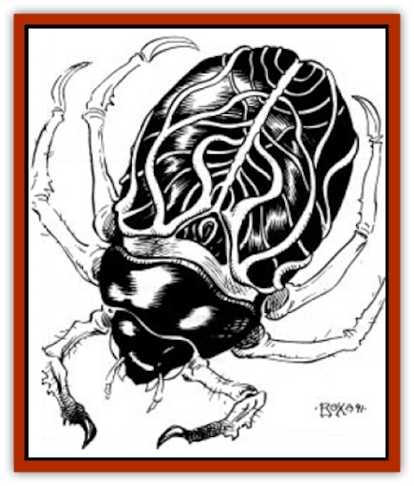

# Beetle - Agony

| Statistic | **Beetle, Agony** |
| --- | --- |
| **Activity Cycle:** | Any |
| **Alignment:** | Neutral |
| **Armor Class:** | 6 |
| **Climate/Terrain:** | Any |
| **Damage/Attack:** | 1 |
| **Diet:** | Pain/psionic drain |
| **Frequency:** | Rare |
| **Hit Dice:** | 1+5 |
| **Intelligence:** | Animal (1) |
| **Magic Resistance:** | Nil |
| **Morale:** | Unsteady (7) |
| **Movement:** | 3, Fl 6, Jp 3 |
| **No. Appearing:** | 1-4 |
| **No. of Attacks:** | 1 |
| **Organization:** | Solitary |
| **Size:** | T (1&rdquo;) |
| **Special Attacks:** | Spinal tap, psionic drain |
| **Special Defenses:** | Nil |
| **THAC0:** | 19 |
| **Treasure:** | Nil |
| **XP Value:** | 270 |

**Psionics Summary**

| Level | Dis/Sci/Dev | Attack/Defense | Score | PSPs |
| --- | --- | --- | --- | --- |
| 2 | 2/1/3 | -/M- | 15 | 30 |

**Telepathy -** *Science:* mind link; *Devotions:* contact, mind blank.

**Metapsionics -** *Sciences:* nil; *Devotions:* cannibalize other, psionic drain.

*Cannibalize other:* special ability, no cost; *psionic drain:* no cost during spinal tap.

This harmless looking, black [[Beetle_Scarab|scarab beetle]] psionically lives off the pain and agony of its victims, hence its name.

The agony beetle has a hard, black-veined, chitinous shell that is marked by dark, transverse lines. The shell protects a pair of wings. Six hooked legs are used by the beetle to attach itself to the skin of humanoid or beast. An elongated snout contains a retractable tendril. The agony beetle uses a pair of stubby antennae to sense vibrations as it does not have eyes.

**Combat:** An agony beetle can only attack creatures that are man-sized or smaller. When an agony beetle attempts or is forced to come in contact with a victim, a secret Intelligence check is rolled. If the roll is less than the character's Intelligence, the player feels something crawling on him; failure means the creature goes unnoticed. If the players are asleep, magically *held*, in the midst of melee, or engaged in any other action that involves intense concentration (i.e., spellcasting, psionics, etc.), there is no roll as the agony beetle automatically goes unnoticed.

 When the agony beetle locates the victim's spinal column, a bile-coated tendril emerges from the beetle's snout (agony beetles do not attack invertebrates). The bile anesthetizes the skin so the victim does not feel the tendril enter. The agony beetle attacks its unknowing victim until the tendril penetrates the skin (a successful attack roll; the agony beetle ignores any armor it is beneath). Once inside the skin, the tendril is inserted into the spine. The victim is suddenly racked with excruciating pain, so intense that the victim can do nothing else but writhe and scream in agony. During this time the beetle psionically absorbs and stores the energy released by the victim. The innate psionic ability cannibalize other is unique to this beetle. It converts the victim's Constitution to PSPs that the beetle absorbs by using *psychic drain*. The beetle can only convert Constitution and can only feed on pain. The beetle will remain attached even after fully sated, basking in the flow of energy until the victim dies.

The beetle cannot be removed by the victim; only another creature may free the individual of the beetle's deadly attachment. If the victim is alone, he will surely die. The beetle drains one Constitution point per round, converting it to 10 PSPs. A victim dies when its Constitution is reduced to zero. For creatures without a Constitution score, it will die in 1d12+5 rounds.

**Habitat/Society:** Although the beetle's primary locomotion is crawling, the creature's small wings allow short distance flight (up to 6'). The six folded, hooked legs also enable the creature to jump 3' vertically. Agony beetles tend to live near water sources where they hope to encounter prey. A pain-devouring creature, the agony beetle never ingests solid food for sustenance, only an occasional sip of water. They will not hesitate to attack members of their own species, but are often no match for other insects more evolved for combat.

**Ecology:** Old stories claim that agony beetles originally escaped from a sorcerer-king's torture chamber. It is more likely that they were (and are) drawn there for obvious reasons. They are not edible and serve only the darkest needs. [[Halfling_Athas|Halflings]] sometimes use the beetles in slings and throw them into trespassers' clothing; it shortens the hunt without harming the meal.

---
## Discovery & Documentation

**Source Publication:** MC12 Dark Sun Appendix I - Terrors of the Desert (1991)
**Campaign Setting:** Dark Sun
**Author(s):** Tom Prusa, Louis J. Prosperi, Walter M. Baas

### Other Creatures Found in This Source Book
   * [[Animal_Herd_Athas|Animal, Herd (Athas)]]
   * [[Animal_Household_Athas|Animal, Household (Athas)]]
   * [[Antloid_Desert|Antloid, Desert]]
   * [[Banshee_Dwarf|Banshee, Dwarf]]
   * [[Bog_Wader|Bog Wader]]
   * [[Brambleweed|Brambleweed]]
   * [[B'rohg|B'rohg]]
   * [[Burnflower|Burnflower]]
   * [[Cat_Psionic|Cat, Psionic]]
   * [[Cha'thrang|Cha'thrang]]
   * [[Cistern_Fiend|Cistern Fiend]]
   * [[Clam_Giant|Clam, Giant]]
   * [[Cloud_Ray|Cloud Ray]]
   * [[Drake_Athas_Air|Drake (Athas), Air]]
   * [[Drake_Athas_Earth|Drake (Athas), Earth]]
   * [[Drake_Athas_Fire|Drake (Athas), Fire]]
   * [[Drake_Athas_Water|Drake (Athas), Water]]
   * [[Dune_Runner|Dune Runner]]
   * [[Dune_Trapper|Dune Trapper]]
   * [[Elemental_Athas_Greater_Air|Elemental (Athas), Greater, Air]]
   * [[Elemental_Athas_Greater_Earth|Elemental (Athas), Greater, Earth]]
   * [[Elemental_Athas_Greater_Fire|Elemental (Athas), Greater, Fire]]
   * [[Elemental_Athas_Greater_Water|Elemental (Athas), Greater, Water]]
   * [[Elemental_Athas_Lesser_Air_Earth|Elemental (Athas), Lesser, Air/Earth]]
   * [[Elemental_Athas_Lesser_Fire_Water|Elemental (Athas), Lesser, Fire/Water]]
   * [[Elemental_Athas_General_Information|Elemental (Athas), General Information]]
   * [[Erdland|Erdland]]
   * [[Esperweed|Esperweed]]
   * [[Flailer|Flailer]]
   * [[Floater|Floater]]
   * [[Giant_Athas|Giant (Athas)]]
   * [[Golem_Athas_I|Golem (Athas) I]]
   * [[Golem_Athas_II|Golem (Athas) II]]
   * [[Golem_Athas_III|Golem (Athas) III]]
   * [[Golem_Athas_General_Information|Golem (Athas), General Information]]
   * [[Halfling_Renegade|Halfling, Renegade]]
   * [[Hej-kin|Hej-kin]]
   * [[Id_Fiend|Id Fiend]]
   * [[Insect_Swarm_Athas|Insect Swarm (Athas)]]
   * [[Kank_Wild|Kank, Wild]]
   * [[Kirre|Kirre]]
   * [[Megapede|Megapede]]
   * [[Mul_Wild|Mul, Wild]]
   * [[Nightmare_Beast|Nightmare Beast]]
   * [[Plant_Carnivorous_Athas|Plant, Carnivorous (Athas)]]
   * [[Pterran|Pterran]]
   * [[Pterrax|Pterrax]]
   * [[Pulp_Bee|Pulp Bee]]
   * [[Pyreen|Pyreen]]
   * [[Rasclinn|Rasclinn]]
   * [[Razorwing|Razorwing]]
   * [[Roc_Athas|Roc (Athas)]]
   * [[Sand_Bride|Sand Bride]]
   * [[Sand_Cactus|Sand Cactus]]
   * [[Sand_Vortex|Sand Vortex]]
   * [[Scrab|Scrab]]
   * [[Silt_Horror|Silt Horror]]
   * [[Silt_Runner|Silt Runner]]
   * [[Sink_Worm|Sink Worm]]
   * [[Sloth_Athas|Sloth (Athas)]]
   * [[So-ut|So-ut]]
   * [[Spider_Cactus|Spider Cactus]]
   * [[Spider_Crystal|Spider, Crystal]]
   * [[Spirit_of_the_Land|Spirit of the Land]]
   * [[T'Chowb|T'Chowb]]
   * [[Thrax|Thrax]]
   * [[Tohr-kreen_I|Tohr-kreen I]]
   * [[Villichi|Villichi]]
   * [[Zhackal|Zhackal]]
   * [[Zombie_Plant|Zombie Plant]]
