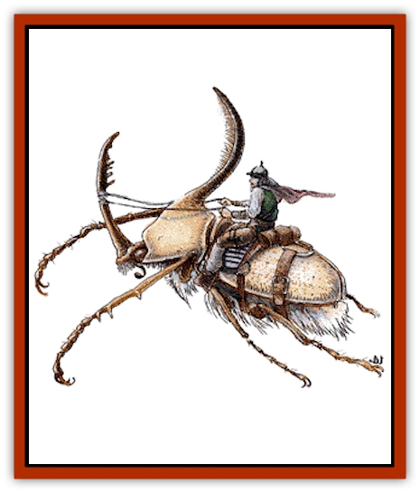
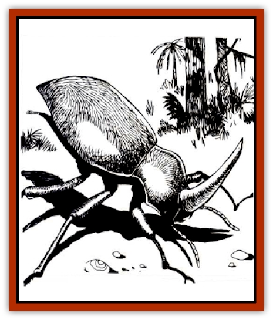

# Beetle - Giant

| Statistic | **Bombardier** | **Boring** | **Fire** | **Rhinoceros** | **Stag** | **Water** |
| --- | --- | --- | --- | --- | --- | --- |
| **Activity Cycle:** | Day | Night | Night | Any | Any | Any |
| **Alignment:** | Neutral | Neutral | Neutral | Neutral | Neutral | Neutral |
| **Armor Class:** | 4 | 3 | 4 | 2 | 3 | 3 |
| **Climate/Terrain:** | Any forest | Any land | Any land | Any jungle | Any forest | Fresh water |
| **Damage/Attack:** | 2-12 | 5-20 | 2-8 | 3-18/2-16 | 4-16/1-10/1-10 | 3-18 |
| **Diet:** | Carnivore | Omnivore | Omnivore | Herbivore | Herbivore | Omnivore |
| **Frequency:** | Common | Common | Common | Uncommon | Common | Common |
| **Hit Dice:** | 2+2 | 5 | 1+2 | 12 | 7 | 4 |
| **Intelligence:** | Non- (0) | Animal (1) | Non- (0) | Non- (0) | Non- (0) | Non- (0) |
| **Magic Resistance:** | Nil | Nil | Nil | Nil | Nil | Nil |
| **Morale:** | Elite (13) | Elite (14) | Steady (12) | Elite (14) | Elite (13) | Elite (14) |
| **Movement:** | 9 | 6 | 12 | 6 | 6 | 3, Sw 9 |
| **No. Appearing:** | 3-12 | 3-18 | 3-12 | 1-6 | 2-12 | 1-12 |
| **No. of Attacks:** | 1 | 1 | 1 | 2 | 3 | 1 |
| **Organization:** | Solitary | Solitary | Solitary | Solitary | Solitary | Solitary |
| **Size:** | S (4' long) | L (9' long) | S (2½' long) | L (12' long) | L (10' long) | M (6' long) |
| **Special Attacks:** | Acid cloud | Nil | Nil | Nil | Nil | Nil |
| **Special Defenses:** | Fire cloud | Nil | Nil | Nil | Nil | Nil |
| **THAC0:** | 19 | 15 | 19 | 9 | 13 | 17 |
| **Treasure:** | Nil | C,R,S,T | Nil | Nil | Nil | Nil |
| **XP Value:** | 120 | 175 | 35 | 4,000 | 975 | 120 |

Giant [[Beetle|beetles]] are similar to their more ordinary counterparts, but thousands of times larger - with chewing mandibles and hard wings that provide substantial armor protection.

Beetles have two pairs of wings and three pairs of legs. Fortunately, the wings of a giant beetle cannot be used to fly, and in most cases, its six bristly legs do not enable it to move as fast as a fleeing man. The hard, chitinous shell of several varieties of these beetles are brightly colored, and sometimes have value to art collectors. While their shells protect beetles as well as plate mail armor, it is difficult to craft armor from them, and a skilled alchemist would need to be brought in on the job.

All beetles are basically unintelligent and always hungry. They will feed on virtually any form of organic material, including other sorts of beetles. They taste matter with their antennae, or feelers; if a substance tasted is organic, the beetle grasps it with its mandibles, crushes it, and eats it. Because of the thorough grinding of the mandibles, nothing eaten by giant beetles can be revived by anything short of a *wish*. Beetles do not hear or see well, and rely primarily on taste and feel.

Except as noted below, giant beetles are not really social animals; those that are found near each other are competitors for the same biological niche, not part of any family unit.

## Bombardier Beetle

The bombardier beetle is usually found above ground in wooded areas. It primarily feeds on offal and carrion, gathering huge heaps of the stuff in which to lay its eggs.

**Combat:** If it is attacked or disturbed, there is a 50% chance each round that it will turn its rear toward its attacker and fire off an 8-foot, spherical cloud of reeking, reddish, acidic vapor from its abdomen. This cloud causes 3d4 points of damage per round to any creature within range. Furthermore, the sound caused by the release of the vapor has a 20% chance of stunning any creature with a sense of hearing within a 15-foot radius, and a like chance for deafening any creature that was not stunned. Stunning lasts for 2d4 rounds, plus an additional 2d4 rounds of deafness afterwards. Deafening lasts 2d6 rounds. The giant bombardier can fire its vapor cloud every third round, but no more than twice in eight hours.

**Ecology:** The bombardier action of this beetle is caused by the explosive mixture of two substances that are produced internally and combined in a third organ. If a bombardier is killed before it has the opportunity to fire off both blasts, it is possible to cut the creature open and retrieve the chemicals. These chemicals can then be combined to produce a small explosive, or fire a projectile, with the proper equipment.

The chemicals are also of value to alchemists, who can use them in various preparations. They are worth 50 gp per dose.

## Boring Beetle

Boring beetles feed on rotting wood and similar organic material, so they are usually found individually inside huge trees or massed in underground tunnel complexes.

**Combat:** The large mandibles of the boring beetle have a powerful bite and will inflict up to 20 points on damage to the victim.

**Habitat/Society:** Individually, these creatures are not much more intelligent than other giant beetles, but it is rumored that nests of them can develop a communal intelligence with a level of consciousness and reasoning that approximates the human brain. This does not mean that each beetle has the intelligence of a human, but rather that, collectively, the entire nest has attained that level. In these cases, the beetles are likely to collect treasure and magical items from their victims.

**Ecology:** In tunnel complexes, boring beetles grow molds, slimes, and fungi for food, beginning their cultures on various forms of decaying vegetable and animal matter and wastes.

One frequent fungi grown is the [[Fungus|shrieker]], which serves a dual role. Not only is the shrieker a tasty treat for the boring beetle, but it also functions as an alarm when visitors have entered the fungi farm. Boring beetles are quick to react to these alarms, dispatching the invaders, sometimes eating them, but in any case gaining fresh organic matter on which to raise shrieker and other saprophytic plants.

## Fire Beetle

The smallest of the giant beetles, fire beetles are nevertheless capable of delivering serious damage with their powerful mandibles. They are found both above and below ground, and are primarily nocturnal.

**Combat:** Despite its name, the fire beetle has no fire attacks, relying instead on its huge mandibles to inflict up to three times the damage of a dagger in a single attack.

**Ecology:** Fire beetles have two special glands above their eyes and one near the back of their abdomens. These glands produce a luminous red glow, and for this reason they are highly prized by miners and adventurers. This luminosity persists for 1d6 days after the glands are removed from the beetle, and the light shed will illuminate a radius of 10 feet.

The light from these glands is <q>cold</q> - it produces no heat. Many mages and alchemists are eager to discover the secret of this cold light, which could be not only safe, but economical, with no parts to heat up and burn out. In theory, they say, such a light source could last forever.

## 

Rhinoceros Beetle

This uncommon monster inhabits tropical and subtropical jungles. They roam the rain forests searching for fruits and vegetation, and crushing anything in their path. The horn of a giant rhinoceros beetle extends about 6 feet.

**Combat:** The mandibles of this giant beetle inflict 3d6 points of damage on anyone unfortunate enough to be caught by them; the tremendous horn is capable of causing 2d8 points of damage by itself.

**Ecology:** The shell of this jungle dweller is often brightly colored or iridescent. If retrieved in one piece, these shells are valuable to clerics of the Egyptian pantheon, who use them as giant [[Beetle_Scarab|scarabs]] to decorate temples and other areas of worship. It is a representation of this, the largest of all beetles, that serves as the holy symbol for clerics of Apshai, the Egyptian god whose sphere of influence is said to include all insects.

## Stag Beetle

These woodland beetles are very fond of grains and similar growing crops, and they sometimes become great nuisances when they raid cultivated lands.

**Combat:** Like other beetles, they have poor sight and hearing, but they will fight if attacked or attack if they encounter organic material they consider food. The giant stag beetle's two horns are usually not less than 8 feet long; they inflict up to 10 points of damage each.

**Ecology:** The worst damage from a stag beetle raid is that done to crops; they will strip an entire farm in short order. Livestock suffers too, stampeding in fear and wreaking more havoc. The beetles may even devour livestock, if they are hungry enough.

## Water Beetle

The giant water beetle is found only in fresh water no less than 30 feet deep.

**Combat:** Voracious eaters, these beetles prey upon virtually any form of animal, but will eat almost anything. Slow and ponderous on land, they move very quickly in water. Giant water beetles hunt food by scent and by feeling vibrations.

**Habitat/Society:** Water beetles sometimes inhabit navigable rivers and lakes, in which case they can cause considerable damage to shipping, often attacking and sinking craft to get at the tasty morsels inside.

**Ecology:** Although they are air breathers, water beetles manage to stay underwater for extended periods of time by catching and holding a bubble of air beneath their giant wings. They will carry the bubble underwater, where it can be placed in a cave or some other cavity capable of holding an air supply.

---
## Discovery & Documentation

**Source Publication:** MC2 Volume II (1993)
**Campaign Setting:** Advanced Dungeons & Dragons 2nd Edition
**Author(s):** Jay Batista, Scott Bennie, Grant Boucher, William W. Connors, Steve Gilbert, Heike Kubasch, James Lowder, David Edward Martin, Bruce Nesmith, Jean Rabe, Rick Swan, John J. Terra, Gary L. Thomas

### Other Creatures Found in This Source Book
   * [[Ant|Ant]]
   * [[Ant_Lion_Giant|Ant Lion, Giant]]
   * [[Ape_Carnivorous|Ape, Carnivorous]]
   * [[Baboon|Baboon]]
   * [[Badger|Badger]]
   * [[Barracuda|Barracuda]]
   * [[Bulette|Bulette]]
   * [[Bullywug|Bullywug]]
   * [[Dwarf_Duergar|Dwarf, Duergar]]
   * [[Dwarf_Gully|Dwarf, Gully]]
   * [[Eagle|Eagle]]
   * [[Eel|Eel]]
   * [[Elemental_Air_Kin|Elemental, Air Kin]]
   * [[Elemental_Water_Kin|Elemental, Water Kin]]
   * [[Elemental_Water_Kin_Water_Weird|Elemental, Water Kin, Water Weird]]
   * [[Firestar|Firestar]]
   * [[Firetail|Firetail]]
   * [[Fish_Giant|Fish, Giant]]
   * [[Frog|Frog]]
   * [[Gorgon|Gorgon]]
   * [[Hawk|Hawk]]
   * [[Heucuva|Heucuva]]
   * [[Hippocampus|Hippocampus]]
   * [[Hippogriff|Hippogriff]]
   * [[Kelpie|Kelpie]]
   * [[Kenku|Kenku]]
   * [[Killmoulis|Killmoulis]]
   * [[Kuo-Toa|Kuo-Toa]]
   * [[Lamia|Lamia]]
   * [[Lammasu|Lammasu]]
   * [[Lamprey|Lamprey]]
   * [[Leech|Leech]]
   * [[Leprechaun|Leprechaun]]
   * [[Leucrotta|Leucrotta]]
   * [[Locathah|Locathah]]
   * [[Lycanthrope_Wereboar|Lycanthrope, Wereboar]]
   * [[Lycanthrope_Werefox|Lycanthrope, Werefox]]
   * [[Mammal_Minimal|Mammal, Minimal]]
   * [[Mammal_Small|Mammal, Small]]
   * [[Mimic|Mimic]]
   * [[Morkoth|Morkoth]]
   * [[Muckdweller|Muckdweller]]
   * [[Myconid|Myconid]]
   * [[Naga|Naga]]
   * [[Obliviax|Obliviax]]
   * [[Octopus_Giant|Octopus, Giant]]
   * [[Otyugh|Otyugh]]
   * [[Piranha|Piranha]]
   * [[Plant_Dangerous_I|Plant, Dangerous I]]
   * [[Plant_Intelligent|Plant, Intelligent]]
   * [[Poltergeist|Poltergeist]]
   * [[Porcupine|Porcupine]]
   * [[Rat_Osquip|Rat, Osquip]]
   * [[Roc|Roc]]
   * [[Roper|Roper]]
   * [[Rot_Grub|Rot Grub]]
   * [[Rust_Monster|Rust Monster]]
   * [[Sahuagin|Sahuagin]]
   * [[Sea_Lion|Sea Lion]]
   * [[Sea_Horse_Giant|Sea Horse, Giant]]
   * [[Shambling_Mound|Shambling Mound]]
   * [[Shark|Shark]]
   * [[Sphinx|Sphinx]]
   * [[Squid_Giant|Squid, Giant]]
   * [[Stirge|Stirge]]
   * [[Swanmay|Swanmay]]
   * [[Tarrasque|Tarrasque]]
   * [[Tasloi|Tasloi]]
   * [[Triton|Triton]]
   * [[Troglodyte|Troglodyte]]
   * [[Urchin|Urchin]]
   * [[Urd|Urd]]
   * [[Weasel|Weasel]]
   * [[Wolverine|Wolverine]]
   * [[Yellow_Musk_Creeper|Yellow Musk Creeper]]
