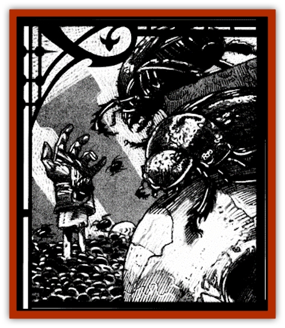

# Beetle - Scarab

| Statistic | **Giant** | **Grave** | **Monstrous** |
| --- | --- | --- | --- |
| **Activity Cycle:** | Night | Night | Any |
| **Alignment:** | Neutral | Neutral | Neutral |
| **Armor Class:** | 4 | 4 | 2 |
| **Climate/Terrain:** | Temperate lands &amp; subterranean | Temperate lands &amp; subterranean | Temperate lands &amp; subterranean |
| **Damage/Attack:** | Special | Special | 4d6 |
| **Diet:** | Scavenger | Scavenger | Scavenger |
| **Frequency:** | Rare | Common | Rare |
| **Hit Dice:** | 6 per swarm | 5 per swarm | 8 |
| **Intelligence:** | Non- (0) | Non- (0) | Non- (0) |
| **Magic Resistance:** | Nil | Nil | Nil |
| **Morale:** | Elite (13-14) | Elite (13-14) | Elite (13-14) |
| **Movement:** | 6, Br 3 | 6, Br 3 | 9, Br 3 |
| **No. Appearing:** | 1d6 swarms | 1d4 swarms | 1d6 |
| **No. of Attacks:** | 1 | 1 | 1 |
| **Organization:** | Swarm | Swarm | Solitary |
| **Size:** | T (6&rdquo; long) | T (3&rdquo; long) | L (11' long) |
| **Special Attacks:** | Disease | Nil | Nil |
| **Special Defenses:** | Nil | Nil | Nil |
| **THAC0:** | 15 | 15 | 13 |
| **Treasure:** | (Z) | (Z) | (C,R,S,T) |
| **XP Value:** | 975 | 420 | 1,400 |

These flesh-eating [[Beetle|beetles]] line the walls of tombs and underground passageways. They attack in horrifying swarms and leave very little in their wake.

There are three types of scarab beetles. The most common, and in many ways the deadliest, is the swarming grave scarab. The larger giant scarab is somewhat less insidious than its smaller cousin but carries a terrible disease. The monstrous scarab is a solitary nightmare that dwells in remote caverns and tunnels.

None of these creatures is able to communicate with others, although the grave and [[Beetle_Giant|giant beetles]] have a rudimentary language that serves to exchange information within the swarm.

**Combat:** Scarab beetles are often passive, feeding primarily on decomposing flesh and detritus. However, there is a 50% chance that a person will be bitten as he passes through an infested area, setting off a feeding frenzy among the beetles who will swarm over the victim.

A swarm of grave scarabs is treated as a single monster. Each swarm covers a 10'x10' area and has 5 Hit Dice. Any victim caught in this area will automatically take damage equal to half the hit points of the swarm plus his base Armor Class each round. If a victim manages to escape the infested area 25% of the remaining beetles will cling to him and continue to deliver damage until destroyed.

Melee weapons have almost no effect on a swarm of scarab beetles. Each successful attack roll delivers 1 point of damage to the writhing mass. If the beetles being attacked have crawled onto someone, the person under the swarm suffers normal damage from the attack. Victims of the attack who are of at least small size can attempt to battle the swarm by falling to the ground and rolling back and forth. A small creature inflicts 1d4 points of damage to the swarm, a man-sized victim inflicts 1d6 points, large creatures inflict 1d8, and huge or gargantuan creatures inflict 1d10.

Area effect weapons such as flaming oil or magical spells do normal damage to scarab beetles, as well as to the persons who are being attacked by them.

**Habitat/Society:** Scarab beetles dig holes and tunnels near piles of offal and decomposing organic material. They are good burrowers and unwary travelers are often horrified to find a clear stretch of ground suddenly swarming with ravenous beetles.

**Ecology:** Through their consumption of carrion and the like, scarab beetles speed the reintroduction of decaying organic material into the environment. Gems and other inedible items of value are sometimes found among their food caches.

**Giant Scarab**

The giant scarab is a slightly larger member of the scarab family and grows to lengths of up to 6 inches. They are treated like grave beetles in combat except that each 10'x10' area has 6 Hit Dice. Each round that a victim loses hit points to a swarm of giant scarab beetles he must make a saving throw vs. poison or contract a disease similar to that created by the *cause desease* spell. A single failed saving throw indicates a debilitating disease. A second failed roll makes this a fatal disease.

**Monstrous Scarab**

These solitary creatures are enormous monsters of tremendous proportions. In combat, they strike with keen, powerful pincers that deliver an incredible 4d6 points of damage. These beasts have been known to bury still-living victims in their lairs for later consumption.

---
## Discovery & Documentation

**Source Publication:** Ravenloft Appendix III (1991)
**Campaign Setting:** Ravenloft
**Author(s):** Kirk Botulla

### Other Creatures Found in This Source Book
   * [[Akikage|Akikage]]
   * [[Animator_Common|Animator, Common]]
   * [[Animator_Greater|Animator, Greater]]
   * [[Animator_Minor|Animator, Minor]]
   * [[Animator_General_Information|Animator, General Information]]
   * [[Bakhna_Rakhna|Bakhna Rakhna]]
   * [[Baobhan_Sith|Baobhan Sith]]
   * [[Boneless|Boneless]]
   * [[Boowray|Boowray]]
   * [[Bruja|Bruja]]
   * [[Carrionette|Carrionette]]
   * [[Carrion_Stalker|Carrion Stalker]]
   * [[Cat_Midnight|Cat, Midnight]]
   * [[Cat_Skeletal|Cat, Skeletal]]
   * [[Cloaker_Resplendent|Cloaker, Resplendent]]
   * [[Cloaker_Shadow|Cloaker, Shadow]]
   * [[Cloaker_Undead|Cloaker, Undead]]
   * [[Corpse_Candle|Corpse Candle]]
   * [[Death's_Head_Tree|Death's Head Tree]]
   * [[Doppelganger_Ravenloft|Doppelganger (Ravenloft)]]
   * [[Familiar_Pseudo-|Familiar, Pseudo-]]
   * [[Familiar_Undead|Familiar, Undead]]
   * [[Feathered_Serpent|Feathered Serpent]]
   * [[Fenhound|Fenhound]]
   * [[Figurine_Ceramic|Figurine, Ceramic]]
   * [[Figurine_Crystal|Figurine, Crystal]]
   * [[Figurine_Ivory|Figurine, Ivory]]
   * [[Figurine_Obsidian|Figurine, Obsidian]]
   * [[Figurine_Porcelain|Figurine, Porcelain]]
   * [[Figurine_General_Information|Figurine, General Information]]
   * [[Fleas_of_Madness|Fleas of Madness]]
   * [[Furies|Furies]]
   * [[Geist|Geist]]
   * [[Ghost_Animal|Ghost, Animal]]
   * [[Golem_Flesh_Ravenloft|Golem, Flesh (Ravenloft)]]
   * [[Golem_Mist_Ravenloft|Golem, Mist (Ravenloft)]]
   * [[Golem_Wax_Ravenloft|Golem, Wax (Ravenloft)]]
   * [[Gremishka|Gremishka]]
   * [[Hag_Spectral|Hag, Spectral]]
   * [[Head_Hunter|Head Hunter]]
   * [[Hearth_Fiend|Hearth Fiend]]
   * [[Hebi-No-Onna|Hebi-No-Onna]]
   * [[Hound_Phantom|Hound, Phantom]]
   * [[Hound_Skeletal|Hound, Skeletal]]
   * [[Imp_Wishing|Imp, Wishing]]
   * [[Ivy_Crawling|Ivy, Crawling]]
   * [[Jack_Frost|Jack Frost]]
   * [[Jolly_Roger|Jolly Roger]]
   * [[Kizoku|Kizoku]]
   * [[Lashweed|Lashweed]]
   * [[Leech_Magical|Leech, Magical]]
   * [[Leech_Psionic|Leech, Psionic]]
   * [[Lich_Defiler|Lich, Defiler]]
   * [[Lich_Drow|Lich, Drow]]
   * [[Lich_Elemental|Lich, Elemental]]
   * [[Lich_Psionic|Lich, Psionic]]
   * [[Living_Tattoo|Living Tattoo]]
   * [[Lycanthrope_Loup-garou|Lycanthrope, Loup-garou]]
   * [[Lycanthrope_Werejackal|Lycanthrope, Werejackal]]
   * [[Lycanthrope_Werejaguar_Ravenloft|Lycanthrope, Werejaguar (Ravenloft)]]
   * [[Lycanthrope_Wereleopard|Lycanthrope, Wereleopard]]
   * [[Lycanthrope_Wereray|Lycanthrope, Wereray]]
   * [[Mist_Ferryman|Mist Ferryman]]
   * [[Moor_Man|Moor Man]]
   * [[Obedient|Obedient]]
   * [[Odem|Odem]]
   * [[Paka|Paka]]
   * [[Plant_Blood_Rose|Plant, Blood Rose]]
   * [[Plant_Fearweed|Plant, Fearweed]]
   * [[Radiant_Spirit|Radiant Spirit]]
   * [[Recluse|Recluse]]
   * [[Remnant_Aquatic|Remnant, Aquatic]]
   * [[Rushlight|Rushlight]]
   * [[Sea_Spawn_Master|Sea Spawn, Master]]
   * [[Sea_Spawn_Minion|Sea Spawn, Minion]]
   * [[Shadow_Asp|Shadow Asp]]
   * [[Shattered_Brethren|Shattered Brethren]]
   * [[Skeleton_Archer|Skeleton, Archer]]
   * [[Skeleton_Insectoid|Skeleton, Insectoid]]
   * [[Skin_Thief|Skin Thief]]
   * [[Spirit_Psionic|Spirit, Psionic]]
   * [[Strahd_Skeleton|Strahd Skeleton]]
   * [[Strahd_Zombie|Strahd Zombie]]
   * [[Unicorn_Shadow|Unicorn, Shadow]]
   * [[Vampire_Drow|Vampire, Drow]]
   * [[Vampire_Nosferatu|Vampire, Nosferatu]]
   * [[Vampire_Oriental|Vampire, Oriental]]
   * [[Virus_General_Information|Virus, General Information]]
   * [[Virus_I|Virus I]]
   * [[Virus_II|Virus II]]
   * [[Virus_III|Virus III]]
   * [[Vorlog|Vorlog]]
   * [[Will_O'Dawn|Will O'Dawn]]
   * [[Will_O'Deep|Will O'Deep]]
   * [[Will_O'Mist|Will O'Mist]]
   * [[Will_O'Sea|Will O'Sea]]
   * [[Zombie_Cannibal|Zombie, Cannibal]]
   * [[Zombie_Desert|Zombie, Desert]]
   * [[Zombie_Wolf|Zombie Wolf]]
   * [[Zombie_Fog|Zombie Fog]]
