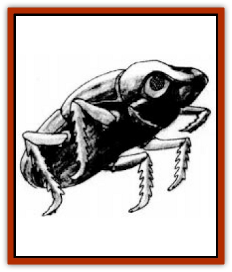

# Beetle - Scarab - Giant

| Statistic | **Beetle, Scarab, Giant** |
| --- | --- |
| **Activity Cycle:** | Any |
| **Alignment:** | Neutral good |
| **Armor Class:** | 3 |
| **Climate/Terrain:** | Any Underdark |
| **Damage/Attack:** | 2-12 |
| **Diet:** | Omnivore |
| **Frequency:** | Uncommon |
| **Hit Dice:** | 6 |
| **Intelligence:** | Low (5-7) |
| **Magic Resistance:** | Nil |
| **Morale:** | Elite (14) |
| **Movement:** | 6, Br 1, Jp 12 |
| **No. Appearing:** | 1-4 |
| **No. of Attacks:** | 1 |
| **Organization:** | Mated pairs |
| **Size:** | L (12' long) |
| **Special Attacks:** | Flare |
| **Special Defenses:** | Jump |
| **THAC0:** | 9 |
| **Treasure:** | Nil |
| **XP Value:** | 420 |

[[Beetle_Scarab|Scarab beetles]] are black- or brown-shelled [[Beetle|beetles]], familiar to many as the beetles adorning Egyptian amulets. In the underdark, they survive on [[Bat|bat]] guano and cave crickets, but they are not averse to a change of diet. They consider all smaller creatures potential prey.

**Combat:** Scarab beetles are generally reclusive creatures, scuttling along with their balls of dung in the center of great caverns, gathering food and avoiding predators as best they can. Their vestigial wings allow them to fly short distances up to 120 yards at a time, with a loud clacking, buzzing flight. They always seek to flee first if attacked; these jump-flights often take them up to cavern ledges.

When pressed, scarab beetles can ignite a special magical flare beneath their vestigial wings, creating a light brighter than normal sunlight that illuminates everything within 150', dispels any magical shadows or darkness within 10', and inflicts 1d6 hp damage/round to the undead or creatures made of shadow, such as shadow fiends, slow shadows, and darkness elementals. The flare lasts for one round per HD of the giant beetle and does not interfere with its normal mandible attacks. However, the scarab beetle cannot fly while its flare shines, because the wings must be used to generate the intense light.

**Habitat/Society:** Scarab beetles are often sought after by sun god cults and followers of the Egyptian pantheon, who believe they are holy animals and symbols of rebirth, In general, they have no complex societies and simply prefer areas containing great quantities of dung, which they fashion into ball-shaped containers for eggs, and which they use to build their elaborate tunnel-nests.

The scarab beetle's nest are simple, circular tunnels about 4' in diameter, just wide enough for the beetles to pass through. but not big enough for larger predators. The tunnels are packed with balls of dung and stink abominably, but they are otherwise as dry as the surrounding stone. Any treasures the beetles have will be embedded into the tunnel walls.

**Ecology:** In addition to their role as scavengers, scarab beetles keep the number of undead in the underdark down. An instinct which some believe was implanted in the species by the sun god Ra drives scarab beetles to swarm to the attack whenever confronted by undead of any kind; their *sunlight* and their powerful jaws are capable of destroying and then recycling everything from [[Skeleton|skeletons]] to [[Vampire_General_Information|vampires]].

---
## Discovery & Documentation

**Source Publication:** Dragon227 (1996)
**Campaign Setting:** Dragon Magazine
**Author(s):** 

### Other Creatures Found in This Source Book
   * [[Elemental_Darkness|Elemental, Darkness]]
   * [[Fireweed|Fireweed]]
   * [[Glouras|Glouras]]
   * [[Octopus_Blue-Ring|Octopus, Blue-Ring]]
