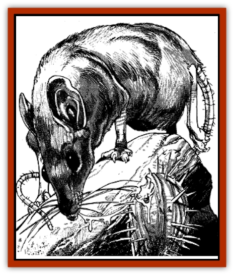

# Beguiler

| Statistic | **Beguiler** |
| --- | --- |
| **Activity Cycle:** | Day |
| **Alignment:** | Neutral |
| **Armor Class:** | 9 |
| **Climate/Terrain:** | Dry steppes |
| **Damage/Attack:** | 1-2(&times;4)/1-4/1 or by weapon type |
| **Diet:** | Omnivore |
| **Frequency:** | Rare |
| **Hit Dice:** | 2 |
| **Intelligence:** | Average to high (8-14) |
| **Magic Resistance:** | Nil |
| **Morale:** | Average (8-10) |
| **Movement:** | 14 |
| **No. Appearing:** | 1-4 |
| **No. of Attacks:** | 6 |
| **Organization:** | Solitary |
| **Size:** | S (2' long) |
| **Special Attacks:** | Illusion |
| **Special Defenses:** | Camouflage |
| **THAC0:** | 19 |
| **Treasure:** | D (L,N,Q) |
| **XP Value:** | 270 |

The beguiler is a plump quadruped about the size of a small [[Dog|dog]]. Somewhat mouse-like in appearance, it has large glistening black eyes, large ears, and a pointed snout. It is covered with thick, bluish-black fur that is silky to the touch. The creature can change its fur color to match its surroundings. When properly cured, the beguiler.s hide commands high prices in any marketplace.

Beguilers possess razor-sharp retractile claws, enabling the creatures to climb trees and wooden structures with ease. The hairless, prehensile tail of the beguiler aids in climbing, and can be used to throw or wield weapons the size of a short sword or smaller.

**Combat:** The creature's four sets of claws each inflict 1-2 points of damage per attack. The beguiler's bite causes 1-4 points of damage, and the tail can inflict one point of damage by itself, or by weapon type if one is used. Any weapon held or thrown by the beguiler's tail has a -2 attack penalty.

The beguiler has only four claw attacks per round when its target is prone and the beguiler is on top.

**Habitat/Society:** The beguiler lives in the dry plains or steppes of the Eastern Shaar. Dampness suppresses the creature's ability to camouflage itself which it can do for 1-4 turns. Unless the creature's fur is dry, it is incapable of this coloration change. In regions of Toril other than the Eastern Shaar, the beguiler is very rare.

The beguiler eats both plants and animals. Its favorite food is the plump, water-rich cacti prevalent in its environment. It eats small field mice and the eggs and young of ground-nesting birds to supplement its diet. Only in times of hunger does the beguiler attack animals larger than itself.

**Ecology:** A beguiler always sees with *true sight*. It clearly sees invisible creatures and objects. It also ignores illusions and their intended effects. Displaced objects or foes, like the [[Displacer_Beast|displacer beast]], can be seen where they truly are. Even ethereal creatures close to the Prime Material Plane can be observed and attacked with ease.

Not only can the creature change the hue of its fur to match the coloration of its surroundings for 1-4 turns, but even unnatural colorations, like plaid, can be easily mimicked by the beguiler. It can remain absolutely motionless during that time, hiding in shadows with 80% success.

Some spell casters are rumored to have maintained or recreated this ability in the cured pelt of the beguiler. Many alchemists pay large sums of money for the remains of the beguiler, usually a gold piece value equal to the Experience Value of the creature. The eyes and frontal lobes of the brain are alternative material components used in the *true sight*, *detect invisibility*, *locate object*, and the *vision* spells.

Many cultures near the Shaar capture beguiler young soon after the babies are weaned. They make excellent pets that warn their owners of trespassers. Several mages of Thar have further increased the creature's value by acquiring the beguiler as a familiar. These mages have exhibited beguiler-like qualities, detecting hidden objects and *hiding in shadows*.

---
## Discovery & Documentation

**Source Publication:** MC11 Forgotten Realms Appendix II (1991)
**Campaign Setting:** Advanced Dungeons & Dragons 2nd Edition
**Author(s):** Tim Beach, Tim Brown, William W. Connors, Dale Donovan, Ed Greenwood, Jeff Grubb, Bruce Heard, Slade Henson, Rob King, Colin McComb, Roger E. Moore, Bruce Nesmith, Jon Pickens, Jean Rabe, Dori Watry, Skip Williams

### Other Creatures Found in This Source Book
   * [[Alaghi|Alaghi]]
   * [[Alguduir|Alguduir]]
   * [[Bird_Toril|Bird (Toril)]]
   * [[Cantobele|Cantobele]]
   * [[Carapace|Carapace]]
   * [[Cat_Toril|Cat (Toril)]]
   * [[Chitine|Chitine]]
   * [[Cildabrin|Cildabrin]]
   * [[Dimensional_Warper|Dimensional Warper]]
   * [[Dragon_Deep|Dragon, Deep]]
   * [[Fachan_Toril|Fachan (Toril)]]
   * [[Fael|Fael]]
   * [[Feyr|Feyr]]
   * [[Firetail|Firetail]]
   * [[Frost|Frost]]
   * [[Gaund|Gaund]]
   * [[Gloomwing|Gloomwing]]
   * [[Golden_Ammonite|Golden Ammonite]]
   * [[Golem_Lightning|Golem, Lightning]]
   * [[Hamadryad|Hamadryad]]
   * [[Harrier|Harrier]]
   * [[Harrla|Harrla]]
   * [[Haun|Haun]]
   * [[Haundar|Haundar]]
   * [[Hendar|Hendar]]
   * [[Inquisitor|Inquisitor]]
   * [[Lhiannan_Shee|Lhiannan Shee]]
   * [[Loxo|Loxo]]
   * [[Manni|Manni]]
   * [[Manscorpion|Manscorpion]]
   * [[Mara|Mara]]
   * [[Morin|Morin]]
   * [[Naga_Dark|Naga, Dark]]
   * [[Orpsu|Orpsu]]
   * [[Plant_Carnivorous_Black_Willow|Plant, Carnivorous, Black Willow]]
   * [[Plant_Carnivorous_Toril|Plant, Carnivorous (Toril)]]
   * [[Plant_Dangerous_I|Plant, Dangerous I]]
   * [[Ring-Worm|Ring-Worm]]
   * [[Rohch|Rohch]]
   * [[Sand_Cat|Sand Cat]]
   * [[Saurial|Saurial]]
   * [[Sha'az|Sha'az]]
   * [[Silver_Dog|Silver Dog]]
   * [[Simpathetic|Simpathetic]]
   * [[Skuz|Skuz]]
   * [[Spider_Monkey|Spider, Monkey]]
   * [[Tren|Tren]]
