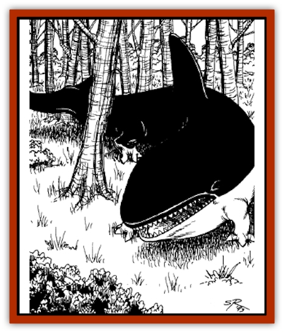

# Behemoth

| Statistic | **Black** | **Snow** | **Swamp** |
| --- | --- | --- | --- |
| **Activity Cycle:** | Any | Day | Day |
| **Alignment:** | Neutral | Neutral | Neutral |
| **Armor Class:** | 3 | 4 | 4 |
| **Climate/Terrain:** | Plains, forest | Cold Wastes | Marsh, swamp |
| **Damage/Attack:** | 4-48 | 4-40 | 4-40 |
| **Diet:** | Carnivore | Carnivore | Carnivore |
| **Frequency:** | Very rare | Very rare | Very rare |
| **Hit Dice:** | 16 | 15 | 14 |
| **Intelligence:** | Animal (1) | Animal (1) | Animal (1) |
| **Magic Resistance:** | Nil | Nil | Nil |
| **Morale:** | Elite (13-14) | Steady (11-12) | Steady (11-12) |
| **Movement:** | 12, Sw 18 | 12, Br 18 | 12, Sw 18 |
| **No. Appearing:** | 1 | 1 | 1 |
| **No. of Attacks:** | 1 | 1 | 1 |
| **Organization:** | Solitary | Family | Solitary |
| **Size:** | G (40' long) | G (40' long) | G (40' long) |
| **Special Attacks:** | See below | See below | See below |
| **Special Defenses:** | Nil | Nil | Nil |
| **THAC0:** | 5 | 5 | 5 |
| **Treasure:** | Nil | Nil | Nil |
| **XP Value:** | 9,000 | 8,000 | 6,000 |

There are three known species of Nehwon behemoths. All of them resemble [[Whale|killer whales]] with four stubby legs, and are ferocious predators with no fear of humans. Fortunately, these creatures are rare.

**Combat:** All behemoths prefer to ambush. Each has a different attack style and surprise bonus (see below). Behemoths always attack the largest target in any group of living things.

**Habitat/Society:** Behemoths are voracious carnivores. A behemoth requires 100 square miles or more of territory to obtain adequate prey. They defend this area fiercely, espedally from their own species.

Family groups are encountered 10% of the time, consisting of two adults and one or two young behemoths (HD 5-10, Dmg 2-20).

**Ecology:** Behemoths stalk any animal, including other carnivores. They are remarkably fast and often use their special swimming and burrowing abilities.

**Swamp Behemoth**

The grayish-green swamp behemoth is sometimes found in the marshlands surrounding Lankhmar. The swamp behemoth likes to lurk beneath water, emerging to attack the largest thing in a group. If no water is available, it uses brush and trees for cover.

**Snow Behemoth**

Found in the Cold Wastes of the north, the snow behemoth is covered in thick white fur. This species burrows beneath the frozen ground. They can detect the footfalls of prey at 100 yards and emerge from beneath the snow without warning, imposing a -4 penalty upon opponents' surprise roll.

**Black Behemoth**

Black behemoths inhabit forests and plains, and they can be active during any cycle. At night, their coloration gives opponents a -4 surprise roll penalty.

---
## Discovery & Documentation

**Source Publication:** Lankhmar: City of Adventure (2nd Ed.) (1993)
**Campaign Setting:** Lankhmar
**Author(s):** Bruce Nesmith, Douglas Niles, and Ken Rolston

### Other Creatures Found in This Source Book
   * [[Astral_Wolf|Astral Wolf]]
   * [[Bird_of_Tyaa|Bird of Tyaa]]
   * [[Cat_War|Cat, War]]
   * [[Cloaker_Sea|Cloaker, Sea]]
   * [[Cold_Woman|Cold Woman]]
   * [[Devourer_Lankhmar|Devourer (Lankhmar)]]
   * [[Ghoul_Kleshite|Ghoul, Kleshite]]
   * [[Ghoul_Lankhmar|Ghoul (Lankhmar)]]
   * [[Gladiator_Lizard|Gladiator Lizard]]
   * [[Horag|Horag]]
   * [[Howler|Howler]]
   * [[Ice_Gnome|Ice Gnome]]
   * [[Invisible_of_Stardock|Invisible of Stardock]]
   * [[Lizard|Lizard]]
   * [[Ophidian|Ophidian]]
   * [[Ray_Invisible_Flying|Ray, Invisible Flying]]
   * [[Scorpion|Scorpion]]
   * [[Simorgyan|Simorgyan]]
   * [[Snow_Serpent|Snow Serpent]]
   * [[Thunder_Children|Thunder Children]]
   * [[Wraith-Spider|Wraith-Spider]]
   * [[Zombie_Sea|Zombie, Sea]]
