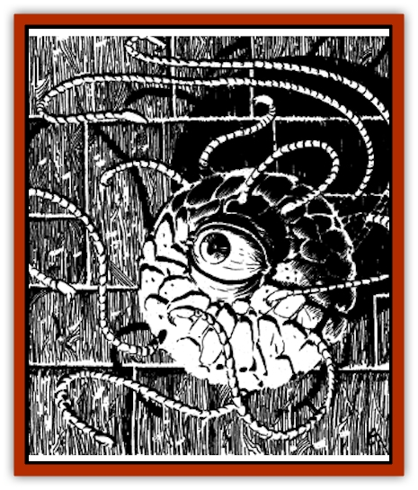

# Beholder-kin - Death Kiss

| Statistic | **Beholder-kin, Death Kiss** |
| --- | --- |
| **Activity Cycle:** | Any |
| **Alignment:** | Neutral evil |
| **Armor Class:** | 4/6/8 |
| **Climate/Terrain:** | Any (remote areas) |
| **Damage/Attack:** | 1-8 |
| **Diet:** | Carnivore |
| **Frequency:** | Rare |
| **Hit Dice:** | 77-84 hp |
| **Intelligence:** | Average to high (8-14) |
| **Magic Resistance:** | Nil |
| **Morale:** | Fanatic (17) |
| **Movement:** | Fl 9 (C) |
| **No. Appearing:** | 1 |
| **No. of Attacks:** | 10 |
| **Organization:** | Solitary |
| **Size:** | H (6-12' diameter, tentacles to 20' long) |
| **Special Attacks:** | Blood drain, ram |
| **Special Defenses:** | Regeneration |
| **THAC0:** | 11 |
| **Treasure:** | See below |
| **XP Value:** | 8,000 |

The Death Kiss, or "bleeder", is fearsome predator found in caverns or ruins. Its spherical body resembles that of the dreaded [[Beholder_and_Beholder-kin_I|beholder]], but the "eyestalks" of this creature are bloodsucking tentacles, its "eyes" hook-toothed orifices. They favor a diet of humans and [[Horse|horses]], but will attack anything having blood (especially "easy meals" like bloodbloated [[Stirge|stirges]] and lone humans). An older name for these creatures is "eye of terror". A gigantic specimen known as The Tentacled One is said to roam the high forests and crags of the northern Sword Coast.

**Combat:** The main body of a death kiss has no mouth. Its central eye gives it 120' infravision, but the death kiss has no magical powers, unlike the beholder that it closely resembles.

A death kiss is 90% likely to be taken for a beholder when sighted. The ten tentacles largely retract into the body when not needed, resembling eyestalks, but can lash out to a full stretch of 20' with blinding speed. The tentacles may act separately or in concert, attacking a single creature or an entire adventuring company.

A tentacle's initial strike does 1-8 points of damage as the barb-mouthed tip attaches to the victim. Each attached tentacle drains a minimum of 2 hit points-worth of blood per round, beginning the round after it hits.

A bleeder's central body is AC4, its central eye AC8 with 6 hit points, its tentacles AC6, and the mouths on their ends AC4. A hit on a tentacle-mouth will stun the tentacle, causing it to writhe helplessly for 1-4 rounds. Tentacles must be struck for 6 points of damage from edged weapons to sever them. They are torn free from its victim by the application of a total of 22 Strength points, i.e., more than one character, acting together; such forceful freeing does the victim 1-6 damage per tentacle, as the barbed teeth forcibly tear free from the tentacle.

If an attached tentacle is damaged but not destroyed, it instantly and automatically drains sufficient hit points worth of blood from the victim's body to restore that tentacle to a full 6 hit points. This reflex effect occurs after every non-killing hit on a tentacle, even if it is wounded more than once in a round. This cannot occur more than twice in one round. This parasitic healing effect does not respond to damage suffered by the central body or other tentacles.

A tentacle continues to drain blood if doing so when the central body of the death kiss reaches zero hit points. Tentacles not attached to a victim at that time are incapable of further activity. A death kiss can retract a draining tentacle, but voluntarily does so only when its central body is at 5 hit points or less; it also willfully detaches once the victim has been drained to zero hit points.

Ingested blood is used to generate electrical energy - one hit point of blood becomes one charge after one round. A death kiss uses this energy for motor activity and healing. An eye of terror expends one charge every two turns in moving, and thus is almost constantly hunting prey. Spending one charge enables a bleeder to heal one hit point of damage to each of its ten tentacles, its central body, and its eye (12 hit points in all). It can heal itself with one charge of stored energy every other round in addition to its normal attacks and activity.

Each tentacle can store up to 24 charges of drained energy, the body capable of storing 50 charges of drained energy. A severed tentacle is 70% likely to transmit its cumulative charges to anything touching it when severed, each charge dealing one hit point of electrical damage.

Bleeders can ram opponents with their bulk. This attack does 1-8 damage, and is often made while turning, tentacles flailing, to dislodge prey from ledges and precarious positions.

If its eye is destroyed, a bleeder locates beings within 10' by smell and sensing vibrations.

**Habitat/Society:** Bleeders prefer to float above surfaces rather than resting upon them. They move by means of *levitation*. A death kiss may "shut itself down", remaining motionless and insensitive on the ground, and remain alive in that state for long periods of time. To awaken from this hibernation, the creature requires an influx of electrical energy, considerable heat, or the internal shock caused by a blow, fall, wound, or magical attack; any of the above stimulants must deal at least 5 points of damage to the death kiss to wake it from its sleep. Adventurers finding a hibernating death kiss usually provide such stimulation, thinking the sleeper helpless prey. Unless they kill the death kiss before it wakes, all they do is provide the bleeder a meal upon its awakening.

Eyes of terror are solitary hunters, fully inheriting the paranoia and ego of their cousins, the beholders. If they encounter one of their kin, the result is often a mid-air struggle to the death. The loser's body becomes an incubator and breeding ground for the death kiss. offspring. After the victor lays innumerable eggs within the corpse, the eggs suspended within a greenish fluid, 1-4 young "hatch" forth within a day. Each new bleeder has half its parent's hit points and size, and fully matures in 1 month. A death kiss's cavern or ruined chamber lair contains the treasure of its victims, often arranged in a trail to attract more prey.

**Ecology:** Death Kisses prey upon larger creatures, providing a balance against the numbers of magical creatures who have no other natural foes. Death Kisses have little fear of any opponents, save [[Dragon_General_Information|dragons]] and other beholderkin.

An organ in the upper central body of a death kiss is a valued ingredient in magical potions and spell inks concerned with levitation. Rumors tell of a little-known mage in Marsember who uses the eye of the death kiss to cure blindness, although the process grants only infravision. A brain or nerve node deep in a bleeder's body hardens into a gem-like, soft-sided but faceted red gem. Called "blood-eyes", these typically fetch a market price of 70 gp each. They are valued for adornment because they glow more brightly as the wearer's emotions become more intense.

---
## Discovery & Documentation

**Source Publication:** Ruins of Undermountain I (1994)
**Campaign Setting:** Forgotten Realms
**Author(s):** Ed Greenwood

### Other Creatures Found in This Source Book
   * [[Automaton_Scaladar|Automaton, Scaladar]]
   * [[Beholder_Elder_Orb|Beholder, Elder Orb]]
   * [[Darktentacles|Darktentacles]]
   * [[Ibrandlin|Ibrandlin]]
   * [[Sharn|Sharn]]
   * [[Slithermorph|Slithermorph]]
   * [[Snake_Flying|Snake, Flying]]
   * [[Steel_Shadow|Steel Shadow]]
   * [[Watchghost|Watchghost]]
