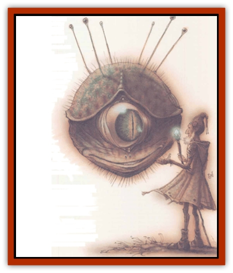

# Beholder-kin - Observer

| Statistic | **Beholder-kin, Observer** |
| --- | --- |
| **Activity Cycle:** | Any |
| **Alignment:** | Lawful neutral (evil) |
| **Armor Class:** | -2 (body)/2 (eyestalks) |
| **Climate/Terrain:** | Acheron, Mechanus, Outlands |
| **Damage/Attack:** | 1d8/1d8/1d8 |
| **Diet:** | Carnivore |
| **Frequency:** | Very rare |
| **Hit Dice:** | 8+8 |
| **Intelligence:** | Genius (17-18) |
| **Magic Resistance:** | 25% |
| **Morale:** | Champion (15-16) |
| **Movement:** | Fl 3 (A) |
| **No. Appearing:** | 1 |
| **No. of Attacks:** | 3 |
| **Organization:** | Solitary |
| **Size:** | L (6' diameter) |
| **Special Attacks:** | Blood drain, gaze, psionics |
| **Special Defenses:** | Nil |
| **THAC0:** | 9 |
| **Treasure:** | E,R,T |
| **XP Value:** | 15,000 |

**Psionics Summary**

| Level | Dis/Sci/Dev | Attack/Defense | Score | PSPs |
| --- | --- | --- | --- | --- |
| 10 | 4/5/15 | All/All | 16 | 230 |

**Psychokinesis -** *Science:* telekinesis; *Devotions:* animate object, inertial barrier.

**Psychometabolism -** *Sciences:* nil; *Devotions:* body control, cause decay, chameleon power, double pain.

**Telepathy -** *Sciences:* domination, mind link, probe; *Devotions:* attraction, aversion, contact, ESP, invisibility, mind bar, phobia amplification.

**Metapsionics -** *Science:* psychic surgery; *Devotions:* psionic sense, psionic drain.

Primes always seem surprised to learn that there are observers that lair on the Outlands and lawful planes, but it only stands to reason that a monster so widespread as the [[Beholder_and_Beholder-kin_I|beholder]] would've spawned planar offspring. Observers are a lot like the other beholder-kin, concealing a frightening alien intelligence and fearsome magical powers behind a chitinous body. Unlike their more rapacious prime-material kin, observers adhere to a cool neutrality and are often content to leave well enough alone. ('Course, that doesn't help the Clueless sod who attacks one of these things, taking it to be a beholder.)

An observer has a spherical body about 6 to 7 feet in diameter, covered with a tough, chitinous shell. The shell's a mottled purple and pinkish color, and can be 2 to 3 inches thick in places. Unlike beholders, observers have three mouths spaced evenly around their lower hemisphere, and three main eyes spaced evenly around their equator. Six minor eyes on stalks ring their dorsal surfaces. Observers support their bodies by means of an innate *levitation* ability.

Observers often create small empires or tyrannies, using their magical and psionic abilities to take control of regions and order them to their own will. Observers are generally more passive than their beholder cousins, and fight only when directly attacked. Unless it's physically threatened, an observer's usually content to use negotiation and manipulation to achieve its ends.

**Combat:** The observer's main body is AC -2, but its mouths, main eyes, and eyestalks are not as well-armored; they're only AC 2. The loss of these organs doesn't count against the obewer's own hit points. The main eyes can withstand 10 points of damage each, the eyestalks 5 points of damage, and the mouths 15 points of damage before being destroyed.

The observer's mouths actually consist of powerful, reractable stalks that can reach things up to 5 feet from the main body. If the observer's mouth hits with a roll 4 or more greater than the attack roll needed, it fastens to the victim and begins to drain blood at the rate of 2 hit points per round. When possible, the observer will divide its attacks to drair as nany victims as it can.

Although the observer's attacks are formidable, they pale in comparison to its magical abilities. Each of the creature's main eyes projects a powerhl ray of telekinetic force that can have one of three effects: First, it can simulate *Bigby's forceful hand*, driving back one creature at the rate of 20 feet per round. Creatures weighing up to 500 pounds can be so affected, and creatures between 500 and 1,000 pounds cannot advance closer to the observer while its gaze remains on them. Creatures over 1,000 pounds can advance only at the speed of 10 feet per round. Second, the gaze of the main eyes can be used to strike telekinetic blows inflicting damage equal to 1d12 points plus the victim's AC. Third, it can automatically deflect all physical missiles fired at the creature from the 120 degree arc in front of the eye. The main eyes have a range of 100 yards.

Each of the six smaller eyes can create the following effects against a single target:

<ul><li>*domination* (30-yard range)</li><li>*enervation* (30-yard range)</li><li>*fear* (50-yard range)</li><li>*finger of death* (30-yard range)</li><li>*magic missile* (3 missiles, 50-yard range)</li><li>*Otiluke's freezing sphere* (cold ray inflicts 8d4+16 points of damage)</li></ul>The powerful eyes of observers are the equivalent of a *true seeing* spell to a range of 100 yards, except that the monster can't determine alignment by sight. This means they can't be deceived by *illusions* or invisibility.

As if these weren't enough to lay any sod in the deadlook, observers are also powerful psionicists, in possession of potent telepathic and psychokinetic abilities. An observer usually relies on its magical abilities first, but should those fail or a subtler means of attack be required, it'll fall back on mental attacks. Observers enjoy experimenting with telepathic attacks against nonpsionic creatures and take a fiendish pleasure in permanently wrecking a foolish opponent's psyche.

**Habitat/Society:** Fortunately, observers aren't social creatures. They can't stand each other and avoid contact with others of their kind. It's rare for observers' rivalries to break out into open conflict, but it's not unheard of. Unlike the xenophobia that forms the basis of prime-material beholders' conflicts, territoriality and fierce competition for the same resources are the main sources of friction between observers.

Observers divide their time between maintaining a realm ordered to their exacting specifications and wandering the cosmos in search of knowledge and power necessary to expand their domains. When an observer's abroad on the planes, it's far more passive and less likely to attack cutters who have something it wants (That's why they call it an observer, berk.) However, its attitude changes once it's back on its own home turf. Patience and tolerance have no places in the observer's territory, and it ruthlessly attacks and eliminates competititors or intruders.

So, what's an observer's domain like? Observers have a strange, alien set of values and ideals. They'll dominate or psionically alter any living thing in their territory to make it their slave. This means that an observer in its home is likely to be defended by a small army of mind-wiped minions. The creature is also fascinated by wealth and spends much of its time encouraging its slaves to add to its hoard. Despite this, it's not necessarily interested in malice for its own sake - it's just supremely selfish and paranoid.

**Ecology:** Observers are near the top of the food chain anywhere they go. Only the most powerful fiends can defeat an eye tyrant. Observers are hoarders of arcane objects and knowledge, and can be an excellent source of information if a cutter's willing to risk dealing with one.She'll need to be able to offer the monster something it wants in exchange for any darks she wants the observer to part with; observers don't give anything away for free.

It's not known how observers reproduce, but some cutters've speculated that observers spawn by selecting one of their slaves to carry a parasitic egg. The young observer devours its host from the inside out before emerging to contest its parent's dominion. The parent drives the young creature out of its territory and ignores it from that point on.

---
## Discovery & Documentation

**Source Publication:** Planescape II (1996)
**Campaign Setting:** Planescape
**Author(s):** Rich Baker, Karen S. Boomgarden

### Other Creatures Found in This Source Book
   * [[Aasimar|Aasimar]]
   * [[Abrian|Abrian]]
   * [[Arcane|Arcane]]
   * [[Balaena|Balaena]]
   * [[Bloodthorn|Bloodthorn]]
   * [[Bonespear|Bonespear]]
   * [[Darkweaver|Darkweaver]]
   * [[Demarax|Demarax]]
   * [[Dhour|Dhour]]
   * [[Eater_of_Knowledge|Eater of Knowledge]]
   * [[Eladrin_Greater_Firre|Eladrin, Greater, Firre]]
   * [[Eladrin_Greater_Ghaele|Eladrin, Greater, Ghaele]]
   * [[Eladrin_Greater_Tulani|Eladrin, Greater, Tulani]]
   * [[Eladrin_Lesser_Bralani|Eladrin, Lesser, Bralani]]
   * [[Eladrin_Lesser_Coure|Eladrin, Lesser, Coure]]
   * [[Eladrin_Lesser_Noviere|Eladrin, Lesser, Noviere]]
   * [[Eladrin_Lesser_Shiere|Eladrin, Lesser, Shiere]]
   * [[Fhorge|Fhorge]]
   * [[Ghostlight|Ghostlight]]
   * [[Guardinal_Avoral|Guardinal, Avoral]]
   * [[Guardinal_Cervidal|Guardinal, Cervidal]]
   * [[Guardinal_General_Information|Guardinal, General Information]]
   * [[Guardinal_Equinal|Guardinal, Equinal]]
   * [[Guardinal_Leonal|Guardinal, Leonal]]
   * [[Guardinal_Lupinal|Guardinal, Lupinal]]
   * [[Guardinal_Ursinal|Guardinal, Ursinal]]
   * [[Hollyphant|Hollyphant]]
   * [[Incantifer|Incantifer]]
   * [[Ironmaw|Ironmaw]]
   * [[Keeper|Keeper]]
   * [[Khaasta|Khaasta]]
   * [[Leomarh|Leomarh]]
   * [[Monster_of_Legend|Monster of Legend]]
   * [[Mortai|Mortai]]
   * [[Noctral|Noctral]]
   * [[Quill|Quill]]
   * [[Razorvine|Razorvine]]
   * [[Reave|Reave]]
   * [[Retriever|Retriever]]
   * [[Rilmani_Abiorach|Rilmani, Abiorach]]
   * [[Rilmani_General_Information|Rilmani, General Information]]
   * [[Rilmani_Argenach|Rilmani, Argenach]]
   * [[Rilmani_Aurumach|Rilmani, Aurumach]]
   * [[Rilmani_Cuprilach|Rilmani, Cuprilach]]
   * [[Rilmani_Ferrumach|Rilmani, Ferrumach]]
   * [[Rilmani_Plumach|Rilmani, Plumach]]
   * [[Shadowdrake|Shadowdrake]]
   * [[Spellhaunt|Spellhaunt]]
   * [[Spider_Hook|Spider, Hook]]
   * [[Sunfly|Sunfly]]
   * [[Sword_Spirit|Sword Spirit]]
   * [[Tanar'ri_Lesser_Bulezau|Tanar'ri, Lesser, Bulezau]]
   * [[Tanar'ri_Lesser_Maurezhi|Tanar'ri, Lesser, Maurezhi]]
   * [[Tanar'ri_Lesser_Yochlol|Tanar'ri, Lesser, Yochlol]]
   * [[Tanar'ri_General_Information|Tanar'ri, General Information]]
   * [[Tanar'ri_True_Alkilith|Tanar'ri, True, Alkilith]]
   * [[Terlen|Terlen]]
   * [[Tso|Tso]]
   * [[T'uen-rin|T'uen-rin]]
   * [[Vaporighu|Vaporighu]]
   * [[Vorr|Vorr]]
   * [[Wastrel|Wastrel]]
   * [[Wraithworm|Wraithworm]]
   * [[Yugoloth_Lesser_Canoloth|Yugoloth, Lesser, Canoloth]]
   * [[Zoveri|Zoveri]]
