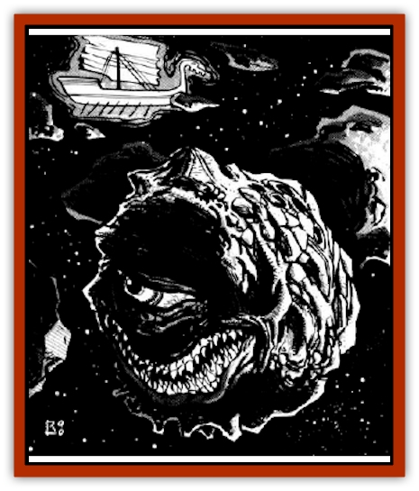

# Beholder - Abomination - Astereater

| Statistic | **Beholder (Abomination), Astereater** |
| --- | --- |
| **Activity Cycle:** | Any |
| **Alignment:** | Lawful evil |
| **Armor Class:** | -2 |
| **Climate/Terrain:** | Any space |
| **Damage/Attack:** | 2-8 |
| **Diet:** | Carnivore |
| **Frequency:** | Very rare |
| **Hit Dice:** | 8 |
| **Intelligence:** | Low to average (5-10) |
| **Magic Resistance:** | Nil |
| **Morale:** | Average (8-10) |
| **Movement:** | Fl 3 (B) |
| **No. Appearing:** | 1 |
| **No. of Attacks:** | 1 |
| **Organization:** | Solitary |
| **Size:** | L (8-12' in diameter) |
| **Special Attacks:** | Swallow whole |
| **Special Defenses:** | Nil |
| **THAC0:** | 13 |
| **Treasure:** | See below |
| **XP Value:** | 2,000 |

In general, [[Beholder_and_Beholder-kin_I|beholders and beholder-kin]] are a very intelligent (and conceited) lot. Which is precisely why all of them deny any relation to the astereater. Though technically a beholder-kin, the astereater has none of the intelligence or magical abilities its cousins possess. In appearance, the astereater resembles a large beholder (minus the eye stalks) with one other major difference: The skin of the creature is virtually identical - in appearance and consistency - to rock. Like the beholder, astereaters have a large, central eye and a large mouth filled with pointed teeth.

Astereaters speak their own language, which consists of very few words. They rarely hold a conversation with anything.

**Combat:** The rock-like skin of the astereater protects it very well. When its eye and mouth are shut, the creature is virtually impervious to any but very powerful or magical attacks.

The astereater's normal method of attack is to hide at the edge of an asteroid field and wait for passers-by to wander too close. It attacks using its huge mouth. A normal hit inflicts 2d4 points of damage, but any attack roll that exceeds the number needed by 5 or more means the astereater has swallowed its prey whole (obviously this doesn't apply if the opponent is larger than the astereater). For example, if an astereater needs an attack roll of 9 or better to hit, and the roll is 14 or greater, then the victim is swallowed whole.

Anyone inside the belly of an astereater receives 1d6 points of damage per round from the powerful digestive acids found there. The victim may attack the astereater only if he held a small-sized weapon prior to being swallowed. Treat the interior of the astereater as AC 5. If the trapped person manages to inflict 12 points of damage to the creature's stomach, he is expelled from the monster. The astereater cannot attack if it has someone in its stomach.

With its eye and mouth shut, the astereater is almost identical to an asteroid in appearance. At distances of 30 feet or less, the astereater is 50% likely to be mistaken for an asteroid. At distances greater than 30 feet, it is indistinguishable from an asteroid. Since the astereater is too slow to retreat from combat, it chooses its opponents carefully before revealing itself and attacking.

**Habitat/Society:** Like all beholder-kin, astereaters are hateful and cruel. They cooperate neither with each other or anyone else unless it is of great benefit to themselves.

Astereaters hoard no treasure as they have no need for such trifles. However, in the bellies of these creatures (particularly older ones) there is usually a fair amount of incidental treasure that the creature cannot digest. In older astereaters it is common to find dozens of coins, various weapons, useless metal odds and ends, and possibly some magical items and potions (the astereater cannot digest glass or ceramic vials either).

An extremely rare but notable exception to the normal solitude of the astereaters is their occasional association with small groups of [[Giff|giff]]. It has been observed that astereaters sometimes act as <q>leaders</q> of giff platoons. Because of the militaristic nature of the giff and their aversion to serve anyone but their own kind, a giff platoon serving under an astereater is typically no larger than 10 giff; the association is generally little more than enslavement. It has been observed that this usually happens when an astereater encounters a giff mercenary platoon that is weak from battle and low in numbers. In this case, the astereater has little trouble domineering the mercenaries. It is unknown why the creatures choose giff as their slaves. Perhaps it is due to the giffs' natural penchant for servitude.

As a rule, beholders are a vicious species, holding great wars of extermination among their own kind. Whole communities of beholders are casually destroyed as a matter of course. But the hatred of the beholder race is greater still when directed toward astereaters. Beholders see astereaters as large blots against them and they stop at nothing to destroy what they consider to be vile errors of creation.

**Ecology:** Astereaters are carnivores that readily eat the flesh of any creature. They seem to prefer sentient species, especially humans and elves. Because of their extreme natural protection, they have no natural enemies but intelligent creatures hunt astereaters for the treasure they may hold in their stomachs.

---
## Discovery & Documentation

**Source Publication:** MC7 Spelljammer Appendix I (1990)
**Campaign Setting:** Advanced Dungeons & Dragons 2nd Edition
**Author(s):** various

### Other Creatures Found in This Source Book
   * [[Aartuk|Aartuk]]
   * [[Albari|Albari]]
   * [[Ancient_Mariner|Ancient Mariner]]
   * [[Argos|Argos]]
   * [[Blazozoid|Blazozoid]]
   * [[Chattur|Chattur]]
   * [[Chevall|Chevall]]
   * [[Clockwork_Horror|Clockwork Horror]]
   * [[Colossus|Colossus]]
   * [[Delphinid|Delphinid]]
   * [[Dizantar|Dizantar]]
   * [[Dog|Dog]]
   * [[Dog_Bog_Hound|Dog, Bog Hound]]
   * [[Esthetic|Esthetic]]
   * [[Focoid|Focoid]]
   * [[Fractine|Fractine]]
   * [[Giant_Spacesea|Giant, Spacesea]]
   * [[Golem_Furnace|Golem, Furnace]]
   * [[Golem_Radiant|Golem, Radiant]]
   * [[Gravislayer|Gravislayer]]
   * [[Grommam|Grommam]]
   * [[Hadozee|Hadozee]]
   * [[Hamster_Giant_Space|Hamster, Giant Space]]
   * [[Jammer_Leech|Jammer Leech]]
   * [[Lakshu|Lakshu]]
   * [[Lumineaux|Lumineaux]]
   * [[Lutum|Lutum]]
   * [[Mimic_Space|Mimic, Space]]
   * [[Misi|Misi]]
   * [[Moon_Rogue|Moon, Rogue]]
   * [[Mortiss|Mortiss]]
   * [[Murderoid|Murderoid]]
   * [[Nay-Churr|Nay-Churr]]
   * [[Phlog-Crawler|Phlog-Crawler]]
   * [[Plasman|Plasman]]
   * [[Plasmoid_DeGleash|Plasmoid, DeGleash]]
   * [[Plasmoid_DelNoric|Plasmoid, DelNoric]]
   * [[Plasmoid_General_Information|Plasmoid, General Information]]
   * [[Plasmoid_Ontalak|Plasmoid, Ontalak]]
   * [[Puffer|Puffer]]
   * [[Q'nidar|Q'nidar]]
   * [[Rastipede|Rastipede]]
   * [[Reigar|Reigar]]
   * [[Rock_Hopper|Rock Hopper]]
   * [[Slinker|Slinker]]
   * [[Spider_Asteroid|Spider, Asteroid]]
   * [[Spiritjam|Spiritjam]]
   * [[Survivor|Survivor]]
   * [[Syllix|Syllix]]
   * [[Symbiont_Power|Symbiont, Power]]
   * [[Vine_Infinity|Vine, Infinity]]
   * [[Wiggle|Wiggle]]
   * [[Wizshade|Wizshade]]
   * [[Wryback|Wryback]]
   * [[Zard|Zard]]
   * [[Zodar|Zodar]]
