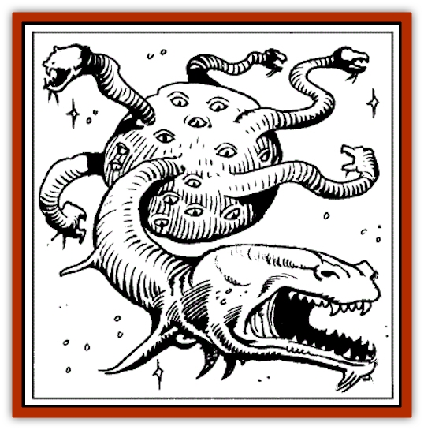
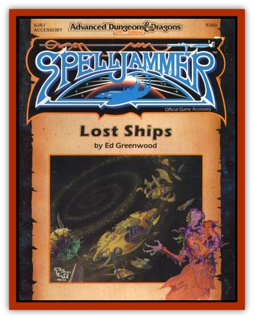

# Beholder Eather - Thagar - Grimgobbler

| Statistic | **Beholder Eather, Thagar (Grimgobbler)** |
| --- | --- |
| **Activity Cycle:** | Any |
| **Alignment:** | Chaotic neutral |
| **Armor Class:** | 1/4/6 |
| **Climate/Terrain:** | Any space |
| **Damage/Attack:** | 2-8 per neck |
| **Diet:** | Carnivore |
| **Frequency:** | Rare |
| **Hit Dice:** | 9+9 |
| **Intelligence:** | Exceptional ( 15-16) |
| **Magic Resistance:** | 70% |
| **Morale:** | Fanatic (17-18) |
| **Movement:** | Fl 12 (8) |
| **No. Appearing:** | 1 |
| **No. of Attacks:** | 6-16 |
| **Organization:** | Solitary |
| **Size:** | L (7' diameter, necks to 14' long) |
| **Special Attacks:** | Nil |
| **Special Defenses:** | Magical immunities |
| **THAC0:** | 11 |
| **Treasure:** | Nil |
| **XP Value:** | 9,000 |

The seldom-seen, near legendary thagar are fearsome predators, voracious eaters whose favorite meal is [[Beholder_and_Beholder-kin_I|beholder]] flesh. Eye tyrants hate and fear them-for when thagar and beholder meet, it is rare for the beholder to escape, let alone emerge victorious.

Thagar are large, rubbery-skinned, dark-hued spheres from which protrude long, serpentine necks ending in manytoothed jaws.

A thagar's eyes stud its central body amid the twisting necks. Thagar levitate slowly about, cruising space in search of meals or devising elaborate trap-lairs to lure prey.

**Combat:** Thagar are immune to many spells and spell-like magical attacks with a high natural resistance to other magics.

Thagar are immune to *charm*, *sleep*, *hold*, *fear*, *confusion*, feeblemind, and other mind-related magics. They are 96% magic resistant to magical effects that change their body state, including all *polymorph*, *petrification*, and *disintegrate* attacks. They possess 120'-range infravision.

A thagar waits patiently for the right moment to attack, then charges in furiously, seeking to disable as many creatures as it can, concentrating on spellcasters and other obvious menaces, never pausing for parley or to catch a breath.

hagar instinctively try to devour eyestalks, or the eyes and limbs of *any* opponent. They anticipate traps and attacks, often using their bulk to pin one opponent while battling another, only to spurt aside in haste and let the pinned victim take the brunt of a spell or missile attack.

The body of a thagar is AC 6 and its writhing necks and mouths are AC4. The many eyes of a thagar (a typical specimen has over 20) are small and hard to hit, located between the bases of the coiling necks. Each is a deep purple, flat, glistening orb the size of a human fist, surrounded by a crater-like rim of protective bone, and having an effective AC of 1.

A thagar begins life with 2d6 +4 mouths and may lose some over the years (while lost hp heal at the normal rate, lost necks and mouths regenerate slowly, typically only one per year).

Healing necks are usually kept curled close to the body and often glisten with a protective slime exuded by a thagar's other mouths. A thagar who loses all its mouths will die of starvation.

**Habitat/Society:** Thagar like to lair in derelict ships, asteroid caverns, and debris fields. Bisexual, they meet with others of their kind only to mate, about every dozen years or so. The young are born live and left to fend for themselves (they are the much smaller thagars sometimes found in desolate areas on worlds).

Thagar are unaffected by cold or lack of air. They take in nutrients from atmospheres around them, but need not do so, and will close their intake pores when they suspect poisonous or harmful substances or when expecting attack.

Thagar often cooperate with servant creatures that they can control completely, using these to aid in setting up traps, for defense, as bait, and as a food supply when times are hard. Thagar will eat carrion if they must, but they prefer the flesh of magic-using creatures, particularly beholders. They can go for long periods without food, but seem to have no limits when food is available: one sage reported seeing a thagar on a battlefield eat literally all day and into the night, devouring almost 1,000 men before it became too dark to see-or remain so close.

**Ecology:** Thagar are one of the few natural predators of beholders, and also control the numbers of other large and powerful creatures that might otherwise rule space. They keep the radiant dragon population low, for instance, by preying on young who have strayed from their elders. Thagar-flesh itself is oily and unpleasant, and eaten by few creatures besides scavvers.

[[Neogi|Neogi]] detest thagar and hunt them on sight-thagar eat [[Umber_Hulk|umber hulks]] (another delicacy), depriving neogi of slaves and status.

Thagar float by means of a magical organ which generates the natural ability of *levitation* (a living thagar cannot be robbed of this ability by dispel magic or other magical attacks). This organ is valued by alchemists and wizards alike for use in spell ink formulae, and in the making of potions and magical items concerned with levitation.

---
## Discovery & Documentation

**Source Publication:** SJR1 Lost Ships (1990)
**Campaign Setting:** Spelljammer
**Author(s):** Ed Greenwood, Paul Jaquays, Anne Brown, Dell Barras, Brom, Jeff Grubb

### Other Creatures Found in This Source Book
   * [[Beholder_Undead_Death_Tyrant|Beholder, Undead (Death Tyrant)]]
   * [[Flow_Barnacle|Flow Barnacle]]
   * [[Lich_Arch|Lich, Arch]]
   * [[Neogi:_Undead_Old_Master|Neogi: Undead Old Master]]
   * [[Shadowsponge_Air_Stealer|Shadowsponge (Air Stealer)]]
   * [[Tinkerer_Giant_Bubble|Tinkerer (Giant Bubble)]]
   * [[Sarphardin_Watcher|Sarphardin (Watcher)]]
   * [[Men:_Wonderseeker|Men: Wonderseeker]]
   * [[Spaceworm|Spaceworm]]
