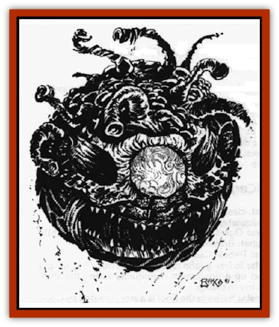

# Beholder - Kasharin

| Statistic | **Beholder, Kasharin** |
| --- | --- |
| **Activity Cycle:** | Any |
| **Alignment:** | Neutral evil |
| **Armor Class:** | 6 |
| **Climate/Terrain:** | Spelljammer (beholder tower) |
| **Damage/Attack:** | 2-12 |
| **Diet:** | None |
| **Frequency:** | Rare |
| **Hit Dice:** | 10 |
| **Intelligence:** | High (13-14) |
| **Magic Resistance:** | Nil |
| **Morale:** | Fearless (19-20) |
| **Movement:** | Fl 3 (B) |
| **No. Appearing:** | 1-4 |
| **No. of Attacks:** | 1 |
| **Organization:** | Community |
| **Size:** | M (4-6' diameter) |
| **Special Attacks:** | Deathcharm eye |
| **Special Defenses:** | Nil |
| **THAC0:** | 11 |
| **Treasure:** | Nil |
| **XP Value:** | 3,000 |

The kasharin are those [[Beholder_and_Beholder-kin_I|beholders]] who contracted the Blinding Rot disease and who survived long enough to seemingly die from the disease and not from beholder retaliation. (The Blinding Rot caused the beholders' eye stalks to wither and decay and subsequently fall off, leaving the beholder severeiy disabled if not dead. At least half of the beholders aboard the *Spelljammer* acquired the disease, but most of those afflicted were killed by their fellow beholders during the early stages of the disease, so great is the race's xenophobia over any disparity in the eye tyrant race.)

The disease did not actually kill the creatures, but rather placed them in a state of living death. They still register as living beings according to the [[Shivak|shivaks']] ability to detect life, and thus they still receive food rations from the ship's stores. The kasharin operate on that thin edge between the living, but for how long they can remain so is unknown. Currently they are being cared for by the beholders in their tower; the kasharin are given healing magic and minimum food rations to maintain their existence in the event that they can be made into servants for the Gray Eye (the leader of the beholders aboard the Spelljammer).

The kasharin appear to be blackened, burnt beholders, their scales curled and seperated, apparently from some intense heat. Their eye stalks are charred and useless, but their central eye still remains intact and usable.

**Combat:** The beholder-[[Mummy|mummies']] main form of attack is their central eye. It retains the range it had when alive, but the eye now has a two-pronged attack. The eye acts as a powerful *charm person/monster* to those characters or creatures who are affected by such spells; to those who are not, it acts as an equally powerful *ray of death magic*.

Any who encounter the ksrharin make their saving throws at -4. If they can be *charmed* and fall their first saving throw, they continue to make all successive saving throws to shake off the charm at -4 as well. Creatures and characters that cannot be *charmed* because of inner magic resistance or immunity must make a saving throw versus death magic at -4, with failure indicating immediate death.

Beholder-mummies can be turned or destroyed if confronted with sufficient clerical power. Treat them like ghosts or other 10 HD monsters.

**Habitat/Society:** The beholder-mummies retain their xenophobic hatred, but the hatred is now focused on all surviving living beholders. The kasharin's new state has, curiously enough, made them more forgiving toward the denizens of the undead, but these feelings occur only if the undead cannot otherwise affect the beholder-mummies.

Only beholders that have passed completely through the transformation caused by the Blinding Rot are considered "true" beholders by the kasharin. To them, the beholders of any subrace that have passed "the test" are now considered brethren, while any former (and living) relations are not, regardiess of whether they were once the same subrace. The xenophobic hatred that drives multiple subraces apart in the world of the living beholder has been simplified to simply living versus unliving in the beholder-mummy world. The transformation to undead may prove to be a blessing in disguise for the strife-ridden beholder factions.

**Ecology:** The kasharin are products of the disease that has transformed them into their present state. They are changed both in body and in mind, yet they retain many of the their natural beholder tendencies.

The beholders kept within the tower have now been metamorphosed into beholder-mummies, but the plague itself originally came from beyond the decks of the *Spelljammer*. It may be that there are colonies (and perhaps even entire planets) of beholders so infected somewhere in the Known Spheres

The Blinding Rot was originally developed as an <q>ultimate unifier</q> of the beholder race. The philosophy behind its development is that it brings the beholders - every race, subrace, and sub-subrace - together in a single, unifying death. Rising from the ashes of that death is a new race, a *single* race of beholder-mummies. All creatures of space must fall to the beholders, and now all the undead must fall to the beholder-mummies.

---
## Discovery & Documentation

**Source Publication:** Legend of the Spelljammer (1991)
**Campaign Setting:** Spelljammer
**Author(s):** Jeff Grub

### Other Creatures Found in This Source Book
   * [[K'r'r'r|K'r'r'r]]
   * [[Lich_Master|Lich, Master]]
   * [[Shivak|Shivak]]
