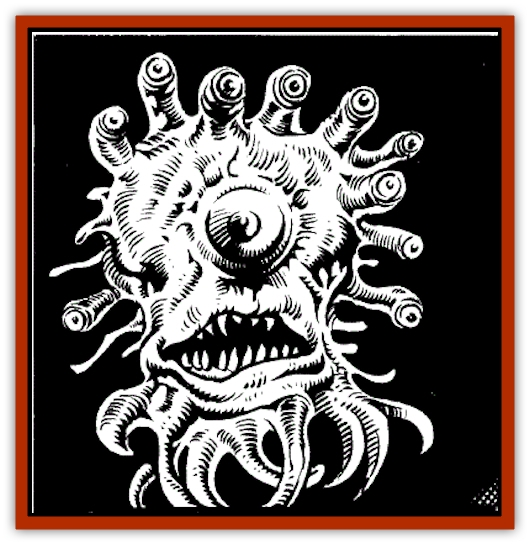

# Beholder - Undead - Death Tyrant

| Statistic | **Beholder, Undead (Death Tyrant)** |
| --- | --- |
| **Activity Cycle:** | Any |
| **Alignment:** | Lawful evil |
| **Armor Class:** | 0/2/7 |
| **Climate/Terrain:** | Any space |
| **Damage/Attack:** | 2-8 |
| **Diet:** | Nil |
| **Frequency:** | Uncommon |
| **Hit Dice:** | As in life: 45-75 hp |
| **Intelligence:** | Special |
| **Magic Resistance:** | Undead immunities |
| **Morale:** | Fanatic ( 18) |
| **Movement:** | Fl 2 (C) |
| **No. Appearing:** | 1-20 |
| **No. of Attacks:** | 1 |
| **Organization:** | Solitary or cohort (guardian) |
| **Size:** | M (4'-6' diameter) |
| **Special Attacks:** | Magic |
| **Special Defenses:** | Anti-magic ray |
| **THAC0:** | As in life (11, 9, 7, or 5) |
| **Treasure:** | Any (guardian) |
| **XP Value:** | 13,000 |

A type of [[Beholder_and_Beholder-kin_I|beholder]] almost unknown on worlds is the undead beholder, or death tyrant.

Death tyrants are rotting, mold-encrusted beholders. They may be shrivelled or even have cavities that expose their bony skeletons of platelets attached to spherical networks of circular ribs. All sport wounds, some have eyestalks missing, and a milky film covers their eyes. They move and turn more slowly than living beholders, striking and bringing their eyes to bear last in any combat round.

**Combat:** An undead beholder can use all powers of surviving eyes just as it did in life. The powers of 2-5 eyes (select randomly, including the central eye) are lost due to injuries death, and the change to undeath. Although a death tyrant 'heals' its motive energies through time, it cannot regenerate lost eyestalks or their powers.

Beholder-eye *charm* powers are lost in undeath. The two eyes that charmed either become useless (60%), or function as weak *hold monster* effects (40%). A being failing to save against such a hold remains held as long as the eye's gaze *remains steady* on them. If the eye is turned on another being, or the victim hooded or forcibly removed, the *hold* lasts another 1-3 rounds.

If not controlled by another creature through magic, a death tyrant hangs motionless until its creator's instructions are fulfilled (e.g., "Attack all humans who enter this chamber until they are destroyed or flee. Do not leave the chamber."). If no instructions are given to a "new" death tyrant, it attacks all living things it perceives.

Death tyrants occur spontaneously in very rare instances. In most cases, they are created through the magic of evil beings-from human mages to [[Mind_Flayer|illithid]] villains. Some outcast, magic-using beholders have even been known to create death tyrants from their unfortunate brethren.

**Habitat/Society:** Death tyrants have no self-awareness or social interaction. Like [[Beholder_and_Beholder-kin_I|orbi]] (see the description of the orbus in the SPELLJAMMER™ boxed set), they are mindless servants of living beholders. They will usually be found either abandoned (for example, in beholder ships or bases left ruined after a battle) or serving beholder society as guardians or unskilled workers.

Mindless' is a relative term; the once highly intelligent brains of death tyrants still use their eyes skillfully to perceive and attack nearby foes. They are among the more intelligent undead; only the cunning and strategies they had in life are gone. When a death tyrant is controlled by another being, consider it to have the intelligence of its controller.

**Ecology:** Death tyrants are created from dying beholders, those condemned as traitors to their race (or sub-race; beholders belong to many warring clans), and captives taken in battle by beholders of another nation. A spell, thought to have been developed by human mages in the remote past, forces a beholder from a living to undead state, and imprints its brain with instructions.

A spell developed by spacefarers enables anyone having 15 + intelligence and natural or magical charm abilities (including a living beholder) to command obedience from a death tyrant. If such a spell is successful, the death tyrant will use its powers just as a *charmed* human obeys a wizard who cast the *charm*. Rumors of devices that create these control effects persist-as do tales of humans and liches who command death tyrant guards.

'Rogue' death tyrants also exist: those whose instructions specifically enable them to ignore all controlling attempts. These are immune to the control attempts of all other beings. Beholders often leave them as traps against rivals.

Human spell researchers report that control of a death tyrant is very difficult for humans. A beholder's mind fluctuates wildly in the amount and level of its mental activity, scrambling normal *charm monster* and control undead** spells and variant magics developed from them. A special spell must be devised by any wizard desiring to command a death tyrant.

Although the eyestalks, brain, and levitation powers of a death tyrant still function, alchemists and wizards report that they disintegrate when the creatures are destroyed.

---
## Discovery & Documentation

**Source Publication:** SJR1 Lost Ships (1990)
**Campaign Setting:** Spelljammer
**Author(s):** Ed Greenwood, Paul Jaquays, Anne Brown, Dell Barras, Brom, Jeff Grubb

### Other Creatures Found in This Source Book
   * [[Flow_Barnacle|Flow Barnacle]]
   * [[Lich_Arch|Lich, Arch]]
   * [[Neogi:_Undead_Old_Master|Neogi: Undead Old Master]]
   * [[Shadowsponge_Air_Stealer|Shadowsponge (Air Stealer)]]
   * [[Beholder_Eater_Thagar_Grimgobbler|Beholder Eater, Thagar (Grimgobbler)]]
   * [[Tinkerer_Giant_Bubble|Tinkerer (Giant Bubble)]]
   * [[Sarphardin_Watcher|Sarphardin (Watcher)]]
   * [[Men:_Wonderseeker|Men: Wonderseeker]]
   * [[Spaceworm|Spaceworm]]
