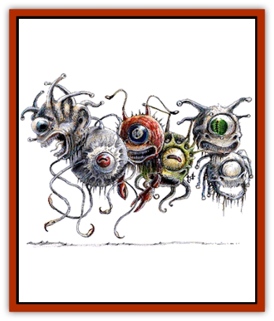
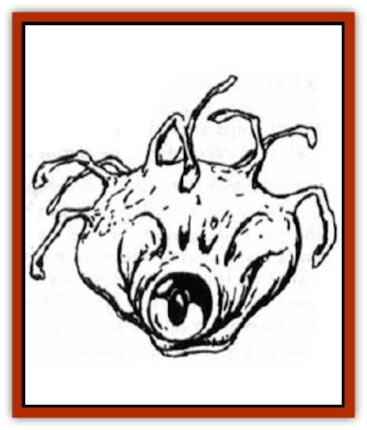

# Beholder and Beholder-kin I

| Statistic | **Beholder** | **Death Kiss** | **Eye of the Deep** | **Gauth** | **Orbus** | **Spectator** | **Undead** |
| --- | --- | --- | --- | --- | --- | --- | --- |
| **Activity Cycle:** | Any | Any | Day | Day | Any | Day | Any |
| **Alignment:** | Lawful evil | Neutral evil | Lawful evil | Neutral evil | Neutral | Lawful neutral | Lawful evil |
| **Armor Class:** | 0/2/7 | 4/6/8 | 5 | 0/2/7 | 10 | 4/7/7 | 0/2/7 |
| **Climate/Terrain:** | Any remote | Any remote | Deep ocean | Any remote | Any space | Any remote | Any |
| **Damage/Attack:** | 2-8 | 1-8 | 2-8/2-8/1-6 | 3-12 | Nil | 2-5 | 2-8 |
| **Diet:** | Omnivore | Carnivore | Omnivore | Magic | Omnivore | Omnivore | None |
| **Frequency:** | Rare | Very rare | Very rare | Rare | Rare | Very rare | Very rare |
| **Hit Dice:** | 45-75 hp | 1d8+76 hp | 10-12 | 6+6 or 9+9 | 5-10 HD | 4+4 | 45-75 hp |
| **Intelligence:** | Exceptional (15-16) | Average to high <nobr>(8-14)</nobr> | Very (11-12) | Exceptional (15-16) | Non- (0) | Very to high <nobr>(11-14)</nobr> | Special |
| **Magic Resistance:** | Nil | Nil | Nil | Nil | Special | 5% | Nil |
| **Morale:** | Fanatic (18) | Fanatic (17) | Champion (15) | Champion to fanatic <nobr>(15-18)</nobr> | Average (10) | Elite (14) | Fanatic (18) |
| **Movement:** | Fl 3 (B) | Fl 9 (B) | Sw 6 | Fl 9 (B) | Fl 3 (B) | Fl 9 (B) | Fl 2 (C) |
| **No. Appearing:** | 1 | 1 | 1 | 1 | 1-6 | 1 | 1 |
| **No. of Attacks:** | 1 | 10 | 3 | 1 | 0 | 1 | 1 |
| **Organization:** | Solitary | Solitary | Solitary | Solitary | Ship | Solitary | Solitary |
| **Size:** | M <nobr>(4-6' in diameter)</nobr> | H (6-12' in diameter) | S-M <nobr>(3-5' in diameter)</nobr> | L (4-6' in diameter) | M (4-6' in diameter) | M (4' in diameter) | L <nobr>(4-6' in diameter)</nobr> |
| **Special Attacks:** | Magic | Blood drain | Magic | Magic | Nil | Magic | Magic |
| **Special Defenses:** | Anti-magic ray | Regeneration | Nil | Regeneration | Anti-magic ray | Magic | Anti-magic ray |
| **THAC0:** | 45-49 hp: 11 / 50-59 hp: 9 / 60-69 hp: 7 / 70+ hp: 5 | 11 | 10 HD: 11 / 11-12 HD: 9 | 6+6 HD: 13 / 9+9 HD: 11 | N/A | 15 | 45-49 hp: 11 / 50-59 hp: 9 / 60-69 hp: 7 / 70+ hp: 5 |
| **Treasure:** | I,S,T | I,S,T | R | B | Nil | See below | E |
| **XP Value:** | 14,000 | 8,000 | 4,000 | 6+6 HD: 6,000 / 9+9 HD: 9,000 | 270+ | 4,000 | 13,000 |

<!-- 

 -->

<!-- 

 --><!-- 

 --><!-- 

  -->The beholder is the stuff of nightmares. This creature, also called the *sphere of many eyes* or the *eye tyrant*, appears as a large orb dominated by a central eye and a large toothy maw, has 10 smaller eyes on stalks sprouting from the top of the orb. Among adventurers, beholders are known as deadly adversaries.

Equally deadly are a number of variant creatures known collectively as beholder-kin, including radical and related creatures, and an undead variety. These creatures are related in manners familial and arcane to the <q>traditional</q> beholders, and share a number of features, including the deadly magical nature of their eyes. The most extreme of these creatures are called beholder abominations.

The globular body of the beholder and its kin is supported by levitation, allowing it to float slowly about as it wills.

Beholders and beholder-kin are usually solitary creatures, but there are reports of large communities of them surviving deep beneath the earth and in the void between the stars, under the dominion of [[Beholder_and_Beholder-kin_II|hive mothers]].All beholders speak their own language, which is also understood by all beholder-kin. In addition, they often speak the tongues of other lawful evil creatures.

**Combat:** The beholder has different Armor Classes for different parts of their body. When attacking a beholder, determine the location of the attack before striking (as the various Armor Classes may make a strike in one area, and a miss in another):

| Roll | Location | AC |
| --- | --- | --- |
| 01-75 | Body | 0 |
| 76-85 | Central Eye | 7 |
| 86-95 | Eyestalk | 2 |
| 96-00 | One smaller eye | 7 |

Each of the beholder's eyes, including the central one has a different function. The standard smaller eyes of a beholder are as follows:

<ol><li>*Charm person* (as spell)</li><li>*Charm monster* (as spell)</li><li>*Sleep* (as spell, but only one target)</li><li>*Telekinesis* (250 pound weight)</li><li>*Flesh to stone* (as spell, 30-yard range)</li><li>*Disintegrate* (20-yard range)</li><li>*Fear* (as wand)</li><li>*Slow* (as spell, but only a single target)</li><li>*Cause serious wounds* (50-yard range)</li><li>*Death ray* (as a *death* spell, with a single target, 40-yard range)</li></ol>The central eye produces an anti-magic ray with a 140-yard range, which covers a 90 degree arc before the creature. No magic (including the effects of the other eyes) will function within that area. Spells cast in or passing through that zone cease to function.

A beholder may activate the magical powers of its eyes' at will. Generally, a beholder can use 1d4 smaller eyes if attackers are within a 90 degree angle in front, 1d6 if attacked from within a 180 degree angle, 1d8 if attacked from a 270 degree arc, and all 10 eyes if attacked from all sides. The central eye can be used only against attacks from the front. If attacked from above, the beholder can use all of the smaller eyes.

The beholder can withstand the loss of its eyestalks, each eyestalk/smaller eye having 5-12 hit points. This loss of hit points is over and above any damage done to the central body. The body can withstand two thirds of the listed hit points in damage before the creature perishes. The remaining third of the listed hit points are located in the central eye, and destroying it will eliminate the anti-magic ray. A beholder with 45 hit points will have a body that will take 30 points of damage, a central eye that will take 15 points, while one with 75 hit points will have a body that will withstand 50 points of damage, and a central eye that takes 25 hit points to destroy. Both beholders would have smaller eyestalks/eyes that take 5-12 (1d8+4) points of damage to destroy, but such damage would not affect the body or central eye. Slaying the body will kill the beholder and render the eyes powerless. Destroyed eyestalks (but not the central eye) can regenerate at a rate of one lost member per week.

**Habitat/Society:** The beholders are a hateful, aggressive and avaricious race, attacking or dominating other races, including other beholders and many of the beholder-kin. This is because of a xenophobic intolerance among beholders that causes them to hate all creatures not like themselves. The basic, beholder body-type (a sphere with a mouth and a central eye, eye-tipped tentacles) allows for a great variety of beholder subspecies. Some have obvious differences, there are those covered with overlapping chitin plates, and those with smooth hides, or snake-like eye tentacles, and some with crustacean-like joints. But something as small as a change in hide color or size of the central eye can make two groups of beholders sworn enemies. Every beholder declares its own unique body-form to be the <q>true ideal</q> of beholderhood, the others being nothing but ugly copies, fit only to be eliminated.

Beholders will normally attack immediately. If confronted with a particular party there is a 50% chance they will listen to negotiations (bribery) before raining death upon their foes.

**Ecology:** The exact reproductive process of the beholder is unknown. The core racial hatred of the beholders may derive from the nature of their reproduction, which seems to produce identical (or nearly so) individuals with only slight margin for variation. Beholders may use parthenogenic reproduction to duplicate themselves, and give birth live (no beholder eggs have been found). Beholders may also (rarely) mate with types of beholder-kin.

The smaller eyes of the beholder may be used to produce a potion of levitation, and as such can be sold for 50 gp each.

**Death Kiss (Beholder-kin)**

The [[Beholder-kin_Death_Kiss|Death Kiss]], or <q>bleeder</q>, is a fearsome predator found in caverns or ruins. Its spherical body resembles that of the dreaded beholder, but the <q>eyestalks</q> of this creature are bloodsucking tentacles, its <q>eyes</q> are hook-toothed orifices. They favor a diet of humans and horses, but will attack anything that has blood. An older name for these creatures is *eye of terror*.

The central body of a death kiss has no mouth. Its central eye gives it 120-foot infravision, but the death kiss has no magical powers. A death kiss is 90% likely to be taken for a beholder when sighted. The 10 tentacles largely retract into the body when not needed, resembling eyestalks, but can lash out to a full 20-foot stretch with blinding speed. The tentacles may act separately or in concert, attacking a single creature or an entire adventuring company.

A tentacle's initial strike does 1-8 points of damage as the barb-mouthed tip attaches to the victim. Each attached tentacle drains 2 hit points worth of blood per round, beginning the round after it hits.

Like the beholder, the death kiss has variable Armor Classes. In ordinary combat, use the following table, though situations may dictate other methods (should the creature be attacking with a tentacle from 20 feet away, then no attack on the body or central eye may be made, while attacks on the stalk and mouth are still possible).

| Roll | Location | AC | Hit Points |
| --- | --- | --- | --- |
| 01-75 | Body | 4 | 77-84 |
| 76-85 | Central Eye | 8 | 6 |
| 86-95 | Tentacle stalk | 2 | 6 |
| 96-00 | Tentacle mouth | 4 | See following text |

A hit on a tentacle-mouth inflicts no damage, but stuns the tentacle, causing it to writhe helplessly for 1-4 rounds. If its central eye is destroyed, a bleeder locates beings within 10 feet by smell and sensing vibrations, but it is otherwise unaffected.

Tentacles must be struck with edged weapons to injure them. They can be torn free from the victim by a successful bend bars/lift gates roll. Such a forceful removal does the victim 1-6 damage per tentacle, since the barbed teeth are violently torn free from the tentacle.

If an attached tentacle is damaged but not destroyed, it instantly and automatically drains sufficient hit points, in blood, from the victim's body to restore it to a full 6 hit points. This reflex effect occurs after every non-killing hit on a tentacle, even if it is wounded more than once in a round. This cannot occur more than twice in one round. The parasitic healing effect does not respond to damage suffered by the central body or other tentacles.

A tentacle continues to drain blood, if it was draining when the central body of the death kiss reaches 0 hit points. Tentacles not attached to a victim at that time are incapable of further activity. A death kiss can retract a draining tentacle, but voluntarily does so only when its central body is at 5 hit points or less; it willfully detaches once the victim has been drained to 0 hit points.

Ingested blood is used to generate electrical energy - 1 hit point of blood becomes 1 charge. A death kiss uses this energy for motor activity and healing. An eye of terror expends one charge every two turns in moving, and thus is almost constantly hunting prey. Spending one charge enables a bleeder to heal 1 hit point of damage to each of its 10 tentacles, its central body, and its eye (12 hit points in all). It can heal itself with one charge of stored energy every other round in addition to its normal attacks and activity.

Each tentacle can store up to 24 charges of drained energy, the body capable of storing 50 charges of drained energy. A severed tentacle is 70% likely to discharge its cumulative charges, when severed, into anything touching it; each charge delivers 1 hit point of electrical damage.

Finally, bleeders can ram opponents with their mass. This attack does 1-8 damage.

A death kiss may "shut itself down", remaining motionless and insensitive on the ground, and can remain alive in that state for long periods of time. To awaken from its hibernation, the creature requires an influx of electrical energy, considerable heat, or the internal shock caused by a blow, fall, wound, or magical attack; any of the above stimulants must deal at least 5 points of damage to the death kiss to awaken it. Adventurers finding a hibernating death kiss usually provide such stimulation, thinking the sleeper helpless prey.

Eyes of terror are solitary hunters, fully inheriting the paranoia and ego of their cousins, the beholders. If they encounter one of their kin, the result is often a mid-air struggle to the death. The loser's body becomes an incubator and breeding ground for the death kiss' offspring. Within one day, 1-4 young will "hatch". Each new bleeder has half its parent's hit points, and fully matures in 1 month.

The death kiss has an organ in the central, upper body that is a valued ingredient in magical potions and spell inks concerned with levitation (and may be sold like beholder eyes). In addition, a brain or nerve node, deep in a bleeder's body hardens into a soft-sided, faceted red gem upon the creature's death. Called "bloodeyes", these typically fetch a market price of 70 gp each. They are valued for adornments since they glow more brightly as the wearer's emotions intensify.

**Eye of the Deep (Beholder-kin)**

This is a water breathing version of the beholder, and dwells only at great depths, floating slowly about, stalking prey. They have two crab-like pincers which inflict 2-8 (2d4) points of damage each, and a wide mouth full of sharp teeth that does 1-6 points of damage.

The primary weapons of the eyes of the deep, however, are their eyes. The creatures large central eye emits a cone of blinding light 5 feet wide at its start, 30 feet long, and 20 feet wide at its base. Those in the cone must save vs. poison or be stunned for 2-8 (2d4) rounds.

The eye of the deep also has two smaller eyes on long stalks, and uses both to create illusion. Acting independently, the small eyes are able to cast *hold person* and *hold monster* spells respectively.

The eye of the deep has an Armor Class of 5 everywhere, including its eyes and eye stalks. If its eyestalks are severed they will grow back in about a week.

**Gauth (Beholder-kin)**

The Gauth is a relative of the beholder that feeds on magic. Its spherical body is 5 feet in diameter and brown in color, mottled with purple and gray. Located in the center of the gauth's forward hemisphere is a large central eye surrounded by a ring of smaller eyes that are protected by ridges of tough flesh. These secondary body eyes provide the creature with normal vision in lighted areas and infravision to 90 feet. On the underside is the beast's fearsome mouth with its accompanying cluster of four feeding tendrils, while the top is adorned with a crown of six eye stalks. Attacks on the creature hit as follows:

| Roll | Location | AC | Hit Points |
| --- | --- | --- | --- |
| 01-85 | Body | 0 | As listed |
| 86-90 | Central Eye | 7 | Part of Body |
| 91-00 | Eyestalk/Tendril | 2 | 6 hit points |

While the gauth is similar to the beholder, its ability to feed on the energy of magical objects makes it even more dangerous in some ways.

When a gauth moves into combat, it begins to glow, much as if it were the object of a *faerie fire* spell, to attract the attention of its foes. A creature that meets the *gaze* of the central eye must roll a successful saving throw vs. spell, with a -2 penalty, or be affected as if the victim of a *feeblemind* spell.

If a gauth chooses to bite with its great maw, the sharp fangs inflict 3d4 points of damage. The four tendrils around the mouth can grab and hold victims as if they had a Strength of 18, but they can inflict no damage.

A gauth in combat can also employ its six eye stalks. These eyes have the following powers:

<ol><li>*Cause serious wounds* (as spell, 30-foot range)</li><li>*Repulsion* (as spell, 10-foot wide path, 40-foot range)</li><li>*Cone of cold* (as spell, inflicts 3d4 points of damage and has an area of effect 5 feet wide at the start, 50 feet long, and 20 feet wide at the base; this eye can be used only three times per day)</li><li>*Lightning bolt* (as spell, inflicts 4d4 damage with 80' range; this power can be used up to four times per day)</li><li>*Paralyzation* (as wand, 40-foot range, single target; only a *dispel magic* or the beholder's death can free the victim)</li><li>*Dweomer drain* (see below)</li></ol>Perhaps the most feared of the gauth's powers, its *dweomer drain*, permits the gauth to drain charges from magical items. It has a 40-foot range and can be targeted on one individual per round. In addition to preventing one object from functioning for the duration of that round, this power drains one charge from one charged object. Permanent objects, such as magical swords, are rendered powerless for one round by this ability. Artifacts are not affected by the *dweomer drain*. The eye has no effect on spells that have been memorized (but not yet cast) and it will not break the concentration of a wizard. It does neutralize any spell cast by its target that round, however.

A *dispel magic* spell cast on any of the gauth's eye stalks prevents its use for 1d4 rounds. The central eye, any fully retracted eye stalks, the body's ability to glow, and the gauth's natural *levitation* are not subject to injury by such a spell.

If a gauth is slain, its magical energy dissipates. Usually, this is a harmless event, but there is a 2% chance that it is catastrophic, inflicting 4d4 points of damage to all creatures within 10 feet (no saving throw). Gauth are immune to their own powers and to those of other gauth. They have an unusual physiology that enables them to regenerate 1 hit point every two turns.

Although gauth are not known to fight over territories or prey, they do go to great lengths to avoid each other. Even when they encounter another of their kind in the wilderness, they often ignore them utterly.

A gauth can survive by eating meat but it greatly prefers to devour magical objects. In some unknown manner, the creature is able to absorb magical energy and feed on it. Each turn that an object spends in the gauth's stomach causes it to lose one charge. A permanent object is rendered inoperative after one day (artifacts are not affected, nor do they provide sustenance). Magical objects that cannot be entirely digested by a gauth are spat out after they have been drained of all their power.

Gauth are thought to live a century or so. Within a week of their <q>natural</q> death, two young gauth emerge from the corpse. Although smaller than their parent (each has 2+2 or 3+3 HD and a bite that causes only 2d4 points of damage), they have all the powers of a full-grown adult.

**Orbus**

The orbus is either a genetically bred or a stunted and immature form of the standard beholder. It is only found in space aboard the tyrant ships of the beholder nations. It is chalk-white and lacks functioning smaller eyes. The central eye is huge and vulnerable, occupying most of the upper body above a small, toothless mouth. This eye has the normal anti-magic properties, but is milky white.

Despite their vulnerability, the orbi are the means by which the beholders travel through space. It is they that can funnel the magical energies of the other beholders into motive force - they are living spelljammer helms. There are 1-5 of them aboard any tyrant ship, and they are located closest to the hive mother, at the deepest point of the shell.

The orbi have their hit points distributed as common beholders: one third for the central eye and two thirds for the body. However, when attacking an orbus, 50% of the hits will strike the central eye, the remainder hitting the body. Both eye and body have the same Armor Class.

**Spectator (Beholder-kin)**

Another relative of the beholder, the spectator is a guardian of places and treasures, and capable of limited planar travel. Once it is given a task, the spectator will watch for up to 101 years. It will allow no one to use, borrow, or examine an item or treasure, except the one who gave it its orders. The spectator has a large central eye and four smaller eye stalks protruding from the top of its hovering, spherical body.

The spectator is difficult to surprise, and has a +2 surprise modifier and a +1 initiative modifier. It is basically a passive creature, and will attempt to communicate and implant suggestion as its first act, unless it is immediately attacked.

Striking a spectator has the following effects:

| Roll | Location | AC | Hit Points |
| --- | --- | --- | --- |
| 01-70 | Body | 4 | 4+4 HD |
| 71-90 | Eyestalk/Eye | 7 | 1 hit point |
| 91-00 | Central Eye | 7 | 1 hit point |

A spectator, if blinded in all of its eyes, cannot defend its treasure and will teleport to the outer plane of Nirvana. This is the only condition under which it will leave its post. Its eyes regenerate in one day and then it returns. If the treasure is gone, the creature again leaves for Nirvana, never to return.

Spectator has a general magic resistance of 5%. As long as the central eye is undamaged, it can also *reflect* one spell cast at it, per round, sending it back against the caster. This does not apply to spells whose range is touch. Reflection occurs only if the spectator rolls a successful saving throw vs. spell. If the saving throw fails, magic resistance (and a further saving throw) must be rolled. Reflection is possible only if the caster is standing within the 60 degree arc of the central eye. Only the spellcaster is affected by a reflected spell.

All of the smaller eyes may be used at the same time against the same target. Their powers are:

<ol><li>*Create food and water* (creates the amount of food and water for a large meal for up to six people; this takes one full round)</li><li>*Cause serious wounds* (inflicts 2d8+3 points of damage to a single being at a range of 60 yards; a saving throw vs. spell is allowed for half damage)</li><li>*Paralyzation ray* (range 90 feet, one target only, for 8d4 rounds).</li><li>*Telepathy* (range 120 feet, only one target; communication is possible in this way, and the beast can also plant a *suggestion* if the target fails a saving throw vs. spell; the suggestion is always to leave in peace).</li></ol>If properly met, the spectator can be quite friendly. It will tell a party exactly what it is guarding early in any conversation. If its charge is not threatened, it can be very amiable and talkative, using its telepathy.

Spectators move by a very rapid levitation, in any direction. They will drift aimlessly when asleep (20% likely when encountered), never touching the ground.

The treasure being guarded is 90% likely to be a magical item. If the spectator gains incidental treasure while performing its duty, this is not part of its charge and it will freely allow it to be taken. Incidental treasure can be generated as follows: 40% for 3-300 coins of mixed types, 30% for 1d6 gems of 50 gp base value, 20% for 1d4 potions, 15% for a +1 piece of armor, 15% for a +1 weapon, and 5% for a miscellaneous magical item valued at 1,000 XP or less.

Spectators are summoned from Nirvana by casting monster summoning V with material components of three or more small eyes from a beholder. (The chance of success is 10% per eye.) The spectator can be commanded only to guard some treasure. It performs no other duty, and if commanded to undertake some other task, it returns to Nirvana immediately. If its guarded treasure is ever destroyed or stolen, the spectator is released from service and returns to Nirvana. The summoner may take the item with no interference from the spectator, but this releases the creature.

**Undead Beholder (Death Tyrant)**

Death tyrants are rotting, mold-encrusted beholders. They may be shriveled, wounds exposing their internal, spherical networks of circular ribs, among the remnants of their exoskeletal plates. All sport wounds, some have eyestalks missing, or a milky film covering their eyes. They move and turn more slowly than living beholders, striking and bringing their eyes to bear last in any combat round.

An undead beholder can use all the powers of its surviving eyes, just as it did in life. The powers of 2-5 eyes (select randomly, including the central eye) are lost due to injuries or death, and the change to undeath. Although a death tyrant <q>heals</q> its motive energies through time, it cannot regenerate lost eyestalks or their powers.

*Charm* powers are lost in undeath. The two eyes that charmed either become useless (60%), or function as weak *hold monster *effects (40%). A being failing to save against such a hold remains held as long as the eye's gaze remains steadily focused on them. If the eye is turned on another being, or the victim hooded, or forcibly removed, the *hold* lasts another 1-3 rounds. Death tyrants are immune to *sleep*, *charm*, and *hold* spells.

If not controlled by another creature through magic, a death tyrant hangs motionless until its creator's instructions are fulfilled (for example,<q>Attack all humans who enter this chamber until they are destroyed or flee. Do not leave the chamber.</q>) If no instructions are given to a <q>new</q> death tyrant, it attacks all living things it perceives. Death tyrants occur spontaneously in very rare instances. In most cases, they are created through the magic of evil beings - from human mages to illithid villains. Some outcast, magic-using beholders have even been known to create death tyrants from their own unfortunate brethren.

Death tyrants have no self-awareness or social interaction; they are mindless servants of more powerful masters. <q>Mindless</q> is a relative term; the once highly intelligent brains of death tyrants still use eyes skillfully to perceive and attack nearby foes. When a death tyrant is controlled by another being, consider it to have the intelligence of its controller.

Death tyrants are created from dying beholders. A spell, thought to have been developed by human mages in the remote past, forces a beholder from a living to an undead state, and imprints its brain with instructions. <q>Rogue</q> death tyrants also exist: those whose instructions specifically enable them to ignore all controlling attempts. These are immune to the control attempts of all other beings. Beholders often leave them as traps against rivals.

Human spell researchers report that control of a death tyrant is very difficult. A beholder's mind fluctuates wildly in the frequency and level of its mental activity, scrambling normal charm monster and control undead spells. A special spell must be devised to command a death tyrant.

**Saving Throws**

Most beholders make saving throws according to their Hit Dice. The Death Kiss makes saving throws as a 10th-level warrior. The typical beholder and undead beholders make saving throws as follows:

| Creature hit points | Saves as |
| --- | --- |
| 45-49 | 10th level warrior |
| 50-59 | 12th level warrior |
| 60-69 | 14th level warrior |
| 70+ | 16th level warrior |

<map name="map"><area shape="circle" coords="250,140,30" href="#01" alt="Beholder" title="Beholder"><area shape="circle" coords="105,175,35" href="/appendix/behodeki" alt="Death Kiss" title="Death Kiss"><area shape="circle" coords="150,150,30" href="#03" alt="Eye of the Deep" title="Eye of the Deep"><area shape="circle" coords="190,180,30" href="#04" alt="Gauth" title="Gauth"><area shape="circle" coords="55,135,35" href="#05" alt="Spectator" title="Spectator"><area shape="circle" coords="270,200,30" href="#05" alt="Undead Beholder" title="Undead Beholder">

---
## Discovery & Documentation

**Source Publication:** Monstrous Manual (1995)
**Campaign Setting:** Advanced Dungeons & Dragons 2nd Edition
**Author(s):** Tim Beach

### Other Creatures Found in This Source Book
   * [[Aarakocra|Aarakocra]]
   * [[Aboleth|Aboleth]]
   * [[Ankheg|Ankheg]]
   * [[Arcane|Arcane]]
   * [[Argos|Argos]]
   * [[Aurumvorax|Aurumvorax]]
   * [[Baatezu_Lesser_Abishai|Baatezu, Lesser, Abishai]]
   * [[Baatezu_General_Information|Baatezu, General Information]]
   * [[Baatezu_Greater_Pit_Fiend|Baatezu, Greater, Pit Fiend]]
   * [[Banshee|Banshee]]
   * [[Basilisk|Basilisk]]
   * [[Bat|Bat]]
   * [[Bear|Bear]]
   * [[Beetle_Giant|Beetle, Giant]]
   * [[Behir|Behir]]
   * [[Beholder_and_Beholder-kin_II|Beholder and Beholder-kin II]]
   * [[Bird|Bird]]
   * [[Brain_Mole|Brain Mole]]
   * [[Broken_One|Broken One]]
   * [[Brownie|Brownie]]
   * [[Bugbear|Bugbear]]
   * [[Bulette|Bulette]]
   * [[Bullywug|Bullywug]]
   * [[Carrion_Crawler|Carrion Crawler]]
   * [[Cat_Great|Cat, Great]]
   * [[Catoblepas|Catoblepas]]
   * [[Cat_Small|Cat, Small]]
   * [[Cave_Fisher|Cave Fisher]]
   * [[Centaur|Centaur]]
   * [[Centipede|Centipede]]
   * [[Chimera|Chimera]]
   * [[Cloaker|Cloaker]]
   * [[Cockatrice|Cockatrice]]
   * [[Couatl|Couatl]]
   * [[Crabman|Crabman]]
   * [[Crawling_Claw|Crawling Claw]]
   * [[Crocodile|Crocodile]]
   * [[Crustacean_Giant|Crustacean, Giant]]
   * [[Crypt_Thing|Crypt Thing]]
   * [[Death_Knight|Death Knight]]
   * [[Deepspawn|Deepspawn]]
   * [[Dinosaur_I|Dinosaur I]]
   * [[Displacer_Beast|Displacer Beast]]
   * [[Dog|Dog]]
   * [[Dog_Moon|Dog, Moon]]
   * [[Dolphin|Dolphin]]
   * [[Doppelganger|Doppelganger]]
   * [[Dracolich|Dracolich]]
   * [[Dragon_Brown|Dragon, Brown]]
   * [[Dragon_Chromatic_Black|Dragon, Chromatic, Black]]
   * [[Dragon_Chromatic_Blue|Dragon, Chromatic, Blue]]
   * [[Dragon_Chromatic_Green|Dragon, Chromatic, Green]]
   * [[Dragon_Cloud|Dragon, Cloud]]
   * [[Dragon_Chromatic_Red|Dragon, Chromatic, Red]]
   * [[Dragon_Chromatic_White|Dragon, Chromatic, White]]
   * [[Dragon_Deep|Dragon, Deep]]
   * [[Dragon_Gem_Amethyst|Dragon, Gem, Amethyst]]
   * [[Dragon_Gem_Crystal|Dragon, Gem, Crystal]]
   * [[Dragon_Gem_Emerald|Dragon, Gem, Emerald]]
   * [[Dragon_Gem_Sapphire|Dragon, Gem, Sapphire]]
   * [[Dragon_Gem_Topaz|Dragon, Gem, Topaz]]
   * [[Dragon_Metallic_Brass|Dragon, Metallic, Brass]]
   * [[Dragon_Metallic_Bronze|Dragon, Metallic, Bronze]]
   * [[Dragon_Metallic_Copper|Dragon, Metallic, Copper]]
   * [[Dragon_Mercury|Dragon, Mercury]]
   * [[Dragon_Metallic_Gold|Dragon, Metallic, Gold]]
   * [[Dragon_Mist|Dragon, Mist]]
   * [[Dragon_Metallic_Silver|Dragon, Metallic, Silver]]
   * [[Dragon_General_Information|Dragon, General Information]]
   * [[Dragon_Shadow|Dragon, Shadow]]
   * [[Dragon_Steel|Dragon, Steel]]
   * [[Dragon_Yellow|Dragon, Yellow]]
   * [[Dragonne|Dragonne]]
   * [[Dragon_Turtle|Dragon Turtle]]
   * [[Dragonet_Faerie_Dragon|Dragonet, Faerie Dragon]]
   * [[Dragonet_Fire_Drake|Dragonet, Fire Drake]]
   * [[Dragonet_Pseudodragon|Dragonet, Pseudodragon]]
   * [[Dryad|Dryad]]
   * [[Dwarf_Derro|Dwarf, Derro]]
   * [[Dwarf|Dwarf]]
   * [[Elemental_Athas_General_Information|Elemental (Athas), General Information]]
   * [[Elemental_Air_Kin|Elemental, Air Kin]]
   * [[Elemental_Earth_Kin|Elemental, Earth Kin]]
   * [[Elemental_Fire_Kin|Elemental, Fire Kin]]
   * [[Elemental_Water_Kin|Elemental, Water Kin]]
   * [[Elemental_of_Chaos_Air_Earth|Elemental of Chaos, Air/Earth]]
   * [[Elemental_of_Chaos_Fire_Water|Elemental of Chaos, Fire/Water]]
   * [[Elemental_Composite|Elemental, Composite]]
   * [[Elemental_Air_Earth|Elemental, Air/Earth]]
   * [[Elemental_Fire_Water|Elemental, Fire/Water]]
   * [[Elemental_General_Information|Elemental, General Information]]
   * [[Elephant|Elephant]]
   * [[Elf|Elf]]
   * [[Elf_Aquatic|Elf, Aquatic]]
   * [[Elf_Drow|Elf, Drow]]
   * [[Ettercap|Ettercap]]
   * [[Eyewing|Eyewing]]
   * [[Feyr|Feyr]]
   * [[Fish|Fish]]
   * [[Frog|Frog]]
   * [[Fungus|Fungus]]
   * [[Galeb_Duhr|Galeb Duhr]]
   * [[Gargantua|Gargantua]]
   * [[Gargoyle_I|Gargoyle I]]
   * [[Genie|Genie]]
   * [[Ghost|Ghost]]
   * [[Ghoul|Ghoul]]
   * [[Giant_Cloud|Giant, Cloud]]
   * [[Giant_Cyclops|Giant, Cyclops]]
   * [[Giant_Desert|Giant, Desert]]
   * [[Giant_Ettin|Giant, Ettin]]
   * [[Giant_Firbolg|Giant, Firbolg]]
   * [[Giant_Fire|Giant, Fire]]
   * [[Giant_Fog|Giant, Fog]]
   * [[Giant_Fomorian|Giant, Fomorian]]
   * [[Giant_Frost|Giant, Frost]]
   * [[Giant_Hill|Giant, Hill]]
   * [[Giant_Jungle|Giant, Jungle]]
   * [[Giant_Mountain|Giant, Mountain]]
   * [[Giant_Reef|Giant, Reef]]
   * [[Giant_Stone|Giant, Stone]]
   * [[Giant_Storm|Giant, Storm]]
   * [[Giant_Verbeeg|Giant, Verbeeg]]
   * [[Giant_Wood|Giant, Wood]]
   * [[Gibberling|Gibberling]]
   * [[Giff|Giff]]
   * [[Gith|Gith]]
   * [[Gith_Pirate_of|Gith, Pirate of]]
   * [[Githyanki|Githyanki]]
   * [[Githzerai|Githzerai]]
   * [[Gloomwing|Gloomwing]]
   * [[Gnoll|Gnoll]]
   * [[Gnome|Gnome]]
   * [[Gnome_Spriggan|Gnome, Spriggan]]
   * [[Goblin|Goblin]]
   * [[Golem_General_Information|Golem, General Information]]
   * [[Golem_I_Greater_Golem|Golem I (Greater Golem)]]
   * [[Golem_II_Lesser_Golem|Golem II (Lesser Golem)]]
   * [[Golem_III|Golem III]]
   * [[Golem_IV|Golem IV]]
   * [[Golem_V|Golem V]]
   * [[Golem_VI_Stone_Variants|Golem VI (Stone Variants)]]
   * [[Gorgon|Gorgon]]
   * [[Grell_Colonial|Grell, Colonial]]
   * [[Gremlin_Jermlaine|Gremlin, Jermlaine]]
   * [[Gremlin|Gremlin]]
   * [[Griffon|Griffon]]
   * [[Grimlock|Grimlock]]
   * [[Grippli|Grippli]]
   * [[Hag|Hag]]
   * [[Halfling|Halfling]]
   * [[Harpy|Harpy]]
   * [[Hatori|Hatori]]
   * [[Haunt|Haunt]]
   * [[Hell_Hound|Hell Hound]]
   * [[Heucuva|Heucuva]]
   * [[Hippocampus|Hippocampus]]
   * [[Hippogriff|Hippogriff]]
   * [[Hobgoblin|Hobgoblin]]
   * [[Homunculus|Homunculus]]
   * [[Hook_Horror|Hook Horror]]
   * [[Horse|Horse]]
   * [[Human|Human]]
   * [[Hydra|Hydra]]
   * [[Imp|Imp]]
   * [[Insect_Giant|Insect, Giant]]
   * [[Insect_Swarm|Insect Swarm]]
   * [[Intellect_Devourer|Intellect Devourer]]
   * [[Invisible_Stalker|Invisible Stalker]]
   * [[Ixitxachitl|Ixitxachitl]]
   * [[Jackalwere|Jackalwere]]
   * [[Kenku|Kenku]]
   * [[Ki-rin|Ki-rin]]
   * [[Kirre|Kirre]]
   * [[Kobold|Kobold]]
   * [[Kuo-Toa|Kuo-Toa]]
   * [[Lamia|Lamia]]
   * [[Lammasu|Lammasu]]
   * [[Leech|Leech]]
   * [[Leprechaun|Leprechaun]]
   * [[Leucrotta|Leucrotta]]
   * [[Lich|Lich]]
   * [[Living_Wall|Living Wall]]
   * [[Lizard|Lizard]]
   * [[Lizard_Man|Lizard Man]]
   * [[Locathah|Locathah]]
   * [[Lurker|Lurker]]
   * [[Lycanthrope_General_Information|Lycanthrope, General Information]]
   * [[Lycanthrope_Seawolf|Lycanthrope, Seawolf]]
   * [[Lycanthrope_Werebear|Lycanthrope, Werebear]]
   * [[Lycanthrope_Wereboar|Lycanthrope, Wereboar]]
   * [[Lycanthrope_Werebat|Lycanthrope, Werebat]]
   * [[Lycanthrope_Werefox|Lycanthrope, Werefox]]
   * [[Lycanthrope_Wererat|Lycanthrope, Wererat]]
   * [[Lycanthrope_Wereraven|Lycanthrope, Wereraven]]
   * [[Lycanthrope_Weretiger|Lycanthrope, Weretiger]]
   * [[Lycanthrope_Werewolf|Lycanthrope, Werewolf]]
   * [[Mammal|Mammal]]
   * [[Mammal_Giant|Mammal, Giant]]
   * [[Mammal_Herd_I|Mammal, Herd I]]
   * [[Mammal_Small|Mammal, Small]]
   * [[Manscorpion|Manscorpion]]
   * [[Manticore|Manticore]]
   * [[Medusa_Maedar|Medusa, Maedar]]
   * [[Medusa|Medusa]]
   * [[Mephit_General_Information|Mephit, General Information]]
   * [[Merman|Merman]]
   * [[Mimic|Mimic]]
   * [[Mind_Flayer|Mind Flayer]]
   * [[Minotaur|Minotaur]]
   * [[Mist_Crimson_Death|Mist, Crimson Death]]
   * [[Mist_Vampiric|Mist, Vampiric]]
   * [[Mold_I|Mold I]]
   * [[Moldman|Moldman]]
   * [[Mongrelman|Mongrelman]]
   * [[Morkoth|Morkoth]]
   * [[Muckdweller|Muckdweller]]
   * [[Mudman|Mudman]]
   * [[Mummy_Greater|Mummy, Greater]]
   * [[Mummy|Mummy]]
   * [[Myconid|Myconid]]
   * [[Naga|Naga]]
   * [[Naga_Dark|Naga, Dark]]
   * [[Neogi|Neogi]]
   * [[Nightmare|Nightmare]]
   * [[Nymph|Nymph]]
   * [[Octopus_Giant|Octopus, Giant]]
   * [[Ogre|Ogre]]
   * [[Ogre_Half-|Ogre, Half-]]
   * [[Ooze_Slime_Jelly_I|Ooze/Slime/Jelly I]]
   * [[Ooze_Slime_Jelly_II|Ooze/Slime/Jelly II]]
   * [[Ooze_Slime_Jelly_Slithering_Tracker|Ooze/Slime/Jelly, Slithering Tracker]]
   * [[Orc|Orc]]
   * [[Otyugh|Otyugh]]
   * [[Owlbear_I|Owlbear I]]
   * [[Pegasus|Pegasus]]
   * [[Peryton|Peryton]]
   * [[Phantom|Phantom]]
   * [[Phoenix|Phoenix]]
   * [[Piercer|Piercer]]
   * [[Plant_Dangerous_I|Plant, Dangerous I]]
   * [[Plant_Intelligent|Plant, Intelligent]]
   * [[Poltergeist|Poltergeist]]
   * [[Pudding_Deadly|Pudding, Deadly]]
   * [[Quaggoth|Quaggoth]]
   * [[Rakshasa|Rakshasa]]
   * [[Rat|Rat]]
   * [[Rat_Osquip|Rat, Osquip]]
   * [[Remorhaz|Remorhaz]]
   * [[Revenant|Revenant]]
   * [[Roc|Roc]]
   * [[Roper|Roper]]
   * [[Rust_Monster|Rust Monster]]
   * [[Sahuagin|Sahuagin]]
   * [[Satyr|Satyr]]
   * [[Scorpion|Scorpion]]
   * [[Sea_Lion|Sea Lion]]
   * [[Selkie|Selkie]]
   * [[Shadow|Shadow]]
   * [[Shedu|Shedu]]
   * [[Sirine|Sirine]]
   * [[Skeleton|Skeleton]]
   * [[Skeleton_Giant|Skeleton, Giant]]
   * [[Skeleton_Warrior|Skeleton, Warrior]]
   * [[Slaad|Slaad]]
   * [[Slug_Giant|Slug, Giant]]
   * [[Snake|Snake]]
   * [[Snake_Winged|Snake, Winged]]
   * [[Spectre|Spectre]]
   * [[Sphinx|Sphinx]]
   * [[Spider|Spider]]
   * [[Sprite|Sprite]]
   * [[Squid_Giant|Squid, Giant]]
   * [[Stirge|Stirge]]
   * [[Su-Monster|Su-Monster]]
   * [[Swanmay|Swanmay]]
   * [[Tabaxi|Tabaxi]]
   * [[Tako|Tako]]
   * [[Tanar'ri_True_Balor|Tanar'ri, True, Balor]]
   * [[Tanar'ri_True_Marilith|Tanar'ri, True, Marilith]]
   * [[Tarrasque|Tarrasque]]
   * [[Tasloi|Tasloi]]
   * [[Thought_Eater|Thought Eater]]
   * [[Thri-kreen|Thri-kreen]]
   * [[Titan|Titan]]
   * [[Toad_Giant|Toad, Giant]]
   * [[Treant|Treant]]
   * [[Triton|Triton]]
   * [[Troglodyte|Troglodyte]]
   * [[Troll|Troll]]
   * [[Umber_Hulk|Umber Hulk]]
   * [[Unicorn|Unicorn]]
   * [[Urchin|Urchin]]
   * [[Vampire|Vampire]]
   * [[Wemic|Wemic]]
   * [[Whale|Whale]]
   * [[Wight|Wight]]
   * [[Will_O'Wisp|Will O'Wisp]]
   * [[Wolf|Wolf]]
   * [[Wolfwere|Wolfwere]]
   * [[Worm|Worm]]
   * [[Wraith|Wraith]]
   * [[Wyvern|Wyvern]]
   * [[Xorn|Xorn]]
   * [[Yeti|Yeti]]
   * [[Yuan-ti_Histachii|Yuan-ti, Histachii]]
   * [[Yuan-ti|Yuan-ti]]
   * [[Yugoloth_Guardian|Yugoloth, Guardian]]
   * [[Zaratan|Zaratan]]
   * [[Zombie|Zombie]]
