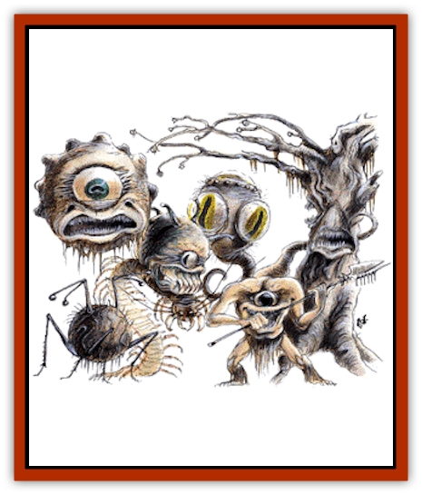
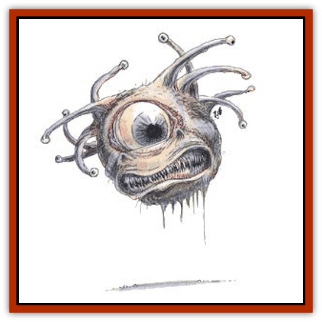

# Beholder and Beholder-kin II

| Statistic | **Director** | **Examiner** | **Hive Mother** | **Lensman** | **Overseer** | **Watcher** |
| --- | --- | --- | --- | --- | --- | --- |
| **Activity Cycle:** | Day | Night | Any | Day | Any | Any |
| **Alignment:** | Lawful evil | Lawful neutral | Lawful evil | Neutral evil | Lawful evil | Neutral |
| **Armor Class:** | 2 (4) | 5 | 0 | 3/7 | 2/7 | 7 |
| **Climate/Terrain:** | Any remote | Any remote | Any remote | Any remote | Any remote | Any remote |
| **Damage/Attack:** | 2-8/2-8 | 1-6 or by weapon | 5-20 | 1-8 or by weapon | 3-12 | 3-18 |
| **Diet:** | Omnivore | Omnivore | Omnivore | Insectivore | Omnivore | Scavenger |
| **Frequency:** | Very rare | Very rare | Very rare | Very rare | Very rare | Very rare |
| **Hit Dice:** | 12 (8) | 8 | 20 | 2 | 14 | 3+3 |
| **Intelligence:** | Average (8-10) | Genius (17-18) | Genius (17-18) | Low (5-7) | Supra-genius (19-20) | Semi- (2-4) |
| **Magic Resistance:** | 20% | 25% | 5% | Nil | 35% | Nil |
| **Morale:** | Fanatic (18) | Steady (11) | Fanatic (18) | Elite (14) | Champion (16) | Average (10) |
| **Movement:** | 15, Fl 3 (A) | Fl 6 (C) | Fl 6 (A) | 9 | 1 | Fl 6 (A) |
| **No. Appearing:** | 2-5 | 1-6 | 1 | 1-10 | 1 | 1-4 |
| **No. of Attacks:** | 2 | 1 | 1 | 1 | 1 | 1 |
| **Organization:** | Squad | Squad | Solitary | Squad | Solitary | Solitary |
| **Size:** | H (8-10' in diameter) | M (4' in diameter) | H (8' in diameter) | M (5' in diameter) | H (15' in diameter) | L (6' in diameter) |
| **Special Attacks:** | Magic | Magic | Magic | Nil | Magic | Magic |
| **Special Defenses:** | Nil | Magic | Anti-magic | Magic | Magic | Magic |
| **THAC0:** | 9 | 13 | 5 | 19 | 7 | 17 |
| **Treasure:** | G | V&times;4 | I,S,T | R | U | Nil |
| **XP Value:** | 10,000 | 6,000 | 24,000 | 175 | 15,000 | 420 |

**

Hive Mother (Beholder-kin)**

The legendary hive mothers are also called the <q>Ultimate tyrants</q>, or just <q>Ultimates</q>. They are twice the size of typical [[Beholder_and_Beholder-kin_I|beholders]], and differ in appearance as well.

Their mouths are larger, so large that they can gulp down a man-sized target on a natural die roll of 20. Once swallowed, the prey takes 5-20 points of damage (5d4) each round until it is dead or escapes. The beholder's mouth is not very deep, so a victim can escape by making a successful attack roll.

The ultimate has no eyestalks, but its magical eyes are protected by hooded covers in the flesh of the creature's body, so that they cannot be severed. The central eye has 15 hit points.

| Roll | Location | AC | Hit Points |
| --- | --- | --- | --- |
| 01-90 | Body | 0 | 20 HD |
| 91-00 | Central Eye | 7 | 15 hp |

The ultimate's true ability is in controlling the actions of large numbers of beholders and beholder-kin. A hive mother may have 5-10 ordinary beholders under its command, or 5-20 abomination or beholder-kin (see below), which it communicates with telepathically. A nesting hive mother spells disaster for the surrounding region, as it can apparently create a community of beholders, beholder-kin, and abominations. If destroyed, the beholders and beholder-kin will turn on each other, or seek their own lairs.

Hive mothers may be the ancestral stock of the better known beholder, the next step of its evolution, a magical mutation, or a separate species. The reality remains unknown.

**Director (Abomination)**

Directors are a social, warrior-beholder, and breed specialized mounts. They mindlink with their mounts to better control them.

Directors resemble beholders, but their central eye is smaller. They possess only six small eyes on retractable eye stalks. Directors have a fanged mouth below the central eye and possesses three clawed, sensory tendrils on their ventral surface. These tendrils are used to cling to the mount and link with its limited mind.

Directors' eyes have their own powers:

<ol><li>*Magic Missile* (as spell , 2/round)</li><li>*Burning Hands* (as spell at 8th level)</li><li>*Wall of Ice* (as spell)</li><li>*Slow* (as spell)</li><li>*Enervation* (as spell)</li><li>*Improved Phantasmal Force* (as spell)</li></ol>A director's central eye has the power of deflection - all frontal attacks on director suffer a -2 penalty to the attack roll and damage is halved. The director also gains a +2 bonus to all saving throws against spells cast by those in the field of vision of the central eye.

Director mounts seem to have derived from an insect stock, as they are covered in chitin and have simple eye spots and multiple limbs.

Directors normally possess 8 Hit Dice, but when mounted the director and mount are treated as a single creature whose Hit Dice equals the sum of those of the director and the mount. After a director/mount suffers half damage, the mount's speed is reduced to half and the director gets only one physical attack per round. A director may flee and leave his mount to fend for itself (the mount suffers a -4 penalty to its attack rolls). Directors have an AC of 4, but are AC 2 when mounted. Directors may use all of their normal powers while mounted, within the restrictions of beholder targeting angles.

**Crawler** (a typical mount): A crawler resembles a cross between a centipede and a spider. It has 4 Hit Dice. It has 10 legs, two pairs of frontal antennae, and two fighting spider fangs that can be used for separate stabbing attacks causing 2d4 points of damage each. Victims who fail to roll successful saving throws vs. poison are paralyzed for 1d4 rounds. Crawlers are omnivores that prefer to eat smaller creatures. Unmounted, they may roll into a ball to gain an AC of 0. They have cutting mandibles beneath their front fangs.

**Examiner (Abomination)**

An examiner is a 4-foot diameter sphere with no central eye and only four small eyes, each at the end of an antenna, mounted atop the sphere. They have one small, lamprey-like mouth on their ventral surface. The mouth is surrounded by four multi-jointed limbs ending in gripper pads. These limbs can pick up and manipulate tools, the chief strength of the examiner.

Examiners are scholars and clerks involved in spell and magical item enhancement, research, and creation. They can use any artifact or tool as well as humans, and they can wield up to four items at a time. Examiners regenerate 1 point of damage each round. The powers of their four eyes are given below (all spell-like effects are cast at the 8th level).

<ol><li>*Enlarge* or *Reduce*</li><li>*Identify* or *Legend Lore*</li><li>*Transmute Form* (similar to a *Stone Shape* spell, but works on all types of nonmagical, nonliving material)</li><li>*Spell Reflection* as a *ring of spell turning*</li></ol>Examiners are not the bravest of beholder-kin, but they are potentially the most dangerous with their command of artifacts. They are often the lackeys of beholders, overseers, and hive mothers.

**Lensman (Abomination)**

A lensman has one eye set in the chest of its five-limbed, starfish-shaped, simian body. Beneath the eye is a leering, toothy maw. Four of the five limbs end in three-fingered, two-thumbed, clawed hands. The fifth limb, atop the body, is a prehensile, whip-like tentacle. Its chitin is soft and there are many short, fly-like hairs. Lensmen are the only kin to wear any sort of garb - a webbing that is used to hold tools and weapons. Their preferred weapons are double-headed pole arms.

Lensmen are semi-mindless drones that don't question their lot in life. The eye of each lensman possesses only one of the following six special powers (all at the 6th level of ability).

<ol><li>*Emotion*</li><li>*Heal*</li><li>*Dispel Magic*</li><li>*Tongues*</li><li>*Phantasmal Force*</li><li>*Protections* (as scrolls, any type, but only one at a time)</li></ol>**Overseer (Abomination)**

Overseers resemble fleshy trees. They have 13 limbs, each of which ends in a bud that conceals an eye; one of these limbs forms the top spine, and three yammering mouths surround the spine. There are eight thorny, vine-like limbs that are used to grasp tools and for physical defense, inflicting 1d10+2 points of damage each. Overseers sit on root-like bases and can inch along when movement is required. They cannot levitate.

Overseers are covered with a fungus which changes color as the overseers desire, commonly mottled green, gray, and brown.

Overseers may use any physical weapons or artifacts. The powers of their 13 eyes are as follows (all magical effects are cast at 14th level).

<ol><li>*Cone of Cold*</li><li>*Dispel Magic*</li><li>*Paralysis*</li><li>*Chain Lightning*</li><li>*Telekinesis* 250 lb. weight</li><li>*Emotion*</li><li>*Mass Charm*</li><li>*Domination*</li><li>*Mass Suggestion*</li><li>*Major Creation*</li><li>*Spell Turning*</li><li>*Serten's Spell Immunity*</li><li>*Temporal Stasis*</li></ol>An overseer's AC is 2, but each eye stalk is AC 7 and is severed if it suffers 10 points of damage. Like hive mothers (that operate with them), overseers can convince similar beholders and beholder-kin to work together. Overseers are very protective of their health and always have one or two beholder guards and at least a half dozen directors protecting their welfare.

**Watcher (Abomination)**

Watchers are 6-foot-diameter spheres with three central eyes arranged around the circumference of the sphere. These eyes are huge and unlidded. On the crown of the sphere is a compound eye and a ring of six eye spots that make it difficult to surprise a watcher. A large tentacle with a barbed prehensile pad extends from the ventral surface, right behind the small mouth with its rasp-like tongue. Watchers feed on carrion and stunned prey. They are information gatherers and are the least brave of all the eye tyrant races.

Watchers can attack with their single tentacle for 3d6 points of damage. The tentacle also inflicts an electrical shock; victims who fail a system shock roll fall unconscious.

Each of a watcher's main eyes has two powers, and the compound eye on top may draw on three different abilities. The six eye spots have no special powers.

<ol><li>*True Seeing* and *ESP*</li><li>*Advanced Illusion* and *Demi-Shadow Magic*</li><li>*Telekinesis* 1,000 lb. and *Teleport*</li></ol>Compound Eye: Message, Tongues, and Suggestion

Watchers are not aggressive warriors; they prefer misdirection and flight to actual confrontation.

## Other Beholders and Beholder-kin

The beholder races are not limited to the ones presented here. The plastic nature of the beholder race allows many mutations and abominations in the breed, including, but not limited to, the following.

**Beholder Mage**

Shunned by other beholders, this is a beholder which has purposely blinded its central eye, so that it might cast spells. It does so by channeling spell energy through an eyestalk, replacing the normal effect with that of a spell of its choice.

**Elder Orb**

[[Beholder_Elder_Orb|These]] are extremely ancient beholders of godlike intelligence and power. Though they have lost the function of some of their eyestalks, they have more hit points and are able to cast spells. They can supposedly create and control death tyrants.

**Orbus**

[[Beholder_and_Beholder-kin_I|This]] is a stunted, pale-white beholder retaining only its anti-magic eye and reputed to have great magical ability.

**Doomsphere**

[[Doomsphere_Ghost_Beholder|This ghost-like undead beholder]] is created by magical explosions.

**Kasharin**

[[Beholder_Kasharin|An undead beholder]], it passes on the rotting disease which killed it.

**Astereater**

[[Beholder_Abomination_Astereater|This abomination]] is a great boulder-like beholder-kin without eyes.

**Gorbel**

The [[Gorbel|gorbel]] is a wild, clawed beholder-kin lacking magic but with the nasty habit of exploding if attacked.

In addition, there are beholders which are in all appearances "normal" but have eyes with alternate magical abilities, such as a *detect lie* instead of a *death ray*. Such creatures are usually treated as outcasts by all the beholder and beholder-kin races.

<map name="map"><area shape="circle" coords="55,135,45" href="#01" alt="Hive Mother" title="Hive Mother"><area shape="circle" coords="120,190,30" href="#02" alt="Director" title="Director"><area shape="circle" coords="60,250,30" href="#03" alt="Examiner" title="Examiner"><area shape="circle" coords="195,235,25" href="#04" alt="Lensman" title="Lensman"><area shape="circle" coords="255,175,35" href="#05" alt="Overseer" title="Overseer"><area shape="circle" coords="165,155,35" href="#05" alt="Watcher" title="Watcher"></map>

---
## Discovery & Documentation

**Source Publication:** Monstrous Manual (1995)
**Campaign Setting:** Advanced Dungeons & Dragons 2nd Edition
**Author(s):** Tim Beach

### Other Creatures Found in This Source Book
   * [[Aarakocra|Aarakocra]]
   * [[Aboleth|Aboleth]]
   * [[Ankheg|Ankheg]]
   * [[Arcane|Arcane]]
   * [[Argos|Argos]]
   * [[Aurumvorax|Aurumvorax]]
   * [[Baatezu_Lesser_Abishai|Baatezu, Lesser, Abishai]]
   * [[Baatezu_General_Information|Baatezu, General Information]]
   * [[Baatezu_Greater_Pit_Fiend|Baatezu, Greater, Pit Fiend]]
   * [[Banshee|Banshee]]
   * [[Basilisk|Basilisk]]
   * [[Bat|Bat]]
   * [[Bear|Bear]]
   * [[Beetle_Giant|Beetle, Giant]]
   * [[Behir|Behir]]
   * [[Beholder_and_Beholder-kin_I|Beholder and Beholder-kin I]]
   * [[Bird|Bird]]
   * [[Brain_Mole|Brain Mole]]
   * [[Broken_One|Broken One]]
   * [[Brownie|Brownie]]
   * [[Bugbear|Bugbear]]
   * [[Bulette|Bulette]]
   * [[Bullywug|Bullywug]]
   * [[Carrion_Crawler|Carrion Crawler]]
   * [[Cat_Great|Cat, Great]]
   * [[Catoblepas|Catoblepas]]
   * [[Cat_Small|Cat, Small]]
   * [[Cave_Fisher|Cave Fisher]]
   * [[Centaur|Centaur]]
   * [[Centipede|Centipede]]
   * [[Chimera|Chimera]]
   * [[Cloaker|Cloaker]]
   * [[Cockatrice|Cockatrice]]
   * [[Couatl|Couatl]]
   * [[Crabman|Crabman]]
   * [[Crawling_Claw|Crawling Claw]]
   * [[Crocodile|Crocodile]]
   * [[Crustacean_Giant|Crustacean, Giant]]
   * [[Crypt_Thing|Crypt Thing]]
   * [[Death_Knight|Death Knight]]
   * [[Deepspawn|Deepspawn]]
   * [[Dinosaur_I|Dinosaur I]]
   * [[Displacer_Beast|Displacer Beast]]
   * [[Dog|Dog]]
   * [[Dog_Moon|Dog, Moon]]
   * [[Dolphin|Dolphin]]
   * [[Doppelganger|Doppelganger]]
   * [[Dracolich|Dracolich]]
   * [[Dragon_Brown|Dragon, Brown]]
   * [[Dragon_Chromatic_Black|Dragon, Chromatic, Black]]
   * [[Dragon_Chromatic_Blue|Dragon, Chromatic, Blue]]
   * [[Dragon_Chromatic_Green|Dragon, Chromatic, Green]]
   * [[Dragon_Cloud|Dragon, Cloud]]
   * [[Dragon_Chromatic_Red|Dragon, Chromatic, Red]]
   * [[Dragon_Chromatic_White|Dragon, Chromatic, White]]
   * [[Dragon_Deep|Dragon, Deep]]
   * [[Dragon_Gem_Amethyst|Dragon, Gem, Amethyst]]
   * [[Dragon_Gem_Crystal|Dragon, Gem, Crystal]]
   * [[Dragon_Gem_Emerald|Dragon, Gem, Emerald]]
   * [[Dragon_Gem_Sapphire|Dragon, Gem, Sapphire]]
   * [[Dragon_Gem_Topaz|Dragon, Gem, Topaz]]
   * [[Dragon_Metallic_Brass|Dragon, Metallic, Brass]]
   * [[Dragon_Metallic_Bronze|Dragon, Metallic, Bronze]]
   * [[Dragon_Metallic_Copper|Dragon, Metallic, Copper]]
   * [[Dragon_Mercury|Dragon, Mercury]]
   * [[Dragon_Metallic_Gold|Dragon, Metallic, Gold]]
   * [[Dragon_Mist|Dragon, Mist]]
   * [[Dragon_Metallic_Silver|Dragon, Metallic, Silver]]
   * [[Dragon_General_Information|Dragon, General Information]]
   * [[Dragon_Shadow|Dragon, Shadow]]
   * [[Dragon_Steel|Dragon, Steel]]
   * [[Dragon_Yellow|Dragon, Yellow]]
   * [[Dragonne|Dragonne]]
   * [[Dragon_Turtle|Dragon Turtle]]
   * [[Dragonet_Faerie_Dragon|Dragonet, Faerie Dragon]]
   * [[Dragonet_Fire_Drake|Dragonet, Fire Drake]]
   * [[Dragonet_Pseudodragon|Dragonet, Pseudodragon]]
   * [[Dryad|Dryad]]
   * [[Dwarf_Derro|Dwarf, Derro]]
   * [[Dwarf|Dwarf]]
   * [[Elemental_Athas_General_Information|Elemental (Athas), General Information]]
   * [[Elemental_Air_Kin|Elemental, Air Kin]]
   * [[Elemental_Earth_Kin|Elemental, Earth Kin]]
   * [[Elemental_Fire_Kin|Elemental, Fire Kin]]
   * [[Elemental_Water_Kin|Elemental, Water Kin]]
   * [[Elemental_of_Chaos_Air_Earth|Elemental of Chaos, Air/Earth]]
   * [[Elemental_of_Chaos_Fire_Water|Elemental of Chaos, Fire/Water]]
   * [[Elemental_Composite|Elemental, Composite]]
   * [[Elemental_Air_Earth|Elemental, Air/Earth]]
   * [[Elemental_Fire_Water|Elemental, Fire/Water]]
   * [[Elemental_General_Information|Elemental, General Information]]
   * [[Elephant|Elephant]]
   * [[Elf|Elf]]
   * [[Elf_Aquatic|Elf, Aquatic]]
   * [[Elf_Drow|Elf, Drow]]
   * [[Ettercap|Ettercap]]
   * [[Eyewing|Eyewing]]
   * [[Feyr|Feyr]]
   * [[Fish|Fish]]
   * [[Frog|Frog]]
   * [[Fungus|Fungus]]
   * [[Galeb_Duhr|Galeb Duhr]]
   * [[Gargantua|Gargantua]]
   * [[Gargoyle_I|Gargoyle I]]
   * [[Genie|Genie]]
   * [[Ghost|Ghost]]
   * [[Ghoul|Ghoul]]
   * [[Giant_Cloud|Giant, Cloud]]
   * [[Giant_Cyclops|Giant, Cyclops]]
   * [[Giant_Desert|Giant, Desert]]
   * [[Giant_Ettin|Giant, Ettin]]
   * [[Giant_Firbolg|Giant, Firbolg]]
   * [[Giant_Fire|Giant, Fire]]
   * [[Giant_Fog|Giant, Fog]]
   * [[Giant_Fomorian|Giant, Fomorian]]
   * [[Giant_Frost|Giant, Frost]]
   * [[Giant_Hill|Giant, Hill]]
   * [[Giant_Jungle|Giant, Jungle]]
   * [[Giant_Mountain|Giant, Mountain]]
   * [[Giant_Reef|Giant, Reef]]
   * [[Giant_Stone|Giant, Stone]]
   * [[Giant_Storm|Giant, Storm]]
   * [[Giant_Verbeeg|Giant, Verbeeg]]
   * [[Giant_Wood|Giant, Wood]]
   * [[Gibberling|Gibberling]]
   * [[Giff|Giff]]
   * [[Gith|Gith]]
   * [[Gith_Pirate_of|Gith, Pirate of]]
   * [[Githyanki|Githyanki]]
   * [[Githzerai|Githzerai]]
   * [[Gloomwing|Gloomwing]]
   * [[Gnoll|Gnoll]]
   * [[Gnome|Gnome]]
   * [[Gnome_Spriggan|Gnome, Spriggan]]
   * [[Goblin|Goblin]]
   * [[Golem_General_Information|Golem, General Information]]
   * [[Golem_I_Greater_Golem|Golem I (Greater Golem)]]
   * [[Golem_II_Lesser_Golem|Golem II (Lesser Golem)]]
   * [[Golem_III|Golem III]]
   * [[Golem_IV|Golem IV]]
   * [[Golem_V|Golem V]]
   * [[Golem_VI_Stone_Variants|Golem VI (Stone Variants)]]
   * [[Gorgon|Gorgon]]
   * [[Grell_Colonial|Grell, Colonial]]
   * [[Gremlin_Jermlaine|Gremlin, Jermlaine]]
   * [[Gremlin|Gremlin]]
   * [[Griffon|Griffon]]
   * [[Grimlock|Grimlock]]
   * [[Grippli|Grippli]]
   * [[Hag|Hag]]
   * [[Halfling|Halfling]]
   * [[Harpy|Harpy]]
   * [[Hatori|Hatori]]
   * [[Haunt|Haunt]]
   * [[Hell_Hound|Hell Hound]]
   * [[Heucuva|Heucuva]]
   * [[Hippocampus|Hippocampus]]
   * [[Hippogriff|Hippogriff]]
   * [[Hobgoblin|Hobgoblin]]
   * [[Homunculus|Homunculus]]
   * [[Hook_Horror|Hook Horror]]
   * [[Horse|Horse]]
   * [[Human|Human]]
   * [[Hydra|Hydra]]
   * [[Imp|Imp]]
   * [[Insect_Giant|Insect, Giant]]
   * [[Insect_Swarm|Insect Swarm]]
   * [[Intellect_Devourer|Intellect Devourer]]
   * [[Invisible_Stalker|Invisible Stalker]]
   * [[Ixitxachitl|Ixitxachitl]]
   * [[Jackalwere|Jackalwere]]
   * [[Kenku|Kenku]]
   * [[Ki-rin|Ki-rin]]
   * [[Kirre|Kirre]]
   * [[Kobold|Kobold]]
   * [[Kuo-Toa|Kuo-Toa]]
   * [[Lamia|Lamia]]
   * [[Lammasu|Lammasu]]
   * [[Leech|Leech]]
   * [[Leprechaun|Leprechaun]]
   * [[Leucrotta|Leucrotta]]
   * [[Lich|Lich]]
   * [[Living_Wall|Living Wall]]
   * [[Lizard|Lizard]]
   * [[Lizard_Man|Lizard Man]]
   * [[Locathah|Locathah]]
   * [[Lurker|Lurker]]
   * [[Lycanthrope_General_Information|Lycanthrope, General Information]]
   * [[Lycanthrope_Seawolf|Lycanthrope, Seawolf]]
   * [[Lycanthrope_Werebear|Lycanthrope, Werebear]]
   * [[Lycanthrope_Wereboar|Lycanthrope, Wereboar]]
   * [[Lycanthrope_Werebat|Lycanthrope, Werebat]]
   * [[Lycanthrope_Werefox|Lycanthrope, Werefox]]
   * [[Lycanthrope_Wererat|Lycanthrope, Wererat]]
   * [[Lycanthrope_Wereraven|Lycanthrope, Wereraven]]
   * [[Lycanthrope_Weretiger|Lycanthrope, Weretiger]]
   * [[Lycanthrope_Werewolf|Lycanthrope, Werewolf]]
   * [[Mammal|Mammal]]
   * [[Mammal_Giant|Mammal, Giant]]
   * [[Mammal_Herd_I|Mammal, Herd I]]
   * [[Mammal_Small|Mammal, Small]]
   * [[Manscorpion|Manscorpion]]
   * [[Manticore|Manticore]]
   * [[Medusa_Maedar|Medusa, Maedar]]
   * [[Medusa|Medusa]]
   * [[Mephit_General_Information|Mephit, General Information]]
   * [[Merman|Merman]]
   * [[Mimic|Mimic]]
   * [[Mind_Flayer|Mind Flayer]]
   * [[Minotaur|Minotaur]]
   * [[Mist_Crimson_Death|Mist, Crimson Death]]
   * [[Mist_Vampiric|Mist, Vampiric]]
   * [[Mold_I|Mold I]]
   * [[Moldman|Moldman]]
   * [[Mongrelman|Mongrelman]]
   * [[Morkoth|Morkoth]]
   * [[Muckdweller|Muckdweller]]
   * [[Mudman|Mudman]]
   * [[Mummy_Greater|Mummy, Greater]]
   * [[Mummy|Mummy]]
   * [[Myconid|Myconid]]
   * [[Naga|Naga]]
   * [[Naga_Dark|Naga, Dark]]
   * [[Neogi|Neogi]]
   * [[Nightmare|Nightmare]]
   * [[Nymph|Nymph]]
   * [[Octopus_Giant|Octopus, Giant]]
   * [[Ogre|Ogre]]
   * [[Ogre_Half-|Ogre, Half-]]
   * [[Ooze_Slime_Jelly_I|Ooze/Slime/Jelly I]]
   * [[Ooze_Slime_Jelly_II|Ooze/Slime/Jelly II]]
   * [[Ooze_Slime_Jelly_Slithering_Tracker|Ooze/Slime/Jelly, Slithering Tracker]]
   * [[Orc|Orc]]
   * [[Otyugh|Otyugh]]
   * [[Owlbear_I|Owlbear I]]
   * [[Pegasus|Pegasus]]
   * [[Peryton|Peryton]]
   * [[Phantom|Phantom]]
   * [[Phoenix|Phoenix]]
   * [[Piercer|Piercer]]
   * [[Plant_Dangerous_I|Plant, Dangerous I]]
   * [[Plant_Intelligent|Plant, Intelligent]]
   * [[Poltergeist|Poltergeist]]
   * [[Pudding_Deadly|Pudding, Deadly]]
   * [[Quaggoth|Quaggoth]]
   * [[Rakshasa|Rakshasa]]
   * [[Rat|Rat]]
   * [[Rat_Osquip|Rat, Osquip]]
   * [[Remorhaz|Remorhaz]]
   * [[Revenant|Revenant]]
   * [[Roc|Roc]]
   * [[Roper|Roper]]
   * [[Rust_Monster|Rust Monster]]
   * [[Sahuagin|Sahuagin]]
   * [[Satyr|Satyr]]
   * [[Scorpion|Scorpion]]
   * [[Sea_Lion|Sea Lion]]
   * [[Selkie|Selkie]]
   * [[Shadow|Shadow]]
   * [[Shedu|Shedu]]
   * [[Sirine|Sirine]]
   * [[Skeleton|Skeleton]]
   * [[Skeleton_Giant|Skeleton, Giant]]
   * [[Skeleton_Warrior|Skeleton, Warrior]]
   * [[Slaad|Slaad]]
   * [[Slug_Giant|Slug, Giant]]
   * [[Snake|Snake]]
   * [[Snake_Winged|Snake, Winged]]
   * [[Spectre|Spectre]]
   * [[Sphinx|Sphinx]]
   * [[Spider|Spider]]
   * [[Sprite|Sprite]]
   * [[Squid_Giant|Squid, Giant]]
   * [[Stirge|Stirge]]
   * [[Su-Monster|Su-Monster]]
   * [[Swanmay|Swanmay]]
   * [[Tabaxi|Tabaxi]]
   * [[Tako|Tako]]
   * [[Tanar'ri_True_Balor|Tanar'ri, True, Balor]]
   * [[Tanar'ri_True_Marilith|Tanar'ri, True, Marilith]]
   * [[Tarrasque|Tarrasque]]
   * [[Tasloi|Tasloi]]
   * [[Thought_Eater|Thought Eater]]
   * [[Thri-kreen|Thri-kreen]]
   * [[Titan|Titan]]
   * [[Toad_Giant|Toad, Giant]]
   * [[Treant|Treant]]
   * [[Triton|Triton]]
   * [[Troglodyte|Troglodyte]]
   * [[Troll|Troll]]
   * [[Umber_Hulk|Umber Hulk]]
   * [[Unicorn|Unicorn]]
   * [[Urchin|Urchin]]
   * [[Vampire|Vampire]]
   * [[Wemic|Wemic]]
   * [[Whale|Whale]]
   * [[Wight|Wight]]
   * [[Will_O'Wisp|Will O'Wisp]]
   * [[Wolf|Wolf]]
   * [[Wolfwere|Wolfwere]]
   * [[Worm|Worm]]
   * [[Wraith|Wraith]]
   * [[Wyvern|Wyvern]]
   * [[Xorn|Xorn]]
   * [[Yeti|Yeti]]
   * [[Yuan-ti_Histachii|Yuan-ti, Histachii]]
   * [[Yuan-ti|Yuan-ti]]
   * [[Yugoloth_Guardian|Yugoloth, Guardian]]
   * [[Zaratan|Zaratan]]
   * [[Zombie|Zombie]]
