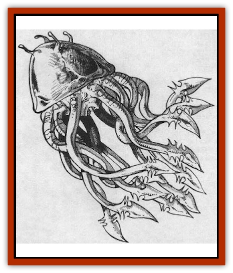
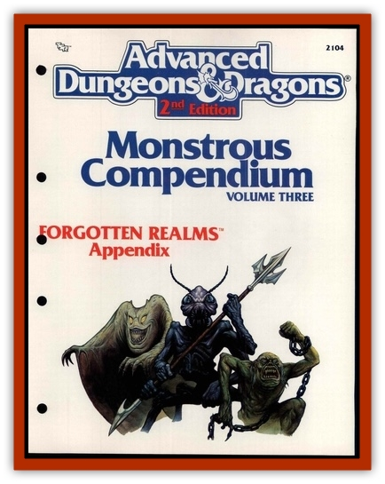

# Belabra

| Statistic | **Belabra** |
| --- | --- |
| **Activity Cycle:** | Day |
| **Alignment:** | Neutral |
| **Armor Class:** | -2 (head), 6 (tentacles) |
| **Climate/Terrain:** | Temperate forests |
| **Damage/Attack:** | 2-8 (ram only) |
| **Diet:** | Carnivore |
| **Frequency:** | Rare |
| **Hit Dice:** | 4+4 |
| **Intelligence:** | Low (5-7) |
| **Magic Resistance:** | Nil |
| **Morale:** | Champion (15-16) |
| **Movement:** | 3, Fl 6 (E) |
| **No. Appearing:** | 1 |
| **No. of Attacks:** | 1 entangle or 1 ram |
| **Organization:** | Solitary |
| **Size:** | M (5' long) |
| **Special Attacks:** | Bite and barbed tentacles |
| **Special Defenses:** | Blood spray |
| **THAC0:** | 15 |
| **Treasure:** | Nil |
| **XP Value:** | 975 |

The belabra, also called "tangler", is a most unusual creature, highly sought after because it can sometimes be domesticated.

The typical belabra has a large, hemispherical shell that measures some two feet in diameter and is generally black or dark grey in color. Extending from the underside of the shell are the creature's 12 rubbery tentacles, its deadly grey beak, and its pale white belly. The monster's four eyes extend above its shell on short eye stalks.

**Combat:** When in close combat, a belabra bounds about so that it can shield its soft underside with its hard shell. When given an opening, the belabra attacks either by bounding at its targets and ramming them with its shell or by entangling them in its barbed tentacles and tearing at them with its beak.

When employing the former method, the belabra kicks with its tentacles to hurl itself into the air. When gliding in this manner, the creature can travel up to 60 yards. If leaping into a breeze or confronted by a strong crosswind, this distance is cut by ten yards. In a strong headwind, the distance traveled is cut by 20 yards. The ramming inflicts 2d4 points of damage to the target.

At any point during its leap, the belabra can whip its tentacles around a target and attempt to entangle it. This requires the creature to roll a successful attack roll with a +4 bonus. An entangled foe loses all of its normal Dexterity bonuses to Armor Class, and the belabra gains a +4 bonus to attack rolls made with its beak. Once per turn a victim may try to escape from the tentacles by rolling against his bend bars/lift gates score. Whether or not the roll is successful, the victim suffers 1d4+2 points of damage from the barbs that cover the tentacles. The grip of the tentacles causes no damage unless the ensnared creature attempts to break free.

The belabra's hard shell gives its head an Armor Class of �2. As a rule, the rest of the creature (including its tentacles) is drawn up into the shell when not in use. Thus, the tentacles and underbelly (which are Armor Class 6) can be attacked only when a victim has been ensnared.

Injured tentacles release a sprai� of the creature's gray-white blood, which causes all humans, elves, and halflings within ten feet to roll saving throws vs. poison, with -3 penalties. Those who fail their rolls are partially blinded and overcome by sneezing fits. They also suffer a -4 penalty to their attack rolls and their Armor Classes are worsened by 2 for 3d8 rounds.

**Habitat/Society:** The belabra is a solitary creature that is found primarily in wooded regions throughout the world's temperate regions.

When at rest or waiting for prey, the creature draws itself up inside its shell and remains perfectly still. In this position, it is often mistaken for a large rock by the unwary. The belabra can sense its prey by both sight and scent.

Biologically, the belabra are most unusual creatures. They have only one sex, although they are not truly asexual as a lone creature cannot reproduce. The offspring begin as buds on the inner wall of their parent's stomach. Here they gestate for six to ten months before being ejected by the parent.

**Ecology:** If taken at a young age, a belabra can be trained to obey simple commands and act as a guard or hunter. If so trained, it identifies with its master and remains with him even in the heat of battle. Morale rolls are required only if the situation is unusually dangerous.

Training a captured belabra takes 4d4 weeks and requires a skilled instructor, a number of live animals (to serve as practice kills), and the frequent presence of the person who will be the creature's master. Adverse conditions can greatly extend the training period.

Once their training is completed, the belabra can be employed in the same manner as an attack dog. A young belabra that has been raised for two years can be taught to capture and hold a victim without trying to kill it.

A captured belabra young is worth some 1,500 gold pieces on the open market.

---
## Discovery & Documentation

**Source Publication:** MC3 Volume III Forgotten Realms Appendix I (1989)
**Campaign Setting:** Forgotten Realms
**Author(s):** William Connors, David Martin, Rick Swan, Gary Thomas

### Other Creatures Found in This Source Book
   * [[Asperii|Asperii]]
   * [[Berbalang|Berbalang]]
   * [[Bhaergala|Bhaergala]]
   * [[Bichir|Bichir]]
   * [[Bunyip|Bunyip]]
   * [[Burbur|Burbur]]
   * [[Cloaker|Cloaker]]
   * [[Crawling_Claw|Crawling Claw]]
   * [[Darkenbeast|Darkenbeast]]
   * [[Dracolich|Dracolich]]
   * [[Dragon_Oriental_Carp_Yu_Lung|Dragon, Oriental, Carp (Yu Lung)]]
   * [[Dragon_Oriental_Celestial_T'ien_Lung|Dragon, Oriental, Celestial (T'ien Lung)]]
   * [[Dragon_Oriental_Coiled_Pan_Lung|Dragon, Oriental, Coiled (Pan Lung)]]
   * [[Dragon_Oriental_Earth_Li_Lung|Dragon, Oriental, Earth (Li Lung)]]
   * [[Dragon_Oriental_Lung_General_Information|Dragon, Oriental (Lung), General Information]]
   * [[Dragon_Oriental_River_Chiang_Lung|Dragon, Oriental, River (Chiang Lung)]]
   * [[Dragon_Oriental_Sea_Lung_Wang|Dragon, Oriental, Sea (Lung Wang)]]
   * [[Dragon_Oriental_Spirit_Shen_Lung|Dragon, Oriental, Spirit (Shen Lung)]]
   * [[Dragon_Oriental_Typhoon_Tun_Mi_Lung|Dragon, Oriental, Typhoon (Tun Mi Lung)]]
   * [[Dragonet_Faerie_Dragon|Dragonet, Faerie Dragon]]
   * [[Firenewt|Firenewt]]
   * [[Firestar|Firestar]]
   * [[Fish_Ascallion|Fish, Ascallion]]
   * [[Fish_Vurgens|Fish, Vurgens]]
   * [[Meazel|Meazel]]
   * [[Medusa_Maedar|Medusa, Maedar]]
   * [[Mist_Crimson_Death|Mist, Crimson Death]]
   * [[Revenant|Revenant]]
   * [[Rhaumbusun|Rhaumbusun]]
   * [[Strider_Giant|Strider, Giant]]
   * [[Thessalmonster|Thessalmonster]]
   * [[Web_Living|Web, Living]]
   * [[Wemic|Wemic]]
