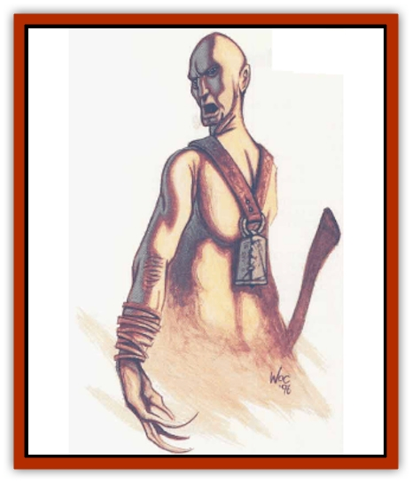

# Belgoi

| Statistic | **Belgoi** |
| --- | --- |
| **Activity Cycle:** | Any |
| **Alignment:** | Lawful evil |
| **Armor Class:** | 7 |
| **Climate/Terrain:** | Desert (Athas: Tablelands) |
| **Damage/Attack:** | 1d4+2/1d4+2 or by weapon |
| **Diet:** | Omnivore |
| **Frequency:** | Uncommon |
| **Hit Dice:** | 5 |
| **Intelligence:** | Average (8-10) |
| **Magic Resistance:** | Nil |
| **Morale:** | Average (8-10) |
| **Movement:** | 12 |
| **No. Appearing:** | 4-10 (2d4+2) |
| **No. of Attacks:** | 2 or 1 |
| **Organization:** | Tribe |
| **Size:** | M (6' tall) |
| **Special Attacks:** | Psionics, Constitution drain |
| **Special Defenses:** | Psionics |
| **THAC0:** | 15 |
| **Treasure:** | M (I) |
| **XP Value:** | 1,400 |

**Psionics Summary**

| Level | Dis/Sci/Dev | Attack/Defense | Score | PSPs |
| --- | --- | --- | --- | --- |
| 5 | 2/2/7 | EW,PB/MBk,TS | 12 | 24 |

**Psychometabolism -** *Sciences:* nil; *Devotions:* catfall, cause decay, flesh armor.

**Telepathy -** *Sciences:* domination, psionic blast; *Devotions:* attraction, ego whip, mind blank, thought shield.

At first sight, a belgoi of Athas appears to be human. An observant traveler then notices the longs claws that extend from its fingers, its puckered, toothless mouth, and its webbed, threetoed feet. A belgoi is a member of a race of ignorant demihumans who dwell in the most forlorn wastes. With its taste for the flesh of intelligent races and a gleeful exuberance to inflict pain, no wonder that the sorcerer-kings and other rulers of the Tablelands don't tolerate a belgoi tribe's presence within five-day's travel of their domains.

The belgoi speak a crude language that bears only the most rudimentary resemblance to the common language of the Tablelands. Some belgoi leaders have also learned the common tongue, though few civilized people willingly get close enough to engage in conversation.

**Combat:** Belgoi attack by sneaking up on a caravan camp and selecting a plump, meaty target. The belgoi carry small bells made from the bones of their own dead by the tribe's shaman These bells have a psionic enchantment that the belgoi (and only the belgoi) can employ. The sound of the bell can shatter the target�s mental defenses and open his mind to psionic contact. To use the bell, the belgoi must be looking at the intended victim and within 500 feet of him. When the bell rings, the target must make a saving throw vs. death magic with a -2 penalty. If successful, the target ignores the sound of the bell and can't be affected by it for 12 hours. Failure means the target's mental defenses collapse and the belgoi can attempt to use a psionic power. The belgoi's powers of choice are *domination* (which it uses to take control of the target to force him to leave the camp) and *attraction* (which it uses to lure the target into the darkness beyond the camp). If the target fails the saving throw, only he can hear the bell. If he succeeds, the bell's ringing can be heard by everyone in the camp (but it has no magical effect in this case).

Once the target is lured from camp, the belgoi caresses him. For every round that the belgoi touches the target, the target loses 1d6 points of Constitution. The loss is temporary; lost Constitution points return after 1d4 turns. While reduced, though, the target loses all Constitution bonuses. When the target's Constitution drops to 0, he falls unconscious. That's when the belgoi starts to feed.

If forced to fight, a belgoi can strike twice in a round with its wicked claws, inflicting 1d4+2 points of damage with each hit. When hit, a victim must make a saving throw vs. poison or lose 1d6 points of Constitution as described above. Some belgoi also employ weapons they have taken from victims.

If a battle goes against the belgoi, they withdraw to gather reinforcements from their own tribe or other belgoi tribes in the vicinity. They return with these reinforcements within 1d6+2 hours to resume the battle. Such battles can go on for days on end. The only way to prevent this is to kill every belgoi before they can escape.

**Habitat/Society:** Belgoi live in huge tribes and operate as raiders. These tribes make their homes in the most forlorn parts of the desert, but they travel across the Tablelands in their unending semh for food. Belgoi tribes harass trade routes, villages, and any groups of poorly defended people they can find.

Small scouting parties of four to ten individuals hunt for prey. When they encounter travelers or a small camp, they attack to secure their own meals. Then they call the rest of the tribe to share the leftovers. Though they prefer the flesh of the intelligent races, belgoi will eat animals, plants, and even monsters if they get hungry enough

**Ecology:** Belgoi leave the land behind them desolate and barren, stripping it of all animal and vegetable life. They are second only to the foulest defilers in the level of destruction they inflict on the world.

---
## Discovery & Documentation

**Source Publication:** Dark Sun Campaign Setting (original) (1991)
**Campaign Setting:** Dark Sun
**Author(s):** Timothy B. Brown, Troy Denning, William W. Connors, J. Robert King, Brom and Tom Baxa,

### Other Creatures Found in This Source Book
   * [[Animal_Domestic_Athas_I|Animal, Domestic (Athas) I]]
   * [[Braxat|Braxat]]
   * [[Dragon_of_Tyr|Dragon of Tyr]]
   * [[Dune_Freak|Dune Freak]]
   * [[Gaj|Gaj]]
   * [[Giant_Athach|Giant, Athach]]
   * [[Gith|Gith]]
   * [[Jozhal|Jozhal]]
   * [[Kluzd|Kluzd]]
   * [[Silk_Wyrm|Silk Wyrm]]
   * [[Tembo|Tembo]]
   * [[Wezer|Wezer]]
