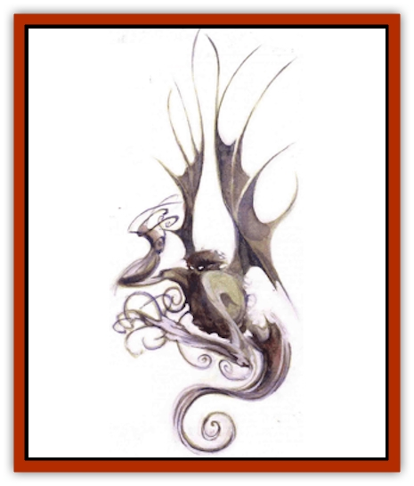

# Belker

| Statistic | **Belker** |
| --- | --- |
| **Activity Cycle:** | Any |
| **Alignment:** | Neutral evil |
| **Armor Class:** | -2 |
| **Climate/Terrain:** | Paraplane of Smoke |
| **Damage/Attack:** | 1d3/1d3/1d4 or 1d6/1d6 |
| **Diet:** | Carnivore |
| **Frequency:** | Rare |
| **Hit Dice:** | 7+3 |
| **Intelligence:** | Very (11-12) |
| **Magic Resistance:** | 20% (40% in smoke form) |
| **Morale:** | Champion (15-16) |
| **Movement:** | 12, Fl 18 (B) |
| **No. Appearing:** | 1 or 1d3 |
| **No. of Attacks:** | 3 or 2 |
| **Organization:** | Solitary |
| **Size:** | L (7-9' tall) |
| **Special Attacks:** | Noxious fumes |
| **Special Defenses:** | Smoke form, immunities |
| **THAC0:** | 13 |
| **Treasure:** | Nil |
| **XP Value:** | 5,000 |

I am not what you might think. Do you see me as a creature of evil nature or intent? I enjoy peace and solitude, not violence or pain. Yet still I'm regarded as though I were a monster - a fiend from the Abyss. Oh, yes, I know of the Abyss. I'm aware of the Outer Planes that stretch beyond our Inner Planes. I've never been there, but I have heard tales. And because my form looks a bit fiendish and I have large black wings - well, I know what you think when you see me. But I'm no devilish tormentor from the Lower Planes.

Someone such as you might consider me an elemental creature. I suppose that I am - your kind refers to my home as the Paraelemental Plane of Smoke. Creatures that I call the N'raaigib, you call [[Paraelemental|smoke paraelementals]] (that, in itself, says much of our difference, does it not?) Smoke is an integral part of my essence, and thus you would name me an [[Elemental_Smoke|elemental]] as well. That's fine. I'm not bothered by it - quite flattered, really. Smoke is one of the fundamental components of existence, and I'm glad that you're aware of that.

I can even alter the composition of my body to become as the smoke of my home. This ability provides me with many advantages, and makes me a great deal different from you. But different is not always evil.

**Combat:** When I must fight, I do so with claws and fangs *[1d3/1d3/1d4]* or with powerful blows from my large wings *[1d6/1d6]* - particularly if I am in my smoke form. Did I mention that I can transform my body into a smoky cloud? When I do, however, my wings remain completely solid.

Turning to smoke is a useful defensive measure, certainly, but it also complements my natural weaponry. It allows me to weaken a foe in the manner I really prefer - from the inside. You see, if a creature such as yourself - and by that I mean someone who breathes air (not that I would ever think of harming you) - engages in combat with me, my favorite tactic is to transform my body into smoke and let my foe simply inhale me.

Ah, what a wondrous feeling that is! Then, while the air-breather coughs and chokes on the vapors of which I'm composed *[saving throw versus poison to avoid]*, I make a portion or myself solid - a claw, perhaps - directly inside his body. This causes him great distress. *[If the victim failed his saving throw, the attack automatically succeeds, inflicting 3d4 points of damage per round. Each round, the victim can attempt another saving throw versus poison to expel the smoky creature from his body.]*

Best of all, while in my smoke form, I can be harmed only by enchanted weapons *[+1 or better]*, and my resistance to magic doubles. I can transform into smoke at will, and I can even turn only part of my body to smoke and leave the rest solid, if I wish. However, as I think I mentioned before, I can never turn fully to smoke - my wings remain solid in any situation. *[If any portion of the balker is smoke, its special defenses are in effect - that is, it's hit only by +1 or better weapons and its magic resistance doubles.]* Sadly, I can sustain my smoky form for only a short while each day *[20 rounds per day, which need not be consecutive]*.

Still find me fiendish or frightening? I'll tell you what - as a show of good faith, I'll even reveal to you a few of my weaknesses. Perhaps that will set your mind at ease. You see, while my smoke form helps to protect me from attacks with weapons, it makes me especially vulnerable to certain kinds of magic. Cold-based attacks inflict twice their usual damage, a *gust of wind* spell sends me up to a mile away, and a *wind wall* entraps me as if it were a *hold* spell.

No matter what form I'm in, though. I'm always immune to heat, fire, poison, paralyzation, and petrification. And, as a last note, I apparently have the unique ability to damage other creatures that can also transform into smoke or mist - even when they're normally considered untouchable. It must be a product of the environment in which I flourish. I've never thought much about it, but I've heard that I could attack and destroy even a vampire (whatever that is) in its mist form.

**Habitat/Society:** Most of the time, I keep to myself. Only when one of the baser needs comes upon me do I seek out the company of others - and even then, it's only for a short time. Sometimes, though, it is enjoyable to hunt with my fellows. We work well together, bringing down our prey quickly and efficiently. If our hunger is great, we finish the meal off quickly. Other times&hellip; not so quickly. You'd be surprised how loud some creatures can squeal when they're in pain. When I catch something particularly soft-fleshed, I like to - well, I suppose you'd call that evil. You're quick to judge, aren't you?

Occasionally, when things grow particularly boring, some of us find the time to procreate. Once born, however, my kind learns to survive on its own. We're not coddled like mewling infants, and that's part of what makes us strong. We thrive and nourish here in our own realm. thank you, with little interference from outsiders like yourself.

Look around you, at this large cinder in which I've made my lair - impressive, yes? For the most part, cinders like these are the only solid surfaces on the entire plane, and they're quite rare. I'll slay any fool that - I mean, rather, that intruders are not welcome, even others of my kind.

**Ecology:** I eat whatever I please. Nothing can escape me when I'm on the hunt. Most of the time, I feed on tiny creatures that I believe you call vapor rats and smoke mephits. (Strangely enough, some of your <q>scholars</q> believe me related to the mephits - the fools.) But whenever something new crosses my path, I just can't resist - that is, I try to&hellip; ah&hellip; (smack) you, erm&hellip; Pardon me. It's just that (smack smack)&hellip; it's just that you look so - well, *tasty*&hellip;

---
## Discovery & Documentation

**Source Publication:** Planescape III (1996)
**Campaign Setting:** Planescape
**Author(s):** Monte Cook

### Other Creatures Found in This Source Book
   * [[Animental|Animental]]
   * [[Archomental_Evil|Archomental, Evil]]
   * [[Archomental_Good|Archomental, Good]]
   * [[Bzastra|Bzastra]]
   * [[Chososion|Chososion]]
   * [[Darklight|Darklight]]
   * [[Devete|Devete]]
   * [[Devourer_Planescape|Devourer (Planescape)]]
   * [[Dharum_Suhn|Dharum Suhn]]
   * [[Egarus|Egarus]]
   * [[Elemental_Athas_Lesser_Air_Earth|Elemental (Athas), Lesser, Air/Earth]]
   * [[Elemental_Athas_Lesser_Fire_Water|Elemental (Athas), Lesser, Fire/Water]]
   * [[Elemental_Fire_Kin_Salamander_II|Elemental, Fire Kin, Salamander II]]
   * [[Entrope|Entrope]]
   * [[Facet|Facet]]
   * [[Frost_Salamander|Frost Salamander]]
   * [[Fundamental_Air_Earth|Fundamental, Air/Earth]]
   * [[Fundamental_Fire_Water|Fundamental, Fire/Water]]
   * [[Fundamental_All_Elements|Fundamental, All Elements]]
   * [[Garmorm|Garmorm]]
   * [[Homunculus_Elemental|Homunculus, Elemental]]
   * [[Immoth|Immoth]]
   * [[Khargra|Khargra]]
   * [[Klyndes|Klyndes]]
   * [[Magran|Magran]]
   * [[Menglis|Menglis]]
   * [[Nathri|Nathri]]
   * [[Ooze_Sprite|Ooze Sprite]]
   * [[Paraelemental|Paraelemental]]
   * [[Phirblas|Phirblas]]
   * [[Psurlon|Psurlon]]
   * [[Quasielemental_Negative|Quasielemental, Negative]]
   * [[Quasielemental_Positive|Quasielemental, Positive]]
   * [[Rast|Rast]]
   * [[Ravid|Ravid]]
   * [[Ruvoka|Ruvoka]]
   * [[Scile|Scile]]
   * [[Shad|Shad]]
   * [[Shocker|Shocker]]
   * [[Sislan|Sislan]]
   * [[Suisseen|Suisseen]]
   * [[Terithran|Terithran]]
   * [[Thoqqua|Thoqqua]]
   * [[Trilloch|Trilloch]]
   * [[Tsnng|Tsnng]]
   * [[Ungulosin|Ungulosin]]
   * [[Vacuous|Vacuous]]
   * [[Wavefire|Wavefire]]
   * [[Xag-Ya_Xeg-Yi|Xag-Ya/Xeg-Yi]]
   * [[Xill|Xill]]
