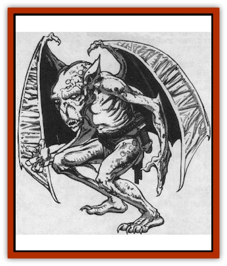

# Berbalang

| Statistic | **Berbalang** |
| --- | --- |
| **Activity Cycle:** | Nights of the full moon |
| **Alignment:** | Chaotic evil |
| **Armor Class:** | 6 |
| **Climate/Terrain:** | Any land or the Astral plane |
| **Damage/Attack:** | 1-4/1-4/1-6 |
| **Diet:** | Special |
| **Frequency:** | Very rare |
| **Hit Dice:** | 4+1 |
| **Intelligence:** | Very (11-12) |
| **Magic Resistance:** | Nil |
| **Morale:** | Average (10) |
| **Movement:** | 6, Fl 24 (B) |
| **No. Appearing:** | 1 |
| **No. of Attacks:** | 3 |
| **Organization:** | Solitary |
| **Size:** | M (4-7' tall) |
| **Special Attacks:** | Nil |
| **Special Defenses:** | Nil |
| **THAC0:** | 17 |
| **Treasure:** | D |
| **XP Value:** | 65 |

The berbalang is a dark and evil creature that spends most of its life in a comatose state while its spirit wanders the Astral plane. When it does return to our world, it does so only to feed on the flesh of humans who dwell near its hiding place.

A typical berbalang is a gaunt biped with black, leathery skin. Its wide, glowing eyes, which provide the berbalang with infra-vision out to 120 yards, are watery and white in color. Two broad, bat-like wings sprout from the creature's back and enable it to fly with great speed and agility.

**Combat:** When a berbalang or its projection (see below) is encountered and forced into combat, it makes the most of its ability to fly. When it strikes, it rips at opponents with its keen claws and attempts to bite them with its needle-like teeth.

If a berbalang's projection is hit, it immediately takes flight and attempts to flee from the battle. The projection is immune to charm, sleep, and hold spells.

**Habitat/Society:** The berbalang is a most unusual creature. The vast majority of its life is spent in a death-like trance that permits the monster's spirit to wander at will throughout the Astral plane. Here the berbalang stalks those creatures that are weaker than itself and engages in its complex courtship and mating rituals.

If the body is discovered or disturbed in any way, the berbalang is aware of this and returns to defend itself. Because of the great distance which the berbalang's spirit may have to cross to reach its material form, however, this can take quite a long time (1d100 rounds). If the body is destroyed before the berbalang can defend itself, the astral spirit is also slain. For this reason, the berbalang does its best to seclude and protect the resting place of its physical form.

Once per month, on the three days of the full moon, the berbalang returns to the Prime Material plane to feed. At this time, the creature alters its trance slightly and manifests an exact duplicate of itself, known as a projection. Once the projection is formed, it is sent forth in search of the berbalang's only food - a freshly slain human being.

The projection, which is controlled directly by the berbalang, can travel up to three miles from its body. If the projection must fight, it does so just as the berbalang itself would (see above).

If the projection is hit or suffers any injury during its quest for food, it takes flight at once and flees. As quickly as possible, the berbalang guides its projection back to its resting place. If the projection is destroyed, there is a 75% chance that the shock to the berbalang's system will prove to be fatal for it as well. If the projection is only injured, but not slain, the berbalang cannot manifest another for a number of days equal to the number of hit points it lost.

When the projection returns to its master, it is dissipated. Adventurers who have followed the projection to finish it off may well be shocked to find themselves confronted by a healthy berbalang.

If the berbalang is not discovered and destroyed, it will eventually seek to avenge itself upon those who interfered with its feeding. Although there may be a lull while the body of the berbalang recovers from the shock of the attack on its projection and is able to send forth another, retribution is a certainty.

If the projection was forced back to the body or destroyed before it could find prey to feed upon, the berbalang will send forth another, as soon as it is able, to satisfy its hunger (regardless of the phase of the moon) before seeking its revenge.

**Ecology:** When the projection kills a human, it picks up the corpse and begins to return with it to its lair. As it does so, the berbalang itself awakens from its trance and the projection begins to feed on the body. By the time the projection has reached the berbalang's hiding place, the body has been all but stripped of flesh and the berbalang's hunger has been satisfied.

In order to avoid drawing attention to itself, the berbalang usually moves its lair every three or four months. At this time, it moves only during the night and avoids any confrontation if it can. Thus actual contact with the berbalang itself, as opposed to its projection, is minimal.

There is no record of anyone discovering how the berbalang is able to derive sustenance when only its projection feeds on the slain humans it hunts. Likewise, the exact process by which the berbalang is able to mate and reproduce when its only contact with others of its species takes place in a spiritual form on the Astral plane remains a mystery.

---
## Discovery & Documentation

**Source Publication:** MC3 Volume III Forgotten Realms Appendix I (1989)
**Campaign Setting:** Forgotten Realms
**Author(s):** William Connors, David Martin, Rick Swan, Gary Thomas

### Other Creatures Found in This Source Book
   * [[Asperii|Asperii]]
   * [[Belabra|Belabra]]
   * [[Bhaergala|Bhaergala]]
   * [[Bichir|Bichir]]
   * [[Bunyip|Bunyip]]
   * [[Burbur|Burbur]]
   * [[Cloaker|Cloaker]]
   * [[Crawling_Claw|Crawling Claw]]
   * [[Darkenbeast|Darkenbeast]]
   * [[Dracolich|Dracolich]]
   * [[Dragon_Oriental_Carp_Yu_Lung|Dragon, Oriental, Carp (Yu Lung)]]
   * [[Dragon_Oriental_Celestial_T'ien_Lung|Dragon, Oriental, Celestial (T'ien Lung)]]
   * [[Dragon_Oriental_Coiled_Pan_Lung|Dragon, Oriental, Coiled (Pan Lung)]]
   * [[Dragon_Oriental_Earth_Li_Lung|Dragon, Oriental, Earth (Li Lung)]]
   * [[Dragon_Oriental_Lung_General_Information|Dragon, Oriental (Lung), General Information]]
   * [[Dragon_Oriental_River_Chiang_Lung|Dragon, Oriental, River (Chiang Lung)]]
   * [[Dragon_Oriental_Sea_Lung_Wang|Dragon, Oriental, Sea (Lung Wang)]]
   * [[Dragon_Oriental_Spirit_Shen_Lung|Dragon, Oriental, Spirit (Shen Lung)]]
   * [[Dragon_Oriental_Typhoon_Tun_Mi_Lung|Dragon, Oriental, Typhoon (Tun Mi Lung)]]
   * [[Dragonet_Faerie_Dragon|Dragonet, Faerie Dragon]]
   * [[Firenewt|Firenewt]]
   * [[Firestar|Firestar]]
   * [[Fish_Ascallion|Fish, Ascallion]]
   * [[Fish_Vurgens|Fish, Vurgens]]
   * [[Meazel|Meazel]]
   * [[Medusa_Maedar|Medusa, Maedar]]
   * [[Mist_Crimson_Death|Mist, Crimson Death]]
   * [[Revenant|Revenant]]
   * [[Rhaumbusun|Rhaumbusun]]
   * [[Strider_Giant|Strider, Giant]]
   * [[Thessalmonster|Thessalmonster]]
   * [[Web_Living|Web, Living]]
   * [[Wemic|Wemic]]
