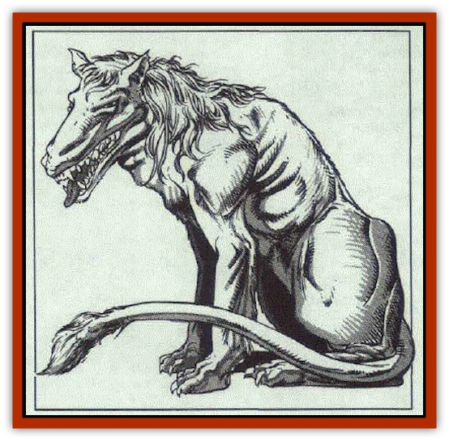

# Bhaergala

| Statistic | **Bhaergala** |
| --- | --- |
| **Activity Cycle:** | Day |
| **Alignment:** | Neutral |
| **Armor Class:** | 6 |
| **Climate/Terrain:** | Temperate or tropical jungles and forests |
| **Damage/Attack:** | 1-6/1-6/1-8 |
| **Diet:** | Carnivore |
| **Frequency:** | Rare |
| **Hit Dice:** | 4+4 |
| **Intelligence:** | Average (8-10) |
| **Magic Resistance:** | Nil |
| **Morale:** | Elite (13-14) |
| **Movement:** | 15 |
| **No. Appearing:** | 1 |
| **No. of Attacks:** | 2 claws and 1 bite |
| **Organization:** | Solitary |
| **Size:** | L (9' long) |
| **Special Attacks:** | Pounce |
| **Special Defenses:** | Poison resistance, spell turning |
| **THAC0:** | 15 |
| **Treasure:** | Nil |
| **XP Value:** | 650 |

The bhaergala is a large predator that roams temperate and tropical jungles or woodlands in search of prey. It is greatly feared by travelers because of its fondness for human, [[Elf|elven]], and [[Satyr|satyr]] prey.

A bhaergala looks something like a cross between a [[Wolf|wolf]] and a [[Cat_Great|lion]], although it is clearly not related to either creature.The fur of a bhaergala gives off a faint but unmistakable odor, which has been described as smelling like fresh bread or biscuits.

The bhaergala can mimic the speech and songs of men and elves with great skill. When hunting, it often uses this power to lure them into an ambush. Most bhaergalas can speak the common tongue of men.

**Combat:** A bhaergala usually attacks unsuspecting victims by pouncing on them from a great height. The superior agility of the bhaergala enables it to drop from as high as 60 feet without sustaining damage. After that, it suffers 1d6 points of damage (up to a maximum of 20d6) for every ten feet it falls.

When it pounces on a victim, the bhaergala can strike only with its claws during the first round. If these hit, however, they inflict their maximum damage.

In normal combat, the creature lashes out with its two front claws and tears at its foes with its powerful jaws. The bhaergala is fearsome in combat and often rips great pieces of flesh from an enemy, which are then dropped for later consumption. The bhaergala has been known to keep ripping apart a body that has long since ceased fighting back.

The great constitution of a bhaergala enables it to regenerate 2 points of damage per day and gives it a +3 bonus to all saving throws vs. poison. Further, the creature has a 99% chance to survive a severe system shock.

The bhaergala has a limited ability to protect itself from magical attacks as well. Up to four times per day, the creature can turn a spell that has been directed against it. In these instances, the power acts just as would a ring of spell turning. It is important to note, however, that this is not an innate ability; it requires the bhaergala to focus its attention and prevents it from taking any other action that round.

**Habitat/Society:** The bhaergala is a solitary creature that stalks its prey from the dense underbrush common to jungles and sylvan woodlands. It normally moves in on its prey from downwind so that its distinctive scent does not give it away before it can strike.

When a bhaergala is encountered in the wilds, there is a chance that it will not attack. The bhaergala are known for their great love of song and music and can often be lulled to sleep by a talented singer or musician. The chance that a bhaergala can be sedated in this manner depends upon its own belief that it is safe and free from any threat of attack. The base chance to sing a bhaergala to sleep is 25%. This is increased by 5% if the singer is alone, by 5% per point of the singer's Charisma over 16, and by 15% if the singer is a professional or talented performer. If the bhaergala feels threatened, has been recently injured, attacked, or is hungry and on the hunt, then any attempt at calming it is doomed to fail.

If lulled to sleep, the bhaergala naps for only 1d10 rounds, as they never sleep for longer periods of time. When it awakes, it will likely give chase to the singer if it finds that he has gone.

**Ecology:** Bhaergala seek out others of their kind only to mate. When they do find a partner, they mate only in sandy areas (river banks, sandbars, and so forth). Six months later, the female bhaergala gives birth to a litter of 2d4 cubs.

The parents remain together for just over a year to raise their progeny. As soon as the cubs make their first kill, they are turned out from their parents' den and must go their own way. At this point, they have all the powers and abilities of adult bhaergalas, but have only 2+2 Hit Dice. Further, their attacks cause only half the usual damage. When the last of the cubs is gone, the parents also part company, never to meet again.

An adult bhaergala usually sleeps in the boughs of tall trees, returning to its lair only rarely. This well-hidden den is often in a caves, ruin, or similar place of desolation and serves as a storage area for whatever items the bhaergala has collected over the years. As a rule, there is little if any true treasure in the lair of a bhaergala. It often collects musical instruments and noise-makers, which are usually broken, from the bodies of its victims. From time to time, an unusual or even magical instrument has turned up in the lair of a bhaergala.

---
## Discovery & Documentation

**Source Publication:** MC3 Volume III Forgotten Realms Appendix I (1989)
**Campaign Setting:** Forgotten Realms
**Author(s):** William Connors, David Martin, Rick Swan, Gary Thomas

### Other Creatures Found in This Source Book
   * [[Asperii|Asperii]]
   * [[Belabra|Belabra]]
   * [[Berbalang|Berbalang]]
   * [[Bichir|Bichir]]
   * [[Bunyip|Bunyip]]
   * [[Burbur|Burbur]]
   * [[Cloaker|Cloaker]]
   * [[Crawling_Claw|Crawling Claw]]
   * [[Darkenbeast|Darkenbeast]]
   * [[Dracolich|Dracolich]]
   * [[Dragon_Oriental_Carp_Yu_Lung|Dragon, Oriental, Carp (Yu Lung)]]
   * [[Dragon_Oriental_Celestial_T'ien_Lung|Dragon, Oriental, Celestial (T'ien Lung)]]
   * [[Dragon_Oriental_Coiled_Pan_Lung|Dragon, Oriental, Coiled (Pan Lung)]]
   * [[Dragon_Oriental_Earth_Li_Lung|Dragon, Oriental, Earth (Li Lung)]]
   * [[Dragon_Oriental_Lung_General_Information|Dragon, Oriental (Lung), General Information]]
   * [[Dragon_Oriental_River_Chiang_Lung|Dragon, Oriental, River (Chiang Lung)]]
   * [[Dragon_Oriental_Sea_Lung_Wang|Dragon, Oriental, Sea (Lung Wang)]]
   * [[Dragon_Oriental_Spirit_Shen_Lung|Dragon, Oriental, Spirit (Shen Lung)]]
   * [[Dragon_Oriental_Typhoon_Tun_Mi_Lung|Dragon, Oriental, Typhoon (Tun Mi Lung)]]
   * [[Dragonet_Faerie_Dragon|Dragonet, Faerie Dragon]]
   * [[Firenewt|Firenewt]]
   * [[Firestar|Firestar]]
   * [[Fish_Ascallion|Fish, Ascallion]]
   * [[Fish_Vurgens|Fish, Vurgens]]
   * [[Meazel|Meazel]]
   * [[Medusa_Maedar|Medusa, Maedar]]
   * [[Mist_Crimson_Death|Mist, Crimson Death]]
   * [[Revenant|Revenant]]
   * [[Rhaumbusun|Rhaumbusun]]
   * [[Strider_Giant|Strider, Giant]]
   * [[Thessalmonster|Thessalmonster]]
   * [[Web_Living|Web, Living]]
   * [[Wemic|Wemic]]
