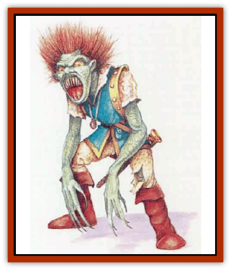

# Bhut

| Statistic | **Bhut** |
| --- | --- |
| **Activity Cycle:** | Night |
| **Alignment:** | Lawful evil |
| **Armor Class:** | 4 |
| **Climate/Terrain:** | Any settled |
| **Damage/Attack:** | 1d4 (claw)/1d4 (claw)/1d6 (bite) |
| **Diet:** | Carnivore |
| **Frequency:** | Very rare |
| **Hit Dice:** | 7+2 |
| **Intelligence:** | Very (11-12) |
| **Magic Resistance:** | Nil |
| **Morale:** | Elite (13) |
| **Movement:** | 12 |
| **No. Appearing:** | 2d4 |
| **No. of Attacks:** | 3 |
| **Organization:** | Clan |
| **Size:** | M (6' tall) |
| **Special Attacks:** | Numbing bite |
| **Special Defenses:** | See below |
| **THAC0:** | 13 |
| **Treasure:** | M (D) |
| **XP Value:** | 1,400 |

During the day, bhuts (bah-HOOTS) look like normal humans. At night, their skin grows scaly, their hair becomes wild, their fingers become claws, and their teeth turn into fangs! Then they set out to feast on humans and demihumans. Would-be scholars sometimes classify bhuts as undead or [[Lycanthrope_General_Information|lycanthropes]]. However, bhuts cannot be turned, and they cannot pass on their shape-changing condition as werebeasts do.

Bhuts speak Common and their own language.

**Combat:** Bhuts are extremely cunning and often use deception and trickery to obtain their meals. They make no noise when moving. Further, they radiate a powerful aura that prevents *detect evil* spells from working on them. *Know alignment* is distorted by the aura and indicates a lawful good alignment. Bhuts make saving throws as if they were 10th-level fighters.

A bhut attacks with its claws and bite. The wound inflicted by its bite is freezing to the touch. Besides suffering normal damage, any creature bitten must make a saving throw vs. paralysis or be numbed. Numbed creatures always lose initiative, and their attack rolls have a -2 penalty. The numbness lasts 1d4 rounds.

Though bhuts cannot be turned, they do enjoy all the immunities of undead creatures (*sleep*, *charm*, *hold*, poison, and gases). They cannot be harmed by nonmagical weapons, but a single hit from a *blessed* weapon kills one instantly.

**Habitat/Society:** Bhuts live near human settlements, preying on the inhabitants. Often the creatures work together. Normally they assume some innocent cover (monks, traveling gypsies, a family on the edge of town, etc.) to lessen suspicion. They interact with human society - at least enough to appear <q>normal</q> but only during the daylight hours.

Clans are the social organization of bhuts. A clan may have an innocuous cover for human society, while in fact it is the bhuts' cooperative means of getting food.

Each clan is ruled by an elder, male or female. The elder makes important decisions for the group, including how to divide food and treasure. Fear and loyalty keep others in line. The elder is usually the patriarch or matriarch; all other clan members are related to the elder by blood or marriage.

The elder also decides when the clan should move to a new place. Timing is important. After all, only so many disappearances can occur before someone investigates. The Bhuts' anti-detection aura provides a modicum of protection against magical inquiries, but sooner or later circumstantial evidence will place the bhut clan at risk. The elder also determines the identity the clan will assume in its next home.

Very rarely, bhut spellcasters are encountered. These are nearly always of the wizard or shaman/witch doctor variety. The highest levels of ability known for these special bhuts are 9th-level wizard and 7th-level shaman/witch doctor.

An individual bhut away from its lair has a 40% chance of carrying Type Q treasure (1d4 gems), in addition to the treasure noted.

**Ecology:** A bhut clan likes to prey upon victims who are alone and vulnerahle - especially a lone traveler or a wandering drunk. Such deaths are the least likely to arouse suspicion among the locals. Rarely do people inquire about the fate of a strange traveler (who may, after all, have moved on), and it is often assumed that the town drunk has found a sad and lonely demise (perhaps dying in a ditch somewhere).

Bhuts can reproduce within the clan. However, female can breed with human males (usually with the aid of deception). The offspring are always bhuts.

Humans are the staple of bhuts' diets. Perhaps for this reason, they consider dernihumans, whose societies are harder to infiltrate, especially tasty.

Legend says that bhuts came into being long ago, when an angry Immortal cursed a town that had defiled her temple. The town was destroyed, and the scattered blasphemers became bhuts. Their chilling bite is an eternal reminder of the Immorttal�s cold rage. Such a supernatural origin would explain the bhuts' magical powers.

---
## Discovery & Documentation

**Source Publication:** Mystara Appendix (1994)
**Campaign Setting:** Mystara
**Author(s):** John Nephew, Teeuwynn Woodruff, John Terra, Skip Williams

### Other Creatures Found in This Source Book
   * [[Actaeon|Actaeon]]
   * [[Agarat|Agarat]]
   * [[Ash_Crawler|Ash Crawler]]
   * [[Baldandar|Baldandar]]
   * [[Bargda|Bargda]]
   * [[Bird_Mystara|Bird (Mystara)]]
   * [[Blackball|Blackball]]
   * [[Choker|Choker]]
   * [[Coltpixie|Coltpixie]]
   * [[Crone_of_Chaos|Crone of Chaos]]
   * [[Darkhood|Darkhood]]
   * [[Darkwing|Darkwing]]
   * [[Decapus|Decapus]]
   * [[Deep_Glaurant|Deep Glaurant]]
   * [[Diabolus|Diabolus]]
   * [[Dimensional_Warper|Dimensional Warper]]
   * [[Dragon_Mystara_Crystalline|Dragon (Mystara), Crystalline]]
   * [[Dragon_Mystara_Jade|Dragon (Mystara), Jade]]
   * [[Dragon_Mystara_Onyx|Dragon (Mystara), Onyx]]
   * [[Dragon_Mystara_Ruby|Dragon (Mystara), Ruby]]
   * [[Drake_Mystara|Drake (Mystara)]]
   * [[Dragonfly|Dragonfly]]
   * [[Dusanu|Dusanu]]
   * [[Elemental_of_Chaos_Air_Earth|Elemental of Chaos, Air/Earth]]
   * [[Elemental_of_Chaos_Fire_Water|Elemental of Chaos, Fire/Water]]
   * [[Elemental_of_Law_Air_Earth|Elemental of Law, Air/Earth]]
   * [[Elemental_of_Law_Fire_Water|Elemental of Law, Fire/Water]]
   * [[Familiar_Mystara|Familiar (Mystara)]]
   * [[Frost_Salamander|Frost Salamander]]
   * [[Fundamental_Air_Earth|Fundamental, Air/Earth]]
   * [[Fundamental_Fire_Water|Fundamental, Fire/Water]]
   * [[Gargantua_Mystara|Gargantua (Mystara)]]
   * [[Geonid|Geonid]]
   * [[Ghostly_Horde|Ghostly Horde]]
   * [[Giant_Athach|Giant, Athach]]
   * [[Giant_Hephaeston|Giant, Hephaeston]]
   * [[Golem_Drolem|Golem, Drolem]]
   * [[Golem_Mystara_I|Golem (Mystara) I]]
   * [[Golem_Mystara_II|Golem (Mystara) II]]
   * [[Golem_Mystara_III|Golem (Mystara) III]]
   * [[Gray_Philosopher|Gray Philosopher]]
   * [[Guardian_Warrior|Guardian Warrior]]
   * [[Gyerian|Gyerian]]
   * [[Herex|Herex]]
   * [[Hivebrood|Hivebrood]]
   * [[Horde|Horde]]
   * [[Hsiao|Hsiao]]
   * [[Huptzeen|Huptzeen]]
   * [[Hutaakan|Hutaakan]]
   * [[Imp_Mystara|Imp (Mystara)]]
   * [[Jellyfish_Giant_Mystara|Jellyfish, Giant (Mystara)]]
   * [[Kna|Kna]]
   * [[Kopru|Kopru]]
   * [[Lizard_Mystara|Lizard (Mystara)]]
   * [[Lizard-kin_Mystara|Lizard-kin (Mystara)]]
   * [[Lupin|Lupin]]
   * [[Lycanthrope_Werejaguar_Mystara|Lycanthrope, Werejaguar (Mystara)]]
   * [[Lycanthrope_Wereswine|Lycanthrope, Wereswine]]
   * [[Magen|Magen]]
   * [[Manikin|Manikin]]
   * [[Mek|Mek]]
   * [[Mujina|Mujina]]
   * [[Nagpa|Nagpa]]
   * [[Neh-thalggu|Neh-thalggu]]
   * [[Nightshade_Mystara|Nightshade (Mystara)]]
   * [[Nuckalavee|Nuckalavee]]
   * [[Pegataur|Pegataur]]
   * [[Phanaton|Phanaton]]
   * [[Plant_Dangerous_Mystara|Plant, Dangerous (Mystara)]]
   * [[Plasm|Plasm]]
   * [[Rakasta|Rakasta]]
   * [[Rock_Man|Rock Man]]
   * [[Sabreclaw|Sabreclaw]]
   * [[Sacrol|Sacrol]]
   * [[Scamille|Scamille]]
   * [[Shapeshifter|Shapeshifter]]
   * [[Shargugh|Shargugh]]
   * [[Shark-kin|Shark-kin]]
   * [[Sollux|Sollux]]
   * [[Spectral_Death|Spectral Death]]
   * [[Spectral_Hound|Spectral Hound]]
   * [[Spider-kin|Spider-kin]]
   * [[Spirit_Mystara|Spirit (Mystara)]]
   * [[Statue_Living|Statue, Living]]
   * [[Surtaki|Surtaki]]
   * [[Tabi|Tabi]]
   * [[Thoul|Thoul]]
   * [[Thunderhead|Thunderhead]]
   * [[Tiger_Ebon|Tiger, Ebon]]
   * [[Topi|Topi]]
   * [[Tortle|Tortle]]
   * [[Vampire_Velya|Vampire, Velya]]
   * [[White_Fang|White Fang]]
   * [[Worm_Mystara|Worm (Mystara)]]
   * [[Wyrd|Wyrd]]
   * [[Yowler|Yowler]]
   * [[Zombie_Lightning|Zombie, Lightning]]
