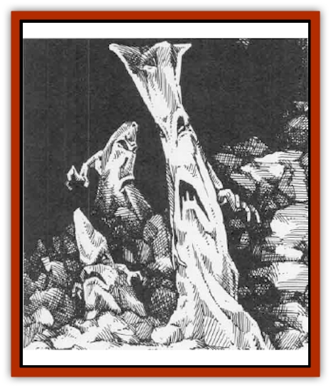

# Bi-nou

| Statistic | **Bi-Nou** | **Rocklord** | **Rockworm** |
| --- | --- | --- | --- |
| **Activity Cycle:** | Any | Any | Any |
| **Alignment:** | Chaotic evil | Neutral | Chaotic evil |
| **Armor Class:** | 1 | -4 | -2 |
| **Climate/Terrain:** | Subterranean | Subterranean | Subterranean |
| **Damage/Attack:** | 1d8/1d8 | 3d6/3d6 | 1d12/1d12 |
| **Diet:** | Carnivore | Carnivore | Carnivore |
| **Frequency:** | Rare | Very rare | Very rare |
| **Hit Dice:** | 5+5 | 10 | 7 |
| **Intelligence:** | Very (11-12) | Semi- (2-4) | Low (5-7) |
| **Magic Resistance:** | 20% | 30% | 20% |
| **Morale:** | Elite (13-14) | Champion (15) | Champion (15) |
| **Movement:** | 6 | 6 | 9 |
| **No. Appearing:** | 1 or 2-8 | 1 | 1 or 2 |
| **No. of Attacks:** | 2 | 2 | 2 |
| **Organization:** | Solitary or clan | Solitary | Solitary |
| **Size:** | M (5-7' tall) | L (8-15' long) | M (5-7' long) |
| **Special Attacks:** | Spells, squeeze | Nil | Nil |
| **Special Defenses:** | Immune to blinding, mind- / affecting spells, and psionics | Nil | Nil |
| **THAC0:** | 15 | 11 | 13 |
| **Treasure:** | Special (eggs) | Special (hide) | Special (eggs) |
| **XP Value:** | 975 | 5,000 | 2,000 |

Appearing as craggy columns with two short, jagged arms ending in spiky claws, bi-nou look like stalagmites. Their shapes render them practically invisible in a cavern filled with natural rocky outcroppings, stalactites, and stalagmites.

Common bi-nou range from five to seven feet tall and weigh from 600 to 1,000 pounds. Their rocky skin varies in color from off-white to dark gray, and they prefer to live in underground chambers where the natural rock color mimicks their own.

The bi-nou communicate telepathically in their own language and in [[Elf_Drow|drow]], as they possess neither mouths nor vocal cords.

**Combat:** Bi-nou are 70% likely to remain unnoticed when encountered. They do not see or hear by conventional means, and are effectively deaf and blind. However, they sense heat and vibrations, having a form of batlike sonar. Their unique senses give them a clear mental image of the size and shape of opponents within 80 feet, and they can distinguish between living and non-living matter. They ignore any penalties related to blinding effects (e.g., *invisibility*, *darkness*, *light*, etc.)

Bi-nou do not work together to attack their foes. They act independently, killing all living creatures entering their caverns. Despite their chaotic natures, some bi-nou have learned to hold their attacks until creatures move within 40 feet; this gives the monsters time to observe their foes.

Bi-nou often attack first with their innate spell abilities. Each of the following spells is usable once a day as if cast by a 10th-level wizard: *slow*, *dig*, *stone shape*, and *wall of stone*.

When foes are within striking range of a bi-nou, it strikes with two jagged limbs. If both limbs strike the same creature, the bi-nou snares the opponent and squeezes it against its rocky body. The creature suffers an additional 1d8 points of damage per round until it frees itself with a successful bend bars/lift gates roll, the bi-nou is killed, or it suffocates.

Although bi-nou have natural magic resistance, certain spells can be deadly to them. *Passwall* stuns them for 1d4 rounds instead of having its normal effect, and *rock to mud* slays them instantly. *Stone shape* operates as a heal spell, restoring all but 1d4 of a bi-nou's hit points.

A bi-nou's mind is different enough from other creatures' to make it immune to mind-affecting spells and psionic attacks.

**Habitat/Society:** Bi-nou hate all warm-blooded life - especially humans and humanoids, who hunt and steal their gem-like eggs. Bi-nou do not hesitate to attack groups of humanoids, even if the odds are against them. Only sick bi-nou or the very young fail to attack trespassers in their domain. Sages believe that when multiple bi-nou are present, they make contests of the killings, though all slain creatures are consumed as food. If the creatures were tampering with bi-nou eggs, there seems to be even a bit of malicious enjoyment in the kill.

Bi-nou are found either individually or in small family groups. Individuals tend to be rogue young or outcast adults. Groups are ruled by the largest bi-nou, and the leader's clan follows orders without question (save those pertaining to combat). The leader selects the cavern lair, determines which of his charges warm the eggs, and metes out punishment if eggs are harmed or stolen. Any bi-nou clan will have 2-8 eggs, each valued at 100-1,000 gp. The eggs are hard and faceted like gems, and are prized by dwarves, who have come to recognize their value and rarity.

Bi-nou prefer damp, drafty caverns, where it is easier to sense their prey. Such a cavern is likely to hold remnants of weapons and armor, as the bi-nou consume humans and other beings and animals by absorbing the fleshy parts. The rock creatures don't value these discarded <q>unlife things</q>, though they have learned that other living being - especially humans and demihumans - are attracted to the objects. Bi-nou have been known to use their stone shape ability to put the metallic leftovers on rocky pedestals to attract the attention of passing adventurers.

Bi-nou also have been known to ally with drow - when the number of dark elves is sufficient to pose a serious threat to their clan. The bi-nou act as sentries for drow communities and outposts, attacking and devouring trespassers, including drow who do not belong to the community they guard. A few bi-nou even act as guards for the dark elves, moving through their underground caverns and battling creatures that threaten the drow.

**Ecology:** Bi-nou are carnivorous, savoring the taste of animal, human, and demihuman flesh. They devour their victims by moving their forms over the bodies and absorbing all flesh. A bi-nou's treasure consists of unfortunate adventurers' gear and the rock creatures' eggs. Most equipment is worthless, damaged when the rock creatures absorb their prey. However, magical equipment tends to stay in reasonable shape. Bi-nou corpses are used by certain dwarves builders, especially duergar, as solid stone building materials.

Bi-nou are hunted by [[Dwarf|dwarves]], particularly [[Dwarf_Duergar|duergar]], who have discovered the rock creatures' eggs are valuable and that armor and weapons can be found in some lairs. The eggs are prevented from hatching by keeping them cold for many hours, killing the young inside. This ensures the eggs retain their gemlike appearance and value. Bi-nou eggs vary in size and color, the younger eggs being smaller but of brighter hue, while the older eggs are larger but lose much of their sheen.

No one knows exactly what the bi-nou are or how they came to be. Most sages believe bi-nou are living rocks created by some dark experiments of the drow. Some swear the rock creatures were spawned by the mage Halaster to act as guardians; they say that drow, while malign, are not known to create living things out of such crude matter.

**Rockworm**

  Closely related to bi-nou, rockworms appear as stone snakes with arms. They move along the ground like reptiles. Rockworms are not capable of upright stance. They travel like ungainly snakes along cavern floors, using their jagged arms to help propel themselves. Sages speculate that rockworms are the predecessors of standard bi-nou, magically-created beings with which their maker or makers were not satisfied. (This is not true, however. Rockworms and bi-nou were created simultaneously from different experiments.)

Rockworms are malicious, seeming to hate all creatures that walk rather than crawl. Their attacking small groups of standard bi-nou to vie for cavern territory or to claim food killed by their upright kin is not unheard of. Like bi-nou, the rockworms particularly hunt out humans and demihumans as thieves of their eggs.

Unlike the bi-nou, rockworms do not attempt to hide in their surroundings - they lumber to the attack as soon as they see a potential meal. Rockworms do not fear alerting their prey to their presence. The segmented creatures know their thick skin is impervious to most attacks and believe they can eventually overtake most quarries.

Like standard bi-nou, rockworms lay valuable eggs. However, unlike their kin, they warm their own eggs, leaving them only for short times to catch nearby food. In this respect they act as parents, while bi-nou in a clan are assigned to egg-warming duty and never know which young are their own. Dwarves are more careful when hunting rockworms. Although the stone snakes are less intelligent, they can be more deadly.

**Rocklord**

  More massive than rockworms, the <q>lords of stone</q>, as many call them, are deadly foes because of the massive amount of damage their stony appendages can deliver. Appearing as a stalagmite with larger limbs than a common bi-nou, these creatures can move upright or slither across the floor. Their thick hides make them very difficult to injure.

Some sages believe rocklords are simply very old rockworms. They do not lay eggs and they do not associate with others of their kind. However, unlike rockworms, the lords do not battle over possession of a cavern.

The hides of these great, craggy creatures are especially prized by underground races who mount war bands to destroy the beasts. The war bands are careful how they attack the lords, as they do not want to overly damage the hide. These are used to construct special buildings meant to keep others out. These rock lord hides are stronger and can withstand more weight and damage than those of rockworms or common bi-nou.

It is rumored that certain proficient dwarven weaponsmiths can create special maces from the skins of rocklords. The smiths claim these weapons are naturally +1 to hit and +3 to damage because of the density of the weapon and the magical properties of the rocklord. However, it takes three times as long to craft one of these weapons as a normal weapon.

---
## Discovery & Documentation

**Source Publication:** Monstrous Compendium, 1995 Annual, Volume 2 (1995)
**Campaign Setting:** Advanced Dungeons & Dragons 2nd Edition
**Author(s):** Jon Pickens

### Other Creatures Found in This Source Book
   * [[Aboleth_Savant|Aboleth, Savant]]
   * [[Addazahr|Addazahr]]
   * [[Amiq_Rasol|Amiq Rasol]]
   * [[Arch-Shadow|Arch-Shadow]]
   * [[Automaton_Scaladar|Automaton, Scaladar]]
   * [[Automaton_Trobriand's|Automaton, Trobriand's]]
   * [[Bat_Sporebat|Bat, Sporebat]]
   * [[Beetle_Dragon|Beetle, Dragon]]
   * [[Boggle|Boggle]]
   * [[Brownie_Dobie|Brownie, Dobie]]
   * [[Brownie_Quickling|Brownie, Quickling]]
   * [[Cat_Crypt|Cat, Crypt]]
   * [[Cat_Great_Cath_Shee|Cat, Great, Cath Shee]]
   * [[Centaur-kin_Dorvesh|Centaur-kin, Dorvesh]]
   * [[Centaur-kin_Gnoat|Centaur-kin, Gnoat]]
   * [[Centaur-kin_Ha'pony|Centaur-kin, Ha'pony]]
   * [[Centaur-kin_Zebranaur|Centaur-kin, Zebranaur]]
   * [[Chronolily|Chronolily]]
   * [[Curst|Curst]]
   * [[Darktentacles|Darktentacles]]
   * [[Dinosaur_Aquatic|Dinosaur, Aquatic]]
   * [[Dinosaur_II|Dinosaur II]]
   * [[Dinosaur_III|Dinosaur III]]
   * [[Doppelganger_Greater|Doppelganger, Greater]]
   * [[Dragon_Brine|Dragon, Brine]]
   * [[Dragon_Half-|Dragon, Half-]]
   * [[Dragon-kin_Sea_Wyrm|Dragon-kin, Sea Wyrm]]
   * [[Dwarf_Wild|Dwarf, Wild]]
   * [[Ekimmu|Ekimmu]]
   * [[Elemental_Nature|Elemental, Nature]]
   * [[Elf_Winged|Elf, Winged]]
   * [[Fish_Great_Glacier|Fish (Great Glacier)]]
   * [[Fish_Subterranean|Fish, Subterranean]]
   * [[Fish_Toril|Fish (Toril)]]
   * [[Flareater|Flareater]]
   * [[Flumph|Flumph]]
   * [[Froghemoth|Froghemoth]]
   * [[Ghost_Casurua|Ghost, Casurua]]
   * [[Ghost_Ker|Ghost, Ker]]
   * [[Ghul|Ghul]]
   * [[Ghul-Kin|Ghul-Kin]]
   * [[Giant_Half-giant|Giant, Half-giant]]
   * [[Golem_Burning_Man|Golem, Burning Man]]
   * [[Golem_Phantom_Flyer|Golem, Phantom Flyer]]
   * [[Gulguthhydra|Gulguthhydra]]
   * [[Hakeashar|Hakeashar]]
   * [[Horse_Moon-|Horse, Moon-]]
   * [[Human_Dragonslayer|Human, Dragonslayer]]
   * [[Human_Vistana|Human, Vistana]]
   * [[Jellyfish_Giant|Jellyfish, Giant]]
   * [[Kalin|Kalin]]
   * [[Kholiathra|Kholiathra]]
   * [[Laerti|Laerti]]
   * [[Leucrotta_Greater|Leucrotta, Greater]]
   * [[Lich_Suel|Lich, Suel]]
   * [[Lurker_Shadow|Lurker, Shadow]]
   * [[Lycanthrope_Werepanther|Lycanthrope, Werepanther]]
   * [[Lycanthrope_Wereshark|Lycanthrope, Wereshark]]
   * [[Mammal_Herd_II|Mammal, Herd II]]
   * [[Marl|Marl]]
   * [[Meenlock|Meenlock]]
   * [[Mimic_Greater|Mimic, Greater]]
   * [[Mold_II|Mold II]]
   * [[Mummy_Creature|Mummy, Creature]]
   * [[Nyth|Nyth]]
   * [[Ooze_Slime_Jelly_Ghaunadan|Ooze/Slime/Jelly, Ghaunadan]]
   * [[Palimpsest|Palimpsest]]
   * [[Peltast|Peltast]]
   * [[Plant_Dangerous_II|Plant, Dangerous II]]
   * [[Pleistocene_Animal|Pleistocene Animal]]
   * [[Pudding_Subterranean|Pudding, Subterranean]]
   * [[Raggamoffyn|Raggamoffyn]]
   * [[Snake_Serpent|Snake, Serpent]]
   * [[Snake_Serpent_Vine|Snake, Serpent Vine]]
   * [[Sphinx_Draco-|Sphinx, Draco-]]
   * [[Sprite_Seelie_Faerie|Sprite, Seelie Faerie]]
   * [[Sprite_Unseelie_Faerie|Sprite, Unseelie Faerie]]
   * [[Squealer|Squealer]]
   * [[Turtle_Giant|Turtle, Giant]]
   * [[Umpleby|Umpleby]]
   * [[Vizier's_Turban|Vizier's Turban]]
   * [[Wall_Walker|Wall Walker]]
   * [[Webbird|Webbird]]
   * [[Yak-Man|Yak-Man]]
   * [[Zorbo|Zorbo]]
