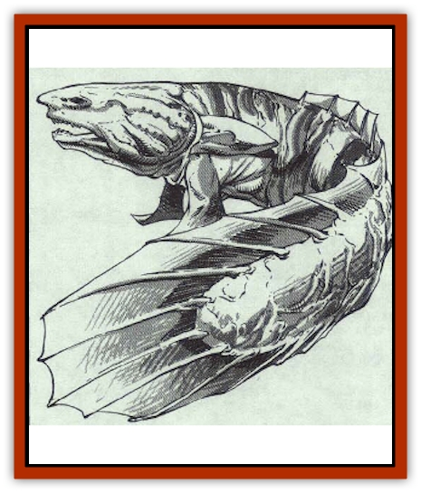

# Bichir

| Statistic | **Bichir** |
| --- | --- |
| **Activity Cycle:** | Day |
| **Alignment:** | Lawful good |
| **Armor Class:** | 6 |
| **Climate/Terrain:** | Any swamp |
| **Damage/Attack:** | 3-12 |
| **Diet:** | Carnivore |
| **Frequency:** | Rare |
| **Hit Dice:** | 5 to 7 |
| **Intelligence:** | Animal (1) |
| **Magic Resistance:** | 30% |
| **Morale:** | Average (8-10) |
| **Movement:** | 6, Sw 15 |
| **No. Appearing:** | 1-4 |
| **No. of Attacks:** | 1 |
| **Organization:** | School |
| **Size:** | L (9-12' long) |
| **Special Attacks:** | Entangle |
| **Special Defenses:** | Nil |
| **THAC0:** | 15 (if 5-6 HD) / 13 (if 7 HD) |
| **Treasure:** | J,K,L,M,N,Q,S,X (up to 3 types per individual) |
| **XP Value:** | 1,400 (5 HD) / 3,000 (7 HD) |

The bichir is a giant relative of the more common lungfish that is found throughout the temperate and tropical swamps of the world. Although often mistaken for a lizard, the bichir is actually related to sharks and similar fishes.

Bichirs have long, thick bodies that are a tan, brown, and cream color to provide them with camouflage in their native environment. They have strong jaws set with sharp white teeth and black, pupil-less eyes. Their heads are broad and flat. Although covered with small scales, the hide of bichirs feels smooth to the touch. A ridge of fins runs down their backs to end in a broad, tan-shaped tail.

**Combat:** When hunting on land, a bichir moves forward slowly, much as a snake does, until it reaches a point where it can strike at its prey. As it moves, it pauses frequebtly to sniff around before continuing onward.
When it strikes, the bichir lunges forward with its powerful jaws and sharp teeth. Despite the size of its maw, the bichir never swallows its prey whole.

If confronted by a creature that it can not overcome or if it is having difficulty slaying its victim, the bichir can cast an entangle spell. This spell can be used as many as six times per day and has a range of 60 yards; it is otherwise identical to the priest's spell of the same name. The bichir can make use of the entangle spell to flee from danger or to aid it in defeating a creature more powerful than itself. Although the bichir has a natural resistance to magical spells and their effects, it greatly fears such attacks. When confronted by creatures that clearly have magical abilities, the bichit will either flee or, if that is impossible, attempt to ambush them.

**Habitat/Society:** Bichir are able to dwell with equal ease in water or on land. They have lungs for breathing and swim bladders much like those of fish. When they move about in the water, they swim with broad strokes of their wide tail fins. On land, they use their front fins to move about much as seals do (dragging their bodies behind them.) When on land, they must keep their skins moist and so never stray far from water.

Bichir live in small schools, although only those on a hunt are normally encountered. When hunting underwater, the bichir uses its keen eyesight to track its prey. The favorite food of a bichir is the flesh of lizard men, which they find to be a great delicacy. Bichir also enjoy a wide variety of frogs, fish, and insects. They have been known to hunt large animals as well and can devour creatures as large as a nine-foot-tail humanoid.

Because of the unusual structure of their eyes, they can see clearly as far as 80 yards when submerged. Of course, unusually murky or muddy water can greatly reduce the effective range of their sight. On land, their eyes are far less effective, seeing for only 20 yards.

Conversely, their sense of smell is more acute on land than in the water. When hunting out of the water, the bichir can smell prey as far as 90 yards away. In the water, however, they can only smell creatures within 20 yards.

When in the water, a bichir can also sense even the most minute of vibrations. In fact, bichir have been known to move toward a faint vibration whose source was as far as half a mile away.

**Ecology:** The bichir breeds whenever its swamps are flooded (by spring run-off, for example). Males and females have been known to cross great distances to find each other for mating.

The young, from 1 to 3 in number, are born three to six months after the mating. These newt-like creatures typically have an Armor Class of 8, a movement rate of 3 on land (or 12 in the water), and 2 or 3 Hit Dice. As a rule, their bite inflicts only 1d4 +1 points of damage. They can employ their ability to entangle only three times per day, but they have their parents' full magic resistance. Although the bichir cannot talk and have no language of their own, they have been known to emit an open-mouthed panting noise that is quite unusual and can be heard for great distances. It is believed that they use this sound to signal each other or attract mates.

---
## Discovery & Documentation

**Source Publication:** MC3 Volume III Forgotten Realms Appendix I (1989)
**Campaign Setting:** Forgotten Realms
**Author(s):** William Connors, David Martin, Rick Swan, Gary Thomas

### Other Creatures Found in This Source Book
   * [[Asperii|Asperii]]
   * [[Belabra|Belabra]]
   * [[Berbalang|Berbalang]]
   * [[Bhaergala|Bhaergala]]
   * [[Bunyip|Bunyip]]
   * [[Burbur|Burbur]]
   * [[Cloaker|Cloaker]]
   * [[Crawling_Claw|Crawling Claw]]
   * [[Darkenbeast|Darkenbeast]]
   * [[Dracolich|Dracolich]]
   * [[Dragon_Oriental_Carp_Yu_Lung|Dragon, Oriental, Carp (Yu Lung)]]
   * [[Dragon_Oriental_Celestial_T'ien_Lung|Dragon, Oriental, Celestial (T'ien Lung)]]
   * [[Dragon_Oriental_Coiled_Pan_Lung|Dragon, Oriental, Coiled (Pan Lung)]]
   * [[Dragon_Oriental_Earth_Li_Lung|Dragon, Oriental, Earth (Li Lung)]]
   * [[Dragon_Oriental_Lung_General_Information|Dragon, Oriental (Lung), General Information]]
   * [[Dragon_Oriental_River_Chiang_Lung|Dragon, Oriental, River (Chiang Lung)]]
   * [[Dragon_Oriental_Sea_Lung_Wang|Dragon, Oriental, Sea (Lung Wang)]]
   * [[Dragon_Oriental_Spirit_Shen_Lung|Dragon, Oriental, Spirit (Shen Lung)]]
   * [[Dragon_Oriental_Typhoon_Tun_Mi_Lung|Dragon, Oriental, Typhoon (Tun Mi Lung)]]
   * [[Dragonet_Faerie_Dragon|Dragonet, Faerie Dragon]]
   * [[Firenewt|Firenewt]]
   * [[Firestar|Firestar]]
   * [[Fish_Ascallion|Fish, Ascallion]]
   * [[Fish_Vurgens|Fish, Vurgens]]
   * [[Meazel|Meazel]]
   * [[Medusa_Maedar|Medusa, Maedar]]
   * [[Mist_Crimson_Death|Mist, Crimson Death]]
   * [[Revenant|Revenant]]
   * [[Rhaumbusun|Rhaumbusun]]
   * [[Strider_Giant|Strider, Giant]]
   * [[Thessalmonster|Thessalmonster]]
   * [[Web_Living|Web, Living]]
   * [[Wemic|Wemic]]
