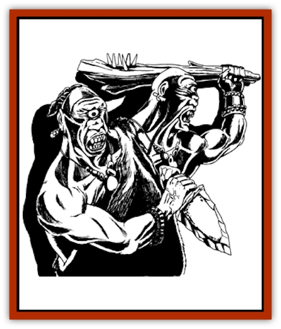
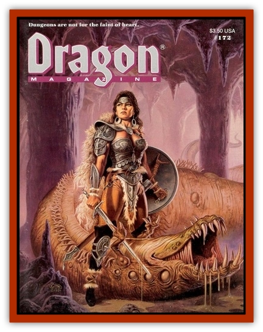

# Biclops

| Statistic | **Biclops** |
| --- | --- |
| **Activity Cycle:** | Night |
| **Alignment:** | Chaotic evil |
| **Armor Class:** | 3 |
| **Climate/Terrain:** | Temperate hills and mountains, subterranean |
| **Damage/Attack:** | 1d8/1d10 (unarmed); 1d10+6/1d12+7 (with clubs) |
| **Diet:** | Omnivore |
| **Frequency:** | Very rare |
| **Hit Dice:** | 8 |
| **Intelligence:** | Low (5-7) |
| **Magic Resistance:** | Nil |
| **Morale:** | Elite (14) |
| **Movement:** | 12 |
| **No. Appearing:** | 1 (10%: 2-4) |
| **No. of Attacks:** | 2 |
| **Organization:** | Solitary |
| **Size:** | L (11' tall) |
| **Special Attacks:** | Hurl rocks |
| **Special Defenses:** | +1 bonus to avoid surprise |
| **THAC0:** | 13 |
| **Treasure:** | C |
| **XP Value:** | 2,000 |

The biclops is a gray-brown, two-headed giant having one yellow eye in the center of each head. The origin of the biclops is uncertain, but it appears to be a cross between a [[Giant_Cyclops|cyclopskin]] and an [[Giant_Ettin|ettin]]. As with both of its ancestors, the biclops prefers to live an isolated life in mountain caves, hunting at night for sources of food including fruits, honey, wild animals, and the occasional human, [[Goblin|goblin]], [[Orc|orc]], or [[Dwarf|dwarf]].

The right head of a biclops usually appears slightly larger than the left, and the right is always dominant. As filthy as an ettin, a biclops has no concept of bathing and can barely make its own clothing, ornaments, and weapons. Biclopes have no true language, instead using a mixture of animal noises and a few words borrowed from other races when appropriate. They have 90' infravision.

**Combat:** Biclopes behave much like ettins, holding a weapon in each hand with one head controlling each attack. Their preferred weapons are mauls, treelimb clubs, and stone axes. Each of their attacks can be used against a different opponent unless one head is incapacitated, in which case control of both arms reverts to the remaining head and both attacks can then be directed at only one target.

In addition, biclopes can throw small boulders (of which they often have an ample supply in their lairs) up to 30' for 1-8 hp damage each; two rocks can be thrown each round. Because they can achieve binocular vision of a sort if both rocks are hurled at the same target, no penalty is then suffered; but if separate targets are chosen or if only one head is "operational", there is a -2 to-hit penalty on all missiles.

Biclopes never use armor, preferring only the crudest of dirt-encrusted, animalhide coverings. They play with fire but never use it for cooking or combat.

**Habitat/Society:** Generally solitary, the only time multiple biclopes will be encountered is when 1-3 young are being raised by their mother. Young biclopes usually have 3 HD and AC 6, and do 1d4+3/1d6+4 hp damage with their small clubs (or half that damage with fists alone). Youths reach adulthood in 5-8 years. Biclopes almost never work in concert with other beings, savagely attacking all who come within sighting range.

**Ecology:** Biclopes are consummate scroungers, able to ingest and survive on virtually any plant or animal diet, including rotting meat. They especially enjoy the flesh of humans, demihumans, and humanoids, though, and have no objection to fighting for their meals. Biclopes are preyed upon as food by [[Dragon_General_Information|dragons]], [[Wyvern|wyverns]], and similar monsters, and are attacked on sight by most adventuring and military forces, as well as by other giants. Unchecked, they wreak the sort of devastation common to evil, uncivilized giant-kin, but this rarely happens for long. Biclopes in some regions are wiped out by their enemies within only a few years of their discovery.

---
## Discovery & Documentation

**Source Publication:** Dragon172 (1991)
**Campaign Setting:** Dragon Magazine
**Author(s):** 

### Other Creatures Found in This Source Book
   * [[Averx|Averx]]
   * [[Fungus_Cushion|Fungus, Cushion]]
