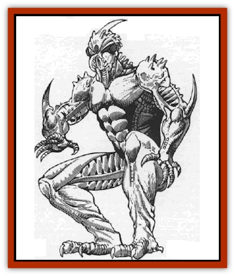

# Bionoid

| Statistic | **Bionoid** |
| --- | --- |
| **Activity Cycle:** | Any |
| **Alignment:** | Neutral good |
| **Armor Class:** | -3 |
| **Climate/Terrain:** | Any |
| **Damage/Attack:** | 1d8(&times;2)/1d10(&times;2)/2d8(&times;2) |
| **Diet:** | Omnivore |
| **Frequency:** | Very rare |
| **Hit Dice:** | 12 |
| **Intelligence:** | Average to Exceptional (8-16) |
| **Magic Resistance:** | Nil |
| **Morale:** | Elite (13-14) |
| **Movement:** | 48 |
| **No. Appearing:** | 1 |
| **No. of Attacks:** | 6 |
| **Organization:** | Solitary |
| **Size:** | L (9-11' tall) |
| **Special Attacks:** | Vorpal attacks, energy blast, crush |
| **Special Defenses:** | See below |
| **THAC0:** | 9 |
| **Treasure:** | Special |
| **XP Value:** | 6,000 |

Bionoids are chitinous, bipedal humanoid insects with a glowing circular gem in the center of their forehead. Though their appearance strikes fear in those who view them, their demeanor belies their looks. They originated as <q>Living Weapons</q> during the Unhuman Wars.

In their combat form, also called their monster form, they are tall, muscular creatures with iridescent exoskeletons. Hard clawlike blades protrude from both forearms and the head. In addition to the standard pair of compound eyes, they possess four seconday eyes that can move independently like those of a chameleon. Pebbly, metallic-looking muscle fibers are visible at the joints.

In their humanoid form, bionoids are thin, well-muscled, and fairly tall. They have uniformly calm, even tempers, and are often contemplative. They move with great economy; useless gestures or movements are very rare.

**Combat:** In battle, the bionoids' true nature becomes apparent. They make two slashing attacks with their forearm blades for 1d10 points of damage apiece, along with spiked fists that strike for 1d8. Similarly, the bionoid's feet have a heel spur that does 2d8 points of damage in a kick or stomp attack. It can make two kicks per round. The bionoid's chitinous plates and its agility give it AC -3.

Due to their high speed, bionoids usually use their fists, forearms and feet in combination with a leaping attack that brings them immediately into close striking range. In close combat with large opponents, the bionoid also crushes the opponent in its arms for an additional 2d8 points of damage. This damage continues on each round the opponent is crushed.

The bionoids' specialized halberds do 1d12 points of damage (plus strength bonuses of +6); only bionoids can wield them. These weapons, pointed with blades at each end, can attack a single target three times per round. The bionoids' speed, agility and expertise with these traditional specialty weapons make them a most feared opponent.

The bionoid's most powerful weapon is a spell-like effect similar to the third level *fireball* spell. The bionoid opens up the twin dorsal plates on its chest, exposing two highly charged membranes. Opening these chest plates causes 2d4 points of damage to the bionoid itself, while causing damage as a 6th-level fireball spell in a 30' cone shape. The damage to the bionoid means this attack is a last resort. The warrior must rest for a full day after such a discharge before using it again.

The *crystal eye* on its forehead is the bionoid's weak point. The *eye* remains in the center of the bionoid's forehead when in monster-form, but is hidden inside the skull in human form. Removal of the *crystal eye* results in the bionoid's immediate decomposition. The *crystal eye* traps its master's essence to wait for regeneration. If a direct crushing blow shatters the eye, irrevocable death for eye and bionoid ensues.

**Habitat/Society:** Bionoids were originally tailored as troops in the Unhuman Wars. Volunteer [[Elf|elves]] gave themselves to be altered into organic fighting machine. After the Wars, they were cast out into the cosmos, to make their own way far from the sight of the elves. Years of ostracism, of living apart from the rest of elvish society like plague victims, has instilled in them a deep distrust of all other elven races.

Although these bionoids were instilled with an instinctive urge for combat without quarter, they are essentially good beings who constantly strive to control the powers of their implanted nature.

Though they travel nearly everywhere in wildspace, bionoids prefer to remain alone. Many work as crew members on spelljamming ships across the flow, or they reside in country manors or castles. Still others live as hermits on lonely asteroids far from the normal spelljamming trade routes. In some cases, elvish communities sympathetic to the bionoids' situation have taken in individual bionoids.

Though rare, a bionoid family can comprise hundreds of members, always led by the individual who started the unit, either the original bionoid or its full-blooded descendants. Bionoid symbionts are welcome to join the unit, but must vow to avoid (and avoid infecting) residents of the outside world.

Though engineered for warfare, the family unit sustains itself primarily through farming. They practice battle skills primarily as a spiritual discipline. Most frontier cities and spelljamming outposts welcome bionoid communities.

**Ecology:** Even bionoid reproduction is invasive. The eggs of mature bionoids are disc-shaped with a single crystalline <q>trigger</q> in the center. This crystal serves a multiple purpose: it is an attractant to potential victims since it makes the egg look like a magical item. and it is also the young bionoid's eye. When a potential host touches the *crystal eye*, the host's essence marks the egg. The egg bursts, attaches to the host, and grows as a symbiont, eventually separating and becoming a separate, nymph bionoid.

If an [[Orc|orc]] touches the egg, the egg explodes in a mass of corrosive filaments causing immediate death. A successful saving throw versus spell causes 2d12 hit points of corrosive damage. If half-orcs make their saving throws, the half-orc and the bionoid bind in symbiosis. Evil beings can fuse with the bionoid, but suffer the penalties of radical change to the bionoid's good alignment.

If elves, humans or other humanoid races touch the egg, it infiltrates the victim, creating another adult bionoid. The new bionoid has the abilities described above, but appears only when danger threatens, whereupon the host <q>monsters out</q> into the bionoid monster form. In addition, the symbiosis gives the host a natural AC of 7. But the host should only wear normal, easily replaceable clothing, due to the unpredictable nature of his malady!

The *crystal eye*'s AC is 0, it has 45 hit points, and it is worth around 10,000 gp - but woe betide the buyer! In the *crystal eye* is the essence of the original owner. If presented with a living body, the crystal reduces and restructures that body in favor of its stored master, resulting in death (of a sort) for the purchaser.

---
## Discovery & Documentation

**Source Publication:** MC9 Spelljammer Appendix II (1991)
**Campaign Setting:** Planescape
**Author(s):** Scott Davis, Newton Ewell, John Terra

### Other Creatures Found in This Source Book
   * [[Alchemy_Plant|Alchemy Plant]]
   * [[Allura|Allura]]
   * [[Aperusa|Aperusa]]
   * [[Autognome|Autognome]]
   * [[Bloodsac|Bloodsac]]
   * [[Buzzjewel|Buzzjewel]]
   * [[Constellate|Constellate]]
   * [[Contemplator|Contemplator]]
   * [[Dohwar|Dohwar]]
   * [[Dragon_Moon|Dragon, Moon]]
   * [[Dragon_Stellar|Dragon, Stellar]]
   * [[Dragon_Sun|Dragon, Sun]]
   * [[Dreamslayer|Dreamslayer]]
   * [[Dweomerborn|Dweomerborn]]
   * [[Fal|Fal]]
   * [[Feesu|Feesu]]
   * [[Fire_Bat|Fire Bat]]
   * [[Firebird|Firebird]]
   * [[Firelich|Firelich]]
   * [[Flowfiend|Flowfiend]]
   * [[Gadabout|Gadabout]]
   * [[Gammaroid|Gammaroid]]
   * [[Gonn|Gonn]]
   * [[Gossamer|Gossamer]]
   * [[Grav|Grav]]
   * [[Great_Dreamer|Great Dreamer]]
   * [[Greatswan|Greatswan]]
   * [[Grell_Colonial|Grell, Colonial]]
   * [[Gullion|Gullion]]
   * [[Insectare|Insectare]]
   * [[Lhee|Lhee]]
   * [[Mercurial_Slime|Mercurial Slime]]
   * [[Meteorspawn|Meteorspawn]]
   * [[Monitor|Monitor]]
   * [[Owl_Space|Owl, Space]]
   * [[Pristatic|Pristatic]]
   * [[Scro|Scro]]
   * [[Selkie_Star|Selkie, Star]]
   * [[Silatic|Silatic]]
   * [[Skullbird|Skullbird]]
   * [[Sleek|Sleek]]
   * [[Sluk|Sluk]]
   * [[Space_Swine|Space Swine]]
   * [[Sphinx_Astro-|Sphinx, Astro-]]
   * [[Spirit_Warrior|Spirit Warrior]]
   * [[Starfly_Plant|Starfly Plant]]
   * [[Stargazer|Stargazer]]
   * [[Undead_Stellar|Undead, Stellar]]
   * [[Witchlight_Marauder|Witchlight Marauder]]
   * [[Xixchil|Xixchil]]
   * [[Yitsan|Yitsan]]
   * [[Zurchin|Zurchin]]
