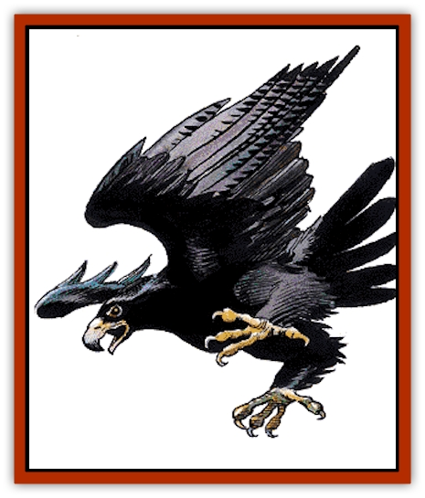

# Bird

Avians, whether magical or mundane in nature, are among the most interesting creatures ever to evolve. Their unique physiology sets them apart from all other life, and their grace and beauty have earned them a place of respect and adoration in the tales of many races.

**Blood Hawk**
[[Hawk|Blood hawk]] hunt in flocks and are fond of humanoids. They continue to attack humans even if the melee has gone against them. Male blood hawks kill humans not only for food but also for gems, which they use to line their nests as an allurement to females.

**Boobrie**
The [[Bird_Toril|boobrie]], giant relative of the stork, stands 12 feet tall. A boobrie's diet consists of giant catfish and other wetland denizens. When times are lean, the boobrie feeds on snakes, lizards, and giant spiders. Its occasional dependence on a diet of creatures that deliver a toxic bite has made the boobrie immune to all poisons. When a boobrie hunts, it finds a grove of tall marsh grass or similar vegetation and slips into it. Once in its hunting blind, it remains still for hours at a time, until prey comes within sight. When employing this means of ambush, its opponents suffer a -3 penalty to their surprise rolls.

**Condor**
Condors measure three to six feet and have a wingspan of 13 to 20 feet. They rarely land except to feed - they even sleep in flight. Condor eggs and hatchlings are worth 30-60 gp. They can be trained to act as spotters or retrievers. Humanoids of small or tiny size can train them as aerial mounts. Used in this way, they can carry 80 pounds, either held in their claws or riding atop their backs.

**Eagle**
An [[Eagle|eagle]] typically attacks from great heights, letting gravity hurtle it toward its prey. If an eagle dives more than 100 feet, its diving speed is double its normal flying speed and the eagle is restricted to attacking with its claws. These high-speed attacks gain a +2 attack bonus and double damage. Eagles are never surprised because of their exceptional eyesight and hearing. Eagles mate for life and, since they nest in one spot, it is easy to identify places where eagles are normally present. On occasion, in an area of rich feeding, 1d8+4 eagles are encountered instead of the normal individual or pair. Eagles generally hunt rodents, fish, and other small animals. Eagles also feed on the carrion of recently killed creatures as well. Eagles never attack humanoids, though small creatures like brownies have to be wary of a hunting eagle.

**Eagle, Giant**
[[Eagle|Giant eagles]] stand 10 feet tall and have wing spans of up to 20 feet. They share the coloration and fighting methods of their smaller cousins. However, if a giant eagle dives more than 50 feet, it adds +4 to its attack roll and doubles its claw damage.

Giant eagles have exceptional eyesight and hearing and cannot be surprised except at night or in their lair, and then only 10% of the time. Far more social than normal eagles, up to 20 nests can be found in the same area, one nest for each mated pair. Giant eagles can be trained, and their eggs sell for 500 to 800 gp.

**Eblis**
Their bodies look like those of storks, with grey, tan, or off-white plumage on their bodies and sleek black necks. Their heads are narrow and end in long, glossy-black, needle-like beaks. [[Bird_Toril|Eblis]] speak a language of chirps, whistles, and deep-throated hoots. In addition, spellcasting eblis have managed to learn a rudimentary version of common, allowing them to converse with those they encounter. Each community is led by one individual with spellcasting ability. These eblis cast 2d4 spells per day as 3rd-level casters. To determine the available spells, roll 1d8 and consult the following table. Duplicate rolls indicate the spell may be employed more than once per day.

| Roll | Spell | Roll | Spell |
| --- | --- | --- | --- |
| 1 | Audible glamer | 5 | Hypnotic pattern |
| 2 | Blur | 6 | Spook |
| 3 | Change self | 7 | Wall of fog |
| 4 | Hypnotism | 8 | Whispering wind |

Eblis love shiny objects (like gems); even the most wise and powerful of the eblis can be bribed with an impressive jewel. An eblis community consists of 2d4 huts built from straw and grasses common to the marsh around the community. Care is taken by the eblis to make these huts difficult to detect. In fact, only a determined search of the area by a ranger or someone with the animal lore proficiency is likely to uncover the community.

All eblis secrete an oil that coats their feathers and provides them with a +1 bonus to all saving throws against fire- and flame-based attacks. Any damage caused by a fire- or flame-based attack is lessened by -1 for each die of damage.

The evil nature of the eblis is best seen in the delight it takes in hunting and killing. When an eblis spots travelers who have objects it desires for its nest, it attacks. Since the eblis is cunning, these attacks often take the forms of ambushes.

**Falcon**
[[Hawk|Falcons]] are smaller, swifter, and more maneuverable than hawks. These birds of prey are easily trained and are preferred by hunters over hawks. Trained falcons sell for around 1,000 gp each.

**Flightless Bird**
These avians are typified by the [[Bird_Toril|ostrich]], [[Bird_Toril|emu]], and [[Bird_Toril|rhea]]. Although they share many of the physiological adaptations that enable other birds to take wing and break the bonds of earth, they are unable to fly.

The ostrich is the largest and strongest, standing 8 feet tall and weighing 300 pounds. The animal's small head and short, flat beak are perched atop a long, featherless neck. The ostrich fans is able to run at 40 miles per hour. If forced to fight, an ostrich uses its legs to deliver a kick that inflicts 1d8 points of damage.

The emu reaches 6 feet high and 130 pounds. Unlike those of their larger cousins, the wings of an emu are rudimentary appendages hidden beneath their coarse, hair-like feathers.

The rhea resembles a small ostrich, standing 3 feet tall and weighs 80 pounds. The differences between the two species lie in the structure of the feet and the tail feathers. Ostriches have two toes, while rheas have three, and ostriches have elegant, flowing tail plumes, while the rhea's are far shorter. Long feathers on the bird's sides swoop down to cover the stunted tail feathers.

**Hawk**
 [[Hawk|Hawks]] have wingspans up to 5 feet. They attack in plummeting dives, usually from a height of 100 feet or more. This dive gives them a +2 attack bonus, enabling their talons to inflict double damage. Hawks cannot attack with their beaks during the round in which they use a dive attack. After the initial dive, hawks fight by biting and pecking with their beaks, tearing at their opponents with their talons. Hawks target eyes and they have a 25% probability of striking an eye whenever its beak strikes. Opponents struck in the eye are blinded for 1d10 rounds and have a 10% chance of losing the use of the eye. Because of their superior eyesight, hawks can never be surprised. Any intruder threatening the nest is attacked, regardless of size. If taken young and trained by an expert, hawks can be taught to hunt. Fledglings bring 500 gp and trained hawks sell for as much as 1,200 gp.

**Owl**
 [[Owl|Owls]] hunt rodents, small lizards, and insects, attacking humans only when frightened (or magically commanded). They have 120' infravision and quadruple normal hearing. They fly in total silence, giving their prey a -6 penalty to their surprise rolls. Owls cannot be surprised during hours of dusk and darkness; during daylight hours, their eye sight is worse than that of humans, suffering a -3 on their surprise roll if discovered in their daylight roosting place. Owls attack with sharp talons and hooked beaks. If they swoop from a height of 50 feet or more, each attack is +2 and inflicts double damage, but no beak attack is possible.

**Owl, Giant**
 These nocturnal creatures inhabit very wild areas, preying on rodents, large game birds, and rabbits. They are too large to gain swoop bonuses but can fly in nearly perfect silence; opponents suffer a -6 on their surprise roll. [[Owl|Giant owls]] may be friendly toward humans, though they are naturally suspicious. Parents will fight anything that threatens their young. Eggs sell for 1,000 sp and hatchlings sell for 2,000 sp.

**Owl, Talking**
 [[Owl|Talking owls]] appear as ordinary owls, but speak common and six other languages (DM's option). Their role is to serve and advise champions of good causes on dangerous quests, which they do for 1d3 weeks if treated kindly on the first encounter; a talking owl feigns a broken wing to see how a party will react. Talking owls can detect good. They have a wisdom score of 21, with the appropriate spell immunities.

**Raven (Crow)**
 [[Raven_Crow|Ravens and crows]] are often mistaken as bad omens by superstitious farmers and peasants. They attack with strong claws and their long, sharp beaks. Ravens employ a grab and peck approach to combat. These birds are 10% likely to attack an opponent's eyes. If successful, the attack causes the opponent to lose an eye. All birds of this type travel in flocks. Any encountered solo are actually scouts. As soon as they see any approaching creature, the scouts give warning cries and maintain a safe distance to keep track of them. Because of the scouts, ravens cannot be surprised during daylight conditions.

**Raven, Giant**
 [[Raven_Crow|Giant ravens]] are both pugnacious and easily trained (if raised from fledglings), and are often used as guards and messengers. While they are too small to be used as mounts by all but small humanoids (i.e., faerie folk and PCs under the effects of a *potion of diminution*), the strength of these birds is enough to carry an adult halfling.

**Raven, Huge**
 [[Raven_Crow|Huge ravens]] have malicious dispositions, occasionally serving evil masters. Not all raven familiars and consorts are evil - the alignment of the master is a decisive factor in such arrangements.

**Swan**
 These aquatic birds tend to inhabit areas frequented by similar waterfowl. Such areas include rivers, ponds, lakes, and marshes. [[Swanmay|Swans]] posses acute senses. They are 90% likely to detect intruders. There is a 10% chance that any swan encounter includes one or more [[Swanmay|swanmays]] in avian form.

**Vulture**
 Vultures are scavengers that search the skies for injured or dead creatures to feed upon. They measure 2 to 3 feet long with a wingspan of up to 7 feet. Greasy blue-black feathers cover the torso and wings; its pink head is bald. Vultures are cowards, and will wait until an intended meal stops moving. If six or more vultures are present, they may attack a weakly moving victim. If the victim defends itself, the vultures move out of reach but maintain their deathwatch. Creatures that are unconscious, dead, or magically sleeping or held are potential meals. If the surviving combatants are further than 20 feet from the fallen creatures, the vultures alight and begin feeding. Because of their diet, vultures kin have developed a natural resistance to disease and organic toxins.

---
## Discovery & Documentation

**Source Publication:** Monstrous Manual (1995)
**Campaign Setting:** Advanced Dungeons & Dragons 2nd Edition
**Author(s):** Tim Beach

### Other Creatures Found in This Source Book
   * [[Aarakocra|Aarakocra]]
   * [[Aboleth|Aboleth]]
   * [[Ankheg|Ankheg]]
   * [[Arcane|Arcane]]
   * [[Argos|Argos]]
   * [[Aurumvorax|Aurumvorax]]
   * [[Baatezu_Lesser_Abishai|Baatezu, Lesser, Abishai]]
   * [[Baatezu_General_Information|Baatezu, General Information]]
   * [[Baatezu_Greater_Pit_Fiend|Baatezu, Greater, Pit Fiend]]
   * [[Banshee|Banshee]]
   * [[Basilisk|Basilisk]]
   * [[Bat|Bat]]
   * [[Bear|Bear]]
   * [[Beetle_Giant|Beetle, Giant]]
   * [[Behir|Behir]]
   * [[Beholder_and_Beholder-kin_I|Beholder and Beholder-kin I]]
   * [[Beholder_and_Beholder-kin_II|Beholder and Beholder-kin II]]
   * [[Brain_Mole|Brain Mole]]
   * [[Broken_One|Broken One]]
   * [[Brownie|Brownie]]
   * [[Bugbear|Bugbear]]
   * [[Bulette|Bulette]]
   * [[Bullywug|Bullywug]]
   * [[Carrion_Crawler|Carrion Crawler]]
   * [[Cat_Great|Cat, Great]]
   * [[Catoblepas|Catoblepas]]
   * [[Cat_Small|Cat, Small]]
   * [[Cave_Fisher|Cave Fisher]]
   * [[Centaur|Centaur]]
   * [[Centipede|Centipede]]
   * [[Chimera|Chimera]]
   * [[Cloaker|Cloaker]]
   * [[Cockatrice|Cockatrice]]
   * [[Couatl|Couatl]]
   * [[Crabman|Crabman]]
   * [[Crawling_Claw|Crawling Claw]]
   * [[Crocodile|Crocodile]]
   * [[Crustacean_Giant|Crustacean, Giant]]
   * [[Crypt_Thing|Crypt Thing]]
   * [[Death_Knight|Death Knight]]
   * [[Deepspawn|Deepspawn]]
   * [[Dinosaur_I|Dinosaur I]]
   * [[Displacer_Beast|Displacer Beast]]
   * [[Dog|Dog]]
   * [[Dog_Moon|Dog, Moon]]
   * [[Dolphin|Dolphin]]
   * [[Doppelganger|Doppelganger]]
   * [[Dracolich|Dracolich]]
   * [[Dragon_Brown|Dragon, Brown]]
   * [[Dragon_Chromatic_Black|Dragon, Chromatic, Black]]
   * [[Dragon_Chromatic_Blue|Dragon, Chromatic, Blue]]
   * [[Dragon_Chromatic_Green|Dragon, Chromatic, Green]]
   * [[Dragon_Cloud|Dragon, Cloud]]
   * [[Dragon_Chromatic_Red|Dragon, Chromatic, Red]]
   * [[Dragon_Chromatic_White|Dragon, Chromatic, White]]
   * [[Dragon_Deep|Dragon, Deep]]
   * [[Dragon_Gem_Amethyst|Dragon, Gem, Amethyst]]
   * [[Dragon_Gem_Crystal|Dragon, Gem, Crystal]]
   * [[Dragon_Gem_Emerald|Dragon, Gem, Emerald]]
   * [[Dragon_Gem_Sapphire|Dragon, Gem, Sapphire]]
   * [[Dragon_Gem_Topaz|Dragon, Gem, Topaz]]
   * [[Dragon_Metallic_Brass|Dragon, Metallic, Brass]]
   * [[Dragon_Metallic_Bronze|Dragon, Metallic, Bronze]]
   * [[Dragon_Metallic_Copper|Dragon, Metallic, Copper]]
   * [[Dragon_Mercury|Dragon, Mercury]]
   * [[Dragon_Metallic_Gold|Dragon, Metallic, Gold]]
   * [[Dragon_Mist|Dragon, Mist]]
   * [[Dragon_Metallic_Silver|Dragon, Metallic, Silver]]
   * [[Dragon_General_Information|Dragon, General Information]]
   * [[Dragon_Shadow|Dragon, Shadow]]
   * [[Dragon_Steel|Dragon, Steel]]
   * [[Dragon_Yellow|Dragon, Yellow]]
   * [[Dragonne|Dragonne]]
   * [[Dragon_Turtle|Dragon Turtle]]
   * [[Dragonet_Faerie_Dragon|Dragonet, Faerie Dragon]]
   * [[Dragonet_Fire_Drake|Dragonet, Fire Drake]]
   * [[Dragonet_Pseudodragon|Dragonet, Pseudodragon]]
   * [[Dryad|Dryad]]
   * [[Dwarf_Derro|Dwarf, Derro]]
   * [[Dwarf|Dwarf]]
   * [[Elemental_Athas_General_Information|Elemental (Athas), General Information]]
   * [[Elemental_Air_Kin|Elemental, Air Kin]]
   * [[Elemental_Earth_Kin|Elemental, Earth Kin]]
   * [[Elemental_Fire_Kin|Elemental, Fire Kin]]
   * [[Elemental_Water_Kin|Elemental, Water Kin]]
   * [[Elemental_of_Chaos_Air_Earth|Elemental of Chaos, Air/Earth]]
   * [[Elemental_of_Chaos_Fire_Water|Elemental of Chaos, Fire/Water]]
   * [[Elemental_Composite|Elemental, Composite]]
   * [[Elemental_Air_Earth|Elemental, Air/Earth]]
   * [[Elemental_Fire_Water|Elemental, Fire/Water]]
   * [[Elemental_General_Information|Elemental, General Information]]
   * [[Elephant|Elephant]]
   * [[Elf|Elf]]
   * [[Elf_Aquatic|Elf, Aquatic]]
   * [[Elf_Drow|Elf, Drow]]
   * [[Ettercap|Ettercap]]
   * [[Eyewing|Eyewing]]
   * [[Feyr|Feyr]]
   * [[Fish|Fish]]
   * [[Frog|Frog]]
   * [[Fungus|Fungus]]
   * [[Galeb_Duhr|Galeb Duhr]]
   * [[Gargantua|Gargantua]]
   * [[Gargoyle_I|Gargoyle I]]
   * [[Genie|Genie]]
   * [[Ghost|Ghost]]
   * [[Ghoul|Ghoul]]
   * [[Giant_Cloud|Giant, Cloud]]
   * [[Giant_Cyclops|Giant, Cyclops]]
   * [[Giant_Desert|Giant, Desert]]
   * [[Giant_Ettin|Giant, Ettin]]
   * [[Giant_Firbolg|Giant, Firbolg]]
   * [[Giant_Fire|Giant, Fire]]
   * [[Giant_Fog|Giant, Fog]]
   * [[Giant_Fomorian|Giant, Fomorian]]
   * [[Giant_Frost|Giant, Frost]]
   * [[Giant_Hill|Giant, Hill]]
   * [[Giant_Jungle|Giant, Jungle]]
   * [[Giant_Mountain|Giant, Mountain]]
   * [[Giant_Reef|Giant, Reef]]
   * [[Giant_Stone|Giant, Stone]]
   * [[Giant_Storm|Giant, Storm]]
   * [[Giant_Verbeeg|Giant, Verbeeg]]
   * [[Giant_Wood|Giant, Wood]]
   * [[Gibberling|Gibberling]]
   * [[Giff|Giff]]
   * [[Gith|Gith]]
   * [[Gith_Pirate_of|Gith, Pirate of]]
   * [[Githyanki|Githyanki]]
   * [[Githzerai|Githzerai]]
   * [[Gloomwing|Gloomwing]]
   * [[Gnoll|Gnoll]]
   * [[Gnome|Gnome]]
   * [[Gnome_Spriggan|Gnome, Spriggan]]
   * [[Goblin|Goblin]]
   * [[Golem_General_Information|Golem, General Information]]
   * [[Golem_I_Greater_Golem|Golem I (Greater Golem)]]
   * [[Golem_II_Lesser_Golem|Golem II (Lesser Golem)]]
   * [[Golem_III|Golem III]]
   * [[Golem_IV|Golem IV]]
   * [[Golem_V|Golem V]]
   * [[Golem_VI_Stone_Variants|Golem VI (Stone Variants)]]
   * [[Gorgon|Gorgon]]
   * [[Grell_Colonial|Grell, Colonial]]
   * [[Gremlin_Jermlaine|Gremlin, Jermlaine]]
   * [[Gremlin|Gremlin]]
   * [[Griffon|Griffon]]
   * [[Grimlock|Grimlock]]
   * [[Grippli|Grippli]]
   * [[Hag|Hag]]
   * [[Halfling|Halfling]]
   * [[Harpy|Harpy]]
   * [[Hatori|Hatori]]
   * [[Haunt|Haunt]]
   * [[Hell_Hound|Hell Hound]]
   * [[Heucuva|Heucuva]]
   * [[Hippocampus|Hippocampus]]
   * [[Hippogriff|Hippogriff]]
   * [[Hobgoblin|Hobgoblin]]
   * [[Homunculus|Homunculus]]
   * [[Hook_Horror|Hook Horror]]
   * [[Horse|Horse]]
   * [[Human|Human]]
   * [[Hydra|Hydra]]
   * [[Imp|Imp]]
   * [[Insect_Giant|Insect, Giant]]
   * [[Insect_Swarm|Insect Swarm]]
   * [[Intellect_Devourer|Intellect Devourer]]
   * [[Invisible_Stalker|Invisible Stalker]]
   * [[Ixitxachitl|Ixitxachitl]]
   * [[Jackalwere|Jackalwere]]
   * [[Kenku|Kenku]]
   * [[Ki-rin|Ki-rin]]
   * [[Kirre|Kirre]]
   * [[Kobold|Kobold]]
   * [[Kuo-Toa|Kuo-Toa]]
   * [[Lamia|Lamia]]
   * [[Lammasu|Lammasu]]
   * [[Leech|Leech]]
   * [[Leprechaun|Leprechaun]]
   * [[Leucrotta|Leucrotta]]
   * [[Lich|Lich]]
   * [[Living_Wall|Living Wall]]
   * [[Lizard|Lizard]]
   * [[Lizard_Man|Lizard Man]]
   * [[Locathah|Locathah]]
   * [[Lurker|Lurker]]
   * [[Lycanthrope_General_Information|Lycanthrope, General Information]]
   * [[Lycanthrope_Seawolf|Lycanthrope, Seawolf]]
   * [[Lycanthrope_Werebear|Lycanthrope, Werebear]]
   * [[Lycanthrope_Wereboar|Lycanthrope, Wereboar]]
   * [[Lycanthrope_Werebat|Lycanthrope, Werebat]]
   * [[Lycanthrope_Werefox|Lycanthrope, Werefox]]
   * [[Lycanthrope_Wererat|Lycanthrope, Wererat]]
   * [[Lycanthrope_Wereraven|Lycanthrope, Wereraven]]
   * [[Lycanthrope_Weretiger|Lycanthrope, Weretiger]]
   * [[Lycanthrope_Werewolf|Lycanthrope, Werewolf]]
   * [[Mammal|Mammal]]
   * [[Mammal_Giant|Mammal, Giant]]
   * [[Mammal_Herd_I|Mammal, Herd I]]
   * [[Mammal_Small|Mammal, Small]]
   * [[Manscorpion|Manscorpion]]
   * [[Manticore|Manticore]]
   * [[Medusa_Maedar|Medusa, Maedar]]
   * [[Medusa|Medusa]]
   * [[Mephit_General_Information|Mephit, General Information]]
   * [[Merman|Merman]]
   * [[Mimic|Mimic]]
   * [[Mind_Flayer|Mind Flayer]]
   * [[Minotaur|Minotaur]]
   * [[Mist_Crimson_Death|Mist, Crimson Death]]
   * [[Mist_Vampiric|Mist, Vampiric]]
   * [[Mold_I|Mold I]]
   * [[Moldman|Moldman]]
   * [[Mongrelman|Mongrelman]]
   * [[Morkoth|Morkoth]]
   * [[Muckdweller|Muckdweller]]
   * [[Mudman|Mudman]]
   * [[Mummy_Greater|Mummy, Greater]]
   * [[Mummy|Mummy]]
   * [[Myconid|Myconid]]
   * [[Naga|Naga]]
   * [[Naga_Dark|Naga, Dark]]
   * [[Neogi|Neogi]]
   * [[Nightmare|Nightmare]]
   * [[Nymph|Nymph]]
   * [[Octopus_Giant|Octopus, Giant]]
   * [[Ogre|Ogre]]
   * [[Ogre_Half-|Ogre, Half-]]
   * [[Ooze_Slime_Jelly_I|Ooze/Slime/Jelly I]]
   * [[Ooze_Slime_Jelly_II|Ooze/Slime/Jelly II]]
   * [[Ooze_Slime_Jelly_Slithering_Tracker|Ooze/Slime/Jelly, Slithering Tracker]]
   * [[Orc|Orc]]
   * [[Otyugh|Otyugh]]
   * [[Owlbear_I|Owlbear I]]
   * [[Pegasus|Pegasus]]
   * [[Peryton|Peryton]]
   * [[Phantom|Phantom]]
   * [[Phoenix|Phoenix]]
   * [[Piercer|Piercer]]
   * [[Plant_Dangerous_I|Plant, Dangerous I]]
   * [[Plant_Intelligent|Plant, Intelligent]]
   * [[Poltergeist|Poltergeist]]
   * [[Pudding_Deadly|Pudding, Deadly]]
   * [[Quaggoth|Quaggoth]]
   * [[Rakshasa|Rakshasa]]
   * [[Rat|Rat]]
   * [[Rat_Osquip|Rat, Osquip]]
   * [[Remorhaz|Remorhaz]]
   * [[Revenant|Revenant]]
   * [[Roc|Roc]]
   * [[Roper|Roper]]
   * [[Rust_Monster|Rust Monster]]
   * [[Sahuagin|Sahuagin]]
   * [[Satyr|Satyr]]
   * [[Scorpion|Scorpion]]
   * [[Sea_Lion|Sea Lion]]
   * [[Selkie|Selkie]]
   * [[Shadow|Shadow]]
   * [[Shedu|Shedu]]
   * [[Sirine|Sirine]]
   * [[Skeleton|Skeleton]]
   * [[Skeleton_Giant|Skeleton, Giant]]
   * [[Skeleton_Warrior|Skeleton, Warrior]]
   * [[Slaad|Slaad]]
   * [[Slug_Giant|Slug, Giant]]
   * [[Snake|Snake]]
   * [[Snake_Winged|Snake, Winged]]
   * [[Spectre|Spectre]]
   * [[Sphinx|Sphinx]]
   * [[Spider|Spider]]
   * [[Sprite|Sprite]]
   * [[Squid_Giant|Squid, Giant]]
   * [[Stirge|Stirge]]
   * [[Su-Monster|Su-Monster]]
   * [[Swanmay|Swanmay]]
   * [[Tabaxi|Tabaxi]]
   * [[Tako|Tako]]
   * [[Tanar'ri_True_Balor|Tanar'ri, True, Balor]]
   * [[Tanar'ri_True_Marilith|Tanar'ri, True, Marilith]]
   * [[Tarrasque|Tarrasque]]
   * [[Tasloi|Tasloi]]
   * [[Thought_Eater|Thought Eater]]
   * [[Thri-kreen|Thri-kreen]]
   * [[Titan|Titan]]
   * [[Toad_Giant|Toad, Giant]]
   * [[Treant|Treant]]
   * [[Triton|Triton]]
   * [[Troglodyte|Troglodyte]]
   * [[Troll|Troll]]
   * [[Umber_Hulk|Umber Hulk]]
   * [[Unicorn|Unicorn]]
   * [[Urchin|Urchin]]
   * [[Vampire|Vampire]]
   * [[Wemic|Wemic]]
   * [[Whale|Whale]]
   * [[Wight|Wight]]
   * [[Will_O'Wisp|Will O'Wisp]]
   * [[Wolf|Wolf]]
   * [[Wolfwere|Wolfwere]]
   * [[Worm|Worm]]
   * [[Wraith|Wraith]]
   * [[Wyvern|Wyvern]]
   * [[Xorn|Xorn]]
   * [[Yeti|Yeti]]
   * [[Yuan-ti_Histachii|Yuan-ti, Histachii]]
   * [[Yuan-ti|Yuan-ti]]
   * [[Yugoloth_Guardian|Yugoloth, Guardian]]
   * [[Zaratan|Zaratan]]
   * [[Zombie|Zombie]]
