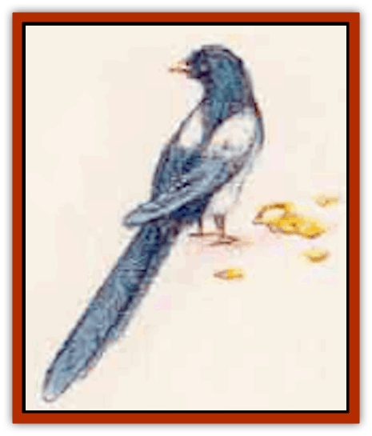
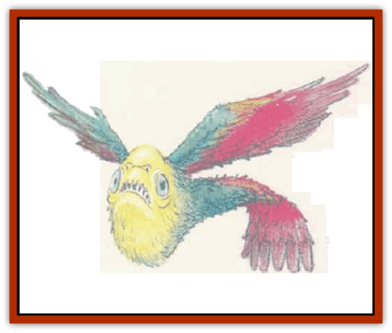

# Bird - Mystara

| Statistic | **Magpie (common)** | **Magpie (giant)** | **Piranhabird (greater)** | **Piranhabird (lesser)** | **Sprackle (greater)** | **Sprackle (lesser)** |
| --- | --- | --- | --- | --- | --- | --- |
| **Activity Cycle:** | Day | Day | Night | Night | Day | Day |
| **Alignment:** | Neutral | Neutral | Chaotic neutral | Chaotic neutral | Neutral | Neutral |
| **Armor Class:** | 7 | 6 | 6 | 7 | 6 | 7 |
| **Climate/Terrain:** | Any temperate | Any temperate | Nonarctic forest | Nonarctic forest | Temperate mountains | Temperate mountains |
| **Damage/Attack:** | 1 (beak) | 1d4 (beak) | 1d6 (bite) | 1d4 (bite) | 1d6 (beak) | 1d3 (beak) |
| **Diet:** | Insectivore | Insectivore | Carnivore | Carnivore | Carnivore | Insectivore |
| **Frequency:** | Common | Rare | Very rare | Rare | Very rare | Very rare |
| **Hit Dice:** | 1-2 hp | 1+1 | 2 | 1-4 hp | 2 | 1-4 hp |
| **Intelligence:** | Semi- (2) | Semi- (4) | Semi- (2) | Semi- (2) | Semi- (2) | Animal (1) |
| **Magic Resistance:** | Nil | Nil | Nil | Nil | Nil | Nil |
| **Morale:** | Unsteady (6) | Average (8) | Average (10) | Average (8) | Average (10) | Average (8) |
| **Movement:** | 1, Fl 36 (B) | 3, Fl 33 (B) | Fl 36 (A) | Fl 36 (A) | 3, Fl 36 (B) | 1, Fl 36 (B) |
| **No. Appearing:** | 1d6 | 1d4 | 2d6 | 1d4 wings of 1d4+2 birds | 2d6 | 2d6 |
| **No. of Attacks:** | 1 | 1 | 1 | 1 (per wing) | 1 | 1 |
| **Organization:** | Solitary | Solitary | Flock | Flock | Rook | Rook |
| **Size:** | T (2' long) | S-M (3-5' long) | S (2½' long) | T (1' long) | S (4' long) | T (2' long) |
| **Special Attacks:** | Nil | Nil | Blood frenzy | +2 to attacks | Electricity, armor penetration | Electricity, armor penetration |
| **Special Defenses:** | Nil | Nil | Nil | Nil | Electricity | Electricity |
| **THAC0:** | 20 | 19 | 19 | 20 | 19 | 20 |
| **Treasure:** | See below | See below | Nil | Nil | See below | See below |
| **XP Value:** | 15 | 65 | 65 | 15 | 175 | 65 |

A wealth of [[Bird|birds]] inhabit the world of Mystara. This section offers a brief sampling, from the mundane but troublesome magpie to the electrifying sprackle.

## 

Magpie

Magpies are notorious for stealing bright objects. Two varieties make their home in Mystara: common and giant. The common magpie is 14 to 18 inches long from its head to the tip of its tail. The body and tail are mostly black (often shot with metallic blue, green and lavender), and the shoulders and belly are white. The giant magpie sports similar colors, but measures 3 to 5 feet from beak to tail.

**Combat:** Common magpies fight aggressively if provoked, causing 1 point of damace with each peck. Since they are able flyers, though, it is usually easy for them to escape danger.

The beak of the giant magpie inflicts 1d4 points of damage

**Habitat/Society:** Magpies have a well-deserved reputation as thieves, and may attempt to steal any shiny or brightly colored object that's unsecured. A common magpie can steal objects weighing up to 3 or 4 ounces (for example, a coin, gem or ring), while the giant magpie can manage objects up to 2 pounds (for example, a piece of jewehy, a dagger, a wand, or a potion bottle).

If people are nearby, a magpie may swoop down to take an object without landing, and has a 30% chance of picking it up cleanly and making off without dropping it. If the bird can land unseen, however, its overall chance of success increases to 60% Stolen objects are taken to the bird's nest.

Finding the nest in order to retrieve a lost item may be a difficult task, perhaps even perilous if the search leads to the territories of dangerous creatures. The search may also be rewarding, however, since the nest might also contain 1d6 coins (30%), 1d2 small gems (3%), a piece of jewelry/art object (3% - giant magpie only), or even a small magical item (1% - giant magpie only).

The magpie's nest is woven of sticks, straw, and mud. Magpies often weave thorny twigs into the roof of the nest to keep predators from attacking the abode. The nest is fairly large and round,with only one entrance. A typical clutch contains 5 to 6 greenish blue or yellowish eggs.

**Ecology:** Both common and giant magpies prefer to live in cool or temperate habitats, making their homes in woodlands, agricultural land, and even towns. Occansionally a magpie serves as a wizard's familiar.

Magpies eat insects and grain. Those dwelling in settled areas often make their nests near granaries, which offer plentiful meals of spilled grain.

According to folklore and common superstition, the number of magpies one sees at a time can help foretell the future. Seven magpies are a portent of great evil.

## 

Piranha Bird

This vicious creature gathers in flocks that rapidly tear apart prey, much like the [[Piranha|fish]] after which the piranha bird is named.

Both varietes of piranha bird (lesser and greater) are garishly colored. Individual birds may have green, blue, red, brown, black, or occasionally purple feathers - the entire spectrum of colors is usually displayed in a single flock.

Lesser piranha birds grow to a maximum of 1 foot long. Greater piranha birds, on the other hand, average over twice that length. The whistles of greater piranha birds are lower and more melodic than those of lesser piranha birds.

**Combat:** Piranha birds have gaping mouths full of slashing teeth. These are razor-sharp, so that the bird can easily bite into flesh and rip away a mouthful while on the wing.

These creatures can fly with hummingbirdlike maneuverability. They can make sudden changes in direction, or even hover in midair. When one catches sight of a potential meal, it utters a high-pitched whistle, alerting the whole flock. These birds only attack warm-blooded creatures.

Lesser piranha birds attack in groups. A flock divides itself into one or more "attack wings" of 3 to 6 individuals (1d4+2). Each "wing" attacks as though it were a single monster, attacking with a +2 bonus and inflicting 1d4 points of damage per hit. If a flock is reduced to fewer than three piranha birds, they lose their attack bonus and must make a successful morale check or scatter.

The greater piranha birds, on the other hand, attack individually, each bite inflicting 1d6 points of damage. If half of their flock has been killed or incapacitated, they must pass a morale check or flee. If they pass, they go into a blood frenzy that gives them a +2 to all attacks.

**Habitat/Society:** Piranha birds do not like bright sunlight, but may he found in warm climates, except areas barren of any shade. They live in regions of dense forest. Underground varieties have developed limited infravision (up to 30 feet). At night or on overcast or foggy days, piranha birds may fly far from their nests in search of prey.

Piranha birds reproduce every spring. Each female lays 2 to 5 eggs. She warms them until hatching, and then rejoins the hunt to feed the young. Piranha birds are especially voracious at this time - first the males, which must bring hack enough food to the nests to feed the females; then male and female alike, as they strive to feed their offspring.

A flock of piranha birds has no leader as such, hut does have a pecking order that dictates which bird gets first pick of fallen prey for itself, its mate and its young.

**Ecology:** Piranha birds, both lesser and greater, are always hungry for fresh meat. They have no interest in treasure; in fact, they tend to avoid shiny objects.

## Sprackle

These creatures look verv similar to grackles, the common blackbirds from which they are descended. However, sprackles are larger and colored differently: Their feathers are coppery or reddish-brown. Moreover, these birds constantly shed little electrical sparks that make them glow in the dark. Their name is a blend of the words "spark" and "grackle".

There are two varieties of sprackle: lesser and greater. The difference between them is simply one of size. The lesser sprackle averages 20 inches in length, while the greater sprackle grows as long as 4 feet.

**Combat:** The sprackles' beaks are very long and sharp and can penetrate armor, giving them a +2 attack bonus against foes in plate mail (bronze or normal), ring mail, or chain mail. Further, sprackles can launch lightning attacks at creatures within 30 feet (60 feet for the greater sprackle); a small charge of electricity shoots out from their beaks and, with a successful attack roll, causes 1d3 points of damage (1d6 for the greater sprackle).

An electrical charge constantly surrounds a sprackle. Even if not directed as a lightning blast, it still inflicts 1d3 (or 1d6 for greater sprackles) points of damage upon any creature that comes into contact with it. Conductive materials (such as metal swords) also carry damage to a wielder.

Sprackles fly directly toward their prey in combat, shooting their lightning blasts until they get within melee range. At that point they attack with their beaks (1d3 or 1d6 damage from the sharp beak, plus 1d3 or 1d6 electrical damage). They continue to fight until half the flock is killed or wounded, at which time they must pass a morale check or flee.

All sprackles have infravision with a range of 60 feet.

**Habitat/Society:** Sprackles are very territorial and will fearlessly attack creatures larger than themselves. They avoid undead creatures and those larger than man-sized, but will attack other creatures to drive them out of their territory.

Sprackles first appeared in a place called Corran Keep, in the mountains of Mystara. Powerful magic there seems to have transformed ordinary birds into these creatures. Since their creation, sprackles have been spreading rapidly, aggressively pushing more common predatory birds out of their temtories.

Sprackles may he most commonly encountered on the forested lower slopes of mountains. As the species spreads, however, they may soon he found in many other areas.

A group of Sprackles is called a rook. They gather in extended families of two to a dozen birds, which share a large, communal nesting area (called a rookery). Rookeries are located in sheltered areas, such as the eaves of an abandoned building or under a rocky overhang. They are built of sticks and mud, and lined with downy feathers shed by the birds.

Like magpies, sprackles are attracted to shiny objects which may he valuable. Their nests might contain 2d6 coins (30%), 1d4 small gems (5%, 30% - giant sprackle), a piece of jewelry/art object (5% - giant sprackle only), or even a small magical item (2%-giant sprackle only). Also, their treasure reflects the chance that they dwell in a ruin or similar place that may contain abandoned valuables.

**Ecology:** Because of their sparks, sprackles do most of their hunting in the daytime, when they are slightly less obvious. (Glowing predators have a tendency to frighten off their prey.)

Lesser sprackles are insectivores, preying chiefly on larger insects and arthropods such as butterflies, [[Centipede|centipedes]], moths, [[Spider|spiders]], and [[Dragonfly|dragonflies]]. Greater sprackles are carnivores who more frequently dine on mice, [[Rat|rats]], smaller birds, and sometimes [[Insect_Giant|giant insects]], such as [[Dragonfly_Giant|giant dragonflies]], robber flies, and giant centipedes and spiders.

---
## Discovery & Documentation

**Source Publication:** Mystara Appendix (1994)
**Campaign Setting:** Mystara
**Author(s):** John Nephew, Teeuwynn Woodruff, John Terra, Skip Williams

### Other Creatures Found in This Source Book
   * [[Actaeon|Actaeon]]
   * [[Agarat|Agarat]]
   * [[Ash_Crawler|Ash Crawler]]
   * [[Baldandar|Baldandar]]
   * [[Bargda|Bargda]]
   * [[Bhut|Bhut]]
   * [[Blackball|Blackball]]
   * [[Choker|Choker]]
   * [[Coltpixie|Coltpixie]]
   * [[Crone_of_Chaos|Crone of Chaos]]
   * [[Darkhood|Darkhood]]
   * [[Darkwing|Darkwing]]
   * [[Decapus|Decapus]]
   * [[Deep_Glaurant|Deep Glaurant]]
   * [[Diabolus|Diabolus]]
   * [[Dimensional_Warper|Dimensional Warper]]
   * [[Dragon_Mystara_Crystalline|Dragon (Mystara), Crystalline]]
   * [[Dragon_Mystara_Jade|Dragon (Mystara), Jade]]
   * [[Dragon_Mystara_Onyx|Dragon (Mystara), Onyx]]
   * [[Dragon_Mystara_Ruby|Dragon (Mystara), Ruby]]
   * [[Drake_Mystara|Drake (Mystara)]]
   * [[Dragonfly|Dragonfly]]
   * [[Dusanu|Dusanu]]
   * [[Elemental_of_Chaos_Air_Earth|Elemental of Chaos, Air/Earth]]
   * [[Elemental_of_Chaos_Fire_Water|Elemental of Chaos, Fire/Water]]
   * [[Elemental_of_Law_Air_Earth|Elemental of Law, Air/Earth]]
   * [[Elemental_of_Law_Fire_Water|Elemental of Law, Fire/Water]]
   * [[Familiar_Mystara|Familiar (Mystara)]]
   * [[Frost_Salamander|Frost Salamander]]
   * [[Fundamental_Air_Earth|Fundamental, Air/Earth]]
   * [[Fundamental_Fire_Water|Fundamental, Fire/Water]]
   * [[Gargantua_Mystara|Gargantua (Mystara)]]
   * [[Geonid|Geonid]]
   * [[Ghostly_Horde|Ghostly Horde]]
   * [[Giant_Athach|Giant, Athach]]
   * [[Giant_Hephaeston|Giant, Hephaeston]]
   * [[Golem_Drolem|Golem, Drolem]]
   * [[Golem_Mystara_I|Golem (Mystara) I]]
   * [[Golem_Mystara_II|Golem (Mystara) II]]
   * [[Golem_Mystara_III|Golem (Mystara) III]]
   * [[Gray_Philosopher|Gray Philosopher]]
   * [[Guardian_Warrior|Guardian Warrior]]
   * [[Gyerian|Gyerian]]
   * [[Herex|Herex]]
   * [[Hivebrood|Hivebrood]]
   * [[Horde|Horde]]
   * [[Hsiao|Hsiao]]
   * [[Huptzeen|Huptzeen]]
   * [[Hutaakan|Hutaakan]]
   * [[Imp_Mystara|Imp (Mystara)]]
   * [[Jellyfish_Giant_Mystara|Jellyfish, Giant (Mystara)]]
   * [[Kna|Kna]]
   * [[Kopru|Kopru]]
   * [[Lizard_Mystara|Lizard (Mystara)]]
   * [[Lizard-kin_Mystara|Lizard-kin (Mystara)]]
   * [[Lupin|Lupin]]
   * [[Lycanthrope_Werejaguar_Mystara|Lycanthrope, Werejaguar (Mystara)]]
   * [[Lycanthrope_Wereswine|Lycanthrope, Wereswine]]
   * [[Magen|Magen]]
   * [[Manikin|Manikin]]
   * [[Mek|Mek]]
   * [[Mujina|Mujina]]
   * [[Nagpa|Nagpa]]
   * [[Neh-thalggu|Neh-thalggu]]
   * [[Nightshade_Mystara|Nightshade (Mystara)]]
   * [[Nuckalavee|Nuckalavee]]
   * [[Pegataur|Pegataur]]
   * [[Phanaton|Phanaton]]
   * [[Plant_Dangerous_Mystara|Plant, Dangerous (Mystara)]]
   * [[Plasm|Plasm]]
   * [[Rakasta|Rakasta]]
   * [[Rock_Man|Rock Man]]
   * [[Sabreclaw|Sabreclaw]]
   * [[Sacrol|Sacrol]]
   * [[Scamille|Scamille]]
   * [[Shapeshifter|Shapeshifter]]
   * [[Shargugh|Shargugh]]
   * [[Shark-kin|Shark-kin]]
   * [[Sollux|Sollux]]
   * [[Spectral_Death|Spectral Death]]
   * [[Spectral_Hound|Spectral Hound]]
   * [[Spider-kin|Spider-kin]]
   * [[Spirit_Mystara|Spirit (Mystara)]]
   * [[Statue_Living|Statue, Living]]
   * [[Surtaki|Surtaki]]
   * [[Tabi|Tabi]]
   * [[Thoul|Thoul]]
   * [[Thunderhead|Thunderhead]]
   * [[Tiger_Ebon|Tiger, Ebon]]
   * [[Topi|Topi]]
   * [[Tortle|Tortle]]
   * [[Vampire_Velya|Vampire, Velya]]
   * [[White_Fang|White Fang]]
   * [[Worm_Mystara|Worm (Mystara)]]
   * [[Wyrd|Wyrd]]
   * [[Yowler|Yowler]]
   * [[Zombie_Lightning|Zombie, Lightning]]
