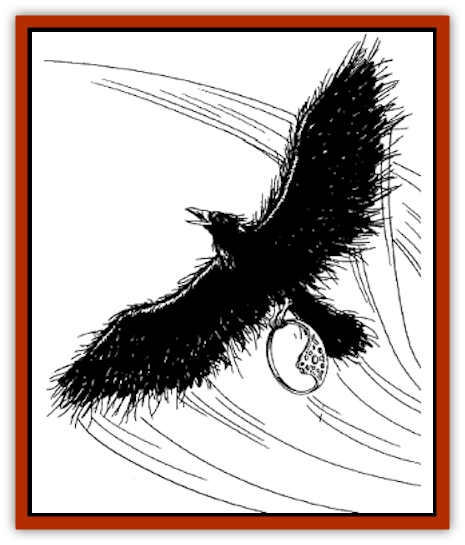

# Bird of Tyaa

| Statistic | **Bird of Tyaa** |
| --- | --- |
| **Activity Cycle:** | Night |
| **Alignment:** | Neutral evil |
| **Armor Class:** | 7 |
| **Climate/Terrain:** | Any |
| **Damage/Attack:** | 1-4 |
| **Diet:** | Omnivore |
| **Frequency:** | Rare |
| **Hit Dice:** | 1-4 hp |
| **Intelligence:** | Low (5-7) |
| **Magic Resistance:** | Nil |
| **Morale:** | Steady (11-12) |
| **Movement:** | 1, Fl 18 |
| **No. Appearing:** | 3-30 |
| **No. of Attacks:** | 1 |
| **Organization:** | Flock |
| **Size:** | T (1' tall) |
| **Special Attacks:** | +1 to attack, 20% poison |
| **Special Defenses:** | Nil |
| **THAC0:** | 20 |
| **Treasure:** | Q |
| **XP Value:** | 120 |

Birds of Tyaa resemble [[Raven_Crow|ravens]]. They are the special servitors of the goddess Tyaa and her evil followers. Priests of Tyaa can summon and command 2d6 such [[Bird|birds]], while Tyaa's high priestess or avatar can summon and command 3d10 birds.

**Combat:** Birds of Tyaa are far more intelligent and cunning than ordinary birds, instinctively attacking their target's eyes and penetrating gaps in armor with a +1 attack bonus.

There is a 20% chance that a bird's claws are treated with poison. Victims of poison attacks must successfully save vs. poison or die in 2d10 rounds.

Trained for theft and assassination, birds of Tyaa are skilled at striking out of the darkness, stealing a valuable object, or inflicting deadly wounds.

**Habitat/Society:** Birds of Tyaa are found in most major cities, where they are indistinguishable from common [[Raven_Crow|crows]] and ravens. They servse priests and priestesses of Tyaa, and they will flock to any newly established temple of their goddess. They are often accompanied by other evil-aligned birds and flying creatures.

**Ecology:** These creatures are not natural. They are created by the evil will of Tyaa, and as such they do not nest or reproduce as do other birds. Birds of Tyaa exist only to carry out the will of their goddess and to serve the evil ends of her worshippers.

---
## Discovery & Documentation

**Source Publication:** Lankhmar: City of Adventure (2nd Ed.) (1993)
**Campaign Setting:** Lankhmar
**Author(s):** Bruce Nesmith, Douglas Niles, and Ken Rolston

### Other Creatures Found in This Source Book
   * [[Astral_Wolf|Astral Wolf]]
   * [[Behemoth|Behemoth]]
   * [[Cat_War|Cat, War]]
   * [[Cloaker_Sea|Cloaker, Sea]]
   * [[Cold_Woman|Cold Woman]]
   * [[Devourer_Lankhmar|Devourer (Lankhmar)]]
   * [[Ghoul_Kleshite|Ghoul, Kleshite]]
   * [[Ghoul_Lankhmar|Ghoul (Lankhmar)]]
   * [[Gladiator_Lizard|Gladiator Lizard]]
   * [[Horag|Horag]]
   * [[Howler|Howler]]
   * [[Ice_Gnome|Ice Gnome]]
   * [[Invisible_of_Stardock|Invisible of Stardock]]
   * [[Lizard|Lizard]]
   * [[Ophidian|Ophidian]]
   * [[Ray_Invisible_Flying|Ray, Invisible Flying]]
   * [[Scorpion|Scorpion]]
   * [[Simorgyan|Simorgyan]]
   * [[Snow_Serpent|Snow Serpent]]
   * [[Thunder_Children|Thunder Children]]
   * [[Wraith-Spider|Wraith-Spider]]
   * [[Zombie_Sea|Zombie, Sea]]
