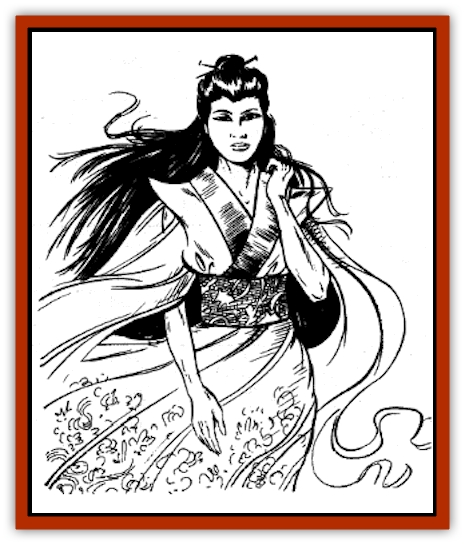

# Bisan

| Statistic | **Bisan** |
| --- | --- |
| **Activity Cycle:** | Any |
| **Alignment:** | Neutral |
| **Armor Class:** | 0 |
| **Climate/Terrain:** | Tropical, subtropical, and temperate forests and jungles |
| **Damage/Attack:** | 1-10 |
| **Diet:** | Special |
| **Frequency:** | Very rare |
| **Hit Dice:** | 10 |
| **Intelligence:** | High (13-14) |
| **Magic Resistance:** | 40% |
| **Morale:** | Elite (13) |
| **Movement:** | 24 |
| **No. Appearing:** | 1 |
| **No. of Attacks:** | 1 |
| **Organization:** | Solitary |
| **Size:** | M (5' tall) |
| **Special Attacks:** | See below |
| **Special Defenses:** | See below |
| **THAC0:** | 11 |
| **Treasure:** | Q,T |
| **XP Value:** | 6,000 |

The bisan is a lesser spirit associated with a particular species of tree, usually one that is valued for its sap, gum, wood, or oils. These spirits most commonly are associated with camphor trees, but sometimes are linked to teak or mahogany.

The bisan's natural form is that of a beautiful woman. She has long, flowing hair - either dark brown, black, or white - and soft green eyes. She wears a blue or pale green silken robe. Her apparent age as well as her lifeforce is bound to a single tree. Depending on the tree's age, she may look young, middle-aged, or elderly. She may reflect her tree's appearance in other ways, too - wearing the flowers of the tree in her hair, for example, or, if her tree is mahogany, having dark, reddish brown skin.

Bisan are seldom encountered as women, however. They can *polymorph self* at will, and prefer the forms of insects, usually fruit files, honey bees, or wasps.

Bisan speak the language of their own race and no other.

**Combat:** Highly intelligent and clever, a bisan can be a formidable enemy when angered, particularly if someone threatens her personal tree. In general, however, these spirits try to avoid combat, and prefer to use their spells to cause mischief and hardship. If forced to fight, a bisan flees at the first chance unless she is defending her tree.

Bisan can *polymorph self*, *turn invisible*, and *become ethereal* at will. Once per round they can cast *bless* (and its reverse, *curse*), *castigate*, *cause paralysis*, *pacify*, *animate wood*, *wood shape*, *elemental turning*, *quickgrowth*, and *ironwood*. The touch of a bisan (make a normal attack roll) inflicts 1-10 hit points of damage.

The bisan prefers to attack as an insect, because of its many advantages. In this form, she retains her spell use, hit points, attack rolls, and saving throws, while gaining the insect's tiny size and flying ability (Fl 6 with maneuverability class C). The bisan usually harasses trespassers with *castigate*, *animate wood*, and *quickgrowth* in an effort to frighten or intimidate them into leaving the area. Failing that, she attacks with her touch, *cause paralysis*, and - as a last resort - *curse*. The bisan rarely pursues a retreating opponent.

A bisan's lifeforce is linked to that of her personal tree. If her tree is chopped down, affected by wood rot, set on fire, or destroyed by any other means, the bisan is likewise affected. The bisan suffers no ill affects while her tree is under attack, but as soon as the tree is destroyed, the bisan is immediately reduced to 0 hit points and disappears. Obviously, a bisan will go to great lengths to protect her personal tree.

**Habitat/Society:** Bisan are spiritually bound to only one tree, but they protect other trees of the same variety in the immediate region. For example, a bisan associated with a camphor tree watches over all camphor trees in the surrounding area. The "surrounding area" may mean a few acres or several square miles, but 1 square mile is the most common area protected. The bisan's personal tree - usually the tallest or sturdiest in the area - usually stands at the center of the guarded region. Bisan are fiercely territorial, and seldom guard overlapping or shared areas.

Experienced woodsmen often know the location of bisan in their vicinity, and many of these spirits can be identified by local superstition. Although the bisan strive to protect their trees from harm, they allow humans (and others) to harvest their trees for sap, branches, fruit, or leaves. Trees at the end of their life spans even can be cut down without incurring the bisan's displeasure. In exchange, the bisan must be given an offering. If a harvester fails to provide a suitable offering, the bisan will become angry and hostile.

A bisan's lifespan parallels that of her personal tree. If the tree dies from natural causes - that is, if it was not intentionally destroyed by humans or other aggressors - the bisan's essence disassociates from the tree and takes up residence in a new sapling in the same region. If the gods are satisfied with the bisan's previous efforts to protect trees in her region, she may be rewarded with many new lives. The disassociated essence may divide into as many as four parts, each assigned to a new sapling somewhere in the world. In this way, a new generation of bisan is created.

**Ecology:** A bisan is sustained by sunlight and shares the nutrients of her personal tree. She can use the bark of her tree as a component in *potions of healing*.

---
## Discovery & Documentation

**Source Publication:** MC6 Kara-Tur Appendix (1990)
**Campaign Setting:** Kara-Tur (Forgotten Realms)
**Author(s):** Rick Swan

### Other Creatures Found in This Source Book
   * [[Bajang|Bajang]]
   * [[Bakemono|Bakemono]]
   * [[Buso|Buso]]
   * [[Carp_Giant|Carp, Giant]]
   * [[Centipede_Spirit|Centipede, Spirit]]
   * [[Chu-u|Chu-u]]
   * [[Con-tinh|Con-tinh]]
   * [[Doc_cu'o'c|Doc cu'o'c]]
   * [[Duruch'i-lin|Duruch'i-lin]]
   * [[Flame_Spirit|Flame Spirit]]
   * [[Foo_Creature|Foo Creature]]
   * [[Gaki|Gaki]]
   * [[Gargantua|Gargantua]]
   * [[Goblin_Rat|Goblin Rat]]
   * [[Hai_Nu|Hai Nu]]
   * [[Hannya|Hannya]]
   * [[Hengeyokai|Hengeyokai]]
   * [[Hsing-sing|Hsing-sing]]
   * [[Hu_Hsien|Hu Hsien]]
   * [[Human_Kara-Tur|Human (Kara-Tur)]]
   * [[Ikiryo|Ikiryo]]
   * [[Jishin_Mushi|Jishin Mushi]]
   * [[Kala|Kala]]
   * [[Kaluk|Kaluk]]
   * [[Kappa|Kappa]]
   * [[Korobokuru|Korobokuru]]
   * [[Krakentua|Krakentua]]
   * [[Kuei|Kuei]]
   * [[Memedi|Memedi]]
   * [[Men-shen|Men-shen]]
   * [[Nat|Nat]]
   * [[Ningyo|Ningyo]]
   * [[Oni|Oni]]
   * [[P'oh|P'oh]]
   * [[P'oh_Gohei|P'oh, Gohei]]
   * [[Shan_Sao|Shan Sao]]
   * [[Shirokinukatsukami|Shirokinukatsukami]]
   * [[Spirit_Folk|Spirit Folk]]
   * [[Spirit_Nature|Spirit, Nature]]
   * [[Spirit_Stone|Spirit, Stone]]
   * [[Tako|Tako]]
   * [[Tengu|Tengu]]
   * [[Wang-Liang|Wang-Liang]]
   * [[Yuan-ti_Histachii|Yuan-ti, Histachii]]
   * [[Yuki-on-na|Yuki-on-na]]
