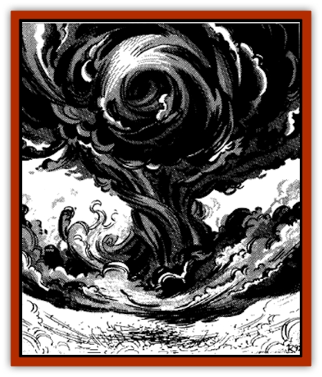

# Black Cloud of Vengeance

| Statistic | **Black Cloud of Vengeance** |
| --- | --- |
| **Activity Cycle:** | Any |
| **Alignment:** | Chaotic evil or neutral |
| **Armor Class:** | -3 |
| **Climate/Terrain:** | Desert |
| **Damage/Attack:** | 15 HD: 3-30/4-40 / 16-17 HD: 4-40/5-50 / 18-19 HD: 5-50/6-60 / 20 HD: 6-60/7-70 |
| **Diet:** | Unknown |
| **Frequency:** | Very rare |
| **Hit Dice:** | 15-20 |
| **Intelligence:** | Exceptional (15-16) |
| **Magic Resistance:** | 30% |
| **Morale:** | Fearless (19) |
| **Movement:** | Fl 24 (E) |
| **No. Appearing:** | 1 |
| **No. of Attacks:** | 2 |
| **Organization:** | Solitary |
| **Size:** | G (Storm-sized) |
| **Special Attacks:** | Fiery rain, wind |
| **Special Defenses:** | +3 or better weapon to hit, totally resistant to fire magic |
| **THAC0:** | 15 HD: 7 / 16-20 HD: 5 |
| **Treasure:** | G |
| **XP Value:** | 15 HD: 15,000 / 16 HD: 16,000 / 17 HD: 17,000 / 18 HD: 18,000 / 19 HD: 19,000 / 20 HD: 20,000 |

These dreadful creatures are believed to be the creations of those who broke the Laws of the Loregiver in the early days of the world. Although they are extraordinarily rare, no culture in the Land of Fate is without tales of the [[Elemental_Composite|Black Clouds]], giving testament to their devastating power. Many believe that there is only one cloud, although the learned sages maintain that there are, in fact, several.

The Black Clouds are incredibly powerful monsoonlike beings. They appear to be sentient thunderclouds, moving contrary to the course dictated by the wind if it suits them. Their roiling depths do little to conceal the occasional flares of bright red lightning; the winds that precede their coming echo with thunder. Their winds carry particles of soot and ash, darkening the ground and the air as they approach.

As a Black Cloud draws near, the winds increase their fury, blowing not only ashes but also the sand that lay before and beneath the cloud in its previous paths. The sound and fury at this point are rivaled only by the fiercest sandstorms of the desert. If a cloud approaches this closely, the best anyone can hope for is that it will veer away from its course. Otherwise, there is little or no hope of survival.

**Combat:** All know when a Black Cloud draws near, for the wind increases its speed, blowing hot and hard. The sky darkens, and the winds smell of fire and destruction.

When it reaches its target or when it is challenged by a foolhardy hero, it unleashes its full fury. (The wind and fire that preceded its approach are dim by comparison.) The winds reach a howling pitch, strong enough to level entire buildings. As individual clouds grow stronger and bigger, their wind becomes ever fiercer, causing up to 6d10 points of damage.

More deadly than the winds are the fiery torrents that the clouds carry. While the winds are immediately destructive, the wind does not spread like the flames. Even after the cloud has moved on, its fires fan up and continue to burn, whipped up and carried by the cloud's winds. Those trapped within the blaze suffer up to 7d10 points of damage, although a successful save vs. breath weapon halves this damage.

**Habitat/Society:** The Black Cloud combines the elements of fire and air to devastating effect. Their origin is unknown. They have existed since the earliest memories of elven grandfathers. Some claim that the clouds are the result of powerful magicks unleashed in the early days of the world, before men knew of the beneficence of the Loregiver. Others state that they are sent by Fate to punish those who would dare to break her laws.

Nearly nothing is known about how the Black Clouds of Vengeance lead their lives. Indeed, although they are known to be sentient beings, none know (or, at least, none will say) whether these beings are even alive. They might be the tools of the Loregiver, punishing those who fall from the Law, or they may simply be free spirits, moving where their whims take them.

**Ecology:** The Black Clouds of Vengeance survive by acts of destruction. They most commonly attack cities or large desert encampments, leaving behind only charred husks and windblown scraps. Some clouds are large enough to envelop entire cities, although they never approach cities favored by the enlightened gods (i.e., cities with mosques) or cities frequented by [[Genie|genies]]. On the other hand, they somehow seem to know when a city is devoid of gods or genies, and they revel in the destruction that ensues. Perhaps the clouds fear the powers that the gods and the genies wield. Whatever the reason, the clouds encourage piousness in the people of Zakhara.

---
## Discovery & Documentation

**Source Publication:** MC13 Al-Qadim Appendix (1992)
**Campaign Setting:** Al-Qadim (Forgotten Realms)
**Author(s):** C. Terry Phillips

### Other Creatures Found in This Source Book
   * [[Ammut|Ammut]]
   * [[Ashira|Ashira]]
   * [[Asuras|Asuras]]
   * [[Buraq|Buraq]]
   * [[Camel|Camel]]
   * [[Camel_of_the_Pearl|Camel of the Pearl]]
   * [[Centaur_Desert|Centaur, Desert]]
   * [[Copper_Automaton|Copper Automaton]]
   * [[Debbi|Debbi]]
   * [[Elephant_Bird|Elephant Bird]]
   * [[Gen|Gen]]
   * [[Genie_Noble_Dao|Genie, Noble Dao]]
   * [[Genie_Noble_Djinni|Genie, Noble Djinni]]
   * [[Genie_Noble_Efreeti|Genie, Noble Efreeti]]
   * [[Genie_Noble_Marid|Genie, Noble Marid]]
   * [[Genie_Tasked_Architect_Builder|Genie, Tasked, Architect/Builder]]
   * [[Genie_Tasked_Artist|Genie, Tasked, Artist]]
   * [[Genie_Tasked_Guardian|Genie, Tasked, Guardian]]
   * [[Genie_Tasked_Herdsman|Genie, Tasked, Herdsman]]
   * [[Genie_Tasked_Slayer|Genie, Tasked, Slayer]]
   * [[Genie_Tasked_Warmonger|Genie, Tasked, Warmonger]]
   * [[Genie_Tasked_Winemaker|Genie, Tasked, Winemaker]]
   * [[Ghost_Mount|Ghost Mount]]
   * [[Ghul|Ghul]]
   * [[Giant_Desert|Giant, Desert]]
   * [[Giant_Jungle|Giant, Jungle]]
   * [[Giant_Reef|Giant, Reef]]
   * [[Giant_Zakhara_General_Information|Giant (Zakhara), General Information]]
   * [[Hama|Hama]]
   * [[Heway|Heway]]
   * [[Living_Idol|Living Idol]]
   * [[Lycanthrope_Werehyena|Lycanthrope, Werehyena]]
   * [[Lycanthrope_Werelion|Lycanthrope, Werelion]]
   * [[Markeen|Markeen]]
   * [[Maskhi|Maskhi]]
   * [[Mason_Wasp_Giant|Mason Wasp, Giant]]
   * [[Nasnas|Nasnas]]
   * [[Pahari|Pahari]]
   * [[Rom|Rom]]
   * [[Sabu_Lord|Sabu Lord]]
   * [[Sakina|Sakina]]
   * [[Serpent_Lord|Serpent Lord]]
   * [[Serpent_Winged|Serpent, Winged]]
   * [[Silat|Silat]]
   * [[Simurgh|Simurgh]]
   * [[Stone_Maiden|Stone Maiden]]
   * [[Vishap|Vishap]]
   * [[Zaratan|Zaratan]]
   * [[Zin|Zin]]
