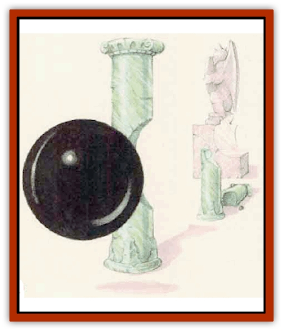

# Blackball

| Statistic | **Blackball** |
| --- | --- |
| **Activity Cycle:** | Any |
| **Alignment:** | Neutral |
| **Armor Class:** | 10 |
| **Climate/Terrain:** | Any |
| **Damage/Attack:** | Nil |
| **Diet:** | Any (see below) |
| **Frequency:** | Very rare |
| **Hit Dice:** | None (see below) |
| **Intelligence:** | Non- (0) |
| **Magic Resistance:** | Nil |
| **Morale:** | Fearless (20) |
| **Movement:** | 3 |
| **No. Appearing:** | 1 |
| **No. of Attacks:** | 0 |
| **Organization:** | Solitary |
| **Size:** | M (5' across) |
| **Special Attacks:** | Disintegration |
| **Special Defenses:** | Disintegration, immune to almost everything |
| **THAC0:** | Nil |
| **Treasure:** | Nil |
| **XP Value:** | 8,000 |

The blackball is a mysterious and extraordinarily dangerous opponent. No one knows precisely how this creature comes into being, or even if it's alive. Also called the *deadly sphere*, it is simply a featureless black globe, 5 feet in diameter. It levitates about slowly and silently, in apparently random patterns, disintegrating everything in its path.

The blackball has no recognizable mind or intelligence.

**Combat:** Whatever solid or liquid matter the blackball touches simply *disintegrates* (no saving throw); the deadly sphere moves freely through anything. This ability makes it immune to all weapons or attacks; even the most magical swords are destroyed immediately by contact with the blackball.

When encountered, the blackball moves toward the nearest intelligent creature within 60 feet. The deadly sphere's ability to sense intelligence extends in three dimensions, so underground adventurers may be surprised by the sudden appearance of a blackball from above or below.

The blackball's advance is relentless, moving in a straight line toward its victim, regardless of the physical or magical barriers in its way. Running away is the only way to deal with a blackball, though that may not be possible in a labyrinth or other such situation. If all intelligent life flees beyond its 60-foot detection range, the blackball will resume its seemingly random movement until another intelligent creature is detected.

If characters close to melee combat range with the blackball, the blackball moves toward one of them (the DM should choose randomly). Because of the blackball's slowness, its target can evade the blackball with a successful Dexterity check, regardless of initiative and other actions; this check, and not an attack roll, determines the blackball's success. If the Dexterity check fails, the blackball catches and disintegrates the opponent. If characters try to fight the blackball, everything that touches it disintegrates.

Immortals can sometimes command a blackball, but it is beyond mortal control. Fortunately, it is extremely rare. It is immune to all spells except a carefully worded *wish*. In additition, if *gate* is cast within 60 feet of the blackball, it moves toward and then through the portal created. Though this transfers the blackball to another plane, whatever is summoned by the *gate* spell might be understandably upset. Other spells and magical effects do nothing to a blackball.

The blackball's power on the Prime Material Plane is nearly absolute; it can utterly destroy any normal magical item. If the blackball touches a *rod of cancellation*, the rod is destroyed and the blackball is rendered immobile for a round (though it still disintegrates anything that touches it). The blackball is unaffected if it moves into an extradimensional space, such as that created by a *portable hole*; however, the blackball can be moved to another plane if within 10 feet when a *portable hole* is is placed within a *bag of holding* and a gate to another plane is opened. If a blackball touches a *sphere of annihilation*, the creature is sent to another plane and everything else within a radius of 200 feet is completely destroyed, including the *sphere of annihilation*. Artifacts are unique items of greater than mortal power; if one contacts a blackball, the results are unpredictable and highly dangerous (and left to the DM's discretion).

**Habitat/Society:** Immortals suspect that blackballs are alive, after a fashion. Mortal sages have presented several hypotheses (guesses, actually) conceming these killers, including the following: (1) Only one blackball exists, and its malevolent force is all that remains of a fiend imprisoned by the Immortals (this theory is usually dismissed because the blackball isn't evil). (2) Blackballs are created by highly intelligent beings who use it to transport creatures to their own plane for study (this theory is usually dismissed because victims are obviously disintegrated). (3) Blackballs are created as destructive instruments by the Old Ones, who are to the Immortals as Immortals are to humans (this theory receives the most acceptance).

No mortal has ever seen more than one blackball at once.

**Ecology:** Blackballs are destructive forces, disruptive to the environment but fortunately too rare to cause more than a local disturbance. Observers report that objects and creatures touched by the blackball vanish suddenly, as if simply wiped out of existence. Wizards have said that it seems most like the results of a *disintegration* spell. However, nothing remains - not even dust or residual essences.

---
## Discovery & Documentation

**Source Publication:** Mystara Appendix (1994)
**Campaign Setting:** Mystara
**Author(s):** John Nephew, Teeuwynn Woodruff, John Terra, Skip Williams

### Other Creatures Found in This Source Book
   * [[Actaeon|Actaeon]]
   * [[Agarat|Agarat]]
   * [[Ash_Crawler|Ash Crawler]]
   * [[Baldandar|Baldandar]]
   * [[Bargda|Bargda]]
   * [[Bhut|Bhut]]
   * [[Bird_Mystara|Bird (Mystara)]]
   * [[Choker|Choker]]
   * [[Coltpixie|Coltpixie]]
   * [[Crone_of_Chaos|Crone of Chaos]]
   * [[Darkhood|Darkhood]]
   * [[Darkwing|Darkwing]]
   * [[Decapus|Decapus]]
   * [[Deep_Glaurant|Deep Glaurant]]
   * [[Diabolus|Diabolus]]
   * [[Dimensional_Warper|Dimensional Warper]]
   * [[Dragon_Mystara_Crystalline|Dragon (Mystara), Crystalline]]
   * [[Dragon_Mystara_Jade|Dragon (Mystara), Jade]]
   * [[Dragon_Mystara_Onyx|Dragon (Mystara), Onyx]]
   * [[Dragon_Mystara_Ruby|Dragon (Mystara), Ruby]]
   * [[Drake_Mystara|Drake (Mystara)]]
   * [[Dragonfly|Dragonfly]]
   * [[Dusanu|Dusanu]]
   * [[Elemental_of_Chaos_Air_Earth|Elemental of Chaos, Air/Earth]]
   * [[Elemental_of_Chaos_Fire_Water|Elemental of Chaos, Fire/Water]]
   * [[Elemental_of_Law_Air_Earth|Elemental of Law, Air/Earth]]
   * [[Elemental_of_Law_Fire_Water|Elemental of Law, Fire/Water]]
   * [[Familiar_Mystara|Familiar (Mystara)]]
   * [[Frost_Salamander|Frost Salamander]]
   * [[Fundamental_Air_Earth|Fundamental, Air/Earth]]
   * [[Fundamental_Fire_Water|Fundamental, Fire/Water]]
   * [[Gargantua_Mystara|Gargantua (Mystara)]]
   * [[Geonid|Geonid]]
   * [[Ghostly_Horde|Ghostly Horde]]
   * [[Giant_Athach|Giant, Athach]]
   * [[Giant_Hephaeston|Giant, Hephaeston]]
   * [[Golem_Drolem|Golem, Drolem]]
   * [[Golem_Mystara_I|Golem (Mystara) I]]
   * [[Golem_Mystara_II|Golem (Mystara) II]]
   * [[Golem_Mystara_III|Golem (Mystara) III]]
   * [[Gray_Philosopher|Gray Philosopher]]
   * [[Guardian_Warrior|Guardian Warrior]]
   * [[Gyerian|Gyerian]]
   * [[Herex|Herex]]
   * [[Hivebrood|Hivebrood]]
   * [[Horde|Horde]]
   * [[Hsiao|Hsiao]]
   * [[Huptzeen|Huptzeen]]
   * [[Hutaakan|Hutaakan]]
   * [[Imp_Mystara|Imp (Mystara)]]
   * [[Jellyfish_Giant_Mystara|Jellyfish, Giant (Mystara)]]
   * [[Kna|Kna]]
   * [[Kopru|Kopru]]
   * [[Lizard_Mystara|Lizard (Mystara)]]
   * [[Lizard-kin_Mystara|Lizard-kin (Mystara)]]
   * [[Lupin|Lupin]]
   * [[Lycanthrope_Werejaguar_Mystara|Lycanthrope, Werejaguar (Mystara)]]
   * [[Lycanthrope_Wereswine|Lycanthrope, Wereswine]]
   * [[Magen|Magen]]
   * [[Manikin|Manikin]]
   * [[Mek|Mek]]
   * [[Mujina|Mujina]]
   * [[Nagpa|Nagpa]]
   * [[Neh-thalggu|Neh-thalggu]]
   * [[Nightshade_Mystara|Nightshade (Mystara)]]
   * [[Nuckalavee|Nuckalavee]]
   * [[Pegataur|Pegataur]]
   * [[Phanaton|Phanaton]]
   * [[Plant_Dangerous_Mystara|Plant, Dangerous (Mystara)]]
   * [[Plasm|Plasm]]
   * [[Rakasta|Rakasta]]
   * [[Rock_Man|Rock Man]]
   * [[Sabreclaw|Sabreclaw]]
   * [[Sacrol|Sacrol]]
   * [[Scamille|Scamille]]
   * [[Shapeshifter|Shapeshifter]]
   * [[Shargugh|Shargugh]]
   * [[Shark-kin|Shark-kin]]
   * [[Sollux|Sollux]]
   * [[Spectral_Death|Spectral Death]]
   * [[Spectral_Hound|Spectral Hound]]
   * [[Spider-kin|Spider-kin]]
   * [[Spirit_Mystara|Spirit (Mystara)]]
   * [[Statue_Living|Statue, Living]]
   * [[Surtaki|Surtaki]]
   * [[Tabi|Tabi]]
   * [[Thoul|Thoul]]
   * [[Thunderhead|Thunderhead]]
   * [[Tiger_Ebon|Tiger, Ebon]]
   * [[Topi|Topi]]
   * [[Tortle|Tortle]]
   * [[Vampire_Velya|Vampire, Velya]]
   * [[White_Fang|White Fang]]
   * [[Worm_Mystara|Worm (Mystara)]]
   * [[Wyrd|Wyrd]]
   * [[Yowler|Yowler]]
   * [[Zombie_Lightning|Zombie, Lightning]]
