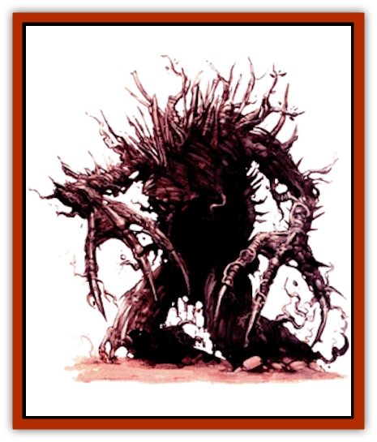

# Blackroot Marauder

| Statistic | **Blackroot Marauder** |
| --- | --- |
| **Activity Cycle:** | Any |
| **Alignment:** | Neutral evil |
| **Armor Class:** | 2 |
| **Climate/Terrain:** | Any |
| **Damage/Attack:** | 3d4/3d4 |
| **Diet:** | None |
| **Frequency:** | Very rare |
| **Hit Dice:** | 9 (40 hit points) |
| **Intelligence:** | Semi- (2-4) |
| **Magic Resistance:** | Nil |
| **Morale:** | Fearless (20) |
| **Movement:** | 15 |
| **No. Appearing:** | 1 |
| **No. of Attacks:** | 2 |
| **Organization:** | Solitary |
| **Size:** | M (7' tall) |
| **Special Attacks:** | Poison thorns, surprise |
| **Special Defenses:** | Immunities, cannot be surprised |
| **THAC0:** | 11 |
| **Treasure:** | Nil |
| **XP Value:** | 6,000 |

Blackroot marauders are magical constructs created by priests of Iuz. Similar to [[Golem_General_Information|golems]], they resemble animated saplings covered with black leaves and thorns. The arrangement of their roots and branches gives them a rudimentary humanoid form. The faint outlines of a leering, evil face in the bark of the marauder is enough to unnerve even the hardiest woodsman.

**Combat:** In combat, blackroot marauders strike twice per round with their thorny branches, causing 3d4 points of damage on a hit. In addition, they can fire 1d6 of their thorns per round at any one target within 30 feet. Anyone struck by one of these thorns must make a successful saving throw vs. poison or lose 1d4 hit points per round for 2d4 rounds. This damage is not cumulative with multiple thorn strikes, but the duration of the poisoning is. Thus, a victim struck by a total of four thorns who fails the saving throw all four times suffers 1d4 points of poison damage for 8d4 rounds. A *neutralize poison* spell stops further damage but won't cure damage already suffered. A *slow poison* spell reduces the damage to only 1 point per round. Launched thorns re-grow at an amazing rate; a marauder effectively has an infinite number of thorns at its disposal. The marauder cannot poison victims with its melee attacks.

Blackroot marauders are immune to all forms of electricity, mind-affecting magic, and poison. They suffer no damage from blunt weapons, only 1 point of damage per strike from piercing weapons, and half damage from slashing weapons. While not moving or attacking, a blackroot marauder is indistinguishable from the surrounding vegetation, granting it a +3 bonus to surprise against all non-druid opponents.

At will, blackroot marauders can cast *know alignment* on all creatures within 60 yards. Marauders can even sense the alignments of creatures in hiding or invisible, so they are thus impossible to surprise.

**Habitat/Society:** Although they possess a rudimentary cunning, blackroot marauders are artificial beings and do not form societies. Since the Flight of the Fiends, Iuz has begun to rely more and more on these creations in the Vesve Forest. Their ability to blend in with the environment makes them the ideal ambush force. Many blackroot marauders are commanded to roam the forest and attack any non-evil creature they encounter. The presence of these creatures has increased since the Flight of the Fiends, making them some of the most notorious adversaries to the rangers of the Vesve Forest.

**Ecology:** The process of creating a blackroot marauder is quite involved. The Bonehart closely guards the secrets of marauder creation, but rumors of the process have been popping up here and there nevertheless.

Only priests of Iuz of at least 12th level or higher can successfully animate a blackroot marauder. The first step in creating one is the preparation of the body. The priest must locate a young sapling of the right height (about 7 feet); this sapling must be growing wild. Once located, the priest must clear the surrounding area in a 15' radius of all vegetation. The sapling must then be kept from the direct light of the sun for a month. Each sunrise and sunset during this cycle, the priest must rub unholy water into the bark of the tree and provide nourishment by pouring warm blood over its roots. On the final day of the month, the priest must cast the following spells on the sapling in the following order: *warp wood*, *spike growth*, *know alignment*, *poison*, *quest*, and *animate object*. With the completion of the *animate object* spell, the blackroot marauder comes to life, ready to obey its master's wishes. Note that some of these spells (notably *warp wood* and *spike growth*) must be cast from scrolls, since Iuz does not normally grant these spells to his clerics and priests.

---
## Discovery & Documentation

**Source Publication:** Dragon270 (2000)
**Campaign Setting:** Dragon Magazine
**Author(s):** 

### Other Creatures Found in This Source Book
   * [[Dirtwraith|Dirtwraith]]
   * [[Kyuss_Hound_of|Kyuss, Hound of]]
   * [[Murdakus|Murdakus]]
