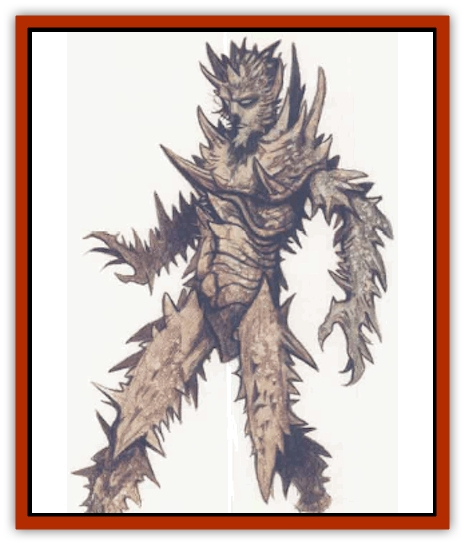

# Bladeling

| Statistic | **Bladeling** |
| --- | --- |
| **Activity Cycle:** | Night |
| **Alignment:** | R,M (individual); D (group) |
| **Armor Class:** | 2 |
| **Climate/Terrain:** | Acheron |
| **Damage/Attack:** | 1d6/1d6 or by weapon |
| **Diet:** | Omnivore |
| **Frequency:** | Rare |
| **Hit Dice:** | 2 to 11 |
| **Intelligence:** | Average (8-10) |
| **Magic Resistance:** | 10% |
| **Morale:** | Elite (13) |
| **Movement:** | 12 |
| **No. Appearing:** | 2-20 |
| **No. of Attacks:** | 2 or 1 |
| **Organization:** | Theocracy |
| **Size:** | M (6' tall) |
| **Special Attacks:** | Razor storm |
| **Special Defenses:** | See below |
| **THAC0:** | 19 to 9 |
| **Treasure:** | Lawful evil (neutral) |
| **XP Value:** | Varies (120 to 3,000) |

Bladelings were once rumored to be [[Tiefling|tieflings]], the spawn of fiends and humanoids. Unlike the other castoffs of the Lower Planes, however, bladelings are a distinct race unto themselves.

Human-shaped, the average bladeling stands about 6 feet tall. The resemblance to humankind ends there. Bladeling eyes glow like translucent chips of glacial ice tinged with purple. Skin and bones protrude in the form of sharp blades of wood and ice and steel, jutting out at all angles; bladelings have no soft flesh. They have blood the color and consistency of oil.

**Combat:** Bladelings are quick to leap into a fray. When entering combat, a bladeling wades in hands first. Striking twice with its metal-encrusted fists, the creature inflicts 1d6 points of damage with each successful attack. Then again, a bladeling might instead wield a weapon of nearly any type. Some bladelings are truly brave. These attack the wielders of the weapons most dangerous to other bladelings first, trying to get a measure of their enemy.

Bladelings are entirely immune to rustiug, acid, corrosive attacks of all types, and normal piercing missiles or bladed weapons. Bladelings are magical beings; their bodies - composed of elements stronger than mere flesh - are resistant to some types of magic. They take only half damage from cold- and fire-based spells. There's not a whole lot that can hurt the them - and they press that advantage. Magical or bludgeoning weapons inflict full damage against them. Other spells affecting metal will work normally on a bladeling; the *heat metal* spell, however, causes double damage. Other heat-based spells, unless specifically designed to work on metal, do nothing.

Once per week, a bladeling can create a *razor storm*. The creature explodes a piece of its outer skin, sending a 5-foot wide hail of blades up to 15 feet forward. The shrapnel attack causes 3d12 points of damage to any within the blast area, though the victims can save vs. breath weapon for half damage. The drawback to this attack is that it weakens the bladeling's natural armor, reducing it from 2 to 6 in the frontal torso. Any attacks striking this area inflict double damage upon the bladeling; fire- and cold-based spells inflict normal damage if directed at this weak spot. In addition, the bladeling's magic resistance falls to 5% untll the bladeling has regenerated the lost blades (typically 1d4 days later)

**Habitat/Society:** Not much is known about the bladelings, for they discourage any investigation into their lives - harshly. They are highly superstitious, and most are exceedingly xenophobic. Though they are courteous to strangers encountered outside their home, they tend to administer swift death to those who invade their territory. Bladelings can become conjurers, priests or fighters. Female bladelings may become fighter/priests, while males may become fighter/wizard (conjurer) specialists.

Certain bladelings have the ability to call on their unknown gods. These bladelings, usually (but not always) female, can achieve 10th level as priestesses. They are the rulers of bladeling society, guiding it as they see fit.

The bladelings live in Ocanthus, the fourth layer of Acheron, amidst the whirling blades of ice and iron. Their city, Zoronor, lies in the Blood Forest. This pulpy mass of wood (and other less savory, unidentifiable material) protects the residents from the whirling blades that are the main feature of this layer.

Zoronor is the only known bladeling city. Here, bladelings obey their priest-king fanatically, having followed his tenets and gained some measure of security, which they will defend with their lives. The city itself yields litle except assassins and travelers.

**Ecology:** Life in Ocanthus is difficult at best. For this reason, bladelings learn to trust in their neighbors and to protect them as well. Though they are prone to internal strife and their priests and priestesses in particular are prey to politics (sometimes to the extent of embroiling parts of the city in their maneuvers), bladelings pull together quickly when faced with outside threats.

Though not originally from Acheron, bladelings have established themselves on the plane and are now considered native. They were nearly wiped out in the first years after their arrival. [[Dragon_Rust|Rust dragons]] inhabiting the plane destroyed large numbers of bladelings with their corrosive breath weapons. Through magical experimentation, however, bladelings finally developed a resistance to rust of any sort.

---
## Discovery & Documentation

**Source Publication:** Monstrous Compendium, 1996 Annual, Volume 3 (1995)
**Campaign Setting:** Advanced Dungeons & Dragons 2nd Edition
**Author(s):** Jon Pickens

### Other Creatures Found in This Source Book
   * [[Alaghi|Alaghi]]
   * [[Alhoon|Alhoon]]
   * [[Aranea_Savage_Coast|Aranea (Savage Coast)]]
   * [[Arcane_Head|Arcane Head]]
   * [[Banedead|Banedead]]
   * [[Banelich|Banelich]]
   * [[Bat_Bonebat|Bat, Bonebat]]
   * [[Beetle|Beetle]]
   * [[Belgoi|Belgoi]]
   * [[Braxat|Braxat]]
   * [[Bunyip|Bunyip]]
   * [[Burbur|Burbur]]
   * [[Bvanen|Bvanen]]
   * [[Cat_Great_Snow_Tiger|Cat, Great, Snow Tiger]]
   * [[Chosen_One|Chosen One]]
   * [[Chronovoid|Chronovoid]]
   * [[Cildabrin|Cildabrin]]
   * [[Coffer_Corpse|Coffer Corpse]]
   * [[Disenchanter|Disenchanter]]
   * [[Dog_Temporal|Dog, Temporal]]
   * [[Dragon_Cerilia|Dragon (Cerilia)]]
   * [[Dragon_Ghost|Dragon, Ghost]]
   * [[Dragon_Lesser_Undead|Dragon, Lesser Undead]]
   * [[Dragon_Neutral_Amber|Dragon, Neutral, Amber]]
   * [[Dread_Warrior|Dread Warrior]]
   * [[Dreamweaver|Dreamweaver]]
   * [[Dream_Spawn_Greater_Ennui|Dream Spawn, Greater, Ennui]]
   * [[Dream_Spawn_Lesser_Morph|Dream Spawn, Lesser, Morph]]
   * [[Dwarf_Arctic|Dwarf, Arctic]]
   * [[Dwarf_Urdunnir|Dwarf, Urdunnir]]
   * [[Eel_Giant_Moray|Eel, Giant Moray]]
   * [[Elemental_Fire_Kin_Tome_Guardian|Elemental, Fire Kin, Tome Guardian]]
   * [[Elf_Rockseer|Elf, Rockseer]]
   * [[Ethyk|Ethyk]]
   * [[Faerie_Faerie_Fiddler|Faerie, Faerie Fiddler]]
   * [[Faerie_Petty_Bramble|Faerie, Petty, Bramble]]
   * [[Faerie_Petty_Gorse|Faerie, Petty, Gorse]]
   * [[Faerie_Petty|Faerie, Petty]]
   * [[Firenewt|Firenewt]]
   * [[Formian|Formian]]
   * [[Gargoyle_II|Gargoyle II]]
   * [[Giant_Cerilia|Giant (Cerilia)]]
   * [[Goblin_Cerilia|Goblin (Cerilia)]]
   * [[Golem_Magic|Golem, Magic]]
   * [[Golem_Shaboath|Golem, Shaboath]]
   * [[Hag_Bheur|Hag, Bheur]]
   * [[Hamadryad|Hamadryad]]
   * [[Hound_of_Ill-Omen|Hound of Ill-Omen]]
   * [[Human_Cerilia|Human (Cerilia)]]
   * [[Hybsil|Hybsil]]
   * [[Ibrandlin|Ibrandlin]]
   * [[Imp_Chaos|Imp, Chaos]]
   * [[Ixitxachitl_Ixzan|Ixitxachitl, Ixzan]]
   * [[Jabberwock|Jabberwock]]
   * [[Kyton|Kyton]]
   * [[Kyuss_Son_of|Kyuss, Son of]]
   * [[Lillend|Lillend]]
   * [[Life-Shaped_Creation_Guardian|Life-Shaped Creation, Guardian]]
   * [[Life-Shaped_Creation_Transport|Life-Shaped Creation, Transport]]
   * [[Lycanthrope_Werecrocodile|Lycanthrope, Werecrocodile]]
   * [[Lycanthrope_Werespider|Lycanthrope, Werespider]]
   * [[Magedoom|Magedoom]]
   * [[Manotaur|Manotaur]]
   * [[Mastiff_Shadow|Mastiff, Shadow]]
   * [[Meazel|Meazel]]
   * [[Mist_Scarlet_Dancer|Mist, Scarlet Dancer]]
   * [[Needleman|Needleman]]
   * [[Orc_Neo-Orog|Orc, Neo-Orog]]
   * [[Orc_Ondonti|Orc, Ondonti]]
   * [[Owlbear_II|Owlbear II]]
   * [[Pegataur|Pegataur]]
   * [[Phaerimm|Phaerimm]]
   * [[Reggelid|Reggelid]]
   * [[Render|Render]]
   * [[Saurial|Saurial]]
   * [[Scalamagdrion|Scalamagdrion]]
   * [[Sharn|Sharn]]
   * [[Snake_Messenger|Snake, Messenger]]
   * [[Spirit_Forest_Uthraki|Spirit, Forest, Uthraki]]
   * [[Spirit_Forest_Wood_Man|Spirit, Forest, Wood Man]]
   * [[Spirit_Ice_Orglash|Spirit, Ice, Orglash]]
   * [[Spirit_Rock_Thomil|Spirit, Rock, Thomil]]
   * [[Strider_Giant|Strider, Giant]]
   * [[Tembo|Tembo]]
   * [[Temporal_Glider|Temporal Glider]]
   * [[Temporal_Stalker|Temporal Stalker]]
   * [[Tether_Beast|Tether Beast]]
   * [[Thessalmonster|Thessalmonster]]
   * [[Time_Dimensional|Time Dimensional]]
   * [[Tomb_Tapper|Tomb Tapper]]
   * [[Undead_Dragon_Slayer|Undead Dragon Slayer]]
   * [[Unicorn_Black_Toril|Unicorn, Black (Toril)]]
   * [[Vaath|Vaath]]
   * [[Vortex_Spider|Vortex Spider]]
   * [[Weredragon|Weredragon]]
   * [[Zhentarim_Spirit|Zhentarim Spirit]]
