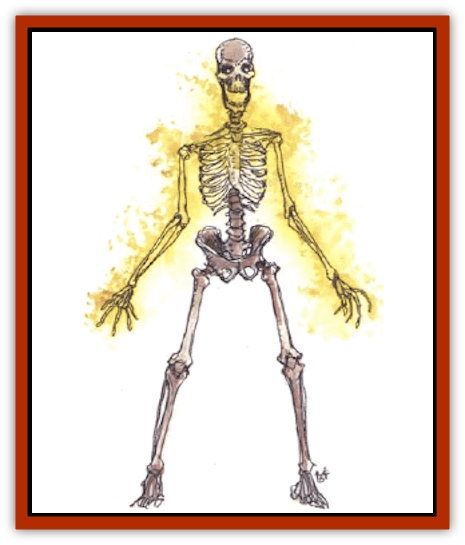
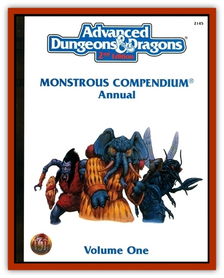

# Blazing Bones

| Statistic | **Blazing Bones** |
| --- | --- |
| **Activity Cycle:** | Any |
| **Alignment:** | Chaotic evil |
| **Armor Class:** | 5 |
| **Climate/Terrain:** | Any land |
| **Damage/Attack:** | 1d4+2 (&times;2) |
| **Diet:** | None |
| **Frequency:** | Very rare |
| **Hit Dice:** | 5+5 |
| **Intelligence:** | As in life (very-genius, 11-18), but insane |
| **Magic Resistance:** | See below |
| **Morale:** | Fearless (20) |
| **Movement:** | 12 |
| **No. Appearing:** | 1 |
| **No. of Attacks:** | 2 |
| **Organization:** | Solitary |
| **Size:** | M (average 6' tall) |
| **Special Attacks:** | Hurling fire |
| **Special Defenses:** | See below |
| **THAC0:** | 15 |
| **Treasure:** | Nil |
| **XP Value:** | 3,000 |

Blazing bones are undead accidentally created when a priest or wizard who has prepared or partially prepared *contingency* magic to prevent death is killed by fiery damage. The casted magic twists the contingency provisions so the unfortunate victim passes into undeath in the heart of a roaring column of flame. Tormented by the endless agony of fire, the priest's or wizard's nature (including alignment, Hit Dice, and thoughts) changes. Hurling flame lessens the pain momentarily, and pouring fire into another living being reduces it considerably, so blazing bones soon become stalking killers, exulting in fiery destruction.

A blazing bones appears as a human [[Skeleton|skeleton]] with a nimbus of flames dancing along its shoulders and small balls of flame encircling its hands.

**Combat:** Blazing bones inflict only 1d4 points of damage per blow to creatures immune to fire, but against all others they strike fiery blows, adding 2 points of damage to each hit. In any round, one of them may forgo one of its hand attacks in favor of hurling a head-sized ball of expanding flames up to 20 feet distant, dealing 1d6+3 damage to creatures struck, igniting flammable things, and forcing item saving throws vs. magical fire. (Handle misses with the scatter diagram - see "Grenadtulike Missiles" in the DMG.) The blazing bones can also (once per turn) forgo both attacks to create a firestorm, collapsing into a whirlwind of bones and flames that act as a *fireball* (6d6 damage, save for half damage) which erupts from where they stand and expands to a 30-foot-radius sphere. A blazing bones may try to embrace a foe before erupting into a firestorm; in this case, it is allowed an attack roll. Success indicates that it strikes the target (no saving throw allowed), and failure means that it misses - consult the scatter diagram.

Blazing bones are immune to all fire and heat damages and magical heat and fire actually augment their hit points. Treat all damage normally inflicted by such magic as hit points *gained*, first healing any missing points and then permanently raising the monster's hit-point total. For each 8 hp gained by a blazing bones, it gains 1 Hit Die.

Blazing bones are turned as ghasts and are immune to *charm*, *hold*, and *sleep* spells. Cold-based attacks inflict normal damage, holy water causes 4d4 points of damage per vial (2d4 if only a splash), and normal water inflicts 2d4 points of damage per bucket (1d4 per splash). Alcoholic liquids do not damage a blazing bones. Blunt weapons impose normal damage, but edged or piercing weapons inflict only half damage.

**Habitat/Society:** Blazing bones hate life and the happiness of others. Some former priests even believe their fiery attacks cleanse the world around them, if one can judge by the words they howl - they can roar crackling words from their empty mouths, and they often taunt or threaten adversaries. Blazing bones avoid each other and all other types of undead. However, if a battle with other undead is forced upon them, their flames inflict double damage upon "cold" undead such as [[Vampire_General_Information|vampires]], [[Lich|liches]], [[Wight|wights]], and [[Ghoul|ghouls]].

There have been cases where evil archmages or high priests have deliberately created blazing bones as guardians, by slaying underling wizards or priests after laying control magic on them. In such cases, blazing bones may be found in groups of as many as eight. They can never be directly controlled by their creator. However, they can be compelled to remain within a certain area or structure, and not attack their creator.

**Ecology:** Blazing bones are among the most destructive of undead. They serve no purpose in the cycles of life, save to burn and spur renewal as forest fires do. Their fire can cleanse away disease germs, and at least one archmage has used a blazing bones as a walking garbage-furnace.

---
## Discovery & Documentation

**Source Publication:** Monstrous Compendium, 1994 Annual, Volume 1 (1995)
**Campaign Setting:** Advanced Dungeons & Dragons 2nd Edition
**Author(s):** David Wise

### Other Creatures Found in This Source Book
   * [[Abyss_Ant|Abyss Ant]]
   * [[Achaierai|Achaierai]]
   * [[Afanc|Afanc]]
   * [[Al-Jahar|Al-Jahar]]
   * [[Baelnorn|Baelnorn]]
   * [[Baneguard|Baneguard]]
   * [[Banelar|Banelar]]
   * [[Bird_Talking|Bird, Talking]]
   * [[Campestri|Campestri]]
   * [[Caniquine|Caniquine]]
   * [[Cat_Winged|Cat, Winged]]
   * [[Crypt_Servant|Crypt Servant]]
   * [[Death's_Head_Tree|Death's Head Tree]]
   * [[Dog_Saluqi|Dog, Saluqi]]
   * [[Dragon_Electrum|Dragon, Electrum]]
   * [[Dragon_Fang|Dragon, Fang]]
   * [[Dragon_Linnorm_Corpse_Tearer|Dragon, Linnorm, Corpse Tearer]]
   * [[Dragon_Linnorm_Dread|Dragon, Linnorm, Dread]]
   * [[Dragon_Linnorm_Flame|Dragon, Linnorm, Flame]]
   * [[Dragon_Linnorm_Forest|Dragon, Linnorm, Forest]]
   * [[Dragon_Linnorm_Frost|Dragon, Linnorm, Frost]]
   * [[Dragon_Linnorm_Gray|Dragon, Linnorm, Gray]]
   * [[Dragon_Linnorm_Land|Dragon, Linnorm, Land]]
   * [[Dragon_Linnorm_Midgard|Dragon, Linnorm, Midgard]]
   * [[Dragon_Linnorm_Rain|Dragon, Linnorm, Rain]]
   * [[Dragon_Linnorm_Sea|Dragon, Linnorm, Sea]]
   * [[Dragon_Neutral_Jacinth|Dragon, Neutral, Jacinth]]
   * [[Dragon_Neutral_Jade|Dragon, Neutral, Jade]]
   * [[Dragon_Neutral_Pearl|Dragon, Neutral, Pearl]]
   * [[Dread|Dread]]
   * [[Dragon-kin|Dragon-kin]]
   * [[Elemental_Earth_Kin_Chrysmal|Elemental, Earth Kin, Chrysmal]]
   * [[Elemental_Earth_Kin_Earth_Weird|Elemental, Earth Kin, Earth Weird]]
   * [[Elemental_Fire_Kin_Azer|Elemental, Fire Kin, Azer]]
   * [[Elemental_Sandman|Elemental, Sandman]]
   * [[Elemental_Wind_Walker|Elemental, Wind Walker]]
   * [[Elemental_Vermin|Elemental Vermin]]
   * [[Feystag|Feystag]]
   * [[Flame_Skull|Flame Skull]]
   * [[Foulwing|Foulwing]]
   * [[Gambado|Gambado]]
   * [[Garbug|Garbug]]
   * [[Genie_Tasked_Administrator|Genie, Tasked, Administrator]]
   * [[Genie_Tasked_Deceiver|Genie, Tasked, Deceiver]]
   * [[Genie_Tasked_Harim_Servant|Genie, Tasked, Harim Servant]]
   * [[Genie_Tasked_Messenger|Genie, Tasked, Messenger]]
   * [[Genie_Tasked_Miner|Genie, Tasked, Miner]]
   * [[Genie_Tasked_Oathbinder|Genie, Tasked, Oathbinder]]
   * [[Gibbering_Mouther|Gibbering Mouther]]
   * [[Gnasher|Gnasher]]
   * [[Gnasher_Winged|Gnasher, Winged]]
   * [[Golem_Brain|Golem, Brain]]
   * [[Golem_Hammer|Golem, Hammer]]
   * [[Golem_Metagolem|Golem, Metagolem]]
   * [[Golem_Spiderstone|Golem, Spiderstone]]
   * [[Gorynych|Gorynych]]
   * [[Greelox|Greelox]]
   * [[Helmed_Horror|Helmed Horror]]
   * [[Jarbo|Jarbo]]
   * [[Laraken|Laraken]]
   * [[Lich_Psionic|Lich, Psionic]]
   * [[Living_Steel|Living Steel]]
   * [[Lock_Lurker|Lock Lurker]]
   * [[Loxo|Loxo]]
   * [[Lycanthrope_Loup_de_Noir|Lycanthrope, Loup de Noir]]
   * [[Lycanthrope_Werebadger|Lycanthrope, Werebadger]]
   * [[Lycanthrope_Werejaguar|Lycanthrope, Werejaguar]]
   * [[Lythlyx|Lythlyx]]
   * [[Magebane|Magebane]]
   * [[Marrashi|Marrashi]]
   * [[Metalmaster|Metalmaster]]
   * [[Mimic_House_Hunter|Mimic, House Hunter]]
   * [[Naga_Bone|Naga, Bone]]
   * [[Nautilus_Giant|Nautilus, Giant]]
   * [[Nightshade_Toril|Nightshade (Toril)]]
   * [[Nishruu|Nishruu]]
   * [[Noran|Noran]]
   * [[Opinicus|Opinicus]]
   * [[Ormyrr|Ormyrr]]
   * [[Parasite|Parasite]]
   * [[Pasari-Niml|Pasari-Niml]]
   * [[Plant_Vampire_Moss|Plant, Vampire Moss]]
   * [[Pteraman|Pteraman]]
   * [[Rautym|Rautym]]
   * [[Shadeling|Shadeling]]
   * [[Skum|Skum]]
   * [[Snake_Giant_Cobra|Snake, Giant Cobra]]
   * [[Snake_Stone|Snake, Stone]]
   * [[Spectral_Wizard|Spectral Wizard]]
   * [[Spell_Weaver|Spell Weaver]]
   * [[Spider_Brain|Spider, Brain]]
   * [[Suwyze|Suwyze]]
   * [[Tatalla|Tatalla]]
   * [[Tick_Heart|Tick, Heart]]
   * [[Tree_Dark|Tree, Dark]]
   * [[Tree_Singing|Tree, Singing]]
   * [[Tressym|Tressym]]
   * [[Troll_Snow|Troll, Snow]]
   * [[Tuyewera|Tuyewera]]
   * [[Ulitharid|Ulitharid]]
   * [[Undead_Dwarf|Undead Dwarf]]
   * [[Undead_Lake_Monster|Undead Lake Monster]]
   * [[Whipsting|Whipsting]]
   * [[Windghost|Windghost]]
   * [[Wolf_Dread|Wolf, Dread]]
   * [[Wolf_Stone|Wolf, Stone]]
   * [[Wolf_Vampiric|Wolf, Vampiric]]
   * [[Wraith_Shimmering|Wraith, Shimmering]]
   * [[Xantravar|Xantravar]]
   * [[Xaver|Xaver]]
