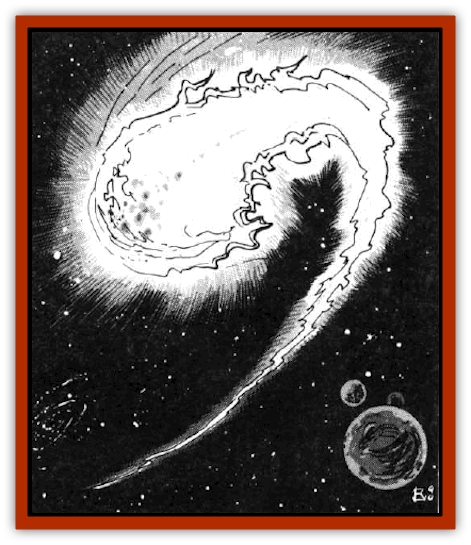

# Blazozoid

| Statistic | **Blazozoid** |
| --- | --- |
| **Activity Cycle:** | Any |
| **Alignment:** | Chaotic neutral |
| **Armor Class:** | 7 |
| **Climate/Terrain:** | Wildspace |
| **Damage/Attack:** | 8d6 |
| **Diet:** | Any matter |
| **Frequency:** | Rare |
| **Hit Dice:** | 15 |
| **Intelligence:** | Very (11-12) |
| **Magic Resistance:** | Nil |
| **Morale:** | Champion (15) |
| **Movement:** | Fl 36 (B) (or Sr 1) |
| **No. Appearing:** | 1 |
| **No. of Attacks:** | 1 |
| **Organization:** | Solitary |
| **Size:** | G (30' diameter) |
| **Special Attacks:** | Firetouch |
| **Special Defenses:** | See below |
| **THAC0:** | 5 |
| **Treasure:** | Nil |
| **XP Value:** | 12,000 |

Blazozoids resemble huge, white [[Elmarin|elmarin]] or small comets of creamy white flame. Their spherical bodies consist entirely of fiery plasma gas, though they often drag a tail of blue fire behind them when traveling at Spelljammer speeds.

Blazozoids are sentient balls of living energy with the ability to communicate telepathically. They are always encountered in wildspace, never on planets or in the phlogiston. Their fiery bodies are so hot that they burn up any matter (including air and water) that they contact (see the explanation of "firetouch" below). In addition, their superheated bodies ignite any phlogiston within a hundred feet of them. Should a blazozoid be foolish enough to expose itself to the phlogiston ocean, the resulting explosion vaporizes everything within a mile, including the blazozoid. (Affected characters must roll successful saving throws vs. dragon breath to survive. Items and beings are thrown 1d10 miles away from the center of the explosion and suffer 1d10 points of damage for each mile thrown.)

**Combat:** Blazozoids usually ignore passing spelljammer ships unless bothered in some way. However, blazozoids do approach ships when they want one of two things: either a ride through the phlogiston or a meal. If the party refuses to give the blazozoid a ride, or if it is searching for a meal, it attacks.

Blazozoids attack by ramming into their target, whether it is an individual or an entire ship. The initial impact causes 8d6 points of damage. The blazozoid then tries to remain in contact with the target, using its firetouch to consume it. Any living victim touched by a blazozoid must roll a successful saving throw vs. breath weapon or burst into flames, suffering 5d6 points of damage each round he remains in contact with the blazozoid. Those attempting to escape a blazozoid's grasp must roll a successful Dexterity check. Inanimate objects touched by a blazozoid must roll a successful saving throw vs. magical fire or burst into flames, suffering an additional 3d6 points of damage per round until removed from contact with the blazozoid and the fire is extinguished.

Blazozoids are immune to fire damage, whether magical or normal. In addition, any weapon that strikes a blazozoid and fails a saving throw vs. normal fire is destroyed by the heat (although the weapon still inflicts full damage). Weapons with a bonus of +3 or more are immune to this effect. Cold-and water-based attacks have their normal effects on blazozoids.

**Habitat/Society:** Blazozoids are the progeny of a huge, living star. Like the blazozoids themselves, this star consists of living energy. Unfortunately, this star, which refers to itself as "I", does not recognize material beings as alive, much less intelligent. Therefore, it believes itself to be the only sentient being in the universe. To determine whether this is true, *I* has formed millions of emissaries from its own body and dispatched them to the far ends of the universe in search of another living star.

The blazozoids are these emissaries. Although intelligent, they are completely incapable of altering the basic beliefs that *I* imprinted upon them at their creation. Therefore, they do not believe that material beings, such as the PCs, are truly intelligent. Instead, they view material beings as potential food sources, or, at best, as a means of transport across the phlogiston.

**Ecology:** Blazozoids cannot reproduce and must be created from *I*'s body. They eat, or refuel, by turning matter into energy. Since their bodies are made entirely of energy, a well-fed blazozoid may be as much as 60 feet across, while one that has not eaten in some time may be less than 10 feet across (a starving blazozoid also has a slightly yellow tinge to its flame).

When encountered in the depths of wildspace (i.e., close to a crystal sphere), a blazozoid is sure to want something from a passing spelljammer ship - either to eat the ship and crew, or to convince the pilots to take it to the next crystal sphere. Often, the blazozoid will agree to perform some service in return for its passage. However, if some provision for feeding the blazozoid during the long journey is not made, it may turn on the crew after reaching the next crystal sphere. To transport a blazozoid across the phlogiston, the blazozoid must be completely encased in some sort of flame-proof container, such as iron, stone. or force. Simply stowing them below decks will have disastrous effects when the ship enters the phlogiston.

---
## Discovery & Documentation

**Source Publication:** MC7 Spelljammer Appendix I (1990)
**Campaign Setting:** Advanced Dungeons & Dragons 2nd Edition
**Author(s):** various

### Other Creatures Found in This Source Book
   * [[Aartuk|Aartuk]]
   * [[Albari|Albari]]
   * [[Ancient_Mariner|Ancient Mariner]]
   * [[Argos|Argos]]
   * [[Beholder_Abomination_Astereater|Beholder (Abomination), Astereater]]
   * [[Chattur|Chattur]]
   * [[Chevall|Chevall]]
   * [[Clockwork_Horror|Clockwork Horror]]
   * [[Colossus|Colossus]]
   * [[Delphinid|Delphinid]]
   * [[Dizantar|Dizantar]]
   * [[Dog|Dog]]
   * [[Dog_Bog_Hound|Dog, Bog Hound]]
   * [[Esthetic|Esthetic]]
   * [[Focoid|Focoid]]
   * [[Fractine|Fractine]]
   * [[Giant_Spacesea|Giant, Spacesea]]
   * [[Golem_Furnace|Golem, Furnace]]
   * [[Golem_Radiant|Golem, Radiant]]
   * [[Gravislayer|Gravislayer]]
   * [[Grommam|Grommam]]
   * [[Hadozee|Hadozee]]
   * [[Hamster_Giant_Space|Hamster, Giant Space]]
   * [[Jammer_Leech|Jammer Leech]]
   * [[Lakshu|Lakshu]]
   * [[Lumineaux|Lumineaux]]
   * [[Lutum|Lutum]]
   * [[Mimic_Space|Mimic, Space]]
   * [[Misi|Misi]]
   * [[Moon_Rogue|Moon, Rogue]]
   * [[Mortiss|Mortiss]]
   * [[Murderoid|Murderoid]]
   * [[Nay-Churr|Nay-Churr]]
   * [[Phlog-Crawler|Phlog-Crawler]]
   * [[Plasman|Plasman]]
   * [[Plasmoid_DeGleash|Plasmoid, DeGleash]]
   * [[Plasmoid_DelNoric|Plasmoid, DelNoric]]
   * [[Plasmoid_General_Information|Plasmoid, General Information]]
   * [[Plasmoid_Ontalak|Plasmoid, Ontalak]]
   * [[Puffer|Puffer]]
   * [[Q'nidar|Q'nidar]]
   * [[Rastipede|Rastipede]]
   * [[Reigar|Reigar]]
   * [[Rock_Hopper|Rock Hopper]]
   * [[Slinker|Slinker]]
   * [[Spider_Asteroid|Spider, Asteroid]]
   * [[Spiritjam|Spiritjam]]
   * [[Survivor|Survivor]]
   * [[Syllix|Syllix]]
   * [[Symbiont_Power|Symbiont, Power]]
   * [[Vine_Infinity|Vine, Infinity]]
   * [[Wiggle|Wiggle]]
   * [[Wizshade|Wizshade]]
   * [[Wryback|Wryback]]
   * [[Zard|Zard]]
   * [[Zodar|Zodar]]
