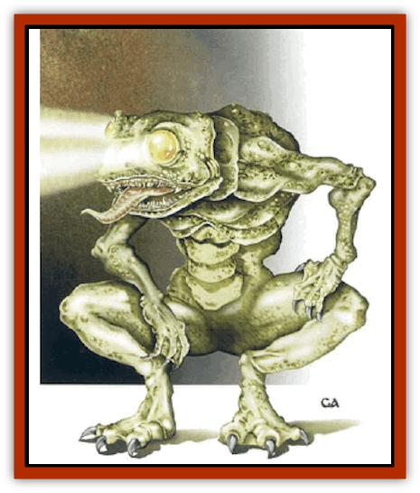

# Blindheim

| Statistic | **Blindheim** |
| --- | --- |
| **Activity Cycle:** | Any |
| **Alignment:** | Chaotic evil |
| **Armor Class:** | 3 (base, see below) |
| **Climate/Terrain:** | Subterranean |
| **Damage/Attack:** | 1d8 |
| **Diet:** | Omnivore |
| **Frequency:** | Very rare |
| **Hit Dice:** | 4+2 |
| **Intelligence:** | Animal (1) |
| **Magic Resistance:** | Nil |
| **Morale:** | Average (8-10) |
| **Movement:** | 9 |
| **No. Appearing:** | 1-4 |
| **No. of Attacks:** | 1 |
| **Organization:** | Solitary |
| **Size:** | S (4' tall) |
| **Special Attacks:** | Blinding stare |
| **Special Defenses:** | Immune to glare |
| **THAC0:** | 17 |
| **Treasure:** | Nil (B) |
| **XP Value:** | 270 / Leader: 420 / Ruler: 650 |

The blindheim is a subterranean, [[Frog|frog]]like humanoid with huge eyes that shine like searchlights, projecting twin beams of light at will. The creature is colored in varying shades of yellow, darker shades on its back contrasting with lighter shades on its underbelly. Its feet are three-toed and webbed, while its hands have four digits (including a thumb) and have hooked talons. Its wide mouth has needle-like teeth and fang incisors. They are not known to use tools.

It is not known if blindheims have an actual language, but they seem to communicate among themselves by means of guttural croaking.

**Combat:** While resting, the blindheim keeps its eyes covered by means of an extra eyelid. It attacks by instantaneously opening its eyes, relying on its acute sense of hearing to indicate the direction of the target. Those who come within 30 feet of its searchlight eyes must make an immediate saving throw vs. wand or be blinded for 1d10+10 rounds. Creatures relying on infravision have a -3 penalty to the saving throw.

Even those who successfully make the saving throw cannot look directly into the searchlight glare of its eyes; even they attack at a penalty of -2 unless immune to the dazzling effects of bright light. Bllndheims are themselves immune to the dazzling effects of bright light, including their own reflected gaze.

At close quarters, blindheims attack with a vicious bite that inflicts 1d8 points of damage. Tiny opponents (size T) are swallowed whole on a roll 4 greater than that needed to hit; such creatures take 2d4 points of damage per round from the blindheim's digestive acids.

**Habitat/Society:** Blindheims thrive in damp underground settings, dwelling near underground pools, lakes, and similar bodies of water. They are amphibious, and can move with equal facility in water as on land. Most often encountered individually or in small groups, at intervals many of them will gather in one place. They then move through the area as a ravening horde, numbering tens or even hundreds of creatures, attacking and devouring all in their path. Then, just as suddenly, they will quietly disperse, disappearing back into their individual subterranean territories.

If the eyes of a dead blindheim are opened, they are revealed to be a dull gold color.

**Ecology:** Blindheims are omnivorous. These creatures are able to eat all but the most toxic [[Fungus|fungi]] and mosses, and are quite willing to supplement their diet with other underground creatures. They are highly successful at keeping down the numbers of tiny creatures such as [[Gremlin_Jermlaine|jermlaine]]. They are particularly troublesome to creatures adverse to bright light, such as [[Goblin|goblins]] and [[Elf_Drow|drow]].

**Advanced Blindheim**

  About 10% of encounters with blindheim will be with members of an advanced tribe. They are generally similar to their less advanced cousins, except that they have a rudimentary language, use tools, and dwell together in crudely constructed villages of 30 to 120 members. Warriors will be armed with one or two barbed darts that they hurl like javelins (20/40/60, 1d6 damage). For every 10 blindheims, a leader with 5+3 HD and unusual color and ability is present (see below). If 100 or more are encountered, they are led by an exceptional leader of 7+4 HD whom eyes also can project a *rainbow pattern* to a distance of 60 feet. Any settlement of 50 or more members has a shaman/witch-doctor of at least 3rd-level ability, and one of 100 or more has two such spellcasters and another of 5th-level ability. Most advanced tribes worship the [[Slaad|slaadi]].

The following types of blindheims have been reported:

*Amber:* The eyes do not blind, but instead have the effect of a *hypnotic pattern*. Creatures making a successful saving throw are slowed for 2d4 rounds instead.

*White:* Every 3rd round, the eyes of this blindheim can discharge a *sunburst*, as if from a *wand of illumination*.

*Blue:* The eyes do not blind, instead, those in their sweep are illuminated by *faerie fire*. The effect lasts 1d6+1 turns (only 1d4 rounds if a saving throw vs. spell is made).

*Gold:* In addition to its eye beams, this blindheim can discharge a small fireball from its mouth once per 3 rounds. These have a range of 30 yards, an area of effect of 10 feet, and inflict 3d6 points of fire damage.

---
## Discovery & Documentation

**Source Publication:** Monstrous Compendium, 1997 Annual, Volume 4 (1995)
**Campaign Setting:** Advanced Dungeons & Dragons 2nd Edition
**Author(s):** Jon Pickens

### Other Creatures Found in This Source Book
   * [[Anemone_Giant_Sea|Anemone, Giant Sea]]
   * [[Asperii|Asperii]]
   * [[Bainligor|Bainligor]]
   * [[Beast_of_Chaos|Beast of Chaos]]
   * [[Bloodsipper_Far_Realm|Bloodsipper (Far Realm)]]
   * [[Bulette_Gohlbrorn|Bulette, Gohlbrorn]]
   * [[Child_of_the_Sea|Child of the Sea]]
   * [[Clockwork_Horror|Clockwork Horror]]
   * [[Clockwork_Swordsman|Clockwork Swordsman]]
   * [[Coral|Coral]]
   * [[Darklore|Darklore]]
   * [[Dharculus|Dharculus]]
   * [[Dolphin_Athas|Dolphin (Athas)]]
   * [[Dragon_Neutral_Moonstone|Dragon, Neutral, Moonstone]]
   * [[Dragon_Prismatic|Dragon, Prismatic]]
   * [[Dream_Stalker|Dream Stalker]]
   * [[Dragon-kin_Albino_Wyrm|Dragon-kin, Albino Wyrm]]
   * [[Echyan|Echyan]]
   * [[Firestar|Firestar]]
   * [[Firetail|Firetail]]
   * [[Fish_Ascallion|Fish, Ascallion]]
   * [[Fish_Deep_Ocean|Fish, Deep Ocean]]
   * [[Fish_Tropical|Fish, Tropical]]
   * [[Fish_Vurgens|Fish, Vurgens]]
   * [[Fogwarden|Fogwarden]]
   * [[Fraal|Fraal]]
   * [[Giant_Crag|Giant, Crag]]
   * [[Gibberling_Brood|Gibberling, Brood]]
   * [[Glutton_Sea|Glutton, Sea]]
   * [[Golden_Ammonite|Golden Ammonite]]
   * [[Golem_Brass_Minotaur|Golem, Brass Minotaur]]
   * [[Golem_Gemstone|Golem, Gemstone]]
   * [[Golem_Maggot|Golem, Maggot]]
   * [[Groundling|Groundling]]
   * [[Hermit_Sea|Hermit, Sea]]
   * [[Hound_of_Law|Hound of Law]]
   * [[Human_Amazon|Human, Amazon]]
   * [[Human_Pygmy|Human, Pygmy]]
   * [[Inquisitor|Inquisitor]]
   * [[Kercpa|Kercpa]]
   * [[Kreel|Kreel]]
   * [[Lycanthrope_Lythari|Lycanthrope, Lythari]]
   * [[Mercurial|Mercurial]]
   * [[Mold_Chromatic|Mold, Chromatic]]
   * [[Mummy_Bog|Mummy, Bog]]
   * [[Neh-thalggu|Neh-thalggu]]
   * [[Nymph_Grain|Nymph, Grain]]
   * [[Nymph_Unseelie|Nymph, Unseelie]]
   * [[Octopus_Octo-Jelly|Octopus, Octo-Jelly]]
   * [[Puddingfish|Puddingfish]]
   * [[Sea_Demon|Sea Demon]]
   * [[Shade|Shade]]
   * [[Shadowrath|Shadowrath]]
   * [[Shark_Athas|Shark (Athas)]]
   * [[Siren_Ravenloft|Siren (Ravenloft)]]
   * [[Skeleton_Variant|Skeleton, Variant]]
   * [[Skyfish|Skyfish]]
   * [[Spectral_Scion|Spectral Scion]]
   * [[Spyder_Fiend|Spyder Fiend]]
   * [[Squid_Squark|Squid, Squark]]
   * [[Tanar'ri_Lesser_Uridezu|Tanar'ri, Lesser, Uridezu]]
   * [[Troll_Mutate|Troll Mutate]]
   * [[Vaati|Vaati]]
   * [[Vampire_Cerebral|Vampire, Cerebral]]
   * [[Varkha|Varkha]]
   * [[Wizshade|Wizshade]]
   * [[Worm_Lukhorn|Worm, Lukhorn]]
   * [[Wyste|Wyste]]
   * [[Yugoloth_Lesser_Gacholoth|Yugoloth, Lesser, Gacholoth]]
   * [[Zombie_Mud|Zombie, Mud]]
