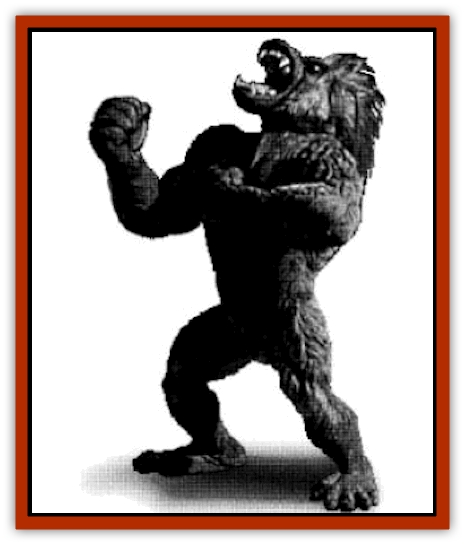
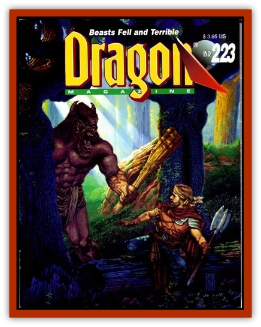

# Blizzard

| Statistic | **Blizzard** |
| --- | --- |
| **Activity Cycle:** | Day |
| **Alignment:** | Neutral good |
| **Armor Class:** | -4 |
| **Climate/Terrain:** | Any |
| **Damage/Attack:** | 2-20/2-24/4-40 |
| **Diet:** | Omnivore |
| **Frequency:** | Unique |
| **Hit Dice:** | 18+12 |
| **Intelligence:** | Supra-genius (19-20) |
| **Magic Resistance:** | 60% |
| **Morale:** | Champion (15-16) |
| **Movement:** | 30 |
| **No. Appearing:** | 1 |
| **No. of Attacks:** | 3 |
| **Organization:** | Solitary |
| **Size:** | L (20') |
| **Special Attacks:** | See below |
| **Special Defenses:** | See below |
| **THAC0:** | 5 |
| **Treasure:** | A |
| **XP Value:** | 17,000 |

Blizzard is the noblest of the seven ancient gods of "Urth". He personifies the essence of the animal spirit. After being frozen for millenia at the heart of an immense glacier, he was released when the Urth met the Great Meteor.

His dwelling is known simply as "the Cliff" - a snowy plateau with a magnificent mountain nearby.

**Combat:** In combat, Blizzard uses his large and powerful hands to pound his opponents into submission, followed by a vicious bite attack. As Blizzard's right arm is more powerful than his left, it can inflict more damage.

His breath weapon is a powerful cone-shaped blast of ice-air which he can emit up to 20 times per day. He must wait a round between these freezing blasts. The area is a cone 60' long and 30' wide. It causes 20d10 hp damage (a successful save vs. breath causes half damage). Those who survive have a +2 initiative penalty in the next round as they try to shake off the freezing effects.

Blizzard can also call forth an *ice strike* (duplicating the 5th-level priest's *spellflame strike*, but the damage is caused by extreme cold) up to six times per day. Initiative penalties as described with the breath weapon also apply.

He is immune to all cold and electrical damage, and only takes half damage from acid- and poison-based attacks.

**Habitat/Society:** Blizzard's social tendency is a solitary one. He is an enigmatic, legend-like figure, whose worshipful human followers include Tundra tribesmen, warriors, nomads, and - as the embodiment of the animal spirit-rangers, druids, and certain specialty priests and beast lords.

His roars are often heard high in the mountain ranges during terrible thunder storms. For this reason, many tribesfolk refer to him as "Thunder Lord".

At periodic intervals, usually on the evening of a new moon, the tribesmen leave offerings for him on a huge altar constructed deep within the labyrinthine glacial caves that constitute his lair.

---
## Discovery & Documentation

**Source Publication:** Dragon223 (1995)
**Campaign Setting:** Dragon Magazine
**Author(s):** Rob Letts, Wayne A. Haskett
