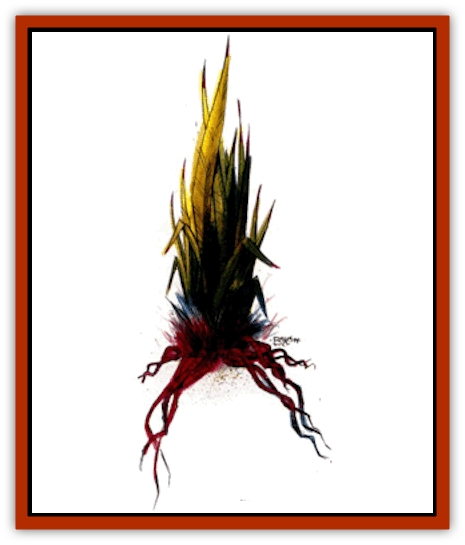

# Bloodgrass

| Statistic | **Bloodgrass** |
| --- | --- |
| **Activity Cycle:** | Any |
| **Alignment:** | Neutral |
| **Armor Class:** | 8 |
| **Climate/Terrain:** | Verdant belt, forest |
| **Damage/Attack:** | 1 point |
| **Diet:** | Carnivore |
| **Frequency:** | Rare, uncommon |
| **Hit Dice:** | 1 hit point per tendril |
| **Intelligence:** | Non- (0) |
| **Magic Resistance:** | Nil |
| **Morale:** | N/A |
| **Movement:** | 0 |
| **No. Appearing:** | 1 clump |
| **No. of Attacks:** | 1 |
| **Organization:** | Clump |
| **Size:** | Varies |
| **Special Attacks:** | Blood drain |
| **Special Defenses:** | Nil |
| **THAC0:** | Special |
| **Treasure:** | Nil |
| **XP Value:** | 15 per tendril |

Bloodgrass appears as a patch of normal, green grass. It has longer tendrils than normal grass, but only careful inspection will reveal its presence. Bloodgrass sends out runners among normal grasses of the belt or the forest.

**Combat:** Bloodgrass is a bloodsucking plant that attacks anything that steps on it by wrapping one or more tendrils around the victim and sucking its blood. A Dexterity check must be made to avoid each tendril that is attacking. Tendrils that hit inject a paralyzing poison into the victim each round. Any creature caught in the bloodgrass must successfully save vs. poison each round they are ensnared until they break free or fail their save. A creature failing its save is paralyzed for 2-12 (2d6) rounds. After the first two rounds, the cumulative effect of the poison imposes a -1 penalty to the saving throws, after 4 rounds a -2 penalty, and so on. A successful Strength check will break a creature free from the tendrils. Each successful blow will hack off one tendril.

Extra tendrils that are nearby can attack a victim that has been immobilized. The tendrils begin to bore into the victim, causing 1 point of damage per tendril per round. There is a 5% base chance, plus 1% per round a victim is immobilized, that a tendril reaches the brain. If this happens, it wraps itself through the skull and kills in 1-6 (1d6) rounds. Only one tentacle each round is checked in this manner.

Each tendril has 1 hit point, but if the first one is not cut off quickly, as many as 20 tendrils can attack within 2-5 rounds. A clump of bloodgrass can have as many as 200 tendrils, but the normal size is about 20 in the belt and 30 in the forest.

Once the victim is drained, the tendrils release the husk to lie where it fell. If another potential victim happens by later, he might recognize what has occurred and can avoid being trapped. Adventurers with the survival-forest proficiency have a chance to notice the bloodgrass among the other vegetation. If for any reason they are specifically looking for the bloodgrass, the adventurer's proficiency check has a +4 bonus. Druids and rangers have a chance to notice the bloodgrass at 5% per level of experience.

**Habitat/Society:** As a plant bloodgrass has no organized society. Patches are found in the grounds of some of the nobility and wealthier merchants of the cities. Bloodgrass is a very effective watchdog that requires little care and feeds itself.

It is possible that a patch of bloodgrass may contain some treasure left over from some unfortunate trader or adventurer. The chance of finding any treasure is only 20%.

**Ecology:** A live bloodgrass plant can bring as much as 5 ceramic piecies in the markets of a large city. The mother root of the clump must be brought in, complete with enough tendrils to keep the plant alive. New tendrils grow in 7-10 days.

Bloodgrass has no useful byproducts and is considered a noxious weed by intelligent creatures.

---
## Discovery & Documentation

**Source Publication:** Dark Sun Appendix II - Terrors Beyond Tyr (1991)
**Campaign Setting:** Dark Sun
**Author(s):** Jim Atkiss, Steve Brown, Timothy B. Brown, Andrew P. Morris, Bruce Nesmith, Wes Nicholson, Bill Slavicsek

### Other Creatures Found in This Source Book
   * [[Aarakocra_Athas|Aarakocra (Athas)]]
   * [[Animal_Domestic_Athas_II|Animal, Domestic (Athas) II]]
   * [[Aviarag|Aviarag]]
   * [[Baazrag|Baazrag]]
   * [[Baazrag_Boneclaw|Baazrag, Boneclaw]]
   * [[Cactus_Hunting|Cactus, Hunting]]
   * [[Cactus_Rock|Cactus, Rock]]
   * [[Cilops|Cilops]]
   * [[Crodlu|Crodlu]]
   * [[Dagorran|Dagorran]]
   * [[Dhaot|Dhaot]]
   * [[Drake_Lesser_Athas_General_Information|Drake, Lesser (Athas), General Information]]
   * [[Drake_Lesser_Athas_Magma|Drake, Lesser (Athas), Magma]]
   * [[Drake_Lesser_Athas_Rain|Drake, Lesser (Athas), Rain]]
   * [[Drake_Lesser_Athas_Silt|Drake, Lesser (Athas), Silt]]
   * [[Drake_Lesser_Athas_Sun|Drake, Lesser (Athas), Sun]]
   * [[Dray|Dray]]
   * [[Drik|Drik]]
   * [[Dune_Reaper|Dune Reaper]]
   * [[Dwarf_Athas|Dwarf (Athas)]]
   * [[Elemental_Beast_Athas_Air|Elemental Beast (Athas), Air]]
   * [[Elemental_Beast_Athas_Earth|Elemental Beast (Athas), Earth]]
   * [[Elemental_Beast_Athas_Fire|Elemental Beast (Athas), Fire]]
   * [[Elemental_Beast_Athas_Water|Elemental Beast (Athas), Water]]
   * [[Elf_Athas|Elf (Athas)]]
   * [[Fael|Fael]]
   * [[Feylaar|Feylaar]]
   * [[Fordorran|Fordorran]]
   * [[Giant_Half-giant|Giant, Half-giant]]
   * [[Giant_Shadow|Giant, Shadow]]
   * [[Golem_Athas_Magma|Golem (Athas), Magma]]
   * [[Golem_Athas_Salt|Golem (Athas), Salt]]
   * [[Golem_Athas_General_Information|Golem (Athas), General Information]]
   * [[Gorak|Gorak]]
   * [[Halfling_Athas|Halfling (Athas)]]
   * [[Human_Athas|Human (Athas)]]
   * [[Jhakar|Jhakar]]
   * [[Kaisharga|Kaisharga]]
   * [[Kes'trekel|Kes'trekel]]
   * [[Klar|Klar]]
   * [[Krag|Krag]]
   * [[Kragling|Kragling]]
   * [[Lirr|Lirr]]
   * [[Mastyrial|Mastyrial]]
   * [[Meorty|Meorty]]
   * [[Mul|Mul]]
   * [[Nikaal|Nikaal]]
   * [[Paraelemental_Beast_General_Information|Paraelemental Beast, General Information]]
   * [[Paraelemental_Beast_Magma|Paraelemental Beast, Magma]]
   * [[Paraelemental_Beast_Rain|Paraelemental Beast, Rain]]
   * [[Paraelemental_Beast_Silt|Paraelemental Beast, Silt]]
   * [[Paraelemental_Beast_Sun|Paraelemental Beast, Sun]]
   * [[Pakubrazi|Pakubrazi]]
   * [[Psionocus|Psionocus]]
   * [[Psurlon|Psurlon]]
   * [[Raaig|Raaig]]
   * [[Retriever_Obsidian|Retriever, Obsidian]]
   * [[Ruktoi|Ruktoi]]
   * [[Ruvoka_Athas|Ruvoka (Athas)]]
   * [[Sand_Howler|Sand Howler]]
   * [[Scorpion_Athas|Scorpion (Athas)]]
   * [[Seed_Brain|Seed, Brain]]
   * [[Silt_Horror_Black|Silt Horror, Black]]
   * [[Silt_Horror_Magma|Silt Horror, Magma]]
   * [[Silt_Horror_Red|Silt Horror, Red]]
   * [[Silt_Spawn|Silt Spawn]]
   * [[Slig|Slig]]
   * [[Spider_Athas|Spider (Athas)]]
   * [[Spinewyrm|Spinewyrm]]
   * [[Ssurran|Ssurran]]
   * [[Stalking_Horror|Stalking Horror]]
   * [[Tarek|Tarek]]
   * [[Tari|Tari]]
   * [[Thri-kreen|Thri-kreen]]
   * [[T'liz|T'liz]]
   * [[Tohr-kreen_II|Tohr-kreen II]]
   * [[Tohr-kreen_III|Tohr-kreen III]]
   * [[Trin|Trin]]
   * [[Tul'k|Tul'k]]
   * [[Undead_Athas_General_Information|Undead (Athas), General Information]]
   * [[Wraith_Athas|Wraith (Athas)]]
   * [[Xerichou|Xerichou]]
   * [[Zombie_Thinking|Zombie, Thinking]]
