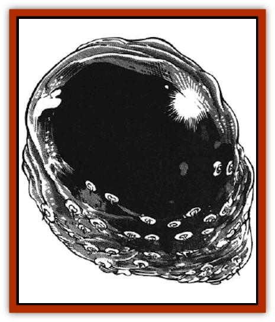

# Bloodsac

| Statistic | **Bloodsac** |
| --- | --- |
| **Activity Cycle:** | Any |
| **Alignment:** | Chaotic evil |
| **Armor Class:** | 6 |
| **Climate/Terrain:** | Wildspace |
| **Damage/Attack:** | 2d10 |
| **Diet:** | Blood |
| **Frequency:** | Rare |
| **Hit Dice:** | 4+4 |
| **Intelligence:** | Semi- (3) |
| **Magic Resistance:** | Nil |
| **Morale:** | Elite (14) |
| **Movement:** | 3, Fl 18 (C) |
| **No. Appearing:** | 3-12 |
| **No. of Attacks:** | 1 |
| **Organization:** | Swarm |
| **Size:** | S (4' diameter) |
| **Special Attacks:** | Surprise |
| **Special Defenses:** | Nil |
| **THAC0:** | 16 |
| **Treasure:** | Nil |
| **XP Value:** | 420 |

Bloodsacs (technically known as "haagathga") are blob-like bloodsuckers that silently glide through wildspace looking for blood. This usually means spelljamming ships, with their complements of warm-blooded sailors.

These space-borne horrors are shapeless, pulsating sacks of fluid in a slightly translucent black-blue membrane. This membrane is covered by tiny, razor-rimmed suckers, each with tiny speck of silver or yellow coloring. Bloodsacs resemble a patch of flying night sky. The familiar smell of blood wafts about their bodies.

Bloodsacs travel in packs, using their natural camouflage to swoop down on unsuspecting ships, surprising the crews, and draining their blood. The beasts are sometime called "star vampires". They have no speech.

**Combat:** Bloodsacs move silently through space using infravision to detect warm-blooded victims. They glide noiselessly onto the deck of a spelljamming vessel, probably one in orbit around a planet, and try to surprise sailors on deck. Due to the creatures' coloration, foes suffer a -2 penalty to surprise rolls. Guards have a 1% chance per point of Intelligence or Wisdom (whichever is higher) to spot the swarm. Guards only get one chance to spot the bloodsacs before the monsters attack.

If at all possible, bloodsacs attack from behind, gaining a +2 to their attack rolls.

Once a victim is hit, the bloodsac's tiny suckers bore into the skin and begin sucking out the blood, causing 2d10 damage. Once attached, a bloodsac does not let go until pulled off, or until it drains the victim completely. Pulling off a bloodsac requires a Strength ability check. If the beast comes off, the victim takes an additional 1d10 points of damage as the blob's suckers tear out of the victim's flesh. If the blob remains attached, it automatically does 2d10 points of damage each round (no attack roll needed). As the bloodsac drains blood from its victim, its color changes from dark blue to a sickly violet.

After draining a victim, the bloodsac sprouts a tube and attaches it to the base of the  victim's skull. Through this tube the blob drains out the victim's brain fluids. This process takes one round. after which the bloodsac flies away, sated - for now.

The fluid it collects contains the victim's memories and knowledge. Thus, victims raised from the dead have no memory of their identities and, though they have full hit points, are effectively 0-level characters in skills, THAC0, saving throws, and proficiencies. All memories are lost. Victims still retain basic skills needed to take care of everyday needs, as well as the ability to speak one language (most likely Common).

A spell such as *restoration* or a *wish* can restore lost memory; so can catching the bloodsac who drained the fluid and pouring it over the victim before he is raised from the dead.

**Habitat/Society:** Bloodsac swarms have no leader. They merely follow whomever has homed in on food. They wander wildspace, never sleeping, never setting up a lair nor landing on a planet. Bloodsacs hate gravity, for their bodies collapse into sluggish heaps of protoplasm.

**Ecology:** Bloodsacs are parasitic predators, greatly feared by warm-blooded beings of all alignments and races. They reproduce by laying a clutch of 6d6 eggs inside a victim who has been completely drained of blood. For each bloodsac that has killed a victim, there is a 50% chance that it was a female and has laid eggs in the victim's body. The eggs hatch 2d6 days later, bursting the body asunder and releasing the voraciously hungry bloodsac young (1 HD each, 1d8 blood drain damage per round).

[[Mind_Flayer|Mind flayers]] take an interest in the bloodsacs, especially with the blobs' ability to drain brain fluids. Some mind flayers keep trained bloodsacs, a particularly deadly combination.

---
## Discovery & Documentation

**Source Publication:** MC9 Spelljammer Appendix II (1991)
**Campaign Setting:** Planescape
**Author(s):** Scott Davis, Newton Ewell, John Terra

### Other Creatures Found in This Source Book
   * [[Alchemy_Plant|Alchemy Plant]]
   * [[Allura|Allura]]
   * [[Aperusa|Aperusa]]
   * [[Autognome|Autognome]]
   * [[Bionoid|Bionoid]]
   * [[Buzzjewel|Buzzjewel]]
   * [[Constellate|Constellate]]
   * [[Contemplator|Contemplator]]
   * [[Dohwar|Dohwar]]
   * [[Dragon_Moon|Dragon, Moon]]
   * [[Dragon_Stellar|Dragon, Stellar]]
   * [[Dragon_Sun|Dragon, Sun]]
   * [[Dreamslayer|Dreamslayer]]
   * [[Dweomerborn|Dweomerborn]]
   * [[Fal|Fal]]
   * [[Feesu|Feesu]]
   * [[Fire_Bat|Fire Bat]]
   * [[Firebird|Firebird]]
   * [[Firelich|Firelich]]
   * [[Flowfiend|Flowfiend]]
   * [[Gadabout|Gadabout]]
   * [[Gammaroid|Gammaroid]]
   * [[Gonn|Gonn]]
   * [[Gossamer|Gossamer]]
   * [[Grav|Grav]]
   * [[Great_Dreamer|Great Dreamer]]
   * [[Greatswan|Greatswan]]
   * [[Grell_Colonial|Grell, Colonial]]
   * [[Gullion|Gullion]]
   * [[Insectare|Insectare]]
   * [[Lhee|Lhee]]
   * [[Mercurial_Slime|Mercurial Slime]]
   * [[Meteorspawn|Meteorspawn]]
   * [[Monitor|Monitor]]
   * [[Owl_Space|Owl, Space]]
   * [[Pristatic|Pristatic]]
   * [[Scro|Scro]]
   * [[Selkie_Star|Selkie, Star]]
   * [[Silatic|Silatic]]
   * [[Skullbird|Skullbird]]
   * [[Sleek|Sleek]]
   * [[Sluk|Sluk]]
   * [[Space_Swine|Space Swine]]
   * [[Sphinx_Astro-|Sphinx, Astro-]]
   * [[Spirit_Warrior|Spirit Warrior]]
   * [[Starfly_Plant|Starfly Plant]]
   * [[Stargazer|Stargazer]]
   * [[Undead_Stellar|Undead, Stellar]]
   * [[Witchlight_Marauder|Witchlight Marauder]]
   * [[Xixchil|Xixchil]]
   * [[Yitsan|Yitsan]]
   * [[Zurchin|Zurchin]]
