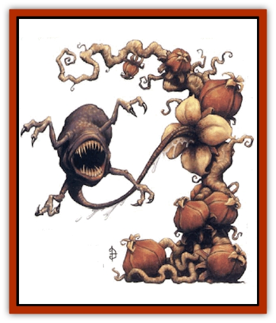

# Bloodsipper - Far Realm

| Statistic | **Bloodsipper (Far Realm)** |
| --- | --- |
| **Activity Cycle:** | Any |
| **Alignment:** | Chaotic neutral |
| **Armor Class:** | 1 |
| **Climate/Terrain:** | Special |
| **Damage/Attack:** | 1d8 + blood drain |
| **Diet:** | Carnivore |
| **Frequency:** | Very rare |
| **Hit Dice:** | 20 vine (pod denizen: 4) |
| **Intelligence:** | Non- (0) |
| **Magic Resistance:** | Nil |
| **Morale:** | Fearless (20) |
| **Movement:** | 0 vine (pod denizen: 15) |
| **No. Appearing:** | 1 (2-12 pod denizens) |
| **No. of Attacks:** | 2-12 (1 attack per mature pod) |
| **Organization:** | Plant |
| **Size:** | G (600+ sq. ft.) vine, S pod |
| **Special Attacks:** | Blood drain, pod denizens |
| **Special Defenses:** | Vulnerable to salt (2d4/handful) |
| **THAC0:** | Nil (pod denizen: 17) |
| **Treasure:** | Nil |
| **XP Value:** | 1,000 (vine) / 175 (pod denizen) |

The bloodsipper's presence is marked from afar - up to 100 feet under still conditions - by a lingering scent of copper in the air. A bloodsipper is an expansive, tangled growth of thin yellow vines that resemble arteries, slowly pulsing with a languid, blood-like fluid. Along the vines, fiery red pods sprout profusely like sickly fruit. Most pods are fist-sized; however, a few have grown to the menacing dimensions of four or more feet in diameter; all have a leathery texture.

**Combat:** The small growths represent immature pods, and grow along the periphery of the vine's domain. Cutting a small pod open releases a gagging stench (save vs. paralyzation or suffer a -4 penalty to all actions, checks, and saves for one turn due to nausea), and reveals what appears to be some sort of vestigial organ secured to the interior base of the pod by a coiled organic cord. Those who have not encountered the larger pods may not guess that the vestigial organ is really an immature form of the *pod denizen*, although a small mouth filled with needle-like teeth can be discovered by anyone tenacious enough to dig around the revealed gooey mass with a dagger point or similar tool.

If any vine of the bloodsipper is stepped on by those attempting to navigate its sprawls (the density of the vine growth makes this a certainty for those moving normally), the mature pods at the center of the growth react with deadly instinct (usually been 2 and 12 pods). These large pods disgorge their contents with a wet pop. The content of a pod resembles a huge, blind tadpole whose mouth is lined with hundreds of needlesharp teeth. The bead of the "tadpole" gradually thins into a long, muscular tether that anchors each striking head to its own pod. Each head has four clawed arms, equally spaced around the gnashing mouth. A pod denizen can attack within a 20-feet radius of its pod.

A successful attack means that a head has anchored itself into a fleshy part of its target with the help of its four clawed arms. The biting mouth immediately begins to drain blood from the target at the prodigious rate of 4 points of damage per round. The blood is visibly transferred down the tether-like body of the creature to the pod. Attacks directed against the tether can sever it if a total of 10 points of damage is delivered to the tether, however, each head can act independently, and continue to attack foes even after the tether has been cut. Each head must be individually killed to end its threat, as the heads propel themselves by their arms alone if separated from their pods. Once all the heads are destroyed, the remaining artery-like vines and immature pods represent no further threat, and can be dealt with or navigated safely. Salt in quantity makes a vine or head pull away convulsively; a handful inflicting 2d4 points of damage (much as holy water affects undead).

**Habitat/Society:** The yellow vine of a bloodsipper is always anchored in stone floors and wails with tough rootlets, making it difficult to dislodge. These overactive growths were dubbed "bloodsippers" by the wizard who encountered the first specimen. It seems likely that bloodsippers did not evolve from precursor organisms naturally. Substantial evidence supports the contention that these growths spring from once-natural plant life that has grown too long within the influence of portals leading to the Far Realm, a strange dimension where reality is subjective and madness is the rule. This realm has been dubbed the Far Realm by those few who've become aware of it and profess to study it. Suffice it to say that bloodsippers and similar creatures are truly alien to the Prime Material plane.

**Ecology:** Bloodsippers share both animal and plant characteristics. Like plants, they grow from a "seed", spreading vines in all directions so as to cover as much surface area as possible. Unlike plants, a bloodsipper has no need for sunlight. Instead, its pods have specialized to "harvest" the blood of living organisms that come too near. Blood seems sufficient to nourish bloodsippers indefinitely.

Bloodsippers propagate by intentionally severing the tether of one of its mature pods, which crawls off under its own power as far as it can before it digs into the earth to germinate, the seed of another bloodsipper growth. This is usually a matter of a few hundred yards.

---
## Discovery & Documentation

**Source Publication:** Monstrous Compendium, 1997 Annual, Volume 4 (1995)
**Campaign Setting:** Advanced Dungeons & Dragons 2nd Edition
**Author(s):** Jon Pickens

### Other Creatures Found in This Source Book
   * [[Anemone_Giant_Sea|Anemone, Giant Sea]]
   * [[Asperii|Asperii]]
   * [[Bainligor|Bainligor]]
   * [[Beast_of_Chaos|Beast of Chaos]]
   * [[Blindheim|Blindheim]]
   * [[Bulette_Gohlbrorn|Bulette, Gohlbrorn]]
   * [[Child_of_the_Sea|Child of the Sea]]
   * [[Clockwork_Horror|Clockwork Horror]]
   * [[Clockwork_Swordsman|Clockwork Swordsman]]
   * [[Coral|Coral]]
   * [[Darklore|Darklore]]
   * [[Dharculus|Dharculus]]
   * [[Dolphin_Athas|Dolphin (Athas)]]
   * [[Dragon_Neutral_Moonstone|Dragon, Neutral, Moonstone]]
   * [[Dragon_Prismatic|Dragon, Prismatic]]
   * [[Dream_Stalker|Dream Stalker]]
   * [[Dragon-kin_Albino_Wyrm|Dragon-kin, Albino Wyrm]]
   * [[Echyan|Echyan]]
   * [[Firestar|Firestar]]
   * [[Firetail|Firetail]]
   * [[Fish_Ascallion|Fish, Ascallion]]
   * [[Fish_Deep_Ocean|Fish, Deep Ocean]]
   * [[Fish_Tropical|Fish, Tropical]]
   * [[Fish_Vurgens|Fish, Vurgens]]
   * [[Fogwarden|Fogwarden]]
   * [[Fraal|Fraal]]
   * [[Giant_Crag|Giant, Crag]]
   * [[Gibberling_Brood|Gibberling, Brood]]
   * [[Glutton_Sea|Glutton, Sea]]
   * [[Golden_Ammonite|Golden Ammonite]]
   * [[Golem_Brass_Minotaur|Golem, Brass Minotaur]]
   * [[Golem_Gemstone|Golem, Gemstone]]
   * [[Golem_Maggot|Golem, Maggot]]
   * [[Groundling|Groundling]]
   * [[Hermit_Sea|Hermit, Sea]]
   * [[Hound_of_Law|Hound of Law]]
   * [[Human_Amazon|Human, Amazon]]
   * [[Human_Pygmy|Human, Pygmy]]
   * [[Inquisitor|Inquisitor]]
   * [[Kercpa|Kercpa]]
   * [[Kreel|Kreel]]
   * [[Lycanthrope_Lythari|Lycanthrope, Lythari]]
   * [[Mercurial|Mercurial]]
   * [[Mold_Chromatic|Mold, Chromatic]]
   * [[Mummy_Bog|Mummy, Bog]]
   * [[Neh-thalggu|Neh-thalggu]]
   * [[Nymph_Grain|Nymph, Grain]]
   * [[Nymph_Unseelie|Nymph, Unseelie]]
   * [[Octopus_Octo-Jelly|Octopus, Octo-Jelly]]
   * [[Puddingfish|Puddingfish]]
   * [[Sea_Demon|Sea Demon]]
   * [[Shade|Shade]]
   * [[Shadowrath|Shadowrath]]
   * [[Shark_Athas|Shark (Athas)]]
   * [[Siren_Ravenloft|Siren (Ravenloft)]]
   * [[Skeleton_Variant|Skeleton, Variant]]
   * [[Skyfish|Skyfish]]
   * [[Spectral_Scion|Spectral Scion]]
   * [[Spyder_Fiend|Spyder Fiend]]
   * [[Squid_Squark|Squid, Squark]]
   * [[Tanar'ri_Lesser_Uridezu|Tanar'ri, Lesser, Uridezu]]
   * [[Troll_Mutate|Troll Mutate]]
   * [[Vaati|Vaati]]
   * [[Vampire_Cerebral|Vampire, Cerebral]]
   * [[Varkha|Varkha]]
   * [[Wizshade|Wizshade]]
   * [[Worm_Lukhorn|Worm, Lukhorn]]
   * [[Wyste|Wyste]]
   * [[Yugoloth_Lesser_Gacholoth|Yugoloth, Lesser, Gacholoth]]
   * [[Zombie_Mud|Zombie, Mud]]
