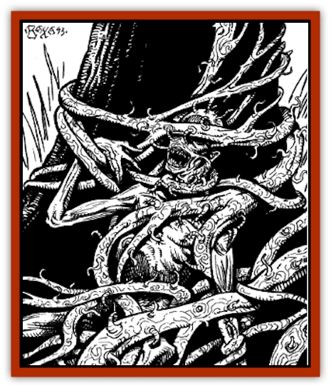

# Bloodvine

| Statistic | **Bloodvine** |
| --- | --- |
| **Activity Cycle:** | Night |
| **Alignment:** | Neutral |
| **Armor Class:** | 6 |
| **Climate/Terrain:** | Crescent Forest |
| **Damage/Attack:** | 1-3 |
| **Diet:** | Carnivore |
| **Frequency:** | Common |
| **Hit Dice:** | 3-5 |
| **Intelligence:** | Non- (0) |
| **Magic Resistance:** | Nil |
| **Morale:** | Steady (11-12) |
| **Movement:** | ½ |
| **No. Appearing:** | 1-10 |
| **No. of Attacks:** | 1 per 5' length |
| **Organization:** | None |
| **Size:** | L-G (4' long per HD) |
| **Special Attacks:** | Strength loss, clinging |
| **Special Defenses:** | Half damage from crushing attacks |
| **THAC0:** | 17 |
| **Treasure:** | Incidental |
| **XP Value:** | 50 |

The bloodvine is a danger to anyone who travels in the Crescent Forest. It is a parasite, dangerous primarily to those weak with hunger or thirst, or to sleeping victims. These parasitic plants consume the very blood of those they capture, and travelers report finding skeletons of fairly sizable creatures lashed tight to agafari tree trunk by these potent vines.

**Combat:** The bloodvine moves extremely slowly, at only ½' per round. Bloodvines are attracted by warmth, particularly that of a living creature. They move only at night.

The bloodvine attacks by injecting roots into its target. If the bloodvine has approached a target (which it will do only at night), this requires an attack roll. However, if the target touches the vine with bare flesh (day or night), the attack is automatically successful. The roots are covered with a sap which anesthetizes the wounds so that the victim feels no pain. An unconscious victim will not awaken, and a conscious victim must make an Intelligence check to determine that he has been attacked.

Once the bloodvine has seized its prey, it drink the victim's blood via its roots, causing 1d3 hit points of damage/round. In addition, the loss of blood diminishes the character's Strength by 1 point. Once the roots are inserted, no additional attack roll is required to inflict this damage and Strength loss each round.

To remove the vine, the victim (or someone aiding the victim) must make a Bend Bars roll; only one roll may be made each round. On a successful roll, the vine tears away (inflicting 1d6 hit points of damage). On an unsuccessful roll the vine remains attached, but the victim suffers an additional point of damage from the stress of tearing roots. Should the victim be separated from the vine, lost Strength returns at a rate of 1 point per hour.

The bloodvine takes half damage from crushing attacks. A bloodvine will not approach within two feet of a fire, and indeed it suffers double damage from fire attacks. Cold inflicts only 1 point of damage per damage die, but it immobilizes the affected section of the vine for a number of rounds equal to the damage roll. Electrical attacks act as a *haste* spell on the bloodvine for 1d4 rounds. A bloodvine is killed instantly by a *warp wood* spell, or by the destructive effect caused when a defiler casts a spell.

It is fairly easy to avoid bloodvines if one is aware of them. They move so slowly that the potential victim can just walk away. They are unable to completely leave their agafari tree, so they will not pursue a victim beyond a few tens of feet from their tree.

**Habitat/Society:** Bloodvines live on the bark of the agafari tree and are found only in the Crescent Forest. Growth begins at ground level and winds its way up the tree. Agafari trees that have been completely surrounded by bloodvine can be found in the central portions of the forest. Such vines represent a tremendous threat to travelers, as there are literally hundreds of feet of bloodvine in such infestations.

**Ecology:** Bloodvines live on the fluids they extract from insects and small mammals. They can live for as long as three months on nothing but rain, extracting nourishment from the agafari bark. After a month of such deprivation, however, the blood vine loses the ability to move, and after three months the bloodvine dies.

Each bloodvine is inextricably attached to the tree which is its host. Bloodvines cannot be transplanted from one tree to another, nor will a bloodvine grow anywhere but on an agafari tree. How bloodvines reproduce is a mystery, but it is impossible to eradicate them completely; kill every bloodvine on an agafari tree and within a month new bloodvines will again sprout.

---
## Discovery & Documentation

**Source Publication:** The Ivory Triangle (1993)
**Campaign Setting:** Dark Sun
**Author(s):** Curtis Scott, Kirk Botula

### Other Creatures Found in This Source Book
   * [[Cilops|Cilops]]
   * [[Treant_Athas|Treant (Athas)]]
   * [[Zombie_Salt|Zombie, Salt]]
