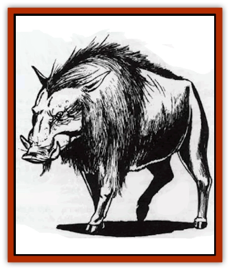

# Boar

| Statistic | **Giant (Elothere)** | **Warthog** | **Wild** |
| --- | --- | --- | --- |
| **Activity Cycle:** | Day | Day | Day |
| **Alignment:** | Neutral | Neutral | Neutral |
| **Armor Class:** | 6 | 7 | 7 |
| **Climate/Terrain:** | Any land | Tropical land | Any land |
| **Damage/Attack:** | 3-18 (3d6) | 2-8(2d4)/1-8 | 3-12 |
| **Diet:** | Omnivore | Omnivore | Omnivore |
| **Frequency:** | Uncommon | Common | Common |
| **Hit Dice:** | 7 | 3 | 3+3 |
| **Intelligence:** | Animal (1) | Animal (1) | Semi- (2-4) |
| **Magic Resistance:** | Nil | Nil | Nil |
| **Morale:** | Average (8-10) | Average (8-10) | Average (8-10) |
| **Movement:** | 12 | 12 | 15 |
| **No. Appearing:** | 2-8 (2d4) | 1-6 | 1-12 |
| **No. of Attacks:** | 1 | 2 | 1 |
| **Organization:** | Family | Family | Family |
| **Size:** | M (5' at shoulder) | S (2½' at shoulder) | S (3' at shoulder) |
| **Special Attacks:** | Nil | Nil | Nil |
| **Special Defenses:** | Nil | Nil | Nil |
| **THAC0:** | 13 | 17 | 17 |
| **Treasure:** | Nil | Nil | Nil |
| **XP Value:** | 650 | 120 | 175 |

Boars, a type of wild swine, are the ancestors of our domesticated hogs. Boars are, of course, more agressive than the barnyard animal, and an unexpected encounter with a family of these creatures or one large individual can be fatal.

Boars look much like hogs, but have slightly shorter snouts, coarser and darker hair, and straighter tails. Some varieties have small tusks at each side of the face.

**Combat:** Boars are dangerous foes when angered. They have a vicious bite and those with tusks can employ them to rip at unprotected flesh with great effectiveness.

The boar will fight for 2-5 (1d4+1) melee rounds after reaching 0 to -6 hit points but dies immediately at -7 or fewer hit points.

**Habitat/Society:** Boars live in family units as a rule. If more than one wild boar is encountered the others will be sows (3 hit dice, 2-8 (2d4) hit points damage/attack) or sounders, with a 1:4 (sows:sounders) ratio. Thus if 12 are encountered there will be 1 boar, 3 sows, and 8 young.

**Ecology:** Boars are true omnivores who will eat virtually anything. While eating a variety of foods is generally considered healthy, in the case of the wild boar this can lead to problems. A small roundworm, Trichinella spiralis, is a parasite that can inhabit a boar's body. This creates a problem when a human eats the boar without cooking it properly, as trichinosis, the disease caused by this parasite, is easily transmissible to humans. Once infected with the parasite, the host suffers fever, sweating, and sore muscles until a *cure disease* spell is cast.

Whether domesticated or not, the boar provides a number of products useful to man. All three varieties listed here are edible. Boar lard can be used interchangeably with domesticated swine lard. Leather from the wild specimen can be used for gloves and comfortable leather armor. The stiff bristles can be used for brushes.

**Giant Boar**

This prehistoric forerunner of the wild boar is also very aggressive. If 3 or more are encountered there is only a 25% chance that there will be young (2-6 hit dice, 1-4/2-5 (1d4+1)/2-7 (1d6+1)/2-8 (2d4)/3-12 (3d4) points of damage/attack) numbering from 1-4 of the total herd. The boars and sows fight equally, and either will fight for 1-4 melee rounds after reaching 0 to -10 hit points but die immediately upon reaching -11 or fewer hit points.

**Warthog**

These tropical beasts are aggressive only if their territory is threatened or if cornered. They make two slashing attacks with their large tusks. Male and female fight equally. If more than 2 are encountered the balance will be young (1-2 hit dice, 1-3/2-5 (1d4+1) points of damage/attack). The warthog will continue to fight for 1-2 melee rounds after reaching 0 to -5 hit points but at -6 or fewer points it dies immediately.

---
## Discovery & Documentation

**Source Publication:** MC1 Volume I (w/binder #1) (1991)
**Campaign Setting:** Advanced Dungeons & Dragons 2nd Edition
**Author(s):** Jay Batista, Scott Bennie, Grant Boucher, William W. Connors, Steve Gilbert, Heike Kubasch, James Lowder, David Edward Martin, Bruce Nesmith, Jean Rabe, Rick Swan, John J. Terra, Gary L. Thomas

### Other Creatures Found in This Source Book
   * [[Bat|Bat]]
   * [[Bear|Bear]]
   * [[Behir|Behir]]
   * [[Bookworm|Bookworm]]
   * [[Brownie|Brownie]]
   * [[Bugbear|Bugbear]]
   * [[Carrion_Crawler|Carrion Crawler]]
   * [[Cat_Great|Cat, Great]]
   * [[Catoblepas|Catoblepas]]
   * [[Dragon_General_Information|Dragon, General Information]]
   * [[Dragonfish|Dragonfish]]
   * [[Elemental_Air_Kin_Aerial_Servant|Elemental, Air Kin, Aerial Servant]]
   * [[Elemental_Earth_Kin_Sandling|Elemental, Earth Kin, Sandling]]
   * [[Elephant|Elephant]]
   * [[Gnoll|Gnoll]]
   * [[Hobgoblin|Hobgoblin]]
   * [[Homunculus|Homunculus]]
   * [[Hornet_Giant|Hornet, Giant]]
   * [[Horse|Horse]]
   * [[Hyena|Hyena]]
   * [[Jackal|Jackal]]
   * [[Jackalwere|Jackalwere]]
   * [[Korred|Korred]]
   * [[Lich|Lich]]
   * [[Lizard|Lizard]]
   * [[Lizard_Man|Lizard Man]]
   * [[Lycanthrope_General_Information|Lycanthrope, General Information]]
   * [[Lycanthrope_Seawolf|Lycanthrope, Seawolf]]
   * [[Lycanthrope_Werebear|Lycanthrope, Werebear]]
   * [[Lycanthrope_Weretiger|Lycanthrope, Weretiger]]
   * [[Lycanthrope_Werewolf|Lycanthrope, Werewolf]]
   * [[Manticore|Manticore]]
   * [[Medusa|Medusa]]
   * [[Mind_Flayer|Mind Flayer]]
   * [[Minotaur|Minotaur]]
   * [[Mudman|Mudman]]
   * [[Mummy|Mummy]]
   * [[Nixie|Nixie]]
   * [[Nymph|Nymph]]
   * [[Ogre|Ogre]]
   * [[Ooze_Slime_Jelly_I|Ooze/Slime/Jelly I]]
   * [[Ooze_Slime_Jelly_II|Ooze/Slime/Jelly II]]
   * [[Orc|Orc]]
   * [[Owl|Owl]]
   * [[Owlbear_I|Owlbear I]]
   * [[Pegasus|Pegasus]]
   * [[Piercer|Piercer]]
   * [[Pudding_Deadly|Pudding, Deadly]]
   * [[Rakshasa|Rakshasa]]
   * [[Rat|Rat]]
   * [[Ray|Ray]]
   * [[Remorhaz|Remorhaz]]
   * [[Satyr|Satyr]]
   * [[Scorpion|Scorpion]]
   * [[Selkie|Selkie]]
   * [[Shadow|Shadow]]
   * [[Skeleton|Skeleton]]
   * [[Skunk|Skunk]]
   * [[Snake|Snake]]
   * [[Spectre|Spectre]]
   * [[Spider|Spider]]
   * [[Sprite|Sprite]]
   * [[Toad_Giant|Toad, Giant]]
   * [[Treant|Treant]]
   * [[Troll|Troll]]
   * [[Umber_Hulk|Umber Hulk]]
   * [[Unicorn|Unicorn]]
   * [[Vampire|Vampire]]
   * [[Wight|Wight]]
   * [[Will_O'Wisp|Will O'Wisp]]
   * [[Wolf|Wolf]]
   * [[Wolfwere|Wolfwere]]
   * [[Wraith|Wraith]]
   * [[Wyvern|Wyvern]]
   * [[Yeti|Yeti]]
   * [[Yuan-ti|Yuan-ti]]
   * [[Zombie|Zombie]]
