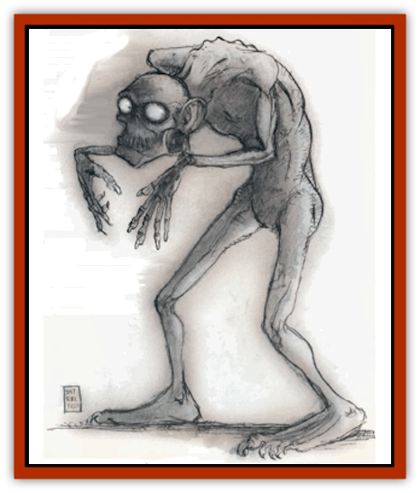

# Bodak

| Statistic | **Bodak** |
| --- | --- |
| **Activity Cycle:** | Any |
| **Alignment:** | Chaotic evil |
| **Armor Class:** | 5 |
| **Climate/Terrain:** | The Abyss |
| **Damage/Attack:** | By weapon |
| **Diet:** | None |
| **Frequency:** | Very rare |
| **Hit Dice:** | 9+9 |
| **Intelligence:** | Low (5-7) |
| **Magic Resistance:** | Nil |
| **Morale:** | Steady (11-12) |
| **Movement:** | 6 |
| **No. Appearing:** | 1 |
| **No. of Attacks:** | 1 |
| **Organization:** | Solitary |
| **Size:** | M (6' tall) |
| **Special Attacks:** | Death gaze |
| **Special Defenses:** | +1 weapons to hit, spell immunity, immune to poison |
| **THAC0:** | 11 |
| **Treasure:** | Nil |
| **XP Value:** | 5,000 |

The grim bodaks are formed from hapless mortals who ventured into parts of the Abyss too deadly for them.

A Sigil legend called "The Bodak Who Walked Home" is probably apocryphal, but it expresses the eternal hope of triumph against vastly more powerful forces.

 

Once an evil king named Basiliedus ruled his small city-state through dark magic. He captured a fair woman named Helen and sought to make her his queen. Helen's lawful husband, Diomed the swordsman, went to the palace of the dark lord and demanded his wife. Basiliedus, who could have killed the swordsman with a mere word or gesture, asked what he would do to win back his bride. "Anything," answered Diomed.

So Basiliedus suggested that Diomed visit the Abyss and bring back a handful of soil.

Diomed agreed, and Basiliedus transported him there, feeling glee at the swordsman's awful fate.

Years passed, and Helen sickened and died, escaping at last the loveless union forced on her. One day a cowled man, evidently a rich merchant, came to Basiliedus' castle. He claimed to have a present for the hated lord. The cowled one was shown into Basiliedus' audience chamber.

"I have brought you this," said the visitor. He poured soil from a black silk bag onto the floor. The soil became blood, and the blood became [[Snake|snakes]]. Basiliedus knew this was soil from the Abyss, but before he could act, the visitor removed his cowl. The sight of the bodak killed all within, and Diomed, the bodak, walked outside the castle to tell the people their dread lord was dead. The sun scorched his impure flesh, but just before the rotting mass fell, Diomed is said to have smiled.

 

Bodaks are humanoids with gray, pearly skin and hairless; muscular bodies of no apparent gender. Their eyes are empty and milky-white, deeply set into their long, distorted features.

Bodaks are only vaguely humanoid in appearance, but sometimes retain some small feature of the mortal they once were. This may manifest itself in a nervous twitch, a peculiar combat style, or anything else that the bodak may have possessed during its normal lifetime.

Bodaks have no language of their own. They speak the language common to the tanar'ri and their dark servants, and generally they remember a few words of the common speech.

**Combat:** Any person or creature that meets a bodak's death gaze must save vs. petrification or die. The gaze is effective to 30 feet. A victim who dies in the Abyss transforms into a bodak in one day.

Only cold iron weapons or +1 or better magical weapons can hit a bodak. They are immune to *charm*, *hold*, *sleep*, and *slow* spells and to poison. Bodaks possess infravision to 180 feet.

Unaccustomed to its brightness, bodaks hate the sun. Direct sunlight inflicts 1 point of damage per round. Different attacks harm them as follows:

| Attack | Damage |
| --- | --- |
| Acid | Full |
| Cold | Half |
| Electricity (lightning) | None |
| Fire (magical) | Half |
| Fire (nonmagical) | None |
| Gas (poisonous, etc.) | Half |
| Iron weapon | Full |
| Magic missile | Full |
| Poison | None |
| Silver weapon | None |

Bodaks have a faint attachment to their former lives as mortals. Rarely, this preoccupation causes the bodak to pause in combat while it considers its actions. There is a base 5% chance, rolled once per encounter, that the creature sees something in an enemy that reminds it of its mortal life. The bodak pauses and make no attacks for one melee round. After that, the bodak takes a -2 penalty to all attacks against that one character.

Bodaks can attack once per round with hand weapons such as swords and maces, but they rarely carry weapons or bother with them in combat.

**Habitat/Society:** Bodaks wander the Abyss in abhorrent hatred of their own inhuman endurance. They hate and attack anything they see, even creatures of obviously greater power.

**Ecology:** Many mortals have traveled to the Abyss to fight the foul creatures that inhabit it. However, some places in the Abyss are so loathsome and secretive that mortals are simply not allowed to enter. A mortal foolish enough to visit these and die is painfully transformed into a bodak.

**Benign Bodak**

  For reasons unknown, occasionally a good-aligned mortal's mind survives the transition from man to bodak. This "benign bodak" has all the powers and abilities of a bodak, but the mind of the mortal it once was. Such creatures usually die quickly in the Abyss. Note that even though a benign bodak retains its memory and consciousness, it cannot cast spells, even if it could as a mortal.

---
## Discovery & Documentation

**Source Publication:** MC8 Outer Planes Appendix (1990)
**Campaign Setting:** Planescape
**Author(s):** Timothy B. Brown, Jamie LaFountain

### Other Creatures Found in This Source Book
   * [[Aasimon_Agathinon|Aasimon, Agathinon]]
   * [[Aasimon_Deva|Aasimon, Deva]]
   * [[Aasimon_Light|Aasimon, Light]]
   * [[Aasimon_General_Information|Aasimon, General Information]]
   * [[Aasimon_Planetar|Aasimon, Planetar]]
   * [[Aasimon_Solar|Aasimon, Solar]]
   * [[Air_Sentinel|Air Sentinel]]
   * [[Animal_Lord|Animal Lord]]
   * [[Archon|Archon]]
   * [[Baatezu_Lesser_Abishai|Baatezu, Lesser, Abishai]]
   * [[Baatezu_Greater_Amnizu|Baatezu, Greater, Amnizu]]
   * [[Baatezu_Lesser_Barbazu|Baatezu, Lesser, Barbazu]]
   * [[Baatezu_Greater_Cornugon|Baatezu, Greater, Cornugon]]
   * [[Baatezu_Lesser_Erinyes|Baatezu, Lesser, Erinyes]]
   * [[Baatezu_General_Information|Baatezu, General Information]]
   * [[Baatezu_Greater_Gelugon|Baatezu, Greater, Gelugon]]
   * [[Baatezu_Lesser_Hamatula|Baatezu, Lesser, Hamatula]]
   * [[Baatezu_Lemure|Baatezu, Lemure]]
   * [[Baatezu_Least_Nupperibo|Baatezu, Least, Nupperibo]]
   * [[Baatezu_Lesser_Osyluth|Baatezu, Lesser, Osyluth]]
   * [[Baatezu_Greater_Pit_Fiend|Baatezu, Greater, Pit Fiend]]
   * [[Baatezu_Least_Spinagon|Baatezu, Least, Spinagon]]
   * [[Balaena|Balaena]]
   * [[Bariaur|Bariaur]]
   * [[Bebilith|Bebilith]]
   * [[Dog_Moon|Dog, Moon]]
   * [[Dragon_Adamantite|Dragon, Adamantite]]
   * [[Einheriar|Einheriar]]
   * [[Gehreleth|Gehreleth]]
   * [[Githyanki|Githyanki]]
   * [[Githzerai|Githzerai]]
   * [[Hordling|Hordling]]
   * [[Lammasu_Celestial|Lammasu, Celestial]]
   * [[Larva|Larva]]
   * [[Maelephant|Maelephant]]
   * [[Marut|Marut]]
   * [[Mediator|Mediator]]
   * [[Mortai|Mortai]]
   * [[Night_Hag|Night Hag]]
   * [[Nightmare|Nightmare]]
   * [[Noctral|Noctral]]
   * [[Per|Per]]
   * [[Phoenix|Phoenix]]
   * [[Slaad|Slaad]]
   * [[Tanar'ri_Greater_Babau|Tanar'ri, Greater, Babau]]
   * [[Tanar'ri_Greater_Chasme|Tanar'ri, Greater, Chasme]]
   * [[Tanar'ri_Greater_Nabassu|Tanar'ri, Greater, Nabassu]]
   * [[Tanar'ri_Least_Dretch|Tanar'ri, Least, Dretch]]
   * [[Tanar'ri_Least_Manes|Tanar'ri, Least, Manes]]
   * [[Tanar'ri_Least_Rutterkin|Tanar'ri, Least, Rutterkin]]
   * [[Tanar'ri_Lesser_Alu-Fiend|Tanar'ri, Lesser, Alu-Fiend]]
   * [[Tanar'ri_Lesser_Bar-Lgura|Tanar'ri, Lesser, Bar-Lgura]]
   * [[Tanar'ri_Lesser_Cambion|Tanar'ri, Lesser, Cambion]]
   * [[Tanar'ri_Lesser_Succubus|Tanar'ri, Lesser, Succubus]]
   * [[Tanar'ri_Guardian_Molydeus|Tanar'ri, Guardian, Molydeus]]
   * [[Tanar'ri_General_Information|Tanar'ri, General Information]]
   * [[Tanar'ri_True_Balor|Tanar'ri, True, Balor]]
   * [[Tanar'ri_True_Glabrezu|Tanar'ri, True, Glabrezu]]
   * [[Tanar'ri_True_Hezrou|Tanar'ri, True, Hezrou]]
   * [[Tanar'ri_True_Marilith|Tanar'ri, True, Marilith]]
   * [[Tanar'ri_True_Nalfeshnee|Tanar'ri, True, Nalfeshnee]]
   * [[Tanar'ri_True_Vrock|Tanar'ri, True, Vrock]]
   * [[Titan|Titan]]
   * [[Translator|Translator]]
   * [[T'uen-rin|T'uen-rin]]
   * [[Vaporighu|Vaporighu]]
   * [[Warden_Beast|Warden Beast]]
   * [[Yugoloth_Greater_Arcanaloth|Yugoloth, Greater, Arcanaloth]]
   * [[Yugoloth_Lesser_Dergoloth|Yugoloth, Lesser, Dergoloth]]
   * [[Yugoloth_Lesser_Hydroloth|Yugoloth, Lesser, Hydroloth]]
   * [[Yugoloth_General_Information|Yugoloth, General Information]]
   * [[Yugoloth_Lesser_Mezzoloth|Yugoloth, Lesser, Mezzoloth]]
   * [[Yugoloth_Greater_Nycaloth|Yugoloth, Greater, Nycaloth]]
   * [[Yugoloth_Lesser_Piscoloth|Yugoloth, Lesser, Piscoloth]]
   * [[Yugoloth_Greater_Ultroloth|Yugoloth, Greater, Ultroloth]]
   * [[Yugoloth_Lesser_Yagnoloth|Yugoloth, Lesser, Yagnoloth]]
   * [[Zoveri|Zoveri]]
