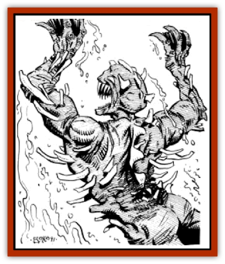

# Bog Wader

| Statistic | **Bog Wader** |
| --- | --- |
| **Activity Cycle:** | Any |
| **Alignment:** | Chaotic evil |
| **Armor Class:** | 4 |
| **Climate/Terrain:** | Verdant belts and scrub plains |
| **Damage/Attack:** | 1-3/1-3/1-3/1-3/1-4 |
| **Diet:** | Carnivore |
| **Frequency:** | Uncommon |
| **Hit Dice:** | 4+3 |
| **Intelligence:** | Low (5-7) |
| **Magic Resistance:** | Nil |
| **Morale:** | Steady (11) |
| **Movement:** | 3, Sw 15 |
| **No. Appearing:** | 1 |
| **No. of Attacks:** | 5 |
| **Organization:** | Solitary |
| **Size:** | M (5-7') |
| **Special Attacks:** | Impale |
| **Special Defenses:** | Nil |
| **THAC0:** | 15 |
| **Treasure:** | O,U |
| **XP Value:** | 420 |

Bog waders live in the bottom of muddy wallows waiting to prey on unsuspecting creatures who come to drink.

The small, misshapen creature could be mistaken for a [[Dwarf_Athas|dwarf]] at a distance. Closer inspection reveals the thousands of wrinkles of overlapping gray skin and thin, yellow and black bones that poke through the soft skin on all sides. A pair of dorsal ridges run down the back. Bog waders have small, flat heads. They have no nose; instead they possess a closeable breathing hole. Bog waders have flaps (instead of ears) on each side of their head. These flaps cover the ear canal when they submerge. Gill ridges run vertically down their backs between their spine and dorsal ridges. The gill ridges are covered by patches of hair or cilia, which filters out the particulate matter in the mud allowing them to breath in the water. They have bent legs designed for leaping and webbed feet and hands that end in sharp, three-fingered claws. A row of small teeth, designed for tearing, line their mouths.

Bog waders have no language of their own and speak no other common tongue. They communicate with each other through a series of guttural tones, but these convey only the simplest concepts concerning feeding and mating. Psionics or magic can be used to further communication, but the bog wader's low intelligence makes a meaningful exchange of ideas unlikely. The bog wader's world is its bog and its prey - it pays attention to little else.

**Combat:** If caught in normal melee combat, the bog wader relies on its formidable claws and its bite attack. It has four claw attacks per round, and each can inflict 1d3 points of damage. Its bite attack is slightly more dangerous, inflicting 1d4 points of damage. However, the bog wader's more deadly attack centers around its self-made trap.

The bog wader hollows out a wallow in muddy flats into which water will collect. The creature then chews mud and mixes it with its saliva. The saliva contains a lighter-than-water substance that, when mixed with the mud, causes the mixture to float on the top of the water, covering and disguising the wallow as normal, harmless muddy terrain. An unsuspecting creature will step into the bog wader's trap and fall into the wallow.

Once the trap is sprung, the bog wader hurls itself upon its victim, attempting to impale it on the bones which grow through its skin. If successful, the attack does 2d4 points of damage, and the creature and victim are locked together. An impaled character must make a successful bend bars roll to break free from the bog wader, or an assisting character must make such a roll. While its victim is impaled, the bog wader will try and wrap its arms and legs around the arms or legs of its victim to keep him from swimming up for air. Each successful claw attack means the creature was able to pin one of the victim's appendages. Freeing a pinned limb requires another successful bend bars roll - a separate roll may be made each round for each pinned limb in addition to the roll to break free from the impaling attack. If one of the claw attacks succeeds, the bog wader will then attempt a bite attack. All the while it will flap its dorsal ridges and try to drive its victim to the bottom of the wallow. If the bog wader gains the bottom, it will use its feet to dig in and hold its prey there until drowned.

As long as a character is impaled, he is held under the mud and cannot breath normally. Any character who was surprised in the round he was impaled does not get a good gulp of air before going under, and so can hold his breath up to 1/3 his Constitution score, in rounds (rounded up). Otherwise, the character does get a good gulp of air, and can hold his breath for up to ½ his Constitution score, in rounds. Creatures without a Constitution score can hold their breath for 1d6 rounds, regardless of surprise. While attempting to hold his breath beyond that time, the character must roll a Constitution check (or a saving throw versus poison for other creatures) each round. The first check has no modifiers, but each subsequent check suffers a -2 cumulative penalty. Once a check is failed, the character must breathe, and if he cannot, he drowns in the mud. Additional rules on diving and surfacing are given in the *Player's Handbook*, page 122.

Under certain circumstances mated male and female bog waders will link their wallows with a small tunnel. Then they can either attack in tandem or split their attacks, attempting to surprise an individual or group that has fallen into one wallow by attacking from behind from the other wallow through the tunnel.

**Habitat/Society:** Each bog wader lives in agony within its own watery pit. The bones that protrude from its skin cause them constant pain, which is one of the reasons the creature is so fierce. The skin of the creature needs almost constant moisture and will dry and crack quickly when exposed to direct sunlight. When moving about the flats, the creature constantly coats itself with fresh mud in order to keep its skin moist.

During particularly dry spells, the bog wader's hole may dry out. In these cases, the bog wader can burrow to the bottom of its drying hole and become dormant. While the sun bakes its home to hard clay around it, the bog wader remains barely alive beneath the earth, waiting patiently for new moisture. Once the bog becomes muddied again, the creature slowly regains its consciousness and mobility, a process that takes anywhere from one day to a week. Fresh watering holes may already have a near dormant bog wader in them, one that won't attack anyone for several days. A bog wader can remain dormant in the dried mud for up to 20 years.

Female bog waders bellow to attract males during mating season, and the males are unable or unwilling to resist the call. Male bog waders commonly fight to the death for the right to sire offspring. Once a year the female gives birth to a single offspring or (rarely) twins. The male is charged with raising the offspring until it is able to take care of itself. Otherwise, the bog wader is a solitary creature.

**Ecology:** Bog waders are a deadly source of water. Although they create holes where fresh water collects, it is dangerous business to attempt to take advantage of water stored there. Many creatures are drawn to the water, and the bog wader, for its own reasons, allows certain creatures to drink unmolested. They provide little else in the way of useable goods or commodities on Athas.

Some more intelligent creatures trap bog waders for their own purposes. Some slave tribes, for instance, capture bog waders and relocate them to man-made water holes around their villages or important fortifications. They supply the bog waders with living prey to keep them from moving on, and help keep the bog comfortably moist for its deadly occupant. Bog waders are intelligent enough to know that they serve a defensive purpose for their captors, but are for the most part inclined to accept their hospitality.

[[Thri-kreen|Thri-kreen]] have been known to use dormant bog waders to foul the water supplies of their enemies. Using subtle psionics, they locate buried bog waders and then dig them up. As long as the creature is kept dry, it does not come out of its dormant state. Several such creatures are then snuck into enemy ponds and watering holes. Within a week the thri-kreen can expect multiple casualties among their unsuspecting enemies.

---
## Discovery & Documentation

**Source Publication:** MC12 Dark Sun Appendix I - Terrors of the Desert (1991)
**Campaign Setting:** Dark Sun
**Author(s):** Tom Prusa, Louis J. Prosperi, Walter M. Baas

### Other Creatures Found in This Source Book
   * [[Animal_Herd_Athas|Animal, Herd (Athas)]]
   * [[Animal_Household_Athas|Animal, Household (Athas)]]
   * [[Antloid_Desert|Antloid, Desert]]
   * [[Banshee_Dwarf|Banshee, Dwarf]]
   * [[Beetle_Agony|Beetle, Agony]]
   * [[Brambleweed|Brambleweed]]
   * [[B'rohg|B'rohg]]
   * [[Burnflower|Burnflower]]
   * [[Cat_Psionic|Cat, Psionic]]
   * [[Cha'thrang|Cha'thrang]]
   * [[Cistern_Fiend|Cistern Fiend]]
   * [[Clam_Giant|Clam, Giant]]
   * [[Cloud_Ray|Cloud Ray]]
   * [[Drake_Athas_Air|Drake (Athas), Air]]
   * [[Drake_Athas_Earth|Drake (Athas), Earth]]
   * [[Drake_Athas_Fire|Drake (Athas), Fire]]
   * [[Drake_Athas_Water|Drake (Athas), Water]]
   * [[Dune_Runner|Dune Runner]]
   * [[Dune_Trapper|Dune Trapper]]
   * [[Elemental_Athas_Greater_Air|Elemental (Athas), Greater, Air]]
   * [[Elemental_Athas_Greater_Earth|Elemental (Athas), Greater, Earth]]
   * [[Elemental_Athas_Greater_Fire|Elemental (Athas), Greater, Fire]]
   * [[Elemental_Athas_Greater_Water|Elemental (Athas), Greater, Water]]
   * [[Elemental_Athas_Lesser_Air_Earth|Elemental (Athas), Lesser, Air/Earth]]
   * [[Elemental_Athas_Lesser_Fire_Water|Elemental (Athas), Lesser, Fire/Water]]
   * [[Elemental_Athas_General_Information|Elemental (Athas), General Information]]
   * [[Erdland|Erdland]]
   * [[Esperweed|Esperweed]]
   * [[Flailer|Flailer]]
   * [[Floater|Floater]]
   * [[Giant_Athas|Giant (Athas)]]
   * [[Golem_Athas_I|Golem (Athas) I]]
   * [[Golem_Athas_II|Golem (Athas) II]]
   * [[Golem_Athas_III|Golem (Athas) III]]
   * [[Golem_Athas_General_Information|Golem (Athas), General Information]]
   * [[Halfling_Renegade|Halfling, Renegade]]
   * [[Hej-kin|Hej-kin]]
   * [[Id_Fiend|Id Fiend]]
   * [[Insect_Swarm_Athas|Insect Swarm (Athas)]]
   * [[Kank_Wild|Kank, Wild]]
   * [[Kirre|Kirre]]
   * [[Megapede|Megapede]]
   * [[Mul_Wild|Mul, Wild]]
   * [[Nightmare_Beast|Nightmare Beast]]
   * [[Plant_Carnivorous_Athas|Plant, Carnivorous (Athas)]]
   * [[Pterran|Pterran]]
   * [[Pterrax|Pterrax]]
   * [[Pulp_Bee|Pulp Bee]]
   * [[Pyreen|Pyreen]]
   * [[Rasclinn|Rasclinn]]
   * [[Razorwing|Razorwing]]
   * [[Roc_Athas|Roc (Athas)]]
   * [[Sand_Bride|Sand Bride]]
   * [[Sand_Cactus|Sand Cactus]]
   * [[Sand_Vortex|Sand Vortex]]
   * [[Scrab|Scrab]]
   * [[Silt_Horror|Silt Horror]]
   * [[Silt_Runner|Silt Runner]]
   * [[Sink_Worm|Sink Worm]]
   * [[Sloth_Athas|Sloth (Athas)]]
   * [[So-ut|So-ut]]
   * [[Spider_Cactus|Spider Cactus]]
   * [[Spider_Crystal|Spider, Crystal]]
   * [[Spirit_of_the_Land|Spirit of the Land]]
   * [[T'Chowb|T'Chowb]]
   * [[Thrax|Thrax]]
   * [[Tohr-kreen_I|Tohr-kreen I]]
   * [[Villichi|Villichi]]
   * [[Zhackal|Zhackal]]
   * [[Zombie_Plant|Zombie Plant]]
