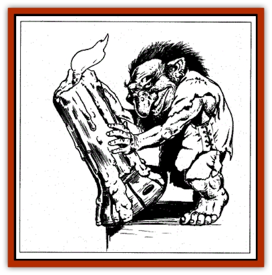

# Boggart

| Statistic | **Boggart** |
| --- | --- |
| **Activity Cycle:** | Night |
| **Alignment:** | Lawful good |
| **Armor Class:** | 2 |
| **Climate/Terrain:** | Temperate/Urban |
| **Damage/Attack:** | n/a |
| **Diet:** | Omnivore |
| **Frequency:** | Rare |
| **Hit Dice:** | 1 |
| **Intelligence:** | Very (11-12) |
| **Magic Resistance:** | 10% |
| **Morale:** | Steady (11-12) |
| **Movement:** | 12 |
| **No. Appearing:** | 1 |
| **No. of Attacks:** | 0 |
| **Organization:** | Solitary |
| **Size:** | T (1' tall) |
| **Special Attacks:** | Spells |
| **Special Defenses:** | Invisibility |
| **THAC0:** | 20 |
| **Treasure:** | F |
| **XP Value:** | 270 |

Boggarts are tiny, helpful cousins to [[Brownie|brownies]] who live in extremely old buildings. They much prefer inhabited homes to abandoned structures.

Boggarts are invisible to all but the most innocent of humans. These are usually children, but occasionally a very good paladin or lawful good priest can see them. Those who have viewed boggarts describe them as funny little men with big noses and colorful clothes. Boggarts speak the common tongue as well as the languages of [[Elf|elves]] and brownies.

**Combat:** Boggarts shun fighting, and they hate evil creatures. When one enters their home, they use their spell abilities to torment the creature in hopes of driving it away. Boggart pranks may include making an offending creature's hair grow, turning it green, or making it trip over the furniture.

Boggarts have several spell-like powers to help them with their jokes. At will they can use *faerie fire*, *ventriloquism*, *dimension door*, *audible glamer*, *cantrip*, and *telekinesis (50 lbs.)* As noted, they are *invisible* to most creatures, and only *detection* spells can reveal their presence.

Anyone who is cowardly enough actually to kill a boggart becomes the recipient of a debilitating *curse* of the DM's design. This may be lifted only by a *remove curse* spell by a caster of no less than 12th level.

Boggarts have a particular weakness: they are frightened by loud noises, which cause them to make a Morale check or flee.

Those who can communicate with boggarts find them a great source of information. Assume that any boggart is 50% likely to know any fact about the area in which they live, 80% if that knowledge involves other fairies.

**Habitat/Society:** Boggarts are helpful creatures who live in houses belonging to very good people, helping out with chores and such after the family goes to bed. They also have been known to play with young children, but they vanish when a disbelieving adult is near.

Boggarts never accept payment for their help, though if someone leaves out small scraps of food for them, they gladly gobble it up.

Boggarts are usually solitary, though every month at the night of the full moon, dozens - or even hundreds - of boggarts gather in one area for a big festival. Very few mortals have seen these merry occurrences, and those who have tell that strange secrets can be gleaned from them.

**Ecology:** Boggarts are primarily vegetarians, though they may eat sausages and smoked meats at their festivals. Boggarts don't hoard wealth, but some may have a small amount of treasure collected over the years. A boggart may be convinced to give up his treasure if he's sure it will go to a worthy cause.

---
## Discovery & Documentation

**Source Publication:** Dragon239 (1997)
**Campaign Setting:** Dragon Magazine
**Author(s):** 

### Other Creatures Found in This Source Book
   * [[Clurichaun|Clurichaun]]
   * [[Leprechaun_Wicked|Leprechaun, Wicked]]
   * [[Leshy|Leshy]]
