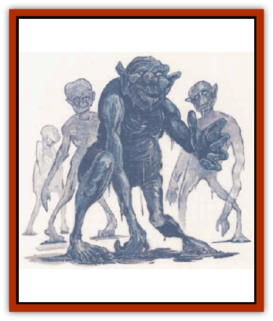

# Boggle

| Statistic | **Boggle** |
| --- | --- |
| **Activity Cycle:** | Night |
| **Alignment:** | Chaotic neutral |
| **Armor Class:** | 5 |
| **Climate/Terrain:** | Any, especially subterranean |
| **Damage/Attack:** | 1d4/1d4 (claw), 1d4 (bite) |
| **Diet:** | Omnivore |
| **Frequency:** | Very rare |
| **Hit Dice:** | 4+3 |
| **Intelligence:** | Low (5-7) |
| **Magic Resistance:** | Nil |
| **Morale:** | Unsteady (7) |
| **Movement:** | 9 |
| **No. Appearing:** | 1-3 (2-8) |
| **No. of Attacks:** | 3 |
| **Organization:** | Family |
| **Size:** | S (3') |
| **Special Attacks:** | Rear claws |
| **Special Defenses:** | Fire resistance, dimensional portal, resist weapon damage, oil |
| **THAC0:** | 17 |
| **Treasure:** | Nil (25%: M or Q) |
| **XP Value:** | 270 |

Boggles are clever gibbering thieves and scavengers, behaving much like some species of monkey. They are 3-foot-tall hairless humanoids with rubbery hides that range in color from dark gray to blackish-blue. They have large bulbous bald heads with large ears; the rest of their body parts are dispropartionate and vary from individual to individual. For example, their noses may be be large and misshapen, broad and flat, mere slits, and so forth. Arms, legs, hands, feet, torso, and abodomen vary from spindly to oversized and misshapen. They can stretch and compress their bodies to an amazing degree.

Boggles have a rudimentary language of grunts and whistles, and can be trained to understand others.

**Combat:** Boggles have an exceptional sense of smell and can detect invisible creatures by scent. Boggles can *spider climb* at will. A favorite tactic is to climb a wall and leap m prey from above to bring their hind claws to bear. Unless acting as guardians they tend to be thieves and raiders rather than a serious physical threat. They can attack with claws and bite. If both claws hit the boggle can rake with its hind claws as well (two attacks for 1d4 damage each).

Boggles can stretch their limbs and bodies to twice their normal length or contract to half size. Their resilient hides reduce damage from weapon attacks by -1 per die of damage. They naturally resist fire, saving against fire-based attacks at +3 and suffering only half or quarter damage.

Boggles can secrete a viscous, nonflammable oily substance from pores in their skin. Not only does this make them hard to catch, but anyone treading on the oil (except those adapted to slippery surfaces, like boggles) must make a Dexterity check or fall down, taking one round to stand up. Boggles will try to steal items from creatures who have fallen. They must make a successful attack against Armor Class 5 to succeed in stealing small items, with penalties of -1 to -5 for larger items.

The most unusual power of a boggle is its ability use any complete frame - such as a hole, a door frame, grillwork, a pocket, or a bag - as a *dimensional portal*. They can jump, reach, step, or poke their heads into one frame, to appear from another frame within 30 yards, allowing them to grab or strike from an unexpected direction if a frame is available. Only boggles can use the portal, but it might be possible for enough of them to pull a man-sized creature through.

**Habitat/Society:** Boggles are a cowardly lot and tend to be whiners if threatened with violence. They have low intelligence, but the cleverness of monkeys. They taunt, bluster, and scold with their gibbering-from a distance. Boggles do not value treasure, but they do like bright, shiny objects such as precious coins, gems and jewelry as well as bits of polished junk, and can be tempted with food and sweets.

The social organization of boggles is loosely familial. A gen of 2-8 adults and young live in a pocket warren, which might require the boggle *dimensional portal* ability to enter. Boggle kids tend to be more roly-poly than their adult counterparts and roll and bounce about rather than running. Old boggles are extremely rare, as they tend to lose their sight, sense of smell, and elasticity as they age.

A boggle nest is usually a pit-marked cavern, an earthen burrow or den, or a hideway hollowed in a wall. Here, boggles build claylike frames and cubbies, using their oil and the debris of their digging to form a mortar, like a mud wasp's nest. Their treasures might be found here in some walled-off cubby.

**Ecology:** Boggles scavenge their food, existing on organic refuse, insects, plants and lichens, and kills stolen from other predators. They seem particularly fond of ants, grubs, and sweets, and can be enticed with a bit of a bribe. Boggles sometime herd beetles, slugs, and lizards in their nests.

The boggles' innate survival instinct combined with their slipperiness and special abilities makes them difficult to capture. Other races, such as [[Goblin|goblins]], [[Hobgoblin|hobgoblins]], and [[Orc|orcs]] have been known to use boggles as watchdogs and trackers because of their sharp senses. When guard boggles sense intruders, they set up a high-pitched keening wail. Goblin boggle handlers use high frequency whistles and collars with inward turned barbs to control their boggles.

---
## Discovery & Documentation

**Source Publication:** Monstrous Compendium, 1995 Annual, Volume 2 (1995)
**Campaign Setting:** Advanced Dungeons & Dragons 2nd Edition
**Author(s):** Jon Pickens

### Other Creatures Found in This Source Book
   * [[Aboleth_Savant|Aboleth, Savant]]
   * [[Addazahr|Addazahr]]
   * [[Amiq_Rasol|Amiq Rasol]]
   * [[Arch-Shadow|Arch-Shadow]]
   * [[Automaton_Scaladar|Automaton, Scaladar]]
   * [[Automaton_Trobriand's|Automaton, Trobriand's]]
   * [[Bat_Sporebat|Bat, Sporebat]]
   * [[Beetle_Dragon|Beetle, Dragon]]
   * [[Bi-nou|Bi-nou]]
   * [[Brownie_Dobie|Brownie, Dobie]]
   * [[Brownie_Quickling|Brownie, Quickling]]
   * [[Cat_Crypt|Cat, Crypt]]
   * [[Cat_Great_Cath_Shee|Cat, Great, Cath Shee]]
   * [[Centaur-kin_Dorvesh|Centaur-kin, Dorvesh]]
   * [[Centaur-kin_Gnoat|Centaur-kin, Gnoat]]
   * [[Centaur-kin_Ha'pony|Centaur-kin, Ha'pony]]
   * [[Centaur-kin_Zebranaur|Centaur-kin, Zebranaur]]
   * [[Chronolily|Chronolily]]
   * [[Curst|Curst]]
   * [[Darktentacles|Darktentacles]]
   * [[Dinosaur_Aquatic|Dinosaur, Aquatic]]
   * [[Dinosaur_II|Dinosaur II]]
   * [[Dinosaur_III|Dinosaur III]]
   * [[Doppelganger_Greater|Doppelganger, Greater]]
   * [[Dragon_Brine|Dragon, Brine]]
   * [[Dragon_Half-|Dragon, Half-]]
   * [[Dragon-kin_Sea_Wyrm|Dragon-kin, Sea Wyrm]]
   * [[Dwarf_Wild|Dwarf, Wild]]
   * [[Ekimmu|Ekimmu]]
   * [[Elemental_Nature|Elemental, Nature]]
   * [[Elf_Winged|Elf, Winged]]
   * [[Fish_Great_Glacier|Fish (Great Glacier)]]
   * [[Fish_Subterranean|Fish, Subterranean]]
   * [[Fish_Toril|Fish (Toril)]]
   * [[Flareater|Flareater]]
   * [[Flumph|Flumph]]
   * [[Froghemoth|Froghemoth]]
   * [[Ghost_Casurua|Ghost, Casurua]]
   * [[Ghost_Ker|Ghost, Ker]]
   * [[Ghul|Ghul]]
   * [[Ghul-Kin|Ghul-Kin]]
   * [[Giant_Half-giant|Giant, Half-giant]]
   * [[Golem_Burning_Man|Golem, Burning Man]]
   * [[Golem_Phantom_Flyer|Golem, Phantom Flyer]]
   * [[Gulguthhydra|Gulguthhydra]]
   * [[Hakeashar|Hakeashar]]
   * [[Horse_Moon-|Horse, Moon-]]
   * [[Human_Dragonslayer|Human, Dragonslayer]]
   * [[Human_Vistana|Human, Vistana]]
   * [[Jellyfish_Giant|Jellyfish, Giant]]
   * [[Kalin|Kalin]]
   * [[Kholiathra|Kholiathra]]
   * [[Laerti|Laerti]]
   * [[Leucrotta_Greater|Leucrotta, Greater]]
   * [[Lich_Suel|Lich, Suel]]
   * [[Lurker_Shadow|Lurker, Shadow]]
   * [[Lycanthrope_Werepanther|Lycanthrope, Werepanther]]
   * [[Lycanthrope_Wereshark|Lycanthrope, Wereshark]]
   * [[Mammal_Herd_II|Mammal, Herd II]]
   * [[Marl|Marl]]
   * [[Meenlock|Meenlock]]
   * [[Mimic_Greater|Mimic, Greater]]
   * [[Mold_II|Mold II]]
   * [[Mummy_Creature|Mummy, Creature]]
   * [[Nyth|Nyth]]
   * [[Ooze_Slime_Jelly_Ghaunadan|Ooze/Slime/Jelly, Ghaunadan]]
   * [[Palimpsest|Palimpsest]]
   * [[Peltast|Peltast]]
   * [[Plant_Dangerous_II|Plant, Dangerous II]]
   * [[Pleistocene_Animal|Pleistocene Animal]]
   * [[Pudding_Subterranean|Pudding, Subterranean]]
   * [[Raggamoffyn|Raggamoffyn]]
   * [[Snake_Serpent|Snake, Serpent]]
   * [[Snake_Serpent_Vine|Snake, Serpent Vine]]
   * [[Sphinx_Draco-|Sphinx, Draco-]]
   * [[Sprite_Seelie_Faerie|Sprite, Seelie Faerie]]
   * [[Sprite_Unseelie_Faerie|Sprite, Unseelie Faerie]]
   * [[Squealer|Squealer]]
   * [[Turtle_Giant|Turtle, Giant]]
   * [[Umpleby|Umpleby]]
   * [[Vizier's_Turban|Vizier's Turban]]
   * [[Wall_Walker|Wall Walker]]
   * [[Webbird|Webbird]]
   * [[Yak-Man|Yak-Man]]
   * [[Zorbo|Zorbo]]
