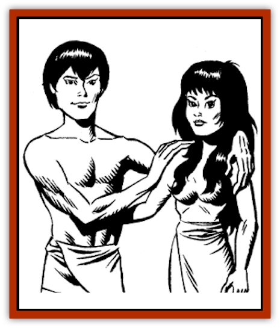

# Bolandi

| Statistic | **Bolandi** |
| --- | --- |
| **Activity Cycle:** | Any |
| **Alignment:** | Chaotic good or neutral |
| **Armor Class:** | 7 |
| **Climate/Terrain:** | Tropical and subtropical/Plains, jungles, hills, and mountains |
| **Damage/Attack:** | 1-4 (weapon) |
| **Diet:** | Herbivore |
| **Frequency:** | Very rare |
| **Hit Dice:** | 2+3 |
| **Intelligence:** | Average to Very (8-12) |
| **Magic Resistance:** | 20% |
| **Morale:** | Elite (13) |
| **Movement:** | 12, Swing 18 |
| **No. Appearing:** | 1-10 |
| **No. of Attacks:** | 1 |
| **Organization:** | Clan |
| **Size:** | M (4-5' tall) |
| **Special Attacks:** | See below |
| **Special Defenses:** | Phase shift |
| **THAC0:** | 17 |
| **Treasure:** | Nil |
| **XP Value:** | 270 |

The Bolandi are small humanoids (between four and five feet tall) with smooth brown skin, with brown hair and eyes. They are slim but well-muscled, with long toes and fingers to help them climb. They wear loose linen clothing.

The Bolandi speak their own language and that of the Mischta, though they speak the latter with great difficulty, for they have highpitched barking voices.

The Bolandi are a race of tree dwellers with minor illusionary powers. They live on Selasia, the jungle island that they share with the [[Ogre_Mischta|Mischta]]. They may be distantly related to the [[Ogre_High|Irda]], but no one really knows their origins with any certainty. Several hundred years before the Cataclysm, the Bolandi lived on other islands in the same chain as Selasia. Then the [[Ogre_Nzunta|Nzunta]], the dark [[Ogre|ogres]], came to their island, bringing with them their brutish slaves, the [[Ogre_Krynn|Orughi]]. Many Bolandi died; the others fled to Selasia, where they were welcomed by the Mischta and aided them in their struggle against the Nzunta.

**Combat:** The Bolandi are not a warrior society, but they know how to defend themselves, typically fighting with either bow or spear.

They have adopted many of the weapons of the Mischta, including their powder bombs. These bombs, when dropped, affect all targets in a ten-foot radius and force them to roll successful saving throws vs. poison or fall victim to one of the following effects: *sleep*, *paralysis*, or *blindness* (depending on the type of bomb). These effects last 2d4 rounds.

The Bolandi sometimes dip their weapons into a paralyzing poison that lasts two rounds on the weapon before it evaporates; if struck, the target must roll a successful saving throw vs. poison (with a +2 bonus) or be paralyzed for 2d4 rounds. Bolandi tree villages are protected by nets, which they drop on intruders.

The Bolandi also have a displacement ability. By the age of maturity (15 years), Bolandi can displace themselves (as a *cloak of displacement*) once per day. By the age of greater maturity (40 years), they can displace themselves twice per day.

Twenty percent of all Bolandi have magical abilities: they can reach up to 10th level of illusionist ability. They are instructed in these arts by Mischta mages, who sometimes regret it.

**Habitat/Society:** The Bolandi are a mischievous race. Coming up with the perfect practical joke is considered the greatest feat that a Bolandi can perform. Since they have learned from the Mischta a philosophy that is devoted to the preservation of life, they will never intentionally hurt anyone with their jokes.

Bolandi live in villages constructed in the limbs and branches of trees. Their homes are constructed from vines, ropes woven from jungle plants, and reeds.

A few Bolandi live on other islands. They live a similar but somewhat more savage existence (no magic and a more neutral outlook on life) as they have not been influenced by the Mischta.

**Ecology:** Bolandi have a natural life span of 60 years. They have one to three young per decade between the ages of 15 and 35, but infant mortality is high and one of three die in infancy. The Bolandi are a race of plant-eaters, but they are capable of eating meat if they must.

Their natural enemies are creatures that feed on man-sized creatures, such as [[Griffon|griffons]], evil [[Dragon_General_Information|dragons]], and [[Cat_Great|tigers]]. Some Bolandi are captured and are hunted for sport by the Nzunta and the Orughi.

---
## Discovery & Documentation

**Source Publication:** DLR1 Otherlands (1992)
**Campaign Setting:** Dragonlance
**Author(s):** Haring, Bennie, and Terra

### Other Creatures Found in This Source Book
   * [[Dragon_Brine|Dragon, Brine]]
   * [[Funno|Funno]]
   * [[Ogre_Mischta|Ogre, Mischta]]
   * [[Ogre_Nzunta|Ogre, Nzunta]]
   * [[Razhak|Razhak]]
   * [[Spirit_Wisdom|Spirit, Wisdom]]
   * [[Ursoi|Ursoi]]
