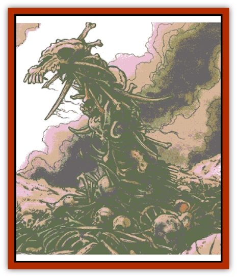
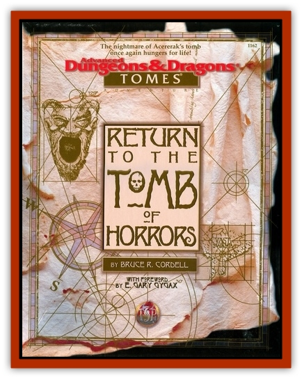

# Bone Weird

| Statistic | **Bone Weird** |
| --- | --- |
| **Activity Cycle:** | Any |
| **Alignment:** | Chaotic evil |
| **Armor Class:** | 0 |
| **Climate/Terrain:** | Any collection of bones |
| **Damage/Attack:** | 1d8 (strike or bite) |
| **Diet:** | Life Force |
| **Frequency:** | Rare |
| **Hit Dice:** | 11+1 |
| **Intelligence:** | Very (11-12) |
| **Magic Resistance:** | Nil |
| **Morale:** | Elite (13-14) |
| **Movement:** | 9 |
| **No. Appearing:** | 2-5 |
| **No. of Attacks:** | 1 |
| **Organization:** | Group |
| **Size:** | H (15'+ long) |
| **Special Attacks:** | Knockdourn, bone subsumption |
| **Special Defenses:** | Immune to piercing attacks and most spells |
| **THAC0:** | 9 |
| **Treasure:** | I,O,P,Y |
| **XP Value:** | 8,000 |

A bone weird is a formless creature from the Negative Energy Plane with the ability to inhabit the cast-off bones of once-living creatures on other planes of existence. When active, it appears as a mass of bones in the shape of a malevolent [[Snake|serpent]]. It uses the skull of some ferocious animal or vicious humanoid, if available, to serve as its own ominous head.

While these creatures are very intelligent, it remains doubtful as to whether they have the ability to communicate with other creatures.

**Combat:** Until a bone weird assumes serpentine form, it is impossible to detect; a *detect invisibility* spell reveals a strange shimmer of peripheral movement, but nothing more definite. Once the bone weird senses living beings within 10 feet, it gathers itself into a bony serpent. The process takes two rounds. Once formed into a serpent, the creature attacks anything within reach.

The bone weird has two attack strategies to choose from. There is a 50% chance that the creature attempts to knock a victim into the pile of bones where the bone weird is based. Opponents hit with this attack take 1d8 points of damage and must attempt saving throws vs. paralyzation. Opponents who fail are knocked into the bony heap. Each round spent within the bones automatically inflicts 2d6 points of damage. Under normal circumstances, a successful Strength check at a -2 penalty is required to break free of the bones.

The bone weird can also choose to attack with a bite for 1d8 points of damage. A successful bite attack requires a saving throw vs. death magic. Those who fail the saving throw are subject to the weird's bone subsumption ability; 1d6 bones are torn from the victim's body to meld with the form of the bone weird. The bone loss inflicts 4d10 points of damage and requires a system shock roll to avoid death. The bones lost are determined randomly and could be as inconsequential as a pinkie bone, or as vital as the hip bone.

Nonmagical weapons inflict only 1 point of damage per attack on bone weirds, and piercing (type P) weapons inflict no damage. Magical weapons inflict normal damage, save for those of the piercing variety, which only inflict 1 point of damage. Priestly turning abilities and spells that affect undead have a 25% chance to be effective per use; if such prove efficacious, treat the bone weird as a lich. Bone weirds are unaffected by other spells.

A bone weird reduced to 0 hit points is not destroyed, just disrupted. In 4 turns, the bone weird reassembles itself at to -10 hit points full hit points. Reducing the creature destroys it completely.

**Habitat/Society:** Unlike elemental creatures of a similar nature (such as [[Elemental_Water_Kin_Water_Weird|water weirds]]), bone weirds are never found alone; they always appear in groups of two or more. It is doubtful that bone weirds are called into existance by mere chance; a wizard or necromancer of powerful ability is most commonly the cause for their appearance.

**Ecology:** A bone weird automatically absorbs the life essence of any creature killed within the weird's heap of bones. The victim's skeletal remains serve to enlarge the bone pile. In the absence of suitable victims, bone weirds can remain quiescent for great lengths of time without suffering. Bone weirds are unable to survive, however, if the supply of available bones falls below an amount which would loosely fill 125 cubic feet of space (a 5-foot cube) per bone weird.

---
## Discovery & Documentation

**Source Publication:** Return to the Tomb of Horrors (1998)
**Campaign Setting:** Greyhawk
**Author(s):** Bruce R. Cordell, Gary Gygax

### Other Creatures Found in This Source Book
   * [[Elemental_Negative_Energy|Elemental, Negative Energy]]
   * [[Fundamental_Negative|Fundamental, Negative]]
   * [[Moilian_Heart|Moilian Heart]]
   * [[Moilian_Zombie|Moilian Zombie]]
   * [[Vestige|Vestige]]
   * [[Winter-Wight|Winter-Wight]]
